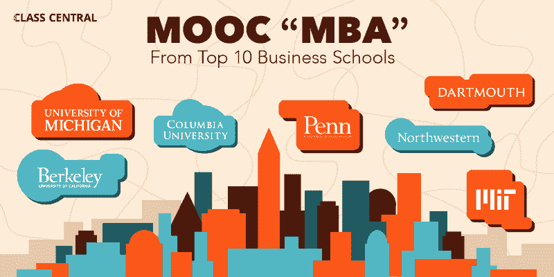

# 如何利用前 10 大商学院的免费课程开设 MOOC“MBA”

> 原文：<https://www.freecodecamp.org/news/how-to-make-a-mooc-mba-using-free-courses-from-top-10-business-schools-545113e506d9/>

劳里·皮卡德

# 如何利用前 10 大商学院的免费课程开设 MOOC“MBA”

回到大规模开放在线课程刚刚兴起的时候，我开始了一个项目，利用免费课程完成相当于 MBA 的课程。Coursera 和 edX 等平台成了头条新闻，当我得知领先的大学(包括商学院)正在免费分发在线课程时，我受到了启发，要建立一个商业教育，而不是为一个学位支付过高的费用。

我称这个项目为“无薪 MBA ”,并在 www.NoPayMBA.com 写了博客。2016 年完成商科教育，写了一本书，指导其他有兴趣做自制 MBA 的人( [*不要为你的 MBA* ，哈珀柯林斯，2017](https://amzn.to/2CW1W6k) )。

现在我在 MOOC 评论网站 [Class Central](https://www.class-central.com/) 工作，我一直在想，考虑到现在可用的大量新课程和工具，我今天将如何着手这个项目？

当我在攻读免费 MBA 时，只有几门商业 MOOCs 课程，所以我基本上报名了所有的课程。不管是幸运还是不幸，如此多受人尊敬的商学院已经发布了免费课程——1867 门商业课程目前列在 Class Central 上——这在今天是不可能的。

通过学习，我还开始相信，要完成 MBA 水平的教育，需要的不仅仅是简单地列出一系列课程主题。部分原因是 MOOCs 在范围、长度和严格程度上不同于校内课程；部分原因是，创建自己的 MBA 提供了一个巨大的机会，可以根据你的需求定制课程。

我的建议是:从在入门课程中学习一些基本的商业概念开始，然后发展一些一般的商业技能，最后，深入专注的领域。

以下是遵循这一建议的课程清单样本，完全来自《美国新闻》&《世界报道》排名前十的商学院。我将美国新闻列表与 Class Central 的数据库进行了交叉参考，找到了排名前十的学校中的大约 90 门课程，包括宾夕法尼亚大学(T3)(排名第三)、T4 大学()、麻省理工学院(T5)(排名第五)、西北大学(T7)(排名第六)、加州大学伯克利分校(T8)、密歇根大学(T10)(并列第七)、哥伦比亚大学(T12)、达特茅斯大学(T13)(排名第九)和达特茅斯大学(14)(排名第十五)

我只使用这些学校的课程，并不是因为《美国新闻》排名靠后的商学院没有优秀的 MOOCs 课程(例如伊利诺伊大学 iMBA 的完整课程目录)，而只是因为 A)我必须以某种方式减少课程数量，B)我想证明顶级 MBA 的内容是现成的。

注意:下面的课程是一个非常坚实的 MBA 项目。然而，它并没有包括 MBA 可能包含的每一个主题。一些明显的差距:项目管理，微观和宏观经济学，以及商业道德。它在运营管理方面也相当轻松。

另请注意:虽然这些课程中有许多需要付费，但所有课程都可以全部或部分免费旁听。如果你是 MOOCs 的新手，你可以在 Class Central 的[大规模开放在线课程初学者指南](https://www.class-central.com/help/moocs?utm_source=fcc_medium&utm_medium=web&utm_campaign=mooc_mba_top_10_bschools)中了解更多。

### 基本商业概念(4 门课程)

宾夕法尼亚大学沃顿商学院(University of Pennsylvania ' s Wharton School of Business)商业基础专业的四门课程，是初涉商界者的热门起点。我建议四个都要。

[**市场营销概论**](https://www.class-central.com/course/coursera-introduction-to-marketing-1137?utm_source=fcc_medium&utm_medium=web&utm_campaign=mooc_mba_top_10_bschools) ，*宾夕法尼亚大学 via Coursera*

[**财务会计介绍**](https://www.class-central.com/course/coursera-introduction-to-financial-accounting-769?utm_source=fcc_medium&utm_medium=web&utm_campaign=mooc_mba_top_10_bschools) ，*宾夕法尼亚大学 via Coursera*

[**运营管理入门**](https://www.class-central.com/course/coursera-introduction-to-operations-management-372?utm_source=fcc_medium&utm_medium=web&utm_campaign=mooc_mba_top_10_bschools) ，*宾夕法尼亚大学 via Coursera*

[**公司财务介绍**](https://www.class-central.com/course/coursera-introduction-to-corporate-finance-625?utm_source=fcc_medium&utm_medium=web&utm_campaign=mooc_mba_top_10_bschools) ，*宾夕法尼亚大学 via Coursera*

### 一般商业和管理技能(4-6 门课程)

无论在哪个行业，定量建模、谈判、项目和人员管理、决策、领导和沟通都是重要的技能。我建议至少选修一门涵盖上述每个主题的课程，总共四至六门课程。

[**量化建模基础**](https://www.class-central.com/course/coursera-fundamentals-of-quantitative-modeling-5448?utm_source=fcc_medium&utm_medium=web&utm_campaign=mooc_mba_top_10_bschools) ，*宾夕法尼亚大学 via Coursera*

[**决策与场景**](https://www.class-central.com/course/coursera-decision-making-and-scenarios-5481?utm_source=fcc_medium&utm_medium=web&utm_campaign=mooc_mba_top_10_bschools) ，*宾夕法尼亚大学 via Coursera*

[**管理人才**](https://www.class-central.com/course/coursera-managing-talent-4308?utm_source=fcc_medium&utm_medium=web&utm_campaign=mooc_mba_top_10_bschools) ，*密歇根大学 via Coursera*

[**领先团队**](https://www.class-central.com/course/coursera-leading-teams-4326?utm_source=fcc_medium&utm_medium=web&utm_campaign=mooc_mba_top_10_bschools) ，*密歇根大学 via Coursera*

[**缩放操作:链接战略与执行**](https://www.class-central.com/course/coursera-scaling-operations-linking-strategy-and-execution-2707?utm_source=fcc_medium&utm_medium=web&utm_campaign=mooc_mba_top_10_bschools) ，*西北大学 via Coursera*

[**高绩效协作:领导力、团队合作和谈判**](https://www.class-central.com/course/coursera-high-performance-collaboration-leadership-teamwork-and-negotiation-4772?utm_source=fcc_medium&utm_medium=web&utm_campaign=mooc_mba_top_10_bschools) ，*西北大学 via Coursera*

[**影响力最大的领导沟通:讲故事**](https://www.class-central.com/course/coursera-leadership-communication-for-maximum-impact-storytelling-4771?utm_source=fcc_medium&utm_medium=web&utm_campaign=mooc_mba_top_10_bschools) ，*西北大学 via Coursera*

[**鼓舞和激励个人**](https://www.class-central.com/course/coursera-inspiring-and-motivating-individuals-4183?utm_source=fcc_medium&utm_medium=web&utm_campaign=mooc_mba_top_10_bschools) ，*密执安大学 via Coursera*

[**通过战略、法律&伦理模式**](https://www.class-central.com/course/coursera-making-successful-decisions-through-the-strategy-law-ethics-model-6195?utm_source=fcc_medium&utm_medium=web&utm_campaign=mooc_mba_top_10_bschools)*密歇根大学 via Coursera* 做出成功决策

[**成功谈判:必备策略与技巧**](https://www.class-central.com/course/coursera-successful-negotiation-essential-strategies-and-skills-2460?utm_source=fcc_medium&utm_medium=web&utm_campaign=mooc_mba_top_10_bschools) ，*密执安大学 via Coursera*

### 浓度(8-10 门课程)

我建议任何追求自我导向教育的人，在专注的领域发展深厚的知识和技能。这是你可以收获自我导向教育的真正价值的地方。专注于一个离散的领域，参加严格的课程，并在真实世界的场景中将所学付诸实践。

我列出了三个可能的 MBA 专业，这些专业可以从排名前十的商学院提供的课程中构建，不包括预先打包的课程，比如麻省理工学院的供应链管理微观硕士课程。

#### 备选方案 1——创业精神

对于有兴趣创业的人来说，创业是显而易见的选择。额外的好处:如果你打算自己当老板，你就不必在求职面试中捍卫你的自我导向教育的价值。

[**创业 1:发展机遇**](https://www.class-central.com/course/coursera-entrepreneurship-1-developing-the-opportunity-5467?utm_source=fcc_medium&utm_medium=web&utm_campaign=mooc_mba_top_10_bschools) ，*宾夕法尼亚大学 via Coursera*

[**创业 2:启动你的初创企业**](https://www.class-central.com/course/coursera-entrepreneurship-2-launching-your-start-up-5468?utm_source=fcc_medium&utm_medium=web&utm_campaign=mooc_mba_top_10_bschools) ，*宾夕法尼亚大学通过 Coursera*

[**创业 3:成长策略**](https://www.class-central.com/course/coursera-entrepreneurship-3-growth-strategies-5466?utm_source=fcc_medium&utm_medium=web&utm_campaign=mooc_mba_top_10_bschools) ，*宾夕法尼亚大学 via Coursera*

[**创业四:融资与盈利**](https://www.class-central.com/course/coursera-entrepreneurship-4-financing-and-profitability-5476?utm_source=fcc_medium&utm_medium=web&utm_campaign=mooc_mba_top_10_bschools) ，*宾夕法尼亚大学 via Coursera*

[**新兴经济体创业**](https://www.class-central.com/course/edx-entrepreneurship-in-emerging-economies-7829?utm_source=fcc_medium&utm_medium=web&utm_campaign=mooc_mba_top_10_bschools) ，*哈佛大学 via edX*

[**成为企业家**](https://www.class-central.com/course/edx-becoming-an-entrepreneur-5726?utm_source=fcc_medium&utm_medium=web&utm_campaign=mooc_mba_top_10_bschools)*麻省理工学院通过 edX*

[**迭代创新过程**](https://www.class-central.com/course/edx-the-iterative-innovation-process-929?utm_source=fcc_medium&utm_medium=web&utm_campaign=mooc_mba_top_10_bschools) ，*麻省理工学院经 edX*

[**CS50 的商业人士计算机科学**](https://www.class-central.com/course/edx-cs50-s-computer-science-for-business-professionals-10143?utm_source=fcc_medium&utm_medium=web&utm_campaign=mooc_mba_top_10_bschools) ，*哈佛大学 via edX*

#### 选项 2 —数字战略

由于有大量的课程和在现实世界中运用你的技能的机会，数字战略是一个很好的专注领域。作为一个相对较新的领域，没有传统学位也可能更容易在这个领域找到工作。

[**什么是社交？**](https://www.class-central.com/course/coursera-what-is-social-4205?utm_source=fcc_medium&utm_medium=web&utm_campaign=mooc_mba_top_10_bschools) ，*西北大学 via Coursera*

[**听力的重要性**](https://www.class-central.com/course/coursera-the-importance-of-listening-4213?utm_source=fcc_medium&utm_medium=web&utm_campaign=mooc_mba_top_10_bschools)*西北大学 via Coursera*

[**订婚&培育营销策略**](https://www.class-central.com/course/coursera-engagement-nurture-marketing-strategies-4331?utm_source=fcc_medium&utm_medium=web&utm_campaign=mooc_mba_top_10_bschools) ，*西北大学 via Coursera*

[**内容、广告&社交 IMC**](https://www.class-central.com/course/coursera-content-advertising-social-imc-4263?utm_source=fcc_medium&utm_medium=web&utm_campaign=mooc_mba_top_10_bschools) 、*西北大学 via Coursera*

[**商界社交**](https://www.class-central.com/course/coursera-the-business-of-social-4262?utm_source=fcc_medium&utm_medium=web&utm_campaign=mooc_mba_top_10_bschools) ，*西北大学 via Coursera*

[**营销分析:价格和促销分析**](https://www.class-central.com/course/edx-marketing-analytics-price-and-promotion-analytics-6355?utm_source=fcc_medium&utm_medium=web&utm_campaign=mooc_mba_top_10_bschools) ，*加州大学柏克莱分校 via edX*

[**营销分析:竞争分析和市场细分**](https://www.class-central.com/course/edx-marketing-analytics-competitive-analysis-and-market-segmentation-6299?utm_source=fcc_medium&utm_medium=web&utm_campaign=mooc_mba_top_10_bschools) ，*加州大学柏克莱分校 via edX*

[**营销分析:产品、分销和销售**](https://www.class-central.com/course/edx-marketing-analytics-products-distribution-and-sales-6354?utm_source=fcc_medium&utm_medium=web&utm_campaign=mooc_mba_top_10_bschools) 、*加州大学柏克莱分校 via edX*

[**营销分析:营销测量策略**](https://www.class-central.com/course/edx-marketing-analytics-marketing-measurement-strategy-6356?utm_source=fcc_medium&utm_medium=web&utm_campaign=mooc_mba_top_10_bschools) ，*加州大学柏克莱分校 via edX*

[**营销分析**](https://www.class-central.com/course/edx-marketing-analytics-8214?utm_source=fcc_medium&utm_medium=web&utm_campaign=mooc_mba_top_10_bschools) ，*哥大 via edX*

[**为社交媒体写作**](https://www.class-central.com/course/edx-writing-for-social-media-10284?utm_source=fcc_medium&utm_medium=web&utm_campaign=mooc_mba_top_10_bschools) ，*加州大学柏克莱分校 via edX*

[**专业人士内容策略:吸引观众**](https://www.class-central.com/course/coursera-content-strategy-for-professionals-engaging-audiences-727?utm_source=fcc_medium&utm_medium=web&utm_campaign=mooc_mba_top_10_bschools) ，*西北大学 via Coursera*

[**专业人士内容策略:管理内容**](https://www.class-central.com/course/coursera-content-strategy-for-professionals-managing-content-5762?utm_source=fcc_medium&utm_medium=web&utm_campaign=mooc_mba_top_10_bschools) ，*西北大学 via Coursera*

[**专业人士的内容策略:通过 Coursera 扩大你的内容覆盖面**](https://www.class-central.com/course/coursera-content-strategy-for-professionals-expanding-your-content-s-reach-2755?utm_source=fcc_medium&utm_medium=web&utm_campaign=mooc_mba_top_10_bschools) 、*西北大学*

[**专业人士的内容策略:确保你的内容的影响力**](https://www.class-central.com/course/coursera-content-strategy-for-professionals-ensuring-your-content-s-impact-5761?utm_source=fcc_medium&utm_medium=web&utm_campaign=mooc_mba_top_10_bschools) ，*西北大学 via Coursera*

***达特茅斯 via edX* 全渠道战略与管理**

#### **备选方案 3——融资**

**金融是一个风险更大的领域，因为没有合适的证书很难进入这个行业。然而，如果你已经迈出了第一步，MBA 级别的金融课程还有很多。**

**[**估值:另类方法**](https://www.class-central.com/course/coursera-valuation-alternative-methods-4005?utm_source=fcc_medium&utm_medium=web&utm_campaign=mooc_mba_top_10_bschools) ，*密西根大学 via Coursera***

**[**金融工程与风险管理第一部分**](https://www.class-central.com/course/coursera-financial-engineering-and-risk-management-part-i-1014?utm_source=fcc_medium&utm_medium=web&utm_campaign=mooc_mba_top_10_bschools) ，*哥大 via Coursera***

**[**金融工程与风险管理第二部分**](https://www.class-central.com/course/coursera-financial-engineering-and-risk-management-part-ii-1015?utm_source=fcc_medium&utm_medium=web&utm_campaign=mooc_mba_top_10_bschools) ，*哥大 via Coursera***

**[**建模风险与现实**](https://www.class-central.com/course/coursera-modeling-risk-and-realities-5546?utm_source=fcc_medium&utm_medium=web&utm_campaign=mooc_mba_top_10_bschools) ，*宾夕法尼亚大学 via Coursera***

**[**公司财务政策**](https://www.class-central.com/course/edx-corporate-financial-policy-6259?utm_source=fcc_medium&utm_medium=web&utm_campaign=mooc_mba_top_10_bschools) ，*密歇根大学 via edX***

**[**估值原则:风险与收益**](https://www.class-central.com/course/coursera-principles-of-valuation-risk-and-return-4004?utm_source=fcc_medium&utm_medium=web&utm_campaign=mooc_mba_top_10_bschools) ，*密执安大学 via Coursera***

*****金融机构与市场*****

****[**项目评估财务决策规则**](https://www.class-central.com/course/edx-financial-decision-rules-for-project-evaluation-6262?utm_source=fcc_medium&utm_medium=web&utm_campaign=mooc_mba_top_10_bschools) ，*密歇根大学经 edX*****

****[**估值原则:货币的时间价值**](https://www.class-central.com/course/coursera-principles-of-valuation-time-value-of-money-4003?utm_source=fcc_medium&utm_medium=web&utm_campaign=mooc_mba_top_10_bschools) ，*密歇根大学 via Coursera*****

****[**评估公司**](https://www.class-central.com/course/coursera-valuing-companies-8826?utm_source=fcc_medium&utm_medium=web&utm_campaign=mooc_mba_top_10_bschools) ，*密歇根大学 via Coursera*****

****[**项目风险评估**](https://www.class-central.com/course/edx-project-risk-assessment-6261?utm_source=fcc_medium&utm_medium=web&utm_campaign=mooc_mba_top_10_bschools) ，*密歇根大学经 edX*****

****[**公司估值的自由现金流量法**](https://www.class-central.com/course/edx-the-free-cash-flow-method-for-firm-valuation-9061?utm_source=fcc_medium&utm_medium=web&utm_campaign=mooc_mba_top_10_bschools) ，*哥伦比亚大学经 edX*****

****感谢您的阅读！****