# 如何用 HTML 和 CSS 制作复仇者联盟 3：无限战争的海报

> 原文：<https://www.freecodecamp.org/news/how-to-make-a-poster-for-avengers-infinity-war-in-html-and-css-304d305c7f7/>

作者 Kunal

# 如何用 HTML 和 CSS 制作复仇者联盟 3：无限战争的海报

在这篇文章中，我们将用 HTML 和 CSS 制作一张《复仇者联盟 3：无限战争》的电影海报。

以下是我们将构建的内容:

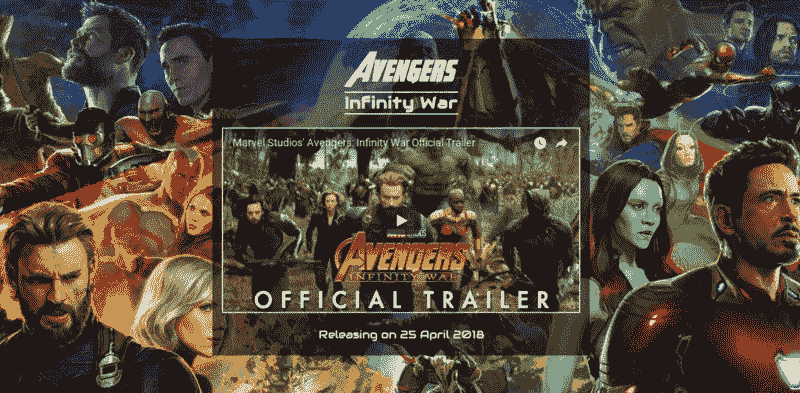

看起来很有趣，不是吗？

在制作这张海报时，你会学到一些重要的概念:

*   如何给你的页面一个全屏的背景图片
*   在 CSS 中水平居中元素
*   在 CSS 中垂直居中元素
*   在 HTML 中嵌入 Youtube 视频
*   什么是利润崩溃
*   如何从本地文件加载自定义字体
*   如何从谷歌字体加载字体

这会很有趣，所以我们开始吧。

### 空白的石板

让我们先达成共识。

这是我的项目文件夹结构的样子:

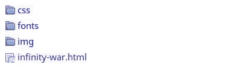

我们的样式表“styles.css”放在 css 文件夹中，我们将下载的自定义字体文件放在 fonts 文件夹中，我们将下载的背景图像放在 img 文件夹中，我们的 HTML 代码放在“infinity-war.html”文件中。

这是我的空白页面的 HTML 文件。我们将在这张白纸上继续努力:

如果你不理解上面的代码，那么你很可能是第一次用 HTML 编码。我推荐从这里开始:[如何用 HTML 制作汉堡——初学者教程](https://medium.com/frontendshortcut/how-to-make-a-burger-in-html-a-beginner-tutorial-dca7b4b0a179)。

### 全背景图像

首先下载[图像](http://hdqwalls.com/wallpapers/avengers-infinity-war-2018-4k-cq.jpg)并保存在“img”文件夹中。


注意:图片的所有权利属于漫威影业有限责任公司，此处仅用于学习目的。

我们通常使用`<i` mg >元素来包含 HTML 中的图像。但是为了这个特定的目的，我们将创建一个 div，使这个 div 覆盖整个屏幕，然后使用“background-image”CSS 属性在这个 div 上设置背景图像。

这是我们的 HTML:

我们的 CSS:

正如您所看到的，我们创建了一个 div，并在 HTML 文件中给了它一个类。在我们的 CSS 文件中，我们将宽度和高度设置为 100%，这样它就覆盖了整个屏幕。我们使用“background-img”属性设置背景图像。

注意我们是如何引用图像文件:`url("../img/infinity-war-wallpaper.jpg")`。你看到路径起点的那个`..`了吗？看，我们是从“css”文件夹中的 styles.css 文件引用“img”文件夹中的图像文件，对吗？

所以我们需要打开一个文件夹，然后引用路径。那个`..`将我们带到文件夹结构中的上一级文件夹。

让我们在浏览器中刷新页面，看看结果。

而且，这还是一张白纸。

实际上，我们忽略了一个细节。

当我们以%为单位设置高度或宽度时，比如我们的例子中的 100%，它不是屏幕的 100%——它是其父维度的 100%。

div 的父元素是什么？`<bo` dy >。`body?` < html >的父元素是什么。

所以，我们需要设置我们的身体和 HTML 元素的高度为 100%。让我们这样做，看看是否可行:

现在我们得到这样的输出:

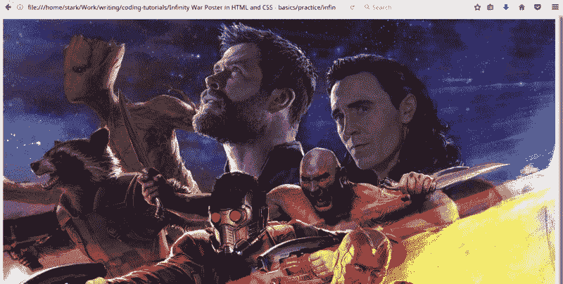

好的，如果你仔细看，你会发现这里有两个问题:

*   图像周围有一个白色空白，你看到了吗？
*   图像被放大了，不是吗？

让我们逐一解决这些问题。

默认情况下，body 元素有一定的边距。这就是为什么我们看到图像周围的间隙。

让我们通过将正文上的边距设置为 0 来移除边距:

刷新浏览器，你会看到白色的空白消失了，现在没有滚动条。

接下来，我们来解决图像缩放问题。默认情况下，图像将以其原始大小显示。我们可以通过将“background-size”属性设置为“cover”来更改此选项，以缩放图像，使其覆盖屏幕。

我们还设置了背景位置，使背景图像居中。

两个问题都解决了。

### 边距折叠

让我们使用`<` h1 >元素添加一个标题，并使用 CSS 中的“color”属性赋予它白色:

我们的 CSS:

输出:

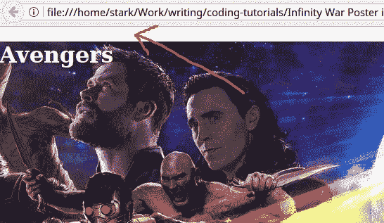

我们搞砸了一些事情。那个白色的缺口是从哪里来的？

事实证明，h1 元素和 body 元素一样，默认情况下也有一些边距，h2、h3、h4、h5 和 h6 元素也是如此。

但是，即使 h1 元素有边距，它也必须在 div 的内与我们的背景图像有一些间隙*。那么为什么它在 div 的外面显示了一个缺口*？**

理想情况下，它应该这样显示:

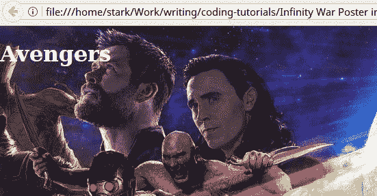

但是它在“full-BG”div 上方显示一个间隙。

发生这种情况是因为利润崩溃。

当您有两个块元素(在我们的例子中是 div 和 h1)并且父元素没有任何填充或边框时，那么子元素的上下边距将显示为父元素的上下边距。这称为边距折叠。子对象的边距与父对象的边距一起折叠。

如果父元素只有 1px 的填充，或者至少有 1px 的边框，那么这种情况不会发生。让我们给“full-BG”div 添加 1px 填充，看看它的效果:

边缘塌陷是固定的。

但是——你注意到一个微小的不同了吗？

你的浏览器现在有水平和垂直滚动条。这意味着 div 的宽度和高度增加了。

怎么会？

### 填充和边框增加了元素的大小

这是您必须记住的另一个默认行为。假设您创建了一个 100px x 100px 的 div，并给它 10px 的填充。div 现在将变成 110 像素 x 110px 像素。

是的，您赋予元素的填充量会添加到元素的尺寸中。边框也是一样:如果你给你的元素一个 4px 的边框，它的大小会增加 4px。

理想情况下，我们不想增加元素的大小，而是收缩元素内部的内容来为填充和边框腾出空间。

我们可以通过将“框大小”属性设置为“边框”来实现这一点。让我们这样做:

刷新您的浏览器。嘭，滚动条不见了。

### 章节和标题

如果你看到了最终的结果图片，你会看到我们仍然需要添加一个副标题，一个 YouTube 视频和发布日期。将所有这些元素归入一个部分是一个很好的做法，因为这些元素是相互关联的。让我们使用>标签上的`<secti`创建一个部分，并将 h1 放入其中:

我们海报的所有元素都将放在“海报内容”部分。

你可能想知道为什么我们在这里不用“div”——为什么用“section ”?

其实在 HTML5 之前，一切都是用“div”的。事实上，我们可以只用“div”元素创建整个网站。但是我们没有这样做，因为包含一个带有元素的图像更有意义，包含一个带有`h t` he < p >元素的段落更有意义，同样，将类似的 t `heme in t` he < section >元素的内容分组更有意义。

所以，经验法则是，当你只想要一个容器来赋予内容某种风格时(比如我们的“full-BG”div)，使用`<d` iv >，一个`d use <`；当你想要一个容器来分组相似主题的内容时。

接下来，我们还知道会有一个副标题。幸运的是，HTML5 有一个元素来分组标题元素——`<head`er>元素。让我们也包括这一点:

我们还必须更新 CSS 中的选择器:

现在，只要点击刷新，您就会注意到 h1 元素的字体变小了。

许多浏览器在将 h1 元素放入> `or a <`上的`<secti`中时会缩小其字体大小；>条元素。所以最好是在 h1 是 pl`aced insi`de&n>或< article >的时候，手动给它指定大小:

### 透明背景

让我们给 section 元素一个黑色半透明的背景色:

输出:

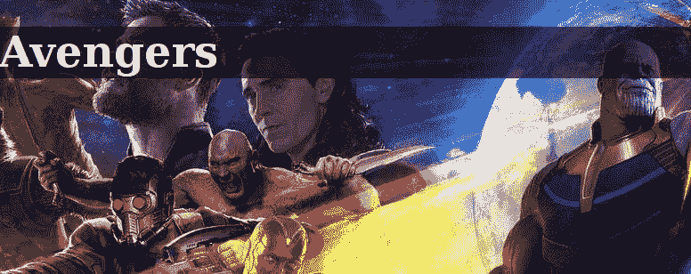

代码“rgba(0，0，0，0.6)”的意思是:由 0 个红色、0 个绿色和 0 个蓝色分量组成的颜色，即黑色，60%不透明。

两件事:我们不希望文本粘在半透明框的边框上。第二，我们希望给该部分一个固定的宽度，并使其居中对齐。

让我们这样做:

我们给了“16px”的填充，并将“框大小”设置为“边框”,因为我们不希望容器扩展 16px 来为填充腾出空间。相反，我们希望容器保持同样的大小，内容缩小，为 16px 的填充空间。

输出:

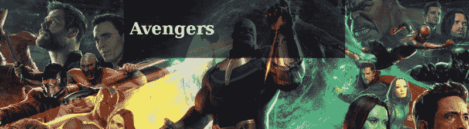

好吧，顶部和底部的差距肯定不像“16px”——他们看起来比这多得多。如果你注意到了，这个部分以前没有接触到浏览器的顶部边缘，但是现在接触到了。发生什么事了？

又是利润暴跌。h1 上下的额外空间不是节的填充，而是 h1 的边距。以前，我们没有任何填充部分，所以 h1 和部分的空白折叠，并显示在部分之外。这就是为什么该部分之前没有触及顶部。

让我们通过为我们的`<head` er >元素设置“text-align: center”来减少 h1 的边距并使其居中:

刷新页面，h1 文本现在应该居中，周围的空间相对较小。

### 伸缩以使事物居中

由于“边距:自动”，我们的部分已经水平居中。

“边距:自动”的作用是将所有边的边距(上边距、右边距、下边距和左边距)设置为“自动”。

我们知道将左边距和右边距设置为“自动”会使元素水平居中。

但是将 margin-top 和 margin-bottom 设置为“auto”不会自动将元素垂直居中。从历史上看，将 HTML 中的内容置于中心一直是 web 开发人员最头疼的事情之一。

不再是了。现在 Flexbox 被所有浏览器广泛支持，我们可以在一个元素上使用“display: flex”。该元素将成为“flex 容器”,其子元素将成为“flex 项目”。

Flex 项目有一些很棒的属性。例如，当 flex 项目的上边距和下边距设置为“自动”时，它会垂直居中！

让我们试一试，将“display: flex”添加到”。全血糖:

输出:

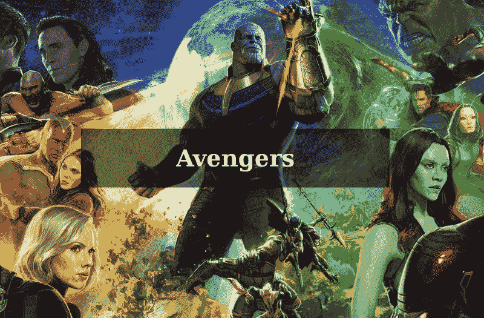

好了，现在看起来不错了。

### 从本地系统加载自定义字体

如果我们真的想让它看起来很酷，我们将需要一个自定义字体的标题。

看看“dafont.com”上的这个字体:

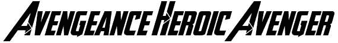

这看起来很适合我们的使用，所以你可以在这里下载它。

如果你解压压缩文件，你会看到 TTF 和 OTF 格式的字体文件。我们可以使用这些，但 WOFF 格式是最好的方式去使用任何自定义字体的 CSS。使用这个在线工具[将任何一个 TTF 文件转换成 WOFF。](https://onlinefontconverter.com/)

然后我们将转换。“fonts”目录下的 woff 文件。

让我们加载我们的字体:

注意:如果你使用 Firefox，你必须允许本地字体文件加载。在 Firefox 的地址栏中输入 about:config，然后回车。接受警告。然后搜索“strict_orogin_policy”，把它变成 false。

输出:

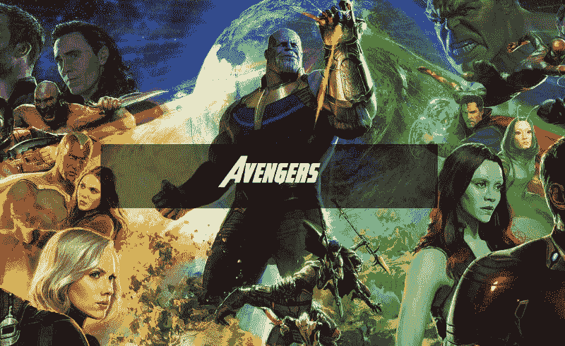

好吧，现在我们在谈话。

### “标题”的样式

现在，让我们将“无限战争”作为副标题写入 h2，并给出顶部和底部边框。

我们的 CSS:

输出:

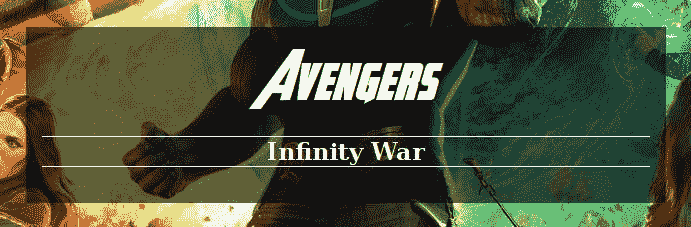

好吧，这里有两个问题:

*   h1 和 h2 之间的间隙，
*   我们不希望白线(h2 的顶部和底部边界)跨越整个部分。我们希望它像“复仇者联盟”的文本一样广泛。

为了缩小 h1 和 h2 之间的差距，让我们去掉 h1 的下边距和 h2 的上边距:

代码“margin: 16px 8px 0”表示将上边距设置为 16px，左右边距设置为 8px，下边距设置为 0。

现在是第二个问题。

默认情况下，

元素是一个 block 元素，所以它的宽度跨越了其父元素的宽度。如果我们让它成为一个“内联块”元素，那么它不会扩展到其父元素的宽度，而只会占据适合其中文本所需的宽度。这正是我们想要的。

让我们将“display: inline-block”赋予标题，将“text-align: center”赋予其父“poster-content”:

输出:

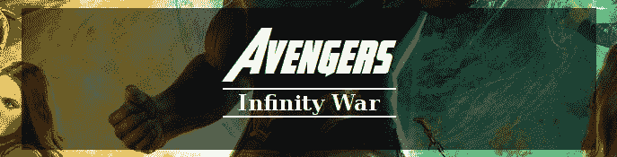

### 自定义谷歌字体

h2 用科幻字体吧。我们看到了如何下载字体并在 CSS 中使用它。在这种情况下，您自己托管字体。谷歌免费提供许多托管字体[这里](https://fonts.google.com)。我们只是从谷歌上链接。这里有一个看起来很适合我们使用的:

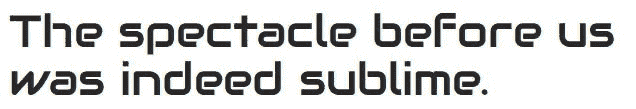

下面是[网址](https://fonts.google.com/specimen/Audiowide)。

转到上面的 URL，然后单击屏幕右侧的“选择该字体”:

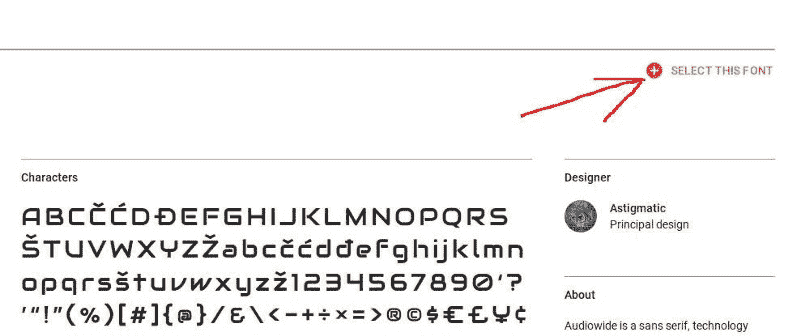

然后点击底部显示的“家庭选择”栏:

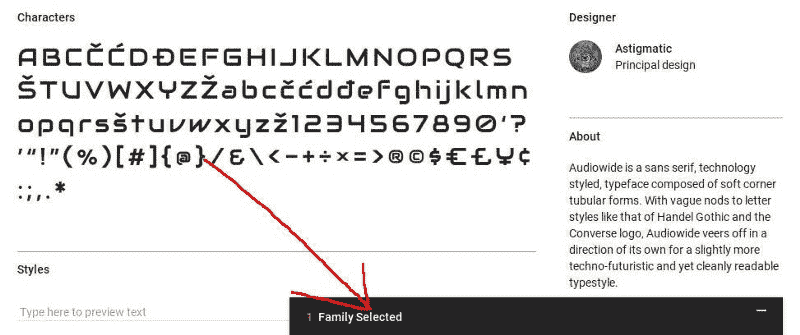

这将为我们提供代码，以便在我们的页面上使用该字体:

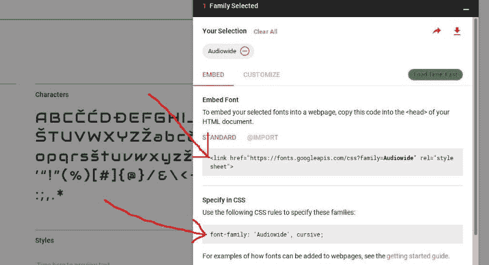

将`<li` nk >代码粘贴到我们的 HTML 文件中:

和字体系列代码添加到我们的 CSS:

我还增加了一些字母间距，因为这些字母看起来很拥挤。我还把字体大小增加到了 26px。

输出:

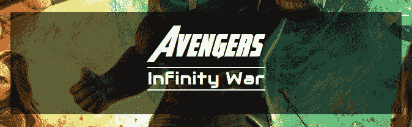

### 嵌入 YouTube 视频

没有预告片的视频，电影海报将是不完整的。

我们可以使用“iframe”将 YouTube 视频包含在 HTML 页面中。“iframe”标签允许我们在当前页面中加载另一个 HTML 页面。加载哪个页面由“src”属性决定。

以下是如何使用来添加 Youtube 上的视频:

```
<iframe src="https://www.youtube.com/embed/6ZfuNTqbHE8"></iframe>
```

“src”中的文本“[https://www.youtube.com/embed/](https://www.youtube.com/embed/)”对所有 Youtube 视频保持不变。对于每个视频，只有最后一个看起来随机的字符串“6ZfuNTqbHE8”会改变。这是视频的 ID，您可以在视频的 URL 中找到它:


我们来看看预告片视频:

输出:

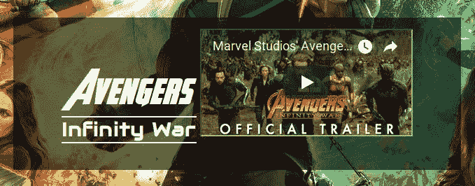

该死的。现在出了什么问题？

你能猜出为什么视频显示在标题的右边吗？

因为我们将标题设置为“inline-block”，正如我们所知道的，inline-block 元素将为它旁边的下一个元素让路。

为了解决这个问题，让我们给 iframe 元素一些宽度和高度:

iframe 的默认边框看起来很丑，所以我添加了一个“#ddd”颜色的 2px 边框(几乎是白色)。

输出:

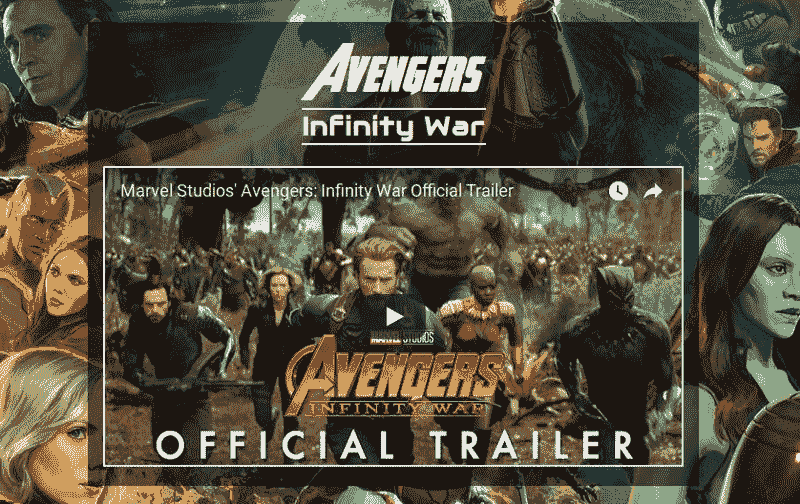

太好了。

最后一件事——发布日期。让我们把发布日期放在底部的一个段落中:

并对该段落进行一些调整:

我们把字体大小增加到 18px，给它白色(#fff)，把字体设置为“Audiowide”，把下边距减少到“8px”。

输出:


我们的无限战争电影海报完成了。

想通过有趣且吸引人的教程学习 Web 开发吗？

[**点击这里每周获取新的 Web 开发教程。**](http://supersarkar.com)