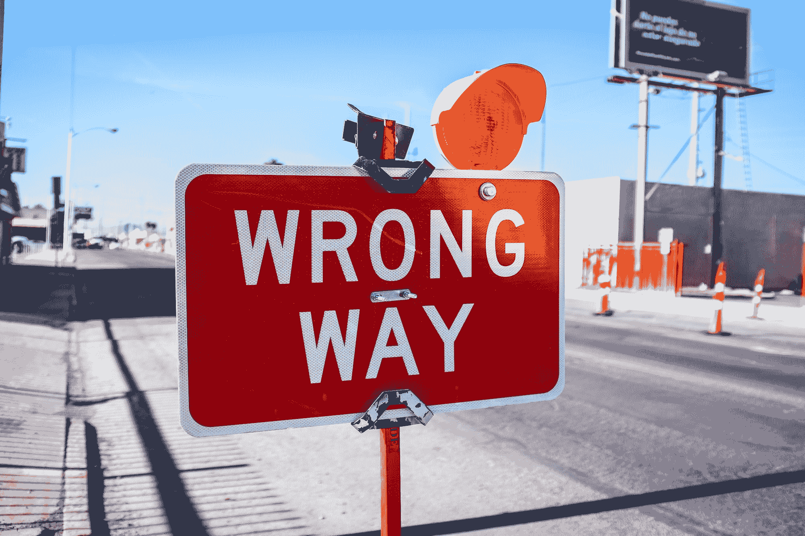

# 如何成功犯错

> 原文：<https://www.freecodecamp.org/news/how-to-make-a-successful-mistake/>

没有人是完美的——我们总是会犯错，而这正是我们人性的一面。我们并不是生活在一个完美的世界里，这种不完美正是生活如此充满活力的原因。

错误通常被视为消极的事情，但你总是可以选择以积极的眼光看待它。此外，我们总是犯错误，所以我们不妨从中获得一些好处，对不对？

有时，即使是一个小小的错误也会导致巨大的经济损失，尤其是对所有的程序员来说。当你犯了一个错误时，你应该感到难过，而不只是说，“嗯，它发生了，所以事情就是这样。”

但是当你犯了一个错误时，不要只是感觉不好，你可以做一些事情来确保这是一个成功的错误。

## 从中吸取教训

Photo by [Ben White](https://unsplash.com/@benwhitephotography?utm_source=ghost&utm_medium=referral&utm_campaign=api-credit) / [Unsplash](https://unsplash.com/?utm_source=ghost&utm_medium=referral&utm_campaign=api-credit)

当你犯错误的时候，黄金法则是你要从中吸取教训。

我很确定你们都听说过这句话(并且在想“谢谢显而易见先生”)。但是每个听说过这个概念的人都实际应用过吗？

有很多名言警句警告你不要犯两次同样的错误。事实上，我们也不能幸免——人们会一次又一次地犯同样的错误。从错误中学习并不能保证你不会再犯同样的错误。

你可以从你的错误中学到很多东西:它是怎么发生的？影响了什么？它有多重要？

课程永远不会结束。

但最重要的是，你要努力完全理解这个错误。至少，这种情况再次发生的几率会大大降低。你可能会偶然发现可以避免犯类似错误的情况。

## 给出解决方案而不是借口

Photo by [AbsolutVision](https://unsplash.com/@freegraphictoday?utm_source=ghost&utm_medium=referral&utm_campaign=api-credit) / [Unsplash](https://unsplash.com/?utm_source=ghost&utm_medium=referral&utm_campaign=api-credit)

每当因为一个错误而发生什么事情时，大多数人做的第一件事就是找借口。甚至可能会有一些不成熟的反应和指责，通常最重要的事情被忘记了:解决问题。

与其找借口，不如找到解决办法。当然，可能有一个完全合理的原因来解释为什么犯了一个错误，但是这可以等到你找到正确的解决方案之后。

有效利用你的时间——没有人想在闹钟响的时候浪费时间。当事情平息下来，你可以仔细地分析解释发生了什么。

## 不知道没关系，但是故意不知道就不行了

Photo by [Rashid Khreiss](https://unsplash.com/@rush_intime?utm_source=ghost&utm_medium=referral&utm_campaign=api-credit) / [Unsplash](https://unsplash.com/?utm_source=ghost&utm_medium=referral&utm_campaign=api-credit)

我们经常犯错误，因为我们不知道一些事情。但是这种错误可以吗？

踏入未知的领域，人都会犯错，这很正常。但你需要问的真正问题是，如果这个人**不知道**，或者**没有试图了解**，因为那些完全不同。

有时候在生活中我们会走捷径，找到简单的方法去做一些事情。这没有错。

但是人们经常忘记的是，捷径**可能**会误导人，是的，可能在这里是一个强有力的词。人们倾向于忽略事情可能出错的可能性，不太考虑后果。

当有人说“我不知道”时，这通常会被理解为“我懒得知道”人们倾向于找到简单的方法去做某件事，却继续不知道他们在做什么。他们懒得深究，因为一切似乎都没问题。

当你因为真的不知道某件事而在不知不觉中犯了一个错误，这没什么。但是当你由于故意的无知而导致错误时，那就不好了。因为无论你犯多少次同样的错误，你都不会从中吸取教训。

## 不要忘记分享你的错误

Photo by [Caleb Lucas](https://unsplash.com/@calebdlucas?utm_source=ghost&utm_medium=referral&utm_campaign=api-credit) / [Unsplash](https://unsplash.com/?utm_source=ghost&utm_medium=referral&utm_campaign=api-credit)

通常当我们犯了错误，我们只是试着改正它，然后继续前进。我们忘记了分享我们的错误是非常重要的。

我们可能会因为看起来很傻而感到尴尬。但幸运的是，好处远不止于此。

首先，这将帮助其他人避免犯和你一样的错误。在内心深处，他们会非常感激。

不仅如此，分享你的错误可能会给你一个新的不同的视角，让你知道别人会怎么想。他们可以给你一个新的视角或者更好的解决方案。

别忘了分享你的错误，因为**分享就是关怀**。

## 承担后果

Photo by [NeONBRAND](https://unsplash.com/@neonbrand?utm_source=ghost&utm_medium=referral&utm_campaign=api-credit) / [Unsplash](https://unsplash.com/?utm_source=ghost&utm_medium=referral&utm_campaign=api-credit)

记住每一个错误都会带来后果。它们会导致经济损失，甚至影响你的信誉。

需要明确定义和理解后果，因为在接近任何情况时，理解后果都会成为一种威慑。这也会帮助你更好地考虑如何解决问题。

有时候，后果可能会伴随你很长一段时间。你必须忍受它，并对后果负责，因为这是你的 T2 的责任。

但是不管后果有多大，也不要对自己太苛刻。保持良好的精神和积极性是处理后果的关键。

## 概括起来

犯错**并不是一切**的结束。生活在继续，一切都在继续。有些东西被遗忘了，新的东西出现了。

对于任何错误，你能做的最好的事情就是尽你所能从中吸取教训，并把它变成一个成功的错误。

人生是一段太长的旅程，你不能因为一个错误而停滞不前。继续前进，享受旅程。

感谢阅读——我真心希望这篇文章对你有用！