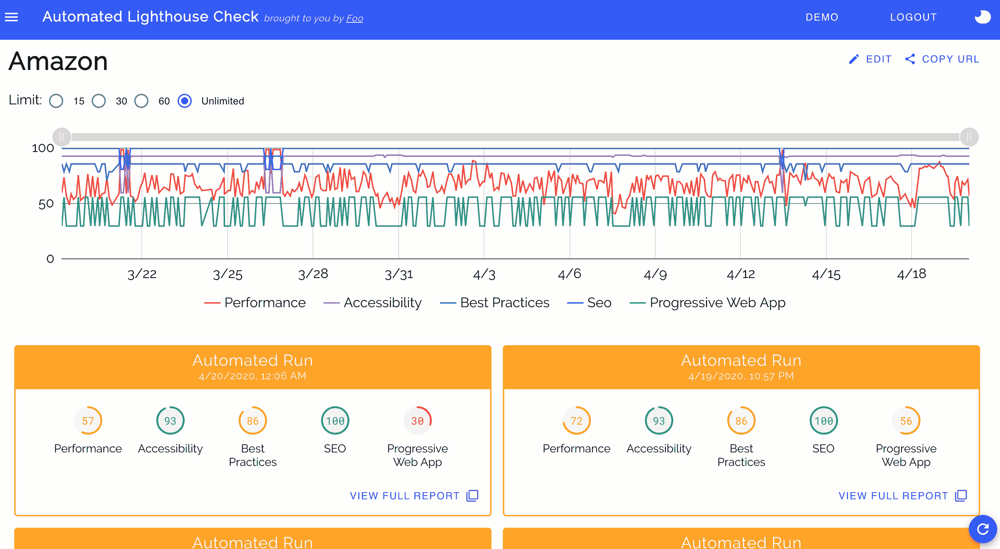
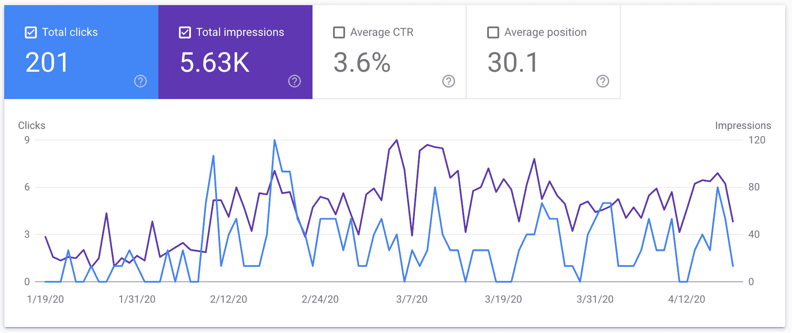

# 如何使网站搜索引擎优化友好，并保持这种方式

> 原文：<https://www.freecodecamp.org/news/how-to-make-a-website-seo-friendly/>

在新冠肺炎的经济灾难中，在线业务比以往任何时候都更加依赖 SEO。这样的时代说明了搜索引擎优化的力量和重要性。

### 什么是 SEO？

SEO 是通过有机搜索引擎结果增加网页流量的数量和质量的实践。有机搜索结果来自搜索引擎的内部算法，而不是付费广告的结果。下面是相关术语的列表。

*   SERP 或搜索引擎结果页面就是驱动点击的结果页面。这些页面包括付费搜索结果和有机搜索结果的组合。
*   **SEM** 或“搜索引擎营销”是使用出现在 SERPs 上的付费广告来营销企业的做法。
*   PPC 代表点击付费，这是一种互联网营销的模式，广告客户每点击一次他们的广告就支付一笔费用。

学习 SEO 基础和更高级的主题可能是一个令人困惑的过程。在本帖中，我们将看看帮助创建 SEO 友好网页的简单步骤和维护它们的工具。

## 相关和有意义的内容

一个 SEO 友好网站最重要的驱动力是独特、相关和有意义的内容。虽然这似乎是显而易见的，但搞砸比做对容易。

对网站用户的深刻理解对于掌握内容创作至关重要。与用户建立紧密联系的内容将促进互动，降低跳出率。搜索引擎识别用户在网站上花费的时间和互动水平。

**不要太聪明**。SEO 不是一个你需要智胜对手的纸牌游戏。“过度优化”是一个描述试图欺骗搜索引擎的古老技术的术语，例如“链接填充”和“内容填充”。在过去，一些技巧被证明是有效的，但它们最终是短命的。

**关键词策略**如果做得正确，可以导致 SEO 成功。在关键词使用和主题相关性之间找到正确的平衡是取得成功的关键。

内容和形式的多样化是抓住注意力的有效方法。包括图像、视频、表格和列表在内的丰富内容将吸引那些眼球。

在一个有逻辑的网站层级中组织内容是创建一个 SEO 友好网站的另一个基本方面。谷歌的搜索控制台帮助页面“[搜索引擎优化(SEO)入门指南](https://support.google.com/webmasters/answer/7451184?hl=en#hierarchy)”提供了组织内容的详细指南。

## 语义标记和结构化数据

结构良好的内容和结构良好的代码是 SEO 的关键，我们的浏览器和搜索引擎使用这些代码来解释内容。

许多 HTML 标签都有语义，可以帮助解释者理解和分类内容类型。作为 web 开发人员，我们有时在 SEO 的营销世界中感到无能为力，但是编写语义标记是我们工具带中最有影响力的工具之一。

当我们有一系列标签来识别不同类型的内容时，为什么要把每个 HTML 元素都写成一个`div`。下面是一些更有用的语义标签。

*   页面标题
*   页面描述
*   段落
*   列表
*   文章
*   部分
*   头球
*   脚注
*   等等，等等

再次强调，聪明地创作 HTML 很重要，但不要太聪明。在标题、描述、h1 和 h2s 之间平衡地散布共享关键词会有很大帮助。页面之间的标题和描述应该是唯一的，并且与内容相关。

**结构化数据**是一种更新的数据格式，遵循 [JSON-LD 规范](https://json-ld.org/)，可以嵌入 HTML 页面。像谷歌这样的搜索引擎解释结构化数据，以理解页面的内容，以及收集关于网络和整个世界的信息，如“[了解结构化数据如何工作](https://developers.google.com/search/docs/guides/intro-structured-data)”中所解释的。下面是一个简单的例子。

```
<script type="application/ld+json">
{
  "@context": "https://schema.org",
  "@type": "Organization",
  "name": "Foo Software | Website Quality Monitoring",
  "url": "https://www.foo.software",
  "sameAs": [
    "https://www.facebook.com/www.foo.software",
    "https://www.instagram.com/foosoftware/",
    "https://github.com/foo-software",
    "https://www.linkedin.com/company/foo-software"
  ]
}
</script> 
```

## 网站可访问性和性能

搜索引擎肯定会继续提高可接受的网络标准。[2018 年，谷歌宣布开始向移动优先索引转移](https://webmasters.googleblog.com/2018/03/rolling-out-mobile-first-indexing.html)，并通过宣布在 2020 年面向整个网络的移动优先索引[进行扩张](https://webmasters.googleblog.com/2020/03/announcing-mobile-first-indexing-for.html)。网页性能和可访问性包含以用户为中心的指标，这些指标最终会影响 SEO。

**网站表现**捕捉用户旅程，标记用户体验的各个瞬间。以下是重要的性能指标。

*   **[【FCP】](https://web.dev/fcp/):**测量从页面开始加载到页面内容的任何部分呈现在屏幕上的时间。
*   **[【LCP】](https://web.dev/lcp/):**测量从页面开始加载到屏幕上呈现最大文本块或图像元素的时间。
*   **[【FID】](https://web.dev/fid/):**测量从用户第一次与您的网站交互(即，当他们点击链接、点击按钮或使用自定义的 JavaScript 支持的控件)到浏览器实际能够响应交互的时间。
*   **[【TTI】](https://web.dev/tti/):**测量从页面开始加载到可视化呈现、加载初始脚本(如果有)以及能够快速可靠地响应用户输入的时间。
*   **[【TBT】](https://web.dev/tbt/):**测量 FCP 和 TTI 之间主线程被阻塞足够长时间以阻止输入响应的总时间。
*   **[【CLS】](https://web.dev/cls/):**测量从页面开始加载到其[生命周期状态](https://developers.google.com/web/updates/2018/07/page-lifecycle-api)变为隐藏之间发生的所有意外布局变化的累积分数。

**网站可访问性**是构建搜索引擎优化网站时要记住的另一个重要概念。不仅有各种各样的人在阅读我们的网站，还有各种各样的机器，比如屏幕阅读器，也在做同样的事情。

> 提高可访问性使你的网站对每个人都更有用。~艾迪·永野修身| [给网页开发者的易访问性提示](https://web.dev/a11y-tips-for-web-dev/)

## SEO 工具

在这篇文章中，我们已经看到了改善 SEO 的方法，但是我们如何随着时间的推移保持这些标准呢？很多工具可以帮助我们分析和监控 SEO。

[Foo 的自动化灯塔检查](https://www.foo.software/lighthouse)用灯塔监控网页质量。它提供了详细的 SEO、性能和可访问性报告。提供免费和高级计划。



Automated Lighthouse Check dashboard

[**谷歌搜索控制台**](https://search.google.com/search-console/about) 对于任何一个关心 SEO 的网站站长来说都是必备的。它提供了对哪些搜索词正在获得有机流量的洞察和粒度级的分析。您可以按位置、设备等进行过滤。



Google Search Console performance dashboard

## 结论

SEO 不是一个容易掌握的实践，但是随着时间的推移，在贸易的趋势技巧中，最有效的方法应该是自然而然的。有意义的、格式良好的内容结合格式良好的代码，以一种高性能的、可访问的方式交付，肯定会安抚 SEO 之神。