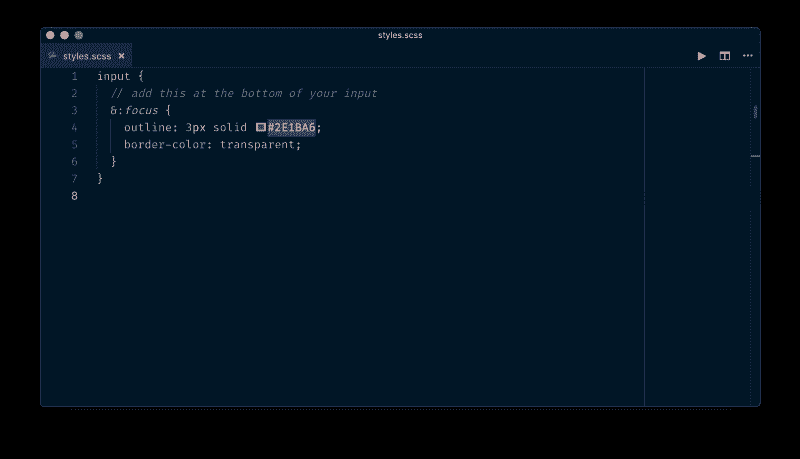

# 如何制作一个易访问的表单:比你想象的要简单

> 原文：<https://www.freecodecamp.org/news/how-to-make-an-accessible-form-its-easier-than-you-think-672d3f4ff573/>

乔纳森·斯皮克

# 如何制作一个易访问的表单:比你想象的要简单

Photo by [rawpixel](https://unsplash.com/photos/ylu3bpKHEXE?utm_source=unsplash&utm_medium=referral&utm_content=creditCopyText) on [Unsplash](https://unsplash.com/search/photos/website?utm_source=unsplash&utm_medium=referral&utm_content=creditCopyText)

表单是网络的重要组成部分，因为它们将用户与你的企业联系起来，并帮助他们完成他们访问你的网站或应用程序的目的。也就是说，您希望确保所有用户都能够使用您的表单，而不会有糟糕的体验。目标是让这些关键的用户交互尽可能地顺畅。

虽然构建表单有时可能是一项困难的任务，但是使它们适度地可访问并没有您想象的那么复杂。经常有各种借口，比如“我们没有时间担心可访问性”或者“我们以后会让它可访问的”。这些借口通常是无效的，你可以帮助你的团队改变这种心态。

以下是构建表单时要考虑的一些事项:

*   有视觉障碍的人在使用我的表单时会有什么困难？
*   用户是否清楚地知道应该输入什么数据？
*   表格是否容易快速理解？
*   我能使用键盘填写表格吗？

### 让我们做一个基本的订阅表格

I’ve given you some starter code to help you cheat a little ?

从这个开始: **[码本上的起始码](https://codepen.io/JonathanSpeek/pen/JwNMYK)**

我们最终会得到这个: [**成品码本**](https://codepen.io/JonathanSpeek/pen/KrEdxR)

我已经为您提供了构成一个简单订阅表单的一些基本样式和元素，但是我们还可以做很多事情来使这个表单更加有用。无论你做什么，使用好的语义 HTML 都会让你走得更远。

让我们首先将`<inp` ut >元素连接到它们各自的`ctive &`lt；标签>的。我们通过 `giving`的 `&`lt；输入>一个 id 和`using t`帽子 `as`<标签>的属性。我们可以用“姓名”和“电子邮件”来表示这些，我们已经做了两件事:

1.  我们以编程方式将标签与输入关联起来，如果输入被聚焦，它会将标签读给屏幕阅读器用户
2.  用户现在可以点击标签，相应的输入将被聚焦，因此用户现在有了更大的目标尺寸

现在我们的输入和标签都连接好了，我们可以定义 HTML 输入类型了。这些真的很有用，并且是一个非常简单的方法来给用户一个很好的体验。添加类型属性([在这里了解不同的类型](https://codepen.io/JonathanSpeek/pen/JwNMYK))将有助于用户自动填写表单，并为移动用户提供更合适的键盘。对于我们的用例，我们可以为姓名输入做`type="text"`，为电子邮件输入做`type="email"`。

我们也希望我们的用户对我们期望从他们那里得到什么类型的数据(及其格式)有一个很好的想法。这里很明显，但情况并非总是如此。通常，提供一个始终可见的标签和一个传达预期输入的占位符是一种好的做法。这意味着 ***而不是*** 使用`placeholder`属性作为输入的可视标签，一旦用户开始输入，该标签就不可见。这是一种流行的做法，需要被搁置…我们可以给出一个占位符“ex。无名氏的名字和前任。[jane.doe@example.com](mailto:jane.doe@example.com)为邮件。

现在总结一下，我们可以研究一下`focus`状态样式。不同浏览器的焦点状态的默认样式是不同的，我们可以改进默认样式，使之更加用户友好。在我们的例子中，我们希望输入具有与按钮匹配的粗的彩色轮廓:

Add your focus styles in your input selector ?

最后，我们需要在按钮元素周围添加一些焦点样式。这经常被忽视，但是确实可以帮助只有键盘的用户知道他们在哪里。我们需要添加这个`&::moz-focus-innner`位来去除 Firefox 中的一些默认样式(您可能希望保存该代码片段以供将来使用)。

就像这样，我们有一个基本的订阅表格，你可以感到自豪，并对其进行改进。因为我们使用了良好的语义，所以只能通过键盘访问表单(尝试使用 tab 和空格键/回车键)。按钮使用的颜色是 11.51 的[色比率，符合 WCAG](https://contrast-ratio.com/#%23FFF-on-%232E1BA6) 的 [AAA 标准(网页内容可访问性指南)。我们为视觉用户和屏幕阅读器用户提供了标签，也为使用键盘的朋友提供了风格化的焦点状态。最后，注意正文中的字体被设置为`18px`，这使得我们的表单可读性更好？(你要尽量保持在 14px 以上)。](https://www.w3.org/WAI/WCAG21/quickref/#contrast-enhanced)

考虑到可访问性的设计和构建需要实践，但是你会成为一个更好的开发者，并且你会得到额外的好处，让网络变得更好？

### 资源

这里有一些很好的资源可以帮助你与用户产生共鸣，并检查你的工作:

Chrome 的一个全新扩展，帮助你通过具有不同能力和残疾的极端用户的眼睛来体验网络和界面。

模拟色盲症(Sim Daltonism)—想象各种色盲所感知的颜色。

[Web.dev](https://web.dev/measure) —提供任何 URL，Web.dev 将使用 [Lighthouse](https://developers.google.com/web/tools/lighthouse/) 运行一系列审计。

[MDN 的可访问性指南](https://developer.mozilla.org/en-US/docs/Web/Accessibility) —这是一个很好的资源，可以经常查阅(我❤️ MDN 的指南)。

[色彩对比度检查器](https://webaim.org/resources/contrastchecker/) —提供一种快速简便的方法来检查色彩对比度及其符合的标准。

感谢阅读。如果你有一些关于可访问性的知识，一定要留下评论。

你可以在推特上关注我，这里是✌️