# 你好，凯蒂！如何用 ARKit 和 Unity 制作一个增强现实 app？

> 原文：<https://www.freecodecamp.org/news/how-to-make-an-augmented-reality-app-using-arkit-and-unity-ba16515a32fa/>

弗朗切斯科·帕洛塔

# 你好，凯蒂！如何用 ARKit 和 Unity 制作一个增强现实 app？

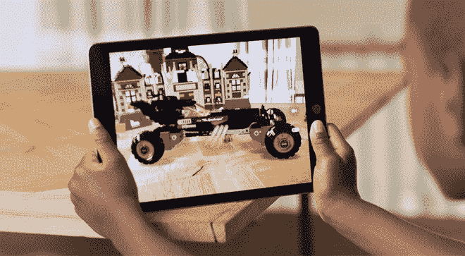

我们都听说过增强现实(AR)，但在这一点上，很少有机会看到这项技术的实际应用。我们知道 AR 让我们看到虚拟元素与我们周围的现实世界融合在一起。例如，通过 AR，我们可以在房间里看到虚拟沙发。苹果现在让我们通过手机中的摄像头看到添加到现实世界中的新物品。

苹果在 iOS11 中推出了 ARKit，这是一个在增强现实中创造体验的框架。ARKit 使用视觉惯性里程计(VIO)来绘制周围环境的地图。VIO 将相机传感器提供的数据与核心运动数据混合在一起。核心运动数据通过加速度计、陀螺仪、计步器、磁力计和气压计收集。

所有这些输入使设备能够理解其在房间内的运动。通过 ARKit，iPhone 和 iPad 可以分析一个场景，并找到一个房间的水平面。ARKit 可以定位桌子和地板，并可以在精确的点上跟踪和定位对象。

ARKit 还使用房间传感器来测量环境光，并将正确的光量应用于虚拟对象。ARKit 与苹果的 A9、A10 和 A11 处理器兼容。要使用 ARKit 进行开发，您可以使用 Metal、Scenekit 和第三方工具，如 Unity 和 Unreal Engine。

现在让我们看看如何使用 ARKit 创建 AR 应用程序。

### 发展环境

要开始，我们需要:

*   [Unity 2017.1.0](https://unity3d.com/get-unity/download?thank-you=update&download_nid=47505&os=Mac) 或更高版本的发布版本。ARKit 还兼容用于 macOS VR 内容创作的[实验 VR build](http://beta.unity3d.com/download/c92f68c59a22/public_download.html) 和 [Unity 5.6.2](https://unity3d.com/get-unity/download?thank-you=update&download_nid=47271&os=Mac) 或更高版本的 Unity 5.x 版本。
*   iOS 11 或更高版本
*   XCode 9 beta 或更高版本，带有包含 ARKit 框架的 iOS SDK
*   支持 ARKit 的 iOS(iPhone 6S 或更高版本，iPad 2017 或更高版本)

### 程序

开始团结。项目窗口将会打开。

此时，我们必须创建一个新的空项目:

1.  在窗口中，点击**新建**新建一个项目。
2.  在**项目名称**文本框中写下“ARKitty”。
3.  在同一窗口中，按下**创建项目**按钮。

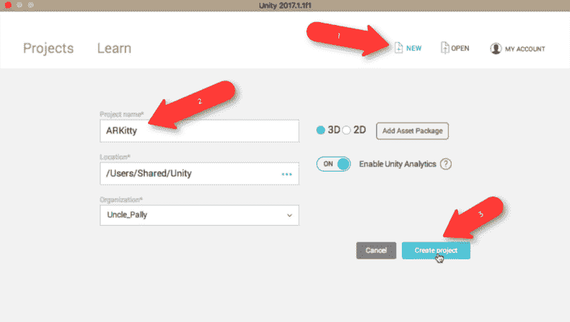

我们已经创建了我们的 AR 项目！

点击该选项卡，打开**资产商店**。

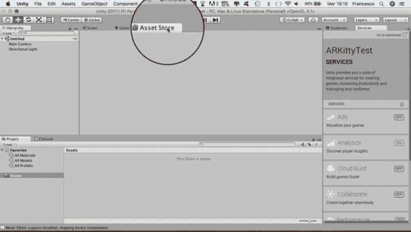

接下来，在商店内搜索:在文本框中输入“ARKit ”,然后点击放大镜图标。

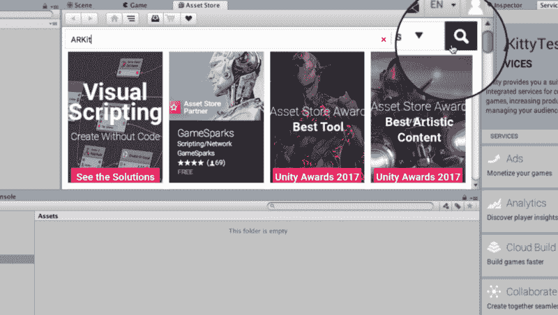

滚动浏览资产商店窗口，直到找到“Unity ARKit 插件”这是在 Unity 中集成 ARKit 的插件。

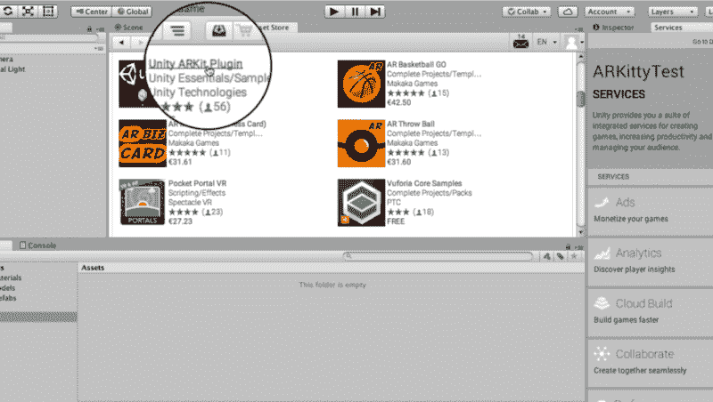

点击 Unity ARKit 插件，向下滚动到**导入**按钮并按下。再次按 import 来导入同一个项目，并在 plugin element 窗口中再次导入。

现在回到资产商店，按下 **Home** 符号，在搜索文本字段中写下“可爱的小猫”。按搜索符号并导入可爱的小猫模型，就像您刚才使用 ARKit 插件一样。

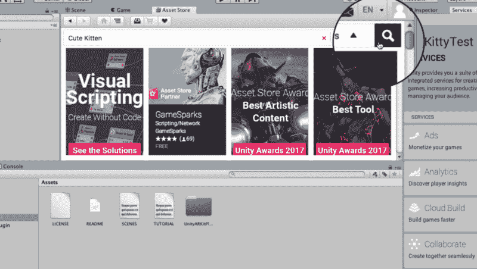

将光标滚动到导入按钮，然后按下它。在插件元素窗口中再次按下 import。

在“资产/示例”下的 UnityARKitScene 文件夹中搜索“UnityARKitScene”场景

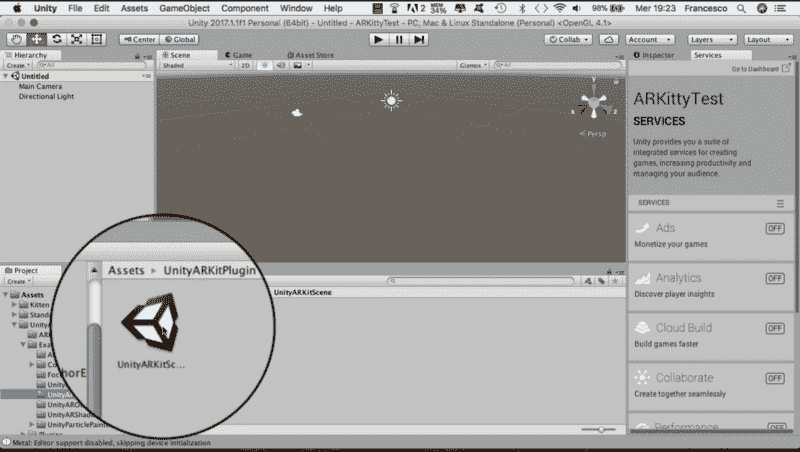

将场景“UnityARKitScene”拖动到“层次”下。

去资产，找到小猫。

转到**模型**下，将“小猫”拖到“层级->hitcuberparent”下。

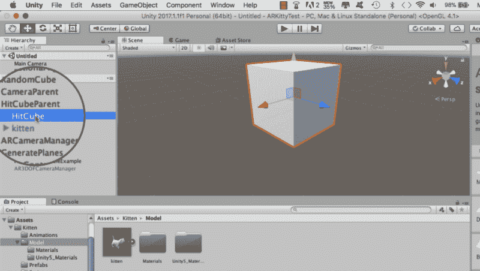

右键点击并点击**删除**，将 HitCube 和 RandomCube 从场景中移除。选择 GeneratePlanes，ARKitControl，点击 inspector，取消选择**标签**。

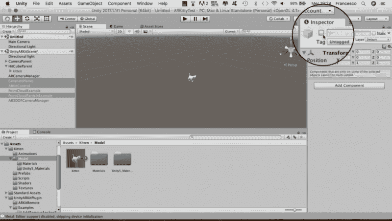

转到 CameraParent 下的**主相机**，在 Inspector 中，将附近的**设置为 0.01。**

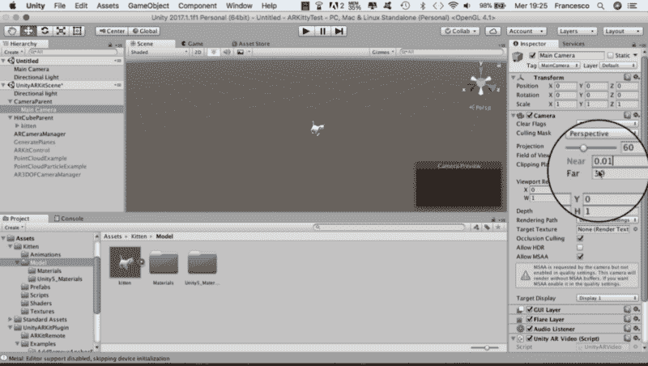

点击**场景**标签。点击**层级**中的小猫进行选择。现在我们在三维空间的场景视图中看到我们的小猫。转到资产“UnityARKitPlugin- >插件- >助手”并使用 UnityARHitTestExample.cs 脚本。将脚本拖到小猫检查器中。

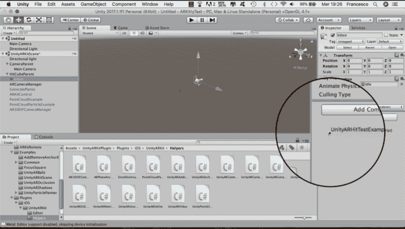

在“UnityARHitTestExample.cs”脚本的**点击变换**字段中拖动小猫。

通过选择“文件->保存场景”来保存场景，并将其命名为“ARKittyTest”。

完了！是时候尝试增强现实中的新应用了。

进入**文件**菜单，选择**构建设置**。在打开的窗口中，在**平台**下，选择 IOS。

按下**播放器设置**按钮，向下滚动直到找到**捆绑标识符**。在这里，写下类型的标识符:“com。<你的名字>。arkittytest”。

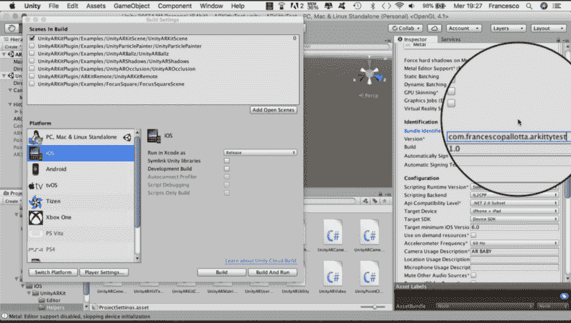

点按“构建设置”窗口中的“构建”按钮，并将项目作为“ARKittyTest”保存到 iOS。

在过程的最后，在 Finder 中找到名为“Unity-iPhone.xcodeproj”的 XCode 项目。双击以使用 XCode 打开项目。在 XCode 中，点击 Unity-iPhone，进入**通用**。在 identity 字段中，写入 Unity 构建设置中插入的同一个包标识符。

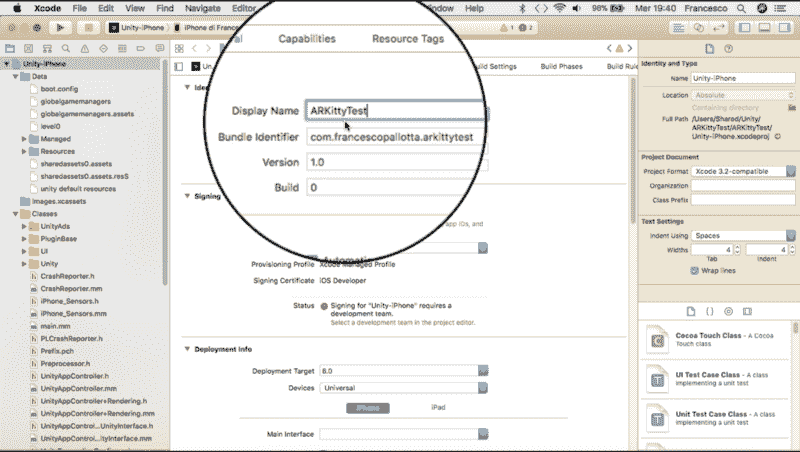

在**团队**下拉菜单中的**签约**下，选择注册的团队名称。

在连接到 Mac 之前选择设备(iPhone / iPad)作为目标设备。

按 XCode 箭头键“构建并运行当前方案”

最终，当我们将一个表面框在我们附近，并在手机屏幕上点击时，我们可以看到我们的小猫生活在我们面前。

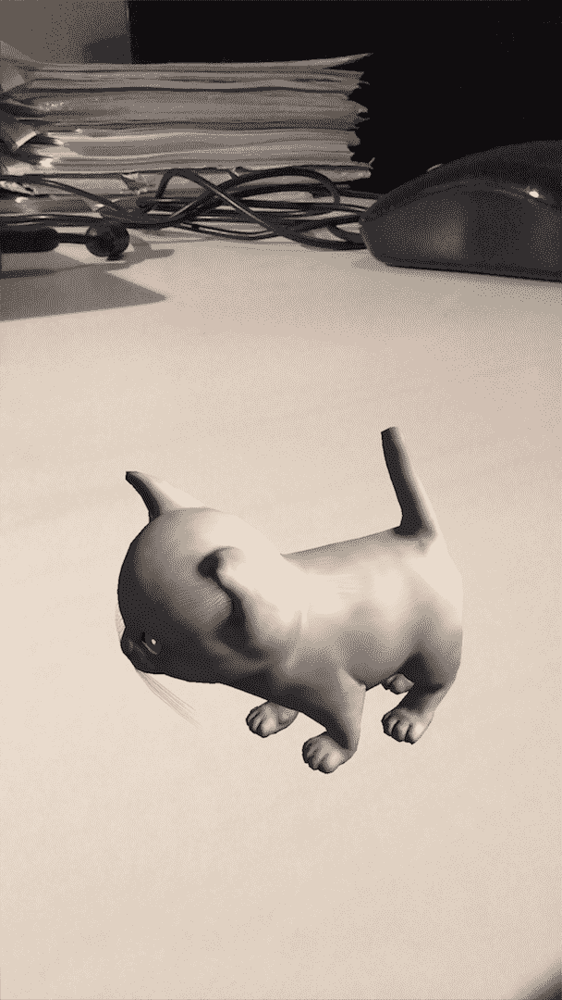

任务完成！以下视频显示了完整的过程。

Francesco Pallotta 是一名高级软件工程师，擅长软件设计和开发。他在太空和国防领域工作，处理虚拟现实和增强现实的应用开发技术*。*

你想了解更多关于虚拟现实、增强现实和混合现实的知识吗？**在[媒体](https://medium.com/@pallotta.francesco)和[推特](https://twitter.com/FranPallotta)上关注我**。

你喜欢这篇文章吗？推荐它，给它一些掌声。谢谢！