# 如何使用 Unsplash API 在 React 中制作图片搜索应用程序

> 原文：<https://www.freecodecamp.org/news/how-to-make-an-image-search-app-in-react/>

Unsplash 是一个网站，你可以下载免费和未经许可的图片，并在你认为合适的时候使用它们。

在本教程中，我们将使用 Unsplash API 创建一个图像搜索应用程序，以访问其庞大的图像集合并下载它们。

在开始我们应用程序的开发部分之前，让我们看看[看起来和](https://unspalsh-app-in-react.vercel.app/)完全一样。

让我们开始…

## 内容

1.  如何创建 React 应用程序
2.  如何构建我们的应用程序的用户界面
3.  如何从 Unsplash 获取访问键和 API 端点
4.  如何在我们的应用中使用钩子
5.  如何在我们的应用中显示图像
6.  如何处理错误
7.  结论

### 我们会学到什么？

这个项目主要是针对初学者的，但任何想提高技能的人都可以跟着做。在本教程中，您将学习:

1.  如何从 Unsplash 开发人员的仪表板获取 API 端点和访问键。
2.  如何使用 useState 和 useEffect 挂钩从 API 获取数据。
3.  如何使用 map 函数显示图像或来自 API 的任何其他数据。

## 如何创建 React 应用程序

创建一个 React 应用程序非常简单——只需转到您首选 IDE 中的工作目录，并在终端中输入以下命令:

```
npx create-react-app image-search-app
```

如果你不确定如何正确设置一个 create-react-app 项目，你可以参考官方指南，网址是 [create-react-app-dev](https://create-react-app.dev/docs/getting-started/) 。‌‌

设置完成后，在同一个终端中运行 npm start 来启动 localhost:3000，我们的 React 应用程序将在这里托管。我们也可以在那里看到我们所有的变化。

## 如何构建我们的应用程序的用户界面

在我们的应用程序的用户界面中将有两个部分:

1.  输入部分
2.  我们将显示图像的结果部分

在输入部分，我们有一个输入标签，我们将在其中写入搜索项或查询。我们还有一个带有 **onClick** 事件处理程序的按钮，它将触发负责从 API 获取数据的函数。

```
import React from "react";
const App = () => {
  return (
    <>
      <div className="container-fluid">
        <div className="row">
          <div className="col-12 d-flex justify-content-center align-items-center input">
            <input
              className="col-3 form-control-sm py-1 fs-4 text-capitalize border border-3 border-dark"
              type="text"
              placeholder="Search Anything..."
            />
            <button
              type="submit"
              onClick={Submit}
              className="btn bg-dark text-white fs-3 mx-3"
            >
              Search
            </button>
          </div>
        </div>
      </div>
    </>
  );
};
export default App; 
```

输出如下所示:

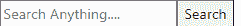

在本文中，我们将不讨论应用程序的样式部分。这样，我们可以更专注于更需要理解的反应部分。

## 如何从 Unsplash 获取访问键和 API 端点

让我们从开发人员的 [Unsplash 获取这些 API 密钥。按照下面给出的步骤获取您的 API 密钥和其他详细信息:](https://unsplash.com/developers)

首先，进入上面的链接，点击注册成为开发者。

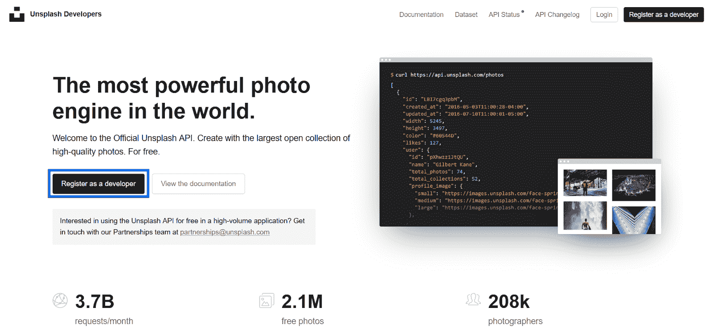

然后填写他们要求的凭证:

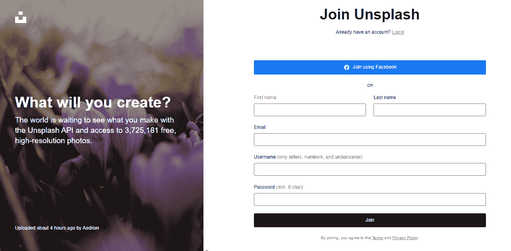

在此之后，您将被定向到开发人员控制面板。点击新项目。

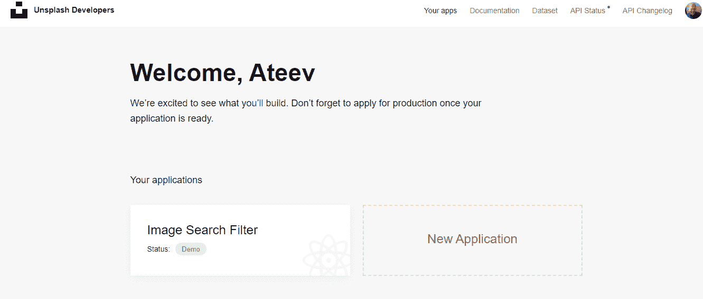

你将被要求接受写在那里的所有条款。如果你愿意，可以阅读它们，或者只需检查所有内容，然后点击最后的按钮继续。

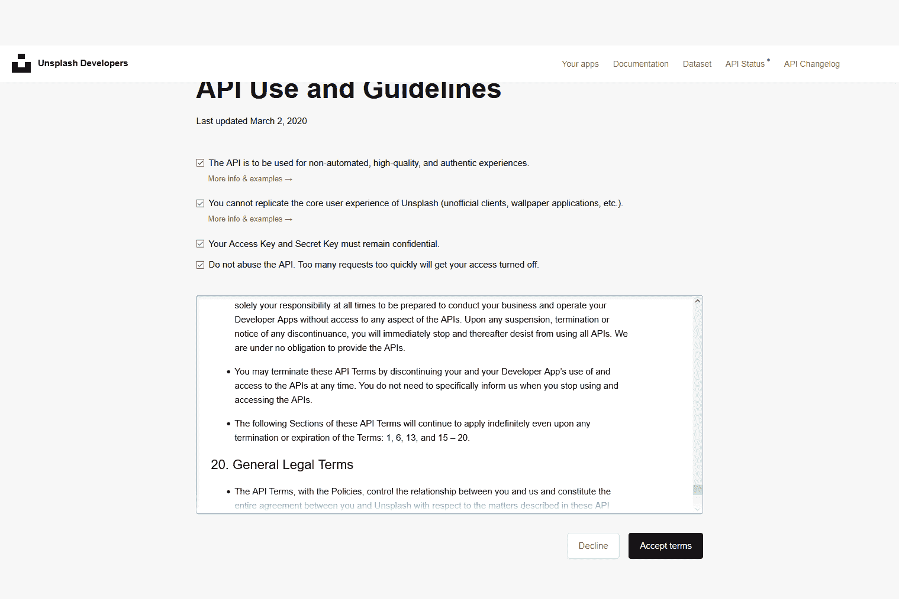

接下来，将出现如下所示的模态表单，您必须在其中写入应用程序信息，如名称和描述。

然后单击创建应用程序。

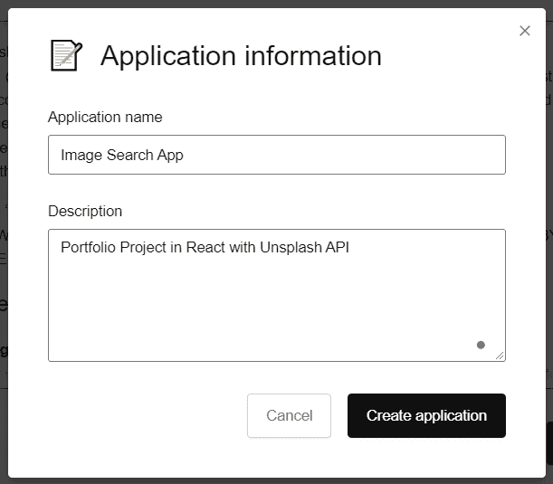

现在我们的应用程序已经创建，我们可以访问**密钥部分**下的**访问密钥**和**秘密密钥**:

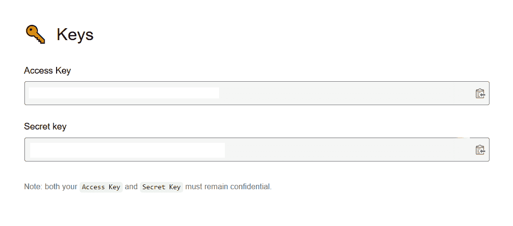

注意，在这一页的最开始，写着**演示**。这意味着我们的应用程序已被接受，但仍处于开发模式。

在这种模式下，我们每小时只能发出 50 个请求。如果超过这个限制，我们的 API 将无法工作，图像将无法加载。

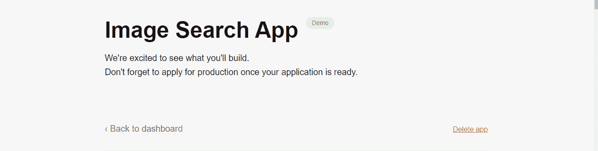

在这之后，前往文档并选择选项“**通过关键字**搜索照片”。

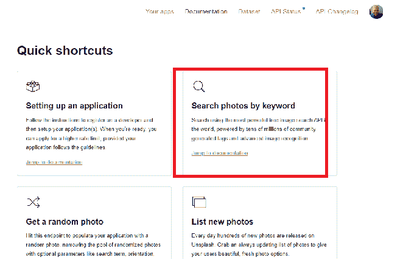

向下滚动到**响应**部分，并复制链接，如下所示:

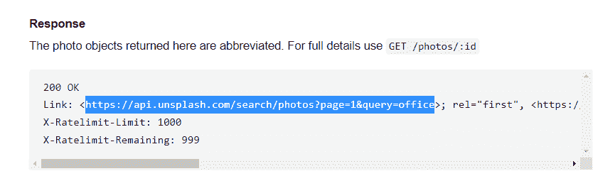

API endpoint

现在我们有了我们的 **API 键和 API 端点**。让我们继续我们的应用程序。

## 如何在我们的应用中使用钩子

我们将在应用程序中使用 useState 和 useEffect 挂钩。他们将让我们设置获取输入值所需的状态，并在 API 中搜索关于该值的数据。

为了让钩子工作，我们必须在应用程序的顶部定义它们，如下所示:

```
import React, { useState, useEffect } from "react";
```

### 如何使用 useState 挂钩设置状态

正如我们上面讨论的，我们将使用钩子从 API 中提取数据，使用在输入字段中搜索的值。我们的 React 应用程序将使用 useState 钩子读取该值。

我们使用这个钩子为特定的目的定义状态。在这个应用程序中，我们将定义其中的两个:一个用于从输入字段获取值，另一个用于显示从 API 获取的结果。

```
const [img, setImg] = useState("");
const [res, setRes] = useState([]);
```

上面的代码中有两个参数用于定义 useState 挂钩:其中一个是我们将用来存储值的状态，另一个是我们将用来更新状态值的函数。点击阅读更多关于[使用状态钩子的信息。](https://tekolio.com/what-is-the-usestate-hook-in-react/)

我们将第一个状态定义为一个空字符串，因为它将用于存储来自搜索栏的输入(也是一个字符串)。

另一个状态被初始化为一个空数组，因为它将存储从 API 获取的数据，然后在我们的结果部分显示它

默认情况下，我们每个 API 最多只能获得 10 个数据点，但是我们可以使用参数 **per_page** 来超过这个数目，我们将在本教程的后面看到这个参数。

### 如何使用 img 状态

下一步是使用输入标记的 value 属性将输入文本字段的值存储到 **img** 状态中。然后我们向它添加一个 onChange()事件处理程序。这个 onChange()事件处理程序将有一个函数，该函数将用于使用 **e.target.value.** 更新状态

```
<input
  className="col-3 form-control-sm py-1 fs-4 text-capitalize border border-3 border-dark"
  type="text"
  placeholder="Search Anything..."
  value={img}
  onChange={(e) => setImg(e.target.value)}
/>; 
```

### 如何使用 useEffect 钩子向 Unsplash 发出 API 请求

我们现在将使用 Unsplash API 和我们在上述步骤中获得的访问键来获取数据，并将其显示在我们的应用程序中。

为此，我们将再次需要一个状态来存储从 API 中获取的数据，我们已经在上面的部分中定义了这个状态( **res** ，它被初始化为一个空数组，仅用于此目的)。

JavaScript 中有许多方法可以用来从 API 中获取数据，但是我们将使用 async-await 方法——这是迄今为止最简单的方法。

```
const fetchRequest = async () => {
  const data = await fetch(
    `https://api.unsplash.com/search/photos?page=1&query=${img}&client_id=${Access_Key}`
  );
  const dataJ = await data.json();
  const result = dataJ.results;
  console.log(result);
  setRes(result);
};
useEffect(() => {
  fetchRequest();
}, []); 
```

注意，我们写了**`${Access_Key}`**——这里我们必须写我们的访问密钥。我们完成这一步是为了保护我们的 API 密钥，因为任何人都可以滥用它。

在 Unsplash 中，我们还可以申请制作我们的应用程序，这样我们就可以将 Unsplash 提供的图像放到网上。

因此，每个人都会得到一组不同的访问密钥和安全密钥。最好将这些密钥隐藏起来，以免被滥用，我们为此付出了代价。

在上面的代码中，为了简单起见，我们首先将从 API 获取的数据存储到 **data** 变量中，然后将该变量转换为 JSON。这让我们读取数据并提取必要的值，这些值存储在 **dataJ** 变量中，并被用来检查我们是否得到了我们需要的值。

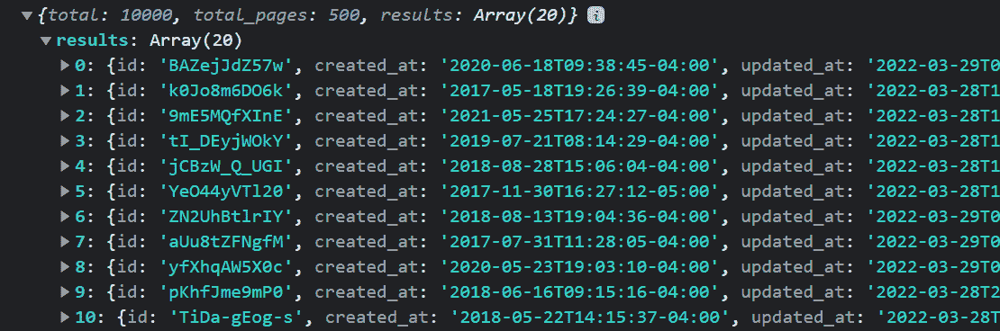

API in JSON format

如果我们打开上面的任何一个搜索结果，看看有哪些值可供我们提取:

```
{
    "total": 133,
    "total_pages": 7,
    "results": [
    {
    "id": "eOLpJytrbsQ",
    "created_at": "2014-11-18T14:35:36-05:00",
    width: 4000,
    height: 3000,
    color: "#A7A2A1",
    blur_hash: "LaLXMa9Fx[D%~q%MtQM|kDRjtRIU",
    likes: 286,
    liked_by_user: false,
    description: "A man drinking a coffee.",
    user: {
    id: "Ul0QVz12Goo",
    username: "ugmonk",
    name: "Jeff Sheldon",
    first_name: "Jeff",
    last_name: "Sheldon",
    instagram_username: "instantgrammer",
    twitter_username: "ugmonk",
    portfolio_url: "http://ugmonk.com/",
    profile_image: {
    small:
    "https://images.unsplash.com/profile-1441298803695-accd94000cac?ixlib=rb-0.3.5&q=80&fm=jpg&crop=faces&cs=tinysrgb&fit=crop&h=32&w=32&s=7cfe3b93750cb0c93e2f7caec08b5a41",
    medium:
    "https://images.unsplash.com/profile-1441298803695-accd94000cac?ixlib=rb-0.3.5&q=80&fm=jpg&crop=faces&cs=tinysrgb&fit=crop&h=64&w=64&s=5a9dc749c43ce5bd60870b129a40902f",
    large:
    "https://images.unsplash.com/profile-1441298803695-accd94000cac?ixlib=rb-0.3.5&q=80&fm=jpg&crop=faces&cs=tinysrgb&fit=crop&h=128&w=128&s=32085a077889586df88bfbe406692202",
    },
    links: {
    self: "https://api.unsplash.com/users/ugmonk",
    html: "http://unsplash.com/@ugmonk",
    photos: "https://api.unsplash.com/users/ugmonk/photos",
    likes: "https://api.unsplash.com/users/ugmonk/likes",
    },
    },
    current_user_collections: [],
    urls: {
    raw: "https://images.unsplash.com/photo-1416339306562-f3d12fefd36f",
    full: "https://hd.unsplash.com/photo-1416339306562-f3d12fefd36f",
    regular:
    "https://images.unsplash.com/photo-1416339306562-f3d12fefd36f?ixlib=rb-0.3.5&q=80&fm=jpg&crop=entropy&cs=tinysrgb&w=1080&fit=max&s=92f3e02f63678acc8416d044e189f515",
    small:
    "https://images.unsplash.com/photo-1416339306562-f3d12fefd36f?ixlib=rb-0.3.5&q=80&fm=jpg&crop=entropy&cs=tinysrgb&w=400&fit=max&s=263af33585f9d32af39d165b000845eb",
    thumb:
    "https://images.unsplash.com/photo-1416339306562-f3d12fefd36f?ixlib=rb-0.3.5&q=80&fm=jpg&crop=entropy&cs=tinysrgb&w=200&fit=max&s=8aae34cf35df31a592f0bef16e6342ef",
    },
    links: {
    self: "https://api.unsplash.com/photos/eOLpJytrbsQ",
    html: "http://unsplash.com/photos/eOLpJytrbsQ",
    download: "http://unsplash.com/photos/eOLpJytrbsQ/download",
    },
    },
    // more photos ...
    ],
    },
```

最好在 useEffect 钩子中使用这个函数，因为如果我们在应用程序的 UI 中做了任何更改，它将阻止数据的任何重新呈现。要深入了解 useEffect，[点击此处](https://tekolio.com/explaining-useeffect-hook-in-react/)。

我们使用 **setRes** 函数将 **res** 的值从一个空数组更新为一个数组，该数组将以 JSON 格式存储所有获取的数据，如上所示。

我们已经在应用程序开始的输入部分给了这个按钮一个 onClick 函数。现在是时候为这个事件处理程序定义一个函数了，这个函数将在单击 Search 按钮时被触发。该函数将调用 **fetchRequest** 函数，该函数将获取数据并在结果部分显示结果。

```
const Submit = () => {
  fetchRequest();
  setImg("");
}; 
```

## 如何在我们的应用中显示图像

在上面的部分中，我们已经将从 API 获取的数据存储到了以数组形式存储它们的 **res** 状态中。为了从那里得到这些值，我们必须使用 map 方法。

```
<div className="col-12 d-flex justify-content-evenly flex-wrap">
  {res.map((val) => {
    return (
      <>
        
      </>
    );
  })}
</div>; 
```

如果我们回过头来看看 JSON 中的响应，我们会发现一种不同的信息: **URLs** ，它包含图像的路径。所以这里 **val.urls.small** 是图片的实际路径， **val.alt_description** 是图片的 alt 描述。

“URL”中有不同的字段提供不同的数据，例如:

*   **Raw** :用户拍摄的实际 Raw 图像。
*   **全** : Raw 图像输入。jpg 格式。
*   **常规**:最实用，宽度=1080px。
*   **小**:非常适合网速慢的情况，宽度=400px。
*   **Thumb** :图像的缩略图版本，宽度=200px。

在本文中，我们将使用 small，但也有其他如上所示的工具，我们可以使用并找到适合自己的工具。

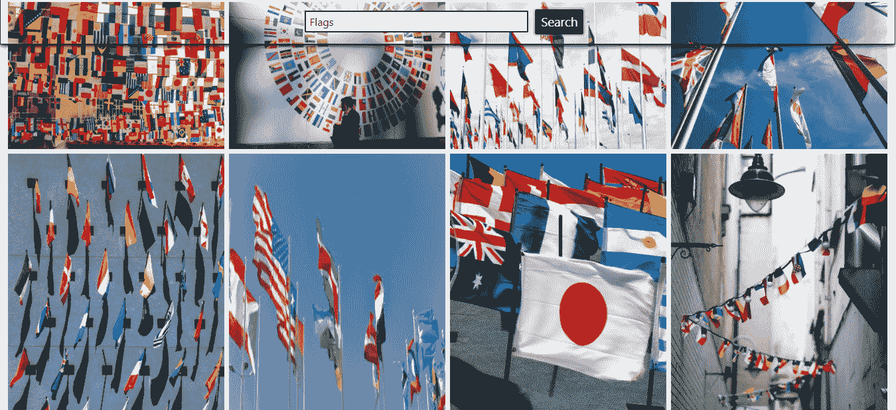

Final Product

默认情况下，一次可以获取的项目数是 10，但这个数字可以根据我们希望我们的应用程序显示多少图像来增加或减少。

为此，我们只需在 API 调用的末尾添加一个参数( **per_page** ) ，如代码所示，并将其设置为我们想要显示的图像数量。

```
const fetchRequest = async () => {
  const data = await fetch(
    `https://api.unsplash.com/search/photos?page=1&query=${img}&client_id=${Access_Key}&per_page=20`
  );
  const dataJ = await data.json();
  const result = dataJ.results;
  console.log(result);
  setRes(result);
}; 
```

Unsplash 必须提供更多的参数。以下是其中的几个例子:

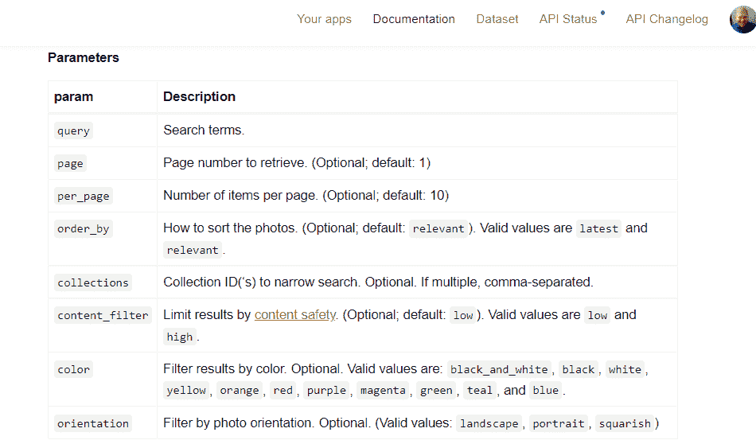

parameters of Unsplash API

## 如何处理错误

如果我们现在做一个快速搜索，比如说，旗帜，我们将得到我们的图像。但是仍然有一些问题需要解决。其中之一是我们在控制台中收到的错误。

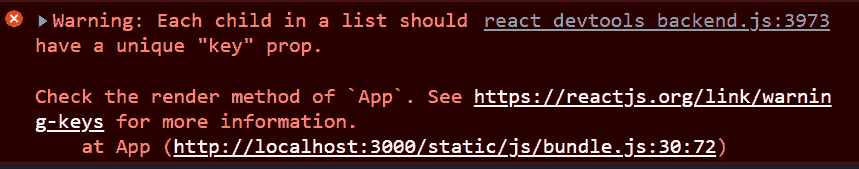

Error in Console

要解决这个问题，请使用图像的 id 向每个孩子传递一个唯一的密钥。这个关键属性明确地告诉 React 列表中每个孩子的身份。这也防止子对象在渲染之间丢失状态。

```
<div className="col-12 d-flex justify-content-evenly flex-wrap">
  {res.map((val) => {
    return (
      <>
        
      </>
    );
  })}
</div>; 
```

## 结论

在本教程中，我们使用 Unsplash API 在 React 中开发了一个照片搜索应用程序。在构建我们的应用程序时，我们讨论了许多事情，比如如何使用 React Hooks 从 API 获取数据，并使用它在我们的应用程序中显示图像。

您可以用这个应用程序做更多的事情来扩展它。例如，我们可以添加一个随机按钮来显示随机图像，创建一个复选框来根据用户的偏好在搜索照片或发布照片的用户之间切换，添加一个[无限滚动](https://www.npmjs.com/package/react-infinite-scroll-component)来显示更多图像，等等。

您可以在这里浏览我的其他一些初学者友好的、基于项目的文章:

1.  [如何在 React 中使用具有多个特性的钩子制作表格](https://tekolio.com/how-to-make-a-table-in-react-with-hooks/)
2.  [我如何在 React 中制作我的投资组合](https://tekolio.com/how-i-made-my-portfolio-in-react/)
3.  [如何在 React 中制作滤镜组件](https://www.freecodecamp.org/news/how-to-make-a-filter-component-in-react/)