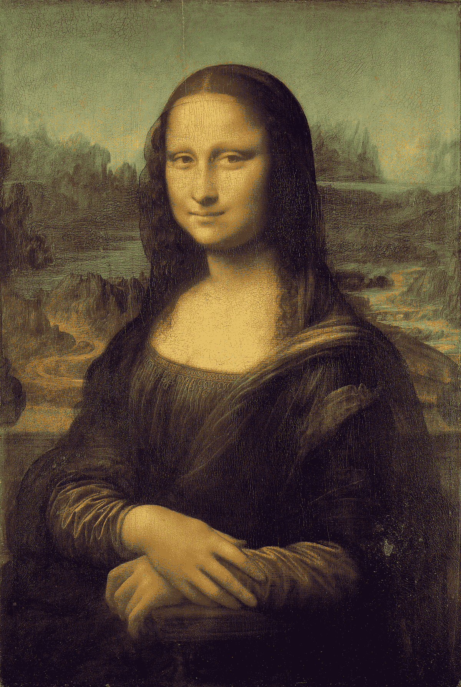
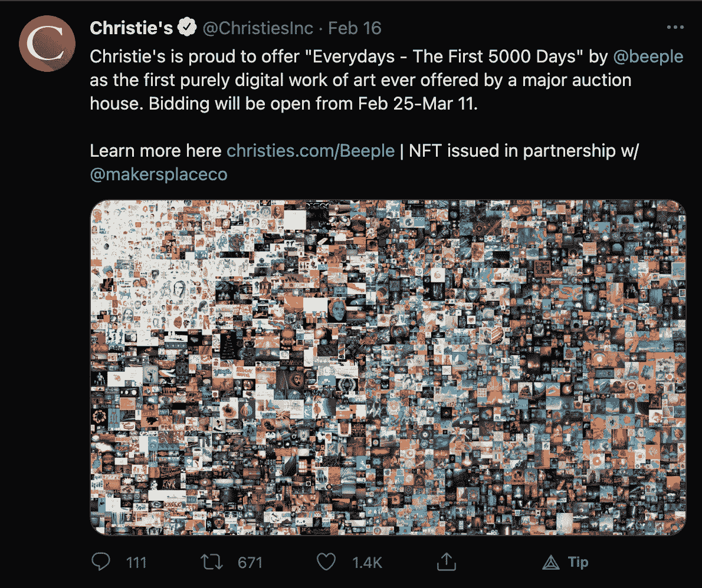
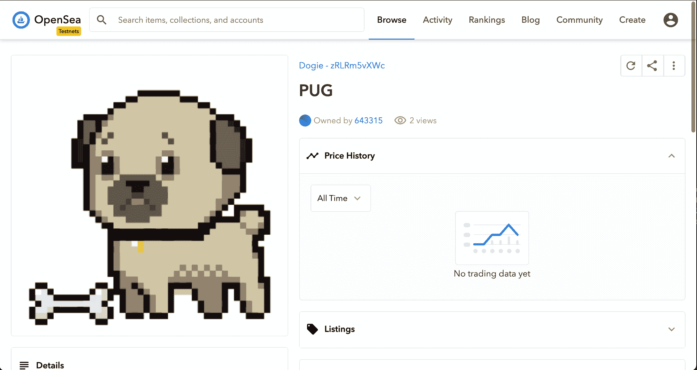
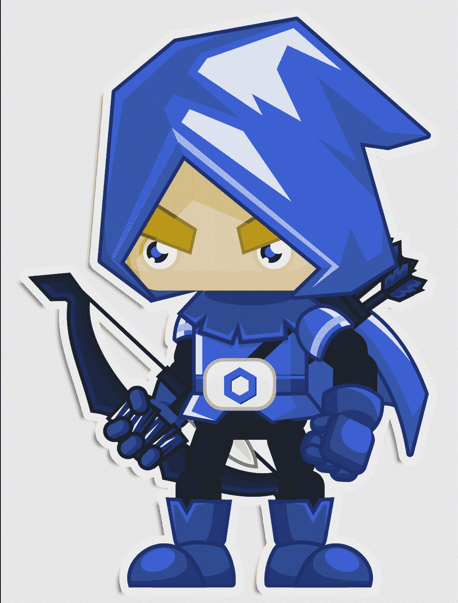
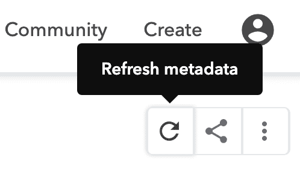
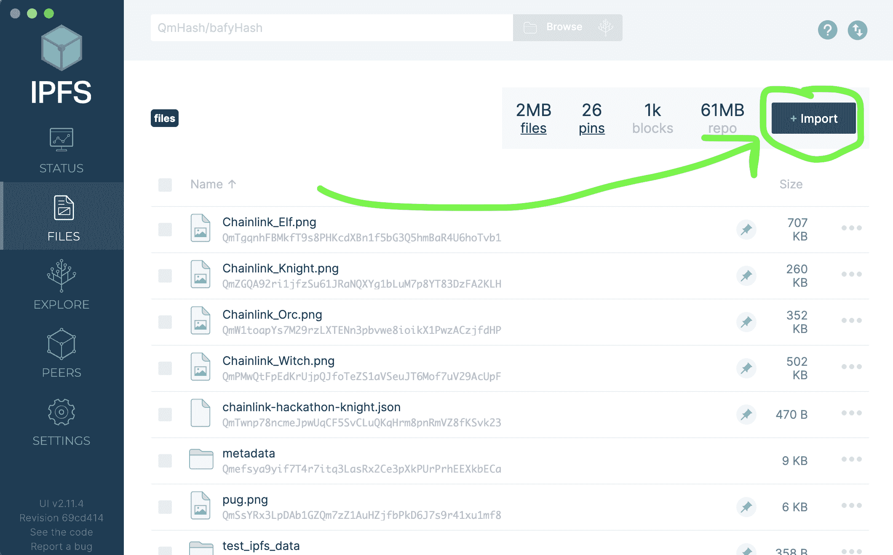

# 如何制作 NFT 并在 OpenSea Marketplace 上渲染

> 原文：<https://www.freecodecamp.org/news/how-to-make-an-nft-and-render-on-opensea-marketplace/>

在本文中，我将向您展示如何在没有软件工程技能的情况下制作 NFT。然后我们将学习如何用[布朗尼](https://eth-brownie.readthedocs.io/en/stable/)、[蟒蛇](https://www.python.org/)和[链环](https://docs.chain.link/docs)制作无限可定制的 NFT。我们将看到如何在 NFT 市场上展示和销售我们的作品。

如果你正在寻找一个使用松露、JavaScript 和有趣的中世纪角色的教程，请点击这里查看如何[构建、部署和销售你的 NFT。](https://blog.chain.link/build-deploy-and-sell-your-own-dynamic-nft/)

## 什么是 NFT？

[NFTs](https://eips.ethereum.org/EIPS/eip-721) (不可替代代币)可以用一个字来概括:“独一无二”。这些是部署在区块链上的智能合约，代表了一些独特的东西。

### ERC20 与 ERC721

NFT 是一种类似于 [ERC20](https://www.investopedia.com/news/what-erc20-and-what-does-it-mean-ethereum/) 的区块链令牌标准，像 AAVE、SNX 和 LINK(技术上是 ERC677)。ERC20s 是“可替换”令牌，这意味着“可替换”或“可互换”

例如，无论你用什么样的美钞，你的美钞都会值 1 美元。美元钞票上的序列号可能不同，但钞票是可以互换的，无论如何它们都值 1 美元。

另一方面，NFT 是“不可替代的”,它们遵循自己的令牌标准, [ERC721。](https://eips.ethereum.org/EIPS/eip-721)例如，蒙娜丽莎是“不可替代的”。即使有人可以复制它，也永远只有一个蒙娜丽莎。如果《蒙娜丽莎》是在区块链上创作的，那它应该是 NFT 的作品。



Original Image from [Wikipedia](https://en.wikipedia.org/wiki/Mona_Lisa)

## NFT 是干什么的？

NFT 通过在链上存储永久的部署历史，为创作者、艺术家、游戏设计者等提供价值。

你将永远知道谁创造了 NFT，谁拥有 NFT，它来自哪里，以及更多，让它们比传统艺术更有价值。在传统艺术中，理解什么是“赝品”可能很棘手，而在链上历史是很容易追溯的。

由于智能合同和非功能性交易是 100%可编程的，非功能性交易还可以增加内置的版税和任何其他功能。补偿艺术家一直是一个问题，因为艺术家的作品经常在没有任何归属的情况下传播。

越来越多的艺术家和工程师都投身于这一巨大的增值，因为这终于是艺术家获得工作报酬的一个好方法。不仅如此，NFT 是一种展示你的创造力和成为数字世界收藏家的有趣方式。

### NFTs 的价值

NFT 已经走过了漫长的道路，我们不断看到破纪录的 NFT 销售，如“每一天:前 5000 天”销售 6930 万美元。



Image from [Twitter](https://twitter.com/ChristiesInc/status/1361670588608176128)

所以这里有很多价值，而且这也是在数字世界中创造艺术和学习智能合同创建的一种有趣、动态和迷人的方式。所以现在我会教你所有你需要知道的关于制作 NFT 的知识。

## 如何制作 NFT

### 我们不打算讨论的是

现在，制作 NFT 最简单的方法就是去像 [Opensea](https://opensea.io/) 、 [Rarible](https://rarible.com/) 或 [Mintible](https://mintable.app/) 这样的平台，按照他们的逐步指南在他们的平台上部署。

你可以 100%走这条路，但是你可能会被绑定到平台上，你被硬塞进平台的功能里。你不能实现无限制的定制，或者真正利用 NFT 的任何优势。但是如果你是一个初学软件的工程师，或者不是很懂技术，这是适合你的路线。

如果你想成为一名更强的软件工程师，学习一些扎实的东西，并且有能力用无限的创造力创造一些东西，那么继续读下去吧！

如果你是第一次接触 solidity，不要担心，我们也将在那里复习基础知识。

## 如何制作无限定制的 NFT

我将带你从这款 [NFT 布朗尼混合蛋糕](https://github.com/PatrickAlphaC/nft-mix)开始。这是一个包含大量样板代码的工作报告。

### 先决条件

我们需要安装一些东西来开始:

*   [Python](https://www.python.org/downloads/)
*   [Nodejs](https://nodejs.org/en/download/) 和 npm
*   [Metamask](https://metamask.io/)

如果你不熟悉 Metamask，你可以[按照这个教程](https://docs.chain.link/docs/install-metamask)来设置它。

### Rinkeby Testnet ETH 和 LINK

我们也将致力于 Rinkeby 以太坊测试网，所以我们将部署我们的合同到一个真正的区块链，免费！

测试网是测试我们的智能合约在现实世界中如何表现的好方法。我们需要 Rinkeby ETH 和 Rinkeby LINK，我们可以从 [Chainlink 文档](https://docs.chain.link/docs/link-token-contracts#rinkeby)的最新水龙头链接中免费获得。

我们还需要将 rinkeby 链接令牌添加到我们的元掩码中，这可以通过遵循[获取链接文档](https://docs.chain.link/docs/acquire-link)来完成。

如果你仍然感到困惑，[你可以跟随这个视频](https://www.youtube.com/watch?v=4ZgFijd02Jo)，只是要确保使用 Rinkeby 而不是 Ropsten。

和以太坊这样的智能合约平台合作的时候，需要付出一点 ETH，从外链获取数据的时候，要付出一点 LINK。这就是为什么我们需要 testnet 链接和 ETH。

太好了，我们开始吧。这是我们将要部署到公海的 NFT 号。



### 快速启动

```
git clone https://github.com/PatrickAlphaC/nft-mix
cd nft-mix
```

厉害！现在我们需要安装`ganache-cli`和`eth-brownie`。

```
pip install eth-brownie
npm install -g ganache-cli
```

现在我们可以[设置我们的环境变量](https://www.twilio.com/blog/2017/01/how-to-set-environment-variables.html)。如果您不熟悉环境变量，您可以将它们添加到您的`.env`文件中，然后运行:

`source .env`

示例`.env`应该在您刚刚克隆的 repo 中，并且环境变量被注释掉了。取消对它们的注释以使用它们！

你需要一个`WEB3_INFURA_PROJECT_ID`和一个`PRIVATE_KEY`。可以发现`WEB3_INFURA_PROJECT_ID`正在注册一个免费的 [Infura](https://infura.io/) 账户。这将为我们提供一种向区块链发送交易的方法。

我们还需要一个私钥，可以从元掩码中获得。点击 3 个小点，点击`Account Details`和`Export Private Key`。如果你放了真钱在里面，请不要和任何人分享这个钥匙！

```
export PRIVATE_KEY=YOUR_KEY_HERE
export WEB3_INFURA_PROJECT_ID=YOUR_PROJECT_ID_HERE
```

.env

现在，我们可以使用下面两个命令部署我们的 NFT 契约并创建我们的第一个收藏品。

```
brownie run scripts/simple_collectible/deploy_simple.py --network rinkeby
brownie run scripts/simple_collectible/create_collectible.py --network rinkeby
```

第一个脚本将我们的 NFT 合同部署到林克比·区块链，第二个脚本创建我们的第一个收藏品。

您刚刚部署了您的第一个智能合同！

它没有做太多事情，但是不要担心——我将在本教程的高级部分向你展示如何在 OpenSea 上渲染它。但首先，我们来看看 ERC721 令牌标准。

## ERC721 令牌标准

让我们看看我们刚刚部署的合同，在`SimpleCollectible.sol`文件中。

```
// SPDX-License-Identifier: MIT
pragma solidity 0.6.6;

import "@openzeppelin/contracts/token/ERC721/ERC721.sol";

contract SimpleCollectible is ERC721 {
    uint256 public tokenCounter;
    constructor () public ERC721 ("Dogie", "DOG"){
        tokenCounter = 0;
    }

    function createCollectible(string memory tokenURI) public returns (uint256) {
        uint256 newItemId = tokenCounter;
        _safeMint(msg.sender, newItemId);
        _setTokenURI(newItemId, tokenURI);
        tokenCounter = tokenCounter + 1;
        return newItemId;
    }

} 
```

我们使用[openzeplin](https://github.com/OpenZeppelin/openzeppelin-contracts)包作为 ERC721 令牌。我们导入的这个包允许我们使用典型 ERC721 令牌的所有功能。这定义了我们的令牌将拥有的所有功能，如将令牌移动到新用户的`transfer`、`safeMint`创建新令牌，等等。

你可以通过查看[openzeplin ERC 721 令牌契约](https://github.com/OpenZeppelin/openzeppelin-contracts/blob/master/contracts/token/ERC721/ERC721.sol)找到我们契约赋予的所有功能。我们的合同在这一行继承了这些功能:

```
contract SimpleCollectible is ERC721 {
```

这就是坚固性是如何继承的。当我们部署一个契约时，`constructor`被自动调用，它需要几个参数。

```
constructor () public ERC721 ("Dogie", "DOG"){
        tokenCounter = 0;
    }
```

我们还使用了`ERC721`的构造函数，在我们的构造函数中，我们只需要给它一个名字和一个符号。在我们的例子中，是“Dogie”和“DOG”。这意味着我们创建的每个 NFT 都将是 Dogie/DOG 类型。

这就好像每张口袋妖怪卡仍然是口袋妖怪，或者交易卡上的每个棒球运动员仍然是棒球运动员。每个棒球运动员都是独一无二的，但他们仍然都是棒球运动员。我们只是使用类型`DOG`。

我们在顶部有`tokenCounter`来统计我们已经创建了多少这种类型的 NFT。基于当前的`tokenCounter`，每个新令牌获得一个`tokenId`。

我们实际上可以用`createCollectible`函数创建一个 NFT。这就是我们在`create_collectible.py`脚本中所说的。

```
function createCollectible(string memory tokenURI) public returns (uint256) {
        uint256 newItemId = tokenCounter;
        _safeMint(msg.sender, newItemId);
        _setTokenURI(newItemId, tokenURI);
        tokenCounter = tokenCounter + 1;
        return newItemId;
    }
```

`_safeMint`函数创建新的 NFT，并把它分配给被称为`createdCollectible`的人，也就是`msg.sender`，从`tokenCounter`派生出一个`newItemId`。这就是我们如何通过检查`tokenId`的所有者来跟踪谁拥有什么。

你会注意到我们也调用`_setTokenURI`。让我们谈谈那个。

## 什么是 NFT 元数据和令牌 URI？

当智能合同和 NFT 被创建时，人们很快意识到将大量数据部署到区块链是非常昂贵的。小至 1kb 的图像很容易[存储成本超过 100 万美元](https://ethereum.stackexchange.com/a/896/57451)。

这显然是 NFTs 的一个问题，因为拥有创造性的艺术意味着你必须将这些信息存储在某个地方。他们还想要一种轻量级的方法来存储关于 NFT 的属性，这就是 tokenURI 和元数据发挥作用的地方。

### TokenURI

NFT 上的`tokenURI`是令牌“外观”的唯一标识符。URI 可以是 HTTPS 上的一个 API 调用，一个 IPFS 散列，或者其他任何独特的东西。

它们遵循显示元数据的标准，如下所示:

```
{
    "name": "name",
    "description": "description",
    "image": "https://ipfs.io/ipfs/QmTgqnhFBMkfT9s8PHKcdXBn1f5bG3Q5hmBaR4U6hoTvb1?filename=Chainlink_Elf.png",
    "attributes": [
        {
            "trait_type": "trait",
            "value": 100
        }
    ]
}
```

这些显示了 NFT 的样子及其属性。部分指出了 NFT 的另一个 URI。这使得像 Opensea、Rarible 和 Mintable 这样的 NFT 平台很容易在它们的平台上呈现 NFT，因为它们都在寻找这些元数据。

### 链外元数据与链上元数据

现在你可能会想“等等...如果元数据不在链上，这是否意味着我的 NFT 可能会在某个时候消失”？你是对的。

您也可以正确地认为，链外元数据意味着您不能使用该元数据让您的智能合约相互交互。

这就是为什么我们要关注链上元数据，这样我们就可以对我们的 NFT 进行编程，使它们相互交互。

尽管如此，我们仍然需要链外元数据的`image`部分，因为我们没有很好的方法来存储链内的大图像。但是不要担心，我们仍然可以通过使用 [IPFS](https://ipfs.io/) 在一个分散的网络上免费这样做。

这里有一个来自 IPFS 的 imageURI 示例，展示了在[龙与地下城教程](https://blog.chain.link/build-deploy-and-sell-your-own-dynamic-nft/)中创建的[链环精灵](https://opensea.io/assets/0x8d78277bc2c63f07efc2c0c8a8512de4ad459a05/1)。



The Chainlink Elf

我们没有为简单的 NFT 设置 tokenURI，因为我们只想展示一个基本的例子。

现在让我们进入高级 NFT，这样我们可以看到一些惊人的功能，我们可以用链上元数据，让 NFT 在 opeansea 上渲染，让我们的小狗起来！

如果您想要复习我们刚刚讨论过的部分的视频，请跟随[部署一个简单的 NFT 视频。](https://www.youtube.com/watch?v=ZH_7nEIJDUY)

## 动态和高级 NFTs

[动态 NFT](https://blog.chain.link/build-deploy-and-sell-your-own-dynamic-nft/)是可以随时间变化的 NFT，或者具有我们可以用来相互交互的链上特性。这些 NFT 可以让我们无限制地定制整个游戏、世界或某种互动艺术。让我们进入高级部分。

### 高级快速入门

确保元掩码中有足够的 testnet ETH 和 LINK，然后运行以下命令:

```
brownie run scripts/advanced_collectible/deploy_advanced.py --network rinkeby
brownie run scripts/advanced_collectible/create_collectible.py --network rinkeby
```

我们这里的收藏品是从 [Chainlink VRF](https://docs.chain.link/docs/chainlink-vrf) 返回的随机犬种。链环 VRF 是一种获得可证明随机数的方法，因此在我们的 NFT 中是真正的稀缺。然后我们想要创建它的元数据。

```
brownie run scripts/advanced_collectible/create_metadata.py --network rinkeby
```

然后，我们可以选择将这些数据上传到 IPFS，这样我们就可以拥有一个 tokenURI。稍后我会告诉你如何做。现在，我们将只使用示例 tokenURI:

```
https://ipfs.io/ipfs/Qmd9MCGtdVz2miNumBHDbvj8bigSgTwnr4SbyH6DNnpWdt?filename=1-PUG.json
```

如果你下载 [IPFS 伴侣](https://chrome.google.com/webstore/detail/ipfs-companion/nibjojkomfdiaoajekhjakgkdhaomnch?hl=en)到你的浏览器中，你可以使用该网址查看 URI 返回的内容。它看起来会像这样:

```
{
    "name": "PUG",
    "description": "An adorable PUG pup!",
    "image": "https://ipfs.io/ipfs/QmSsYRx3LpDAb1GZQm7zZ1AuHZjfbPkD6J7s9r41xu1mf8?filename=pug.png",
    "attributes": [
        {
            "trait_type": "cuteness",
            "value": 100
        }
    ]
}
```

然后我们可以运行我们的`set_tokenuri.py`脚本:

```
brownie run scripts/advanced_collectible/set_tokenuri.py --network rinkeby
```

我们将得到这样的输出:

```
Running 'scripts/advanced_collectible/set_tokenuri.py::main'...
Working on rinkeby
Transaction sent: 0x8a83a446c306d6255952880c0ca35fa420248a84ba7484c3798d8bbad421f88e
  Gas price: 1.0 gwei   Gas limit: 44601   Nonce: 354
  AdvancedCollectible.setTokenURI confirmed - Block: 8331653   Gas used: 40547 (90.91%)

Awesome! You can view your NFT at https://testnets.opensea.io/assets/0x679c5f9adC630663a6e63Fa27153B215fe021b34/0
Please give up to 20 minutes, and hit the "refresh metadata" button
```

我们可以点击给出的链接，看看它在 Opensea 上是什么样子！您可能需要点击`refresh metadata`按钮并等待几分钟。



Refresh Metadata

## 随机品种

来说说刚刚做的事吧。这是我们的`AdvancedCollectible.sol`:

```
pragma solidity 0.6.6;

import "@openzeppelin/contracts/token/ERC721/ERC721.sol";
import "@chainlink/contracts/src/v0.6/VRFConsumerBase.sol";

contract AdvancedCollectible is ERC721, VRFConsumerBase {
    uint256 public tokenCounter;
    enum Breed{PUG, SHIBA_INU, BRENARD}
    // add other things
    mapping(bytes32 => address) public requestIdToSender;
    mapping(bytes32 => string) public requestIdToTokenURI;
    mapping(uint256 => Breed) public tokenIdToBreed;
    mapping(bytes32 => uint256) public requestIdToTokenId;
    event requestedCollectible(bytes32 indexed requestId); 

    bytes32 internal keyHash;
    uint256 internal fee;
    uint256 public randomResult;
    constructor(address _VRFCoordinator, address _LinkToken, bytes32 _keyhash)
    public 
    VRFConsumerBase(_VRFCoordinator, _LinkToken)
    ERC721("Dogie", "DOG")
    {
        tokenCounter = 0;
        keyHash = _keyhash;
        fee = 0.1 * 10 ** 18;
    }

    function createCollectible(string memory tokenURI, uint256 userProvidedSeed) 
        public returns (bytes32){
            bytes32 requestId = requestRandomness(keyHash, fee, userProvidedSeed);
            requestIdToSender[requestId] = msg.sender;
            requestIdToTokenURI[requestId] = tokenURI;
            emit requestedCollectible(requestId);
    }

    function fulfillRandomness(bytes32 requestId, uint256 randomNumber) internal override {
        address dogOwner = requestIdToSender[requestId];
        string memory tokenURI = requestIdToTokenURI[requestId];
        uint256 newItemId = tokenCounter;
        _safeMint(dogOwner, newItemId);
        _setTokenURI(newItemId, tokenURI);
        Breed breed = Breed(randomNumber % 3); 
        tokenIdToBreed[newItemId] = breed;
        requestIdToTokenId[requestId] = newItemId;
        tokenCounter = tokenCounter + 1;
    }

    function setTokenURI(uint256 tokenId, string memory _tokenURI) public {
        require(
            _isApprovedOrOwner(_msgSender(), tokenId),
            "ERC721: transfer caller is not owner nor approved"
        );
        _setTokenURI(tokenId, _tokenURI);
    }
} 
```

我们使用链环 VRF 从一个`PUG, SHIBA_INU, BRENARD`列表中创建一个随机品种。当我们这次调用`createCollectible`时，我们实际上向链连接 VRF 节点发出了一个离线请求，并返回了一个随机数来创建这三个品种之一的 NFT。

在你的 NFT 中使用真正的随机性是创造真正稀缺性的一个很好的方法，使用链式甲骨文随机数意味着你的数字是可证明随机的，并且不会受到矿工的影响。

你可以在文档中了解更多关于 [Chainlink VRF 的信息。](https://docs.chain.link/docs/chainlink-vrf)

Chainlink 节点通过调用`fulfillRandomness`函数进行响应，并根据随机数创建可收集的数据。然后我们仍然需要调用`_setTokenURI`来给我们的 NFT 它需要的外观。

我们在这里没有给出我们的 NFT 属性，但是属性是让我们的 NFTs 战斗和互动的一个很好的方式。在这个[龙与地下城的例子](https://github.com/PatrickAlphaC/dungeons-and-dragons-nft)中，你可以看到一个很好的带有属性的 NFT 的例子。

### IPFS 的元数据

我们使用 IPFS 存储两个文件:

1.  NFT 的形象(帕格形象)
2.  tokenURI 文件(也包含图像链接的 JSON 文件)

我们使用 IPFS 是因为它是一个免费的分散平台。我们可以通过下载 [IPFS 桌面](https://docs.ipfs.io/install/ipfs-desktop/)，点击`import`按钮，将我们的 tokenURIs 和图像添加到 IPFS。



IPFS add a file

然后，我们可以通过点击我们想要共享的文件旁边的 3 个点，点击`share link`并复制给定的链接来共享 URI。然后，我们可以将这个链接添加到我们的`set_tokenuri.py`文件中，以更改我们想要使用的令牌 URI。

### 坚持不懈

但是，如果 tokenURI 只在我们的节点上，这意味着当我们的节点关闭时，其他人无法查看它。所以我们希望其他人成为我们的 NFT。我们可以使用像 [Pinata](https://pinata.cloud/) 这样的钉住服务来帮助保持我们的数据存活，即使当我们的 IPFS 节点关闭时。

我想象未来越来越多的元数据将存储在 IPFS 和分散存储平台上。集中式服务器可能会宕机，这意味着这些 NFT 上的艺术品将永远丢失。一定要检查您使用的 NFT 的 tokenURI 位于哪里！

我还预计未来会有更多的人使用像 Filecoin 这样的数据存储平台，因为使用 pin 服务也没有像它应该的那样分散。

## 前进

如果你想看先进 NFT 的视频演示，你可以看先进 NFT 的视频。

现在你有了制作漂亮有趣的、可定制的、交互式的 NFT 的技能，并把它们呈现在市场上。

NFT 是让艺术家准确补偿他们所做的所有艰苦工作的有趣而有力的方式。祝你好运，记得玩得开心！