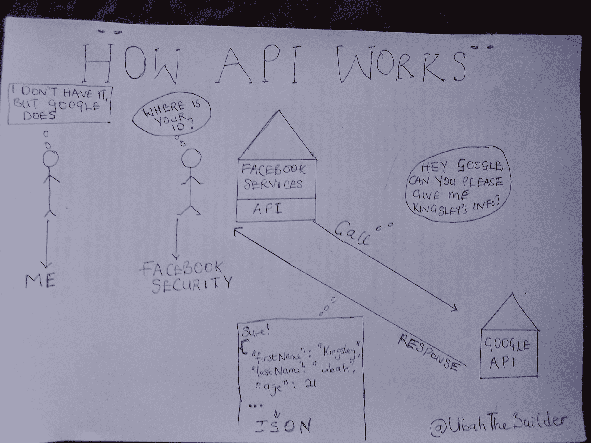

# fetch API——如何用 JavaScript 发出 GET 请求和 POST 请求

> 原文：<https://www.freecodecamp.org/news/how-to-make-api-calls-with-fetch/>

通常，您可能希望您的系统与其他 web 服务器通信来获取信息。

例如，假设一个新用户想在你的网站上注册一个账户。他们不需要手动填写表格来将他们的信息发送到您的系统，而是希望使用已经在另一个服务或平台中的信息(即**第三方认证**)来注册。

在这种情况下，您的系统必须与第三方系统通信，以获取该用户的信息。它通过一个 **API** 来实现。

> API，或者说应用程序编程接口，就是一组规则，指导一个软件或系统如何与另一个软件或系统通信。



My hand-drawn explanation of an API

如果您的应用程序是用异步编程语言(如 JavaScript)构建的单页面应用程序，那么您有一个有用的工具来实现这个功能:`fetch()`。

## 什么是 Fetch API？

`fetch()`是一种让你用 JavaScript 进行简单 AJAX(异步 JavaScript 和 XML)调用的机制。

**异步**意味着你可以使用 fetch 来调用外部 API，而不需要暂停其他指令的执行。这样，即使 API 调用没有被解决，站点上的其他功能也将继续运行。

当从 API 发回一个响应(数据)时，异步任务(获取)恢复。如果听起来仍然很难，你可以在这里阅读我对[异步代码的详细介绍。](https://ubahthebuilder.tech/introduction-to-asynchronous-programming-with-javascript)

不过，需要注意的是，fetch 不是 JavaScript 规范的一部分，而是 WWTAG。因此，您将无法在 Node.js 环境中使用它(除非您安装一个特殊的模块)。

## 如何在 JavaScript 中使用`fetch()`

当我们谈论 API 时，我们还需要谈论**端点**。端点只是一个惟一的 URL，您可以调用它来与另一个系统进行交互。

让我们假设我们正在向一个外部 API 请求获取一些数据(比如一篇博客文章)。为此，我们将使用一个简单的GET 请求。

只需用端点 URL 作为参数调用`fetch()`:

```
fetch('https://ubahthebuilder.tech/posts/1');
```

Trying to fetch blog post from external API

此端点的响应正文将是关于博客帖子的信息:

```
{
userId: 1,
id: 1,
title: 'A post by Kingsley',
body: 'Brilliant post on fetch...',
};
```

最终，您会希望得到响应体。但是响应对象包含了主体之外的大量信息，包括状态代码、标头和更多信息。

> 注意，fetch API 返回一个承诺。因此，您需要嵌套一个 then()方法来处理解析。点击了解更多关于承诺的信息[。](https://ubahthebuilder.tech/introduction-to-asynchronous-programming-with-javascript)

从 API 返回的数据通常不是可用的形式。因此，您需要将数据转换成 JavaScript 可以操作的形式。幸运的是，您可以使用`json()`方法来做到这一点:

```
fetch('https://ubahthebuilder.tech/posts/1')
.then(data => {
return data.json();
})
.then(post => {
console.log(post.title);
});
```

Retrieving blog post from API and extracting only the title property

正如您在上面的代码中看到的，您可以嵌套一个后续的`then()`方法来解析数据(在我们的例子中，我只提取了标题)

在这个例子中，我们只是想从 API 获取一篇博客文章。但是如果我们想发布一个故事呢？

## 如何提出发布请求

一旦超越了 GET 请求，就需要设置更多的选项。到目前为止，您只为 URL 端点`fetch()`提供了一个参数。

对于 post 请求，您需要传递一个配置选项对象作为第二个参数。可选对象可以接受许多不同的参数。在这种情况下，只包括最必要的信息。

因为您正在发送 POST 请求，所以您需要声明您正在使用 POST 方法。

您还需要传递一些数据来实际创建新的博客文章。因为您正在发送 JSON 数据，所以您需要将标题*的内容类型*设置为*应用程序/json* 。最后，您需要主体，它将是一个 JSON 数据字符串。

```
const update = {
title: 'A blog post by Kingsley',
body: 'Brilliant post on fetch API',
userId: 1,
};

const options = {
method: 'POST',
headers: {
'Content-Type': 'application/json',
},
body: JSON.stringify(update),
};
```

然后，API 调用:

```
fetch('https://jsonplaceholder.typicode.com/posts', options)
  .then(data => {
      if (!data.ok) {
        throw Error(data.status);
       }
       return data.json();
      }).then(update => {
      console.log(update);
      // {
      //
      title: 'A blog post by Kingsley',
      //
      body: 'Brilliant post on fetch API',
      //
      userId: 1,
      //
      id: 101
      // };
      }).catch(e => {
      console.log(e);
      });
```

如果您的请求成功，您将获得一个响应主体，其中包含 blog post 对象和一个新的 ID。响应将根据 API 的设置方式而有所不同。

最后，您应该注意到端点可能会随着时间而改变，API 可能会被重新构造。因此，您应该将所有的 fetch 调用放在一起，以便于访问。

## 结论

以下是总结这篇文章的几点:

*   像软件这样的计算机系统通过一个叫做 API 的层相互通信和共享信息。
*   API 包含指导两个或多个系统如何交互的一组规则和协议。例如，脸书的系统可能会与谷歌的系统交互，通过 API 获取用户信息。
*   在前端 JavaScript 中，您可以使用`fetch()`实用程序进行简单的 API 调用。
*   要使用 fetch 发出简单的 GET 请求，只需将 URL 端点作为参数传入即可。
*   要发出 POST 请求，您需要传递某些其他参数，包括一个配置对象。

如果你喜欢我的文章，并想提供你的支持，请访问我的【给我买杯咖啡】页面。

谢谢你，再见。