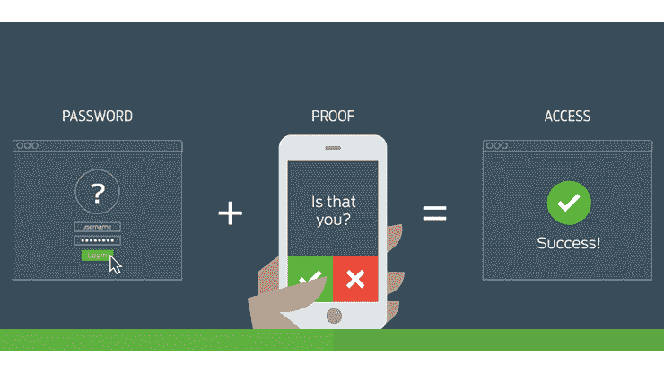
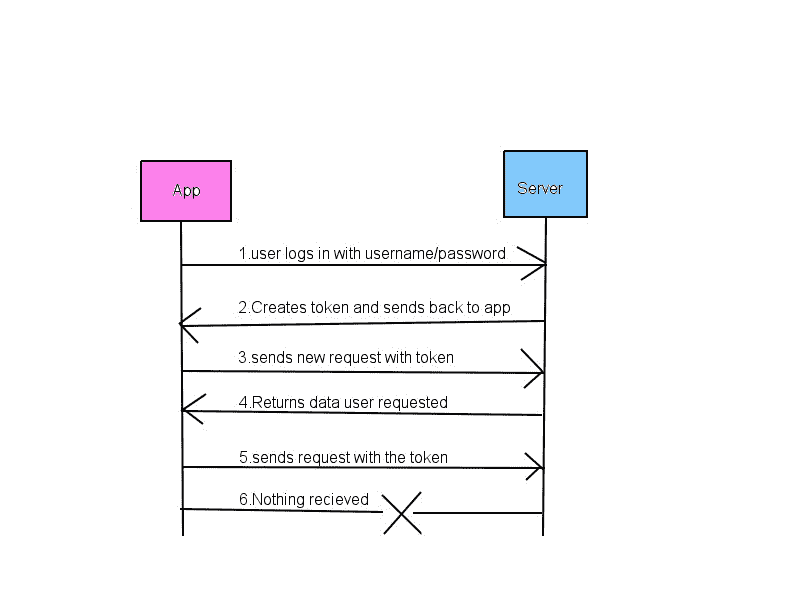

# 如何使用 JSON Web Token 简化应用程序的身份验证

> 原文：<https://www.freecodecamp.org/news/how-to-make-authentication-easier-with-json-web-token-cc15df3f2228/>

作者 Sudheesh Shetty

# 如何使用 JSON Web Token 简化应用程序的身份验证



A sample authentication flow

我们今天遇到的每个应用程序都实施了安全措施，以防止用户数据被滥用。安全性总是在不断变化和发展。身份验证是每个应用程序的重要组成部分之一。

有各种方法来验证用户。让我们讨论使用 node.js 应用程序的基于令牌的认证。为此，我们将使用 JSON Web 令牌。

### 什么是 JSON Web 令牌(JWT)？

JSON Web Tokens (JWT)是一种标准，它定义了一种紧凑且独立的方式，以 JSON 对象的形式在各方之间安全地传输信息。

*   **紧凑**:体积更小，便于转移。
*   **自含:**包含用户的所有信息。

### 它们是如何工作的？

当用户发送带有用户名和密码等必需参数的请求时。应用程序检查用户名和密码是否有效。验证时，应用程序将使用有效负载和密钥创建一个令牌。然后，它会将令牌发送回用户进行存储，并随每个请求一起发送。当用户使用此令牌发送请求时，应用程序使用相同的密钥验证有效性。如果令牌是有效的，则服务请求，否则应用程序将发送适当的错误消息。



Token Generation Flow

### 结构

JWT 的基本结构是这样的

```
header payload signature
```

*   **头:**包含令牌类型和用于制作签名的算法。被编码成 base64。
*   **有效负载:**任何自定义用户数据，如用户名和电子邮件。
*   **签名:**编码头、有效载荷和密钥的散列。

### JWT 的优势

*   **单键:**不需要每次都调用数据库来验证用户。单个密钥将解码任何用户提供的令牌。
*   **可移植:**同一个令牌可以在不同的域或不同的平台之间使用。它只需要钥匙。
*   **轻松到期:**用户可以使用 JWT 设置到期时间。在此之后，JWT 到期。

### 怎么才能做到呢？

我们将构建一个具有少量路由的 node.js 应用程序，并使用令牌对其进行身份验证。需要 node.js 和 javascript 的基础知识。

**第一步** —打开终端。在目录中启动一个新项目

```
cd auth
```

```
npm init
```

这将启动一个新项目。过程将要求某些信息。提供所需的所有细节。流程将创建 *package.json* ，看起来像这样。

```
{  "name": "auth",  "version": "1.0.0",  "description": "application to explain authentication",  "main": "server.js",  "scripts": {    "test": "echo \"Error: no test specified\" && exit 1"  },  "author": "Your name",  "license": "ISC"}
```

**第二步** —安装依赖项。再次回到终端，粘贴下面一行。

```
npm install express body-parser jsonwebtoken --save
```

*   ***表示:*** *Node.js* web 应用框架。
*   ***body-parser:*** 从我们的 POST 请求中获取参数。
*   ***jsonwebtoken:*** 创建并验证令牌。

安装完依赖项后。我们的 package.json 将如下所示:

```
{  "name": "auth",  "version": "1.0.0",  "description": "application to explain authentication",  "main": "server.js",  "scripts": {    "test": "echo \"Error: no test specified\" && exit 1"  },  "author": "Your name",  "license": "ISC",  "dependencies": {    "body-parser": "^1.17.2",    "express": "^4.15.3",    "jsonwebtoken": "^7.4.1"  }}
```

**步骤 3 —** 创建服务器

让我们创建一个服务器，服务于端口 3000，当调用`/` 路由时，它发送 index.html。我们还将创建认证用户的`/login` API 和给出用户列表的`/getusers` API。现在让我们创建虚拟数据，并将其存储在“users”数组中。您也可以用数据库调用来替换它们。

**步骤 4 —** 构建客户端

让我们使用 HTML、Bootstrap 和 JavaScript 创建一个客户端。我们的客户端有两个部分:登录屏幕和检索用户的地方。登录屏幕将包含电子邮件和密码文本框和一个按钮发送请求。我们还将添加一个文本框和按钮来传递令牌并获取用户列表。

**步骤 5 —** 启动应用程序

```
node server.js
```

### 我们的应用安全吗？


不，您可能会看到，即使您不传递令牌，您也可以获得所有用户的列表。我们还没有实现认证。让我们将身份验证添加到`/getusers` API 中，以便拥有有效令牌的用户可以检索用户列表。

### 如何添加认证？

1.  将 JWT 包含到 server.js 文件中。

```
var jwt=require('jsonwebtoken');
```

2.传递有效载荷(任何对象，这里传递用户对象本身)和一个秘密字符串给 sign 函数并创建一个令牌。

```
var token=jwt.sign(<user>,<secret>);
```

3.成功创建令牌后，将令牌传递给客户端。

```
res.json({token:token});
```

然后，您可以在客户端存储令牌，并在每次会话期间传递它以进行身份验证。让我们更改“getlist”函数，以便当我们想要访问用户列表时，可以将令牌传递给服务器。

让我们添加一个中间件来认证`/getusers`或将来添加的任何安全路由。确保所有需要认证的路由都在中间件之下。

在 server.js 中，首先我们有创建令牌的登录路由。之后，我们将使用中间件来验证令牌。所有需要认证的路由都在中间件之后。顺序很重要。

4.要进行解码，您需要传递令牌和密钥来验证功能。如果令牌无效，函数将返回错误；如果令牌有效，函数将返回成功。

```
jwt.verify(token,"samplesecret",(err,decod)=>{  //your logic})
```

调用 next()以便调用相应的路由。

最终的 server.js 将如下所示:

最终的 index.html 会是这样的:

就是这样。这是一个简单的例子，说明如何使用令牌来验证您的应用程序。我已经把完整的代码放在 GitHub 上了。你可以在那里检查一下。

[**sudheeshshetty/JWT_Auth**](https://github.com/sudheeshshetty/JWT_Auth)
[*通过在 GitHub 上创建账号为 JWT _ Auth 开发做贡献。*github.com](https://github.com/sudheeshshetty/JWT_Auth)

感谢您的阅读，请关注我，点击♡向其他人推荐同样的内容。我的推特账号是 [sudheeshshetty](https://twitter.com/sudheeshshetty) 。