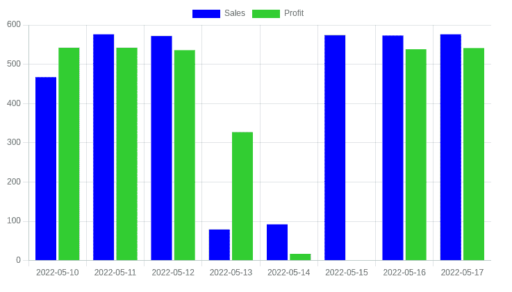
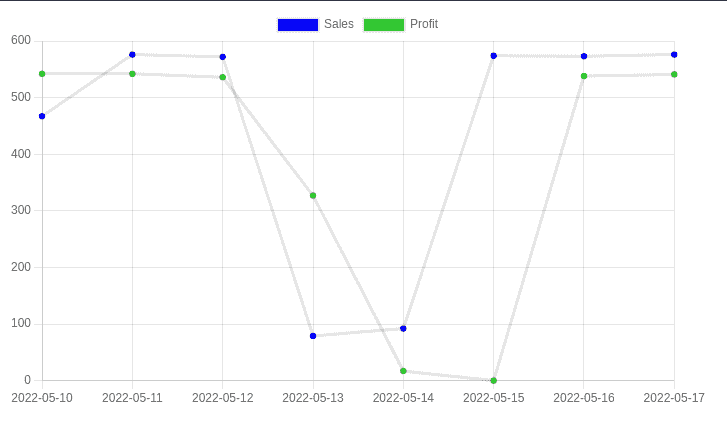

# Chart.js 教程——如何用 Angular 制作条形图和折线图

> 原文：<https://www.freecodecamp.org/news/how-to-make-bar-and-line-charts-using-chartjs-in-angular/>

在本教程中，我们将学习如何在 Angular 应用程序中使用 Chart.js 库创建简单的条形图和折线图。

但首先，Chart.js 是什么，是做什么的？

## 什么是 Chart.js？

Chart.js 是一个用于构建图表的 JavaScript 库。它被设计得直观简单，但功能强大到足以构建复杂的可视化。它有各种各样的图表类型，包括条形图、折线图、饼图、散点图等等。

ChartJs 是开源的，您可以在私人或商业项目中不受任何限制地使用它。它是用纯 JavaScript 编写的，不依赖于 jQuery 或 D3 等其他库。

它还提供了动画数据更新和向图表添加交互性(如工具提示和单击事件)的选项。

它是由 Plotly 的团队开发的，可以免费使用。

现在我们可以继续在 Chart.js 中创建我们的第一个条形图

## 先决条件

在我们开始制作图表之前，请确保您满足以下先决条件:

*   您对 HTML、CSS 和 TypeScript 有基本的了解，尤其是面向对象的 TypeScript 类和方法的概念。
*   你有 Node.js 版本 10 或更高版本和 NPM 或纱包管理器。你可以从[这里](https://nodejs.org/en/download/)下载 Node.js。

## 如何安装 Angular CLI

Angular CLI 是 Angular 开发者提供的官方工具。这是一个命令行界面工具，对于初始化和开发 Angular 应用程序非常有用。

您可以通过在终端或 powershell 窗口中执行以下命令来安装 Angular CLI:

```
npm install -g @angular/cli 
```

## 如何创建角度应用程序

现在让我们创建一个角度应用程序来保存我们的图表。在终端中，执行以下命令:

```
 ng new angular-chartjs 
```

现在您已经创建了 angular 应用程序，导航到项目文件夹并使用以下命令启动本地开发服务器:

```
cd angular-chartjs
ng serve -o 
```

在`http://localhost:4200/`会打开一个浏览器窗口，您可以在那里看到您正在运行的 Angular 应用程序。

现在，在同一目录中打开一个新的终端窗口，并使用以下命令安装 Chart.js 库:

```
npm install chart.js 
```

现在我们需要创建两个角度组件:一个用于条形图，另一个用于折线图。

您可以使用 Angular CLI 通过执行以下命令轻松创建它们:

```
ng generate component bar-chart
ng generate component line-chart 
```

## 如何用 Chart.js 创建条形图

条形图是数据的图形表示，其中水平轴和垂直轴代表值，每个条形的长度代表轴上指定的值。

条形图是可视化表示数据时最常见的图表形式之一。我们用它们来识别各种数据集中的趋势和模式。

何时使用条形图:

*   要一次显示多个值
*   为了提供数据的图形表示
*   比较数据集
*   检验不同变量之间的关系。

条形图通常用于商业和经济中，显示产品、服务或公司之间的比较。在我们的示例中，我们获取了 8 天期间每天的销售额和利润数据。

现在我们已经创建了组件，我们将继续创建条形图。

在条形图组件内，打开`bar-chart.component.html`文件并粘贴以下代码:

```
<div class="chart-container">
      <canvas  id="MyChart" >{{ chart }}</canvas>
</div> 
```

我们简单地创建了一个容器，并在该容器内创建了一个 id 为`MyChart`的画布。我们已经使用 Angular 的字符串插值来渲染`chart`变量，我们将在画布中创建它。

在条形图组件中，打开`bar-chart.component.ts`文件，使用以下命令导入 Chart.js 库:

```
import Chart from 'chart.js/auto';
//or
import Chart from 'chart.js'; 
```

现在让我们让前面提到的`chart`名副其实。这个变量将保存我们的图的信息。

```
public chart: any; 
```

现在我们将为条形图创建一个方法。这将包括我们的条形图的数据和标签。复制以下代码并粘贴到`ngOnInit()`函数下的`bar-chart.component.ts`文件中:

```
createChart(){

    this.chart = new Chart("MyChart", {
      type: 'bar', //this denotes tha type of chart

      data: {// values on X-Axis
        labels: ['2022-05-10', '2022-05-11', '2022-05-12','2022-05-13',
								 '2022-05-14', '2022-05-15', '2022-05-16','2022-05-17', ], 
	       datasets: [
          {
            label: "Sales",
            data: ['467','576', '572', '79', '92',
								 '574', '573', '576'],
            backgroundColor: 'blue'
          },
          {
            label: "Profit",
            data: ['542', '542', '536', '327', '17',
									 '0.00', '538', '541'],
            backgroundColor: 'limegreen'
          }  
        ]
      },
      options: {
        aspectRatio:2.5
      }

    });
  } 
```

上面的代码乍一看可能令人望而生畏，但它非常简单。我们提供图表类型、标签和数据。

我们希望我们的`createChart()`函数在页面加载后立即运行。为此，我们需要像这样调用`ngOnInit()`中的函数:

```
ngOnInit(): void {
    this.createChart();
  } 
```

最后，我们需要将条形图组件的 HTML 选择器添加到`app.component.html file.`中。删除初始角度模板代码，并添加以下内容:

```
<app-bar-chart></app-bar-chart> 
```

恭喜你！如果您已经仔细地执行了，那么您应该不会遇到任何错误，并且您的输出可能如下所示:



## 如何用 Chart.js 创建折线图

类似于条形图的折线图通常用于显示一段时间内的数据趋势，如经济增长或股票价格的变化。

折线图也有助于显示数量的变化，如一段时间内的人口或几周内的体重下降。

与条形图不同，折线图可以在两个轴上绘制单独的点，并用直线连接附近的点。

何时使用条形图:

*   当数据点的差异较小时
*   显示一段时间内的趋势

如果你已经创建了条形图，那么创建一个线形图是非常简单的。只需遵循您到目前为止已经完成的相同步骤(并确保在折线图组件上完成这些步骤)。

将`createChart()`方法的相同代码粘贴到`ngOnInit()`函数下的`line-chart.component.ts`文件中。您只需要将图表类型的关键字从`bar`更改为`line`。

您的代码应该如下所示:

```
createChart(){

    this.chart = new Chart("MyChart", {
      type: 'line', //this denotes tha type of chart

      data: {// values on X-Axis
        labels: ['2022-05-10', '2022-05-11', '2022-05-12','2022-05-13',
								 '2022-05-14', '2022-05-15', '2022-05-16','2022-05-17', ], 
	       datasets: [
          {
            label: "Sales",
            data: ['467','576', '572', '79', '92',
								 '574', '573', '576'],
            backgroundColor: 'blue'
          },
          {
            label: "Profit",
            data: ['542', '542', '536', '327', '17',
									 '0.00', '538', '541'],
            backgroundColor: 'limegreen'
          }  
        ]
      },
      options: {
        aspectRatio:2.5
      }

    });
  } 
```

调用`ngOnInit()`中的`createChart()`函数，你的折线图就做好了。

```
ngOnInit(): void {
    this.createChart();
  } 
```

最后，我们需要将折线图组件的 HTML 选择器添加到`app.component.html`文件中。

```
<app-line-chart></app-line-chart> 
```

您的输出可能如下所示:



这个 Angular 应用程序的完整代码存放在我的 [GitHub Repo](https://github.com/SwatejPatil/Bar-and-Line-Charts-using-ChartJs-in-Angular) 上。

我希望这篇教程对你有所帮助。感谢您的阅读！

卢克·切瑟的照片