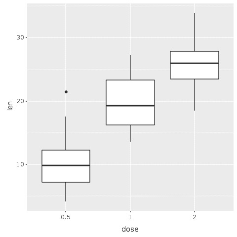
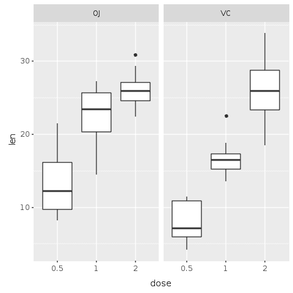
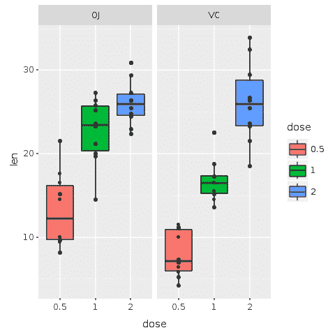
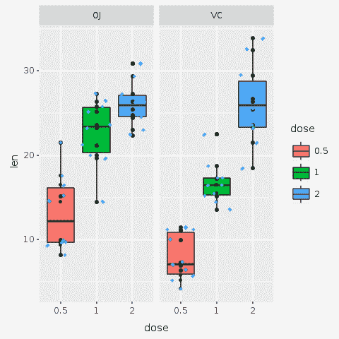
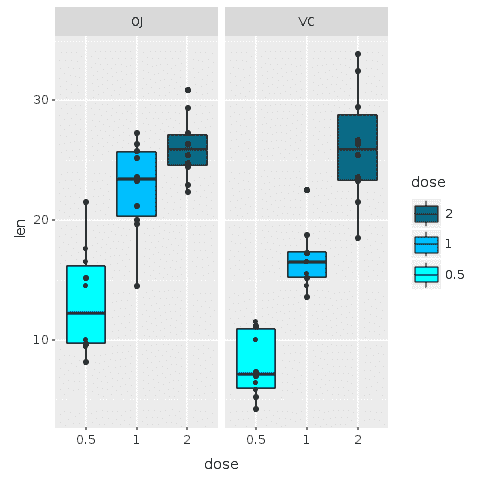
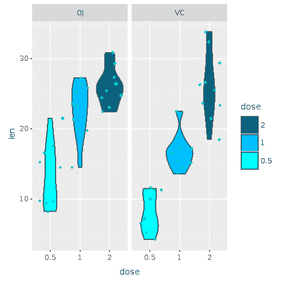
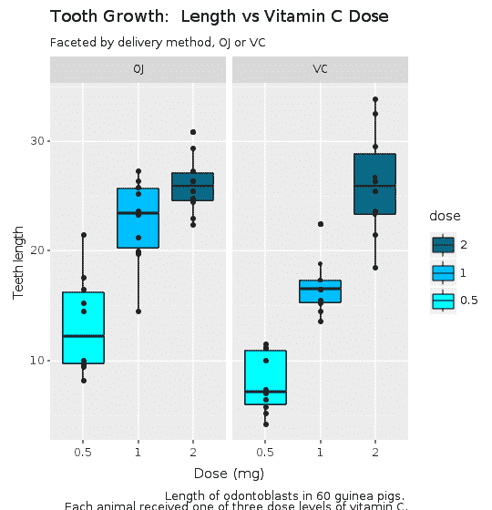
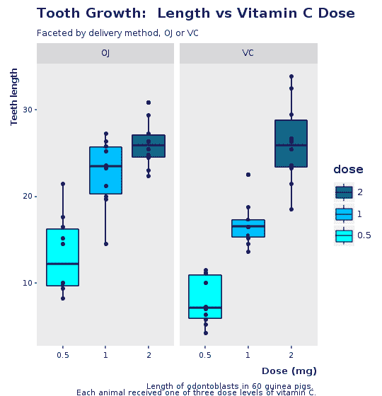
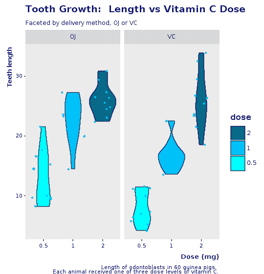

# 如何用 Galaaz 制作漂亮的红宝石图

> 原文：<https://www.freecodecamp.org/news/how-to-make-beautiful-ruby-plots-with-galaaz-320848058857/>

罗德里戈·博塔戈

# 如何用 Galaaz 制作漂亮的红宝石图

#### 罗德里戈·博塔弗戈和丹尼尔·莫斯

根据维基百科，“Ruby 是一种动态的、解释的、反射的、面向对象的、通用的编程语言。它是由日本的松本幸宏在 20 世纪 90 年代中期设计和开发的。随着 David Heinemeier Hansson 对 Ruby on Rails (RoR)的开发，它获得了很高的知名度。

RoR 是一个 web 应用程序框架，最初发布于 2005 年左右。它大量使用了 Ruby 的元编程特性。有了 RoR，鲁比变得非常受欢迎。根据 Ruby 的 Tiobe 指数，它的受欢迎程度在 2008 年左右达到顶峰，然后下降，直到 2015 年才开始回升。

在撰写本文时(2018 年 11 月)，Tiobe 索引将 Ruby 作为最受欢迎的语言排在第 16 位。

Python，一种类似于 Ruby 的语言，在指数中排名第四。Java，C，C++占据了前三个位置。Ruby 经常因为专注于 web 应用而受到批评。但是 Ruby 能做的不仅仅是网络应用。然而，对于科学计算，Ruby 远远落后于 Python 和 r。Python 有用于 web 的 Django 框架，用于数值数组的 NumPy，以及用于数据分析的 Pandas。r 是一个用于统计计算和图形的自由软件环境，有数千个用于数据分析的库。

直到最近，Ruby 还没有真正的方法来跨越这个鸿沟。实现一个完整的科学计算基础设施需要太长的时间。进入[甲骨文的 GraalVM](https://www.graalvm.org/) :

> GraalVM 是一个通用虚拟机，用于运行用 JavaScript、Python 3、Ruby、R、基于 JVM 的语言(如 Java、Scala、Kotlin)和基于 LLVM 的语言(如 C 和 C++)编写的应用程序。

> GraalVM 消除了编程语言之间的隔离，并支持共享运行时的互操作性。它可以独立运行，也可以在 OpenJDK、Node.js、Oracle 数据库或 MySQL 的上下文中运行。

> GraalVM 允许您编写多语言应用程序，以无缝的方式将值从一种语言传递到另一种语言。与其他多语言系统不同，GraalVM 不需要复制或封送。这让您在跨越语言界限时获得高性能。大多数情况下，跨越语言界限根本不需要额外的费用。

> 开发人员经常不得不做出令人不舒服的妥协，要求他们用其他语言重写他们的软件。比如:

> -“该库没有我的语言版本。我需要重写。”

> -“这种语言非常适合我的问题，但是我们无法在我们的环境中运行它。”

> ——“那个问题用我的语言已经解决了，只是语言太慢了。”

> 通过 GraalVM，我们的目标是让开发人员能够自由地为手头的任务选择合适的语言，而不会做出妥协。

如上所述，GraalVM 是一个*通用*虚拟机，它允许 Ruby 和 R(以及其他语言)在同一个环境中运行。GraalVM 允许多语言应用程序*无缝地*相互交互，并将值从一种语言传递到另一种语言。

GraalVM 是一个非常强大的环境。然而，它仍然需要应用程序的作者知道几种语言。为了消除这种需求，我们构建了 Galaaz，这是 Ruby 的一个瑰宝，它将 Ruby 和 R 紧密地结合在一起，并允许这些语言以一种用户不会意识到的方式进行交互。换句话说，一个 Ruby 程序员可以在不知道 R 语法的情况下使用 R 的所有功能。

库包装是将一种语言的特性引入另一种语言的常用方式。为了提高性能，Python 经常包装更高效的 C 库。对于 Python 开发人员来说，这种 C 库的存在是隐藏的。库包装的问题是，对于任何新的库，都需要手工制作新的包装，这需要高水平的专业知识和时间。

Galaaz 没有包装单一的 C 或 R 库，而是用 Ruby 包装了整个 R 语言。这样，Ruby 开发人员无需任何新的包装工作，就可以立即获得所有成千上万的 R 库。

为了展示 Galaaz 的强大功能，我们在本文中展示了 Ruby 如何透明地使用 R 的 ggplot2 库，为 Ruby 带来高质量的科学绘图能力。我们还展示了用 Galaaz 从 R 迁移到 Ruby 是一个小的语法变化问题。通过使用 Ruby，R 开发人员可以使用 Ruby 所有强大的面向对象特性。此外，使用 Ruby，将代码从分析阶段转移到生产阶段变得更加容易。

在本文中，我们将探索 R ToothGrowth 数据集。为了举例说明，我们将创建一些箱线图。本文中的[提供了关于 boxplot 的入门知识。](https://towardsdatascience.com/understanding-boxplots-5e2df7bcbd51)

我们还将创建一个公司模板，确保绘图具有一致的可视化。这个模板是使用 Ruby 模块构建的。有一种构建 ggplot 主题的方法，可以像 Ruby 模块一样工作。然而，写一个新的主题需要特定的主题写作知识。Ruby 模块是该语言的标准，不需要特殊的知识。

[这里](https://towardsdatascience.com/ruby-plotting-with-galaaz-an-example-of-tightly-coupling-ruby-and-r-in-graalvm-520b69e21021)我们展示了 Ruby 和 Galaaz 的散点图。

### gKnit

knitter 是一个应用程序，可以把用 rmarkdown 编写的文本转换成许多不同的输出格式。例如，作者可以将 rmarkdown 文档转换成 HTML、*、LaTex* 、docx 和许多其他格式。

Rmarkdown 文档可以包含文本和*代码块*。Knitr 在输出文档的灰色框中格式化代码块。它还执行代码块，并在白盒中格式化输出。执行代码的每一行输出都以“##”开头。

Knitr 允许用 R、Python、Ruby 和许多其他语言编写代码块。然而，虽然 R 和 Python 块可以共享数据，但在其他语言中，块是独立的。这意味着在一个块中定义的变量不能在另一个块中使用。

用 *gKnit* Ruby 代码块可以共享数据。在 gKnit 中，每个 Ruby 块都在自己的范围内执行，因此，一个块中定义的局部变量不能被其他块访问。然而，所有块都在“chunk”类的范围内执行，并且实例变量(“@”)在所有块中都可用。

### 探索数据集

让我们从探索我们选择的数据集开始。数据集就像一个简单的 excel 电子表格，其中每一列只有一种类型的数据。例如，一列可以有 float，另一列可以有 integer，还有第三个 strings。

ToothGrowth R 数据集分析了 60 只豚鼠中成牙本质细胞(负责牙齿生长的细胞)的长度，其中每只动物通过两种递送方法之一接受三种剂量水平的维生素 C (0.5、1 和 2mg/天)，橙汁(OJ)或抗坏血酸(维生素 C 的一种形式，编码为 VC)。

ToothGrowth 数据集包含三列:“len”、“supp”和“dose”。让我们看一下这个数据集的几行。

在 Galaaz 中，R 变量是通过使用前面带有波浪号(' ~ ')函数的相应 Ruby 符号来访问的。请注意，在下面的块中,' ToothGrowth '是 R 变量，Ruby 的' @tooth_growth '被赋值为' ~:ToothGrowth '。

```
# Read the R ToothGrowth variable and assign it to the# Ruby instance variable @tooth_growth that will be # available to all Ruby chunks in this document.@tooth_growth = ~:ToothGrowth
```

```
# print the first few elements of the datasetputs @tooth_growth.head
```

```
##    len supp dose## 1  4.2   VC  0.5## 2 11.5   VC  0.5## 3  7.3   VC  0.5## 4  5.8   VC  0.5## 5  6.4   VC  0.5## 6 10.0   VC  0.5
```

太好了！我们已经设法读取了 ToothGrowth 数据集，并查看了它的元素。我们在这里看到数据集的前 6 行。若要访问列，请在数据集名称后加上一个点(' . '))和列的名称。也使用点符号来链接通常 Ruby 风格的方法。

```
# Access the tooth_growth 'len' column and print the first few# elements of this column with the 'head' method.puts @tooth_growth.len.head
```

```
## [1]  4.2 11.5  7.3  5.8  6.4 10.0
```

“剂量”列包含数值 0.5、1 或 2，尽管上面看到的前 6 行仅包含 0.5 的值。尽管这些是数字，但它们最好被解释为一个[因素或类别](https://swcarpentry.github.io/r-novice-inflammation/12-supp-factors/)。因此，让我们将“剂量”列从数字转换为“因子”。

在 R 中，函数“as.factor”用于将向量中的数据转换为因子。要使用 Galaaz 中的这个函数，请使用“.”)被替换为“__”(双下划线)。链接时，函数“as.factor”变成“R.as__factor”或只是“as__factor”。

```
# convert the dose to a factor@tooth_growth.dose = @tooth_growth.dose.as__factor
```

让我们探索这个数据集的更多细节。具体来说，我们来看看它的维度、结构和汇总统计。

```
puts @tooth_growth.dim
```

```
## [1] 60  3
```

正如我们已经看到的，这个数据集有 60 行，每个主题一行，3 列。

请注意，在使用“str”函数时，我们不需要调用“puts”。这个函数不返回任何东西，并且打印数据集的结构作为副作用。

```
@tooth_growth.str
```

```
## 'data.frame':    60 obs. of  3 variables:##  $ len : num  4.2 11.5 7.3 5.8 6.4 10 11.2 11.2 5.2 7 ...##  $ supp: Factor w/ 2 levels "OJ","VC": 2 2 2 2 2 2 2 2 2 2 ...##  $ dose: Factor w/ 3 levels "0.5","1","2": 1 1 1 1 1 1 1 1 1 1 ...
```

观察变量“supp”和“dose”都是因子。系统自动将变量“supp”作为因子，因为它包含两个字符串 OJ 和 VC。

最后，使用 summary 方法，我们得到数据集的统计摘要

```
puts @tooth_growth.summary
```

```
##       len        supp     dose   ##  Min.   : 4.20   OJ:30   0.5:20  ##  1st Qu.:13.07   VC:30   1  :20  ##  Median :19.25           2  :20  ##  Mean   :18.81                   ##  3rd Qu.:25.27                   ##  Max.   :33.90
```

### 做数据分析

#### 查看数据的快速绘图

现在让我们通过从 Ruby 访问 ggplot2，用给定的数据创建我们的第一个图。对于从未见过或使用过 ggplot2 的 Rubyists 来说，下面是在它的主页上找到的对 ggplot 的描述:

> “ggplot2 是一个基于*图形*语法的声明式创建图形的系统。你提供数据，告诉 ggplot2 如何将变量映射到美学，使用什么图形原语，它会处理细节。”

这种描述可能有点神秘，最好是在工作中看到它来理解它。基本上，在图形的*语法中，开发者添加网格、轴、数据、标题、副标题等组件层，以及*条形图*、*方框图*等图元，形成最终图形。*

感兴趣的读者可以查阅以下关于媒体上的图形语法的文章:[多维数据有效可视化的图形语法综合指南](https://towardsdatascience.com/a-comprehensive-guide-to-the-grammar-of-graphics-for-effective-visualization-of-multi-dimensional-1f92b4ed4149)和[一个可怕的数据故事的成分是什么？](https://towardsdatascience.com/murdering-a-legendary-data-story-what-can-we-learn-from-a-grammar-of-graphics-ad6ca42f5e30)

为了做出一个图，我们对数据集使用' ggplot '函数。在 R 中，这将被写成`ggplot(<dataset>`，...).Galaaz 给你使用 e `ither R.ggplot(<datas` et & g `t;, ...) or <datas` et >的灵活性。ggplot(...).在下面的图表规范中，我们使用第二种符号，看起来更像 Ruby。Ggplot 使用“aes”方法指定 x 轴和 y 轴；在这种情况下，x 轴上的*th*e‘dose’，y 轴上的*e*‘length’:e . AES(x::dose，y: :len)。要指定地块类型，请向地块添加几何图形。对于箱线图，geom 是 R.geom_boxplot。

还要注意，我们在绘图之前调用了' R.png ',在 print 语句之后调用了' R.dev__off'。“R.png”打开一个“png 设备”用于输出绘图。如果我们不向“png”函数传递名称，图像将获得一个默认名称“Rplot <nnn>”，其中<nnn>是绘图的编号。“R.dev__off”关闭设备并创建“png”文件。然后，我们可以通过添加 rmarkdown 指令将生成的‘png’文件包含在文档中。</nnn></nnn>



Figure 1: Creating a Boxplot in png format for the ToothGrowth dataset. Dose x Length of Odontoblasts

太好了！我们刚刚用 Ruby 创建并保存了我们的第一个绘图，只用了四行代码。我们现在可以很容易地从这张图上看出一个明显的趋势:随着补充剂剂量的增加，牙齿的长度也在增加。

#### 直面剧情

第一个图显示了一个趋势，但是我们的数据包含了关于两种不同形式的传递方法的信息，要么通过橙汁(OJ ),要么通过维生素 C (VC)。然后，让我们试着创建一个图，帮助我们辨别每种交付方式的效果。

下一个图是一个*多面*图，其中每种交付方式都有自己的图。在左侧，该图显示了 OJ 输送方法。在右侧，我们看到了 VC 交付方法。为了获得该图，我们使用“R.facet_grid”函数，该函数根据交付方法因素自动创建面。“facet_grid”方法的参数是一个 [*公式*](https://thomasleeper.com/Rcourse/Tutorials/formulae.html) 。

在 Galaaz 中，我们给予程序员使用两种不同方式编写公式的灵活性。在第一种方式中，在 R 中编写公式(例如“x ~ y”)需要进行以下更改:

*   r 符号由前缀为“+”方法的同一个 Ruby 符号表示。R 中的符号`x`变成了 Ruby 中的`+:x`；
*   R 中的' ~ '运算符在 Ruby 中变成了' =~ '。R 中的公式`x ~ y`在 Ruby 中写成`+:x =~ +:y`；
*   “.”R 中的符号变成“+:all”

编写公式的另一种方式是使用“formula”函数，将实际公式作为字符串。R 中的公式`x ~ y`可以写成`R.formula("x ~ y")`。对于更复杂的公式，最好使用“公式”功能。

公式`+:all =~ +:supp`向‘facet _ grid’函数表明，它需要根据变量`supp`对图形进行分面，并垂直分割图形。将公式改为`+:supp =~ +:all`将水平分割图形。

```
R.png("figures/facet_by_delivery.png")@base_tooth = @tooth_growth.ggplot(E.aes(x: :dose, y: :len, group: :dose))@bp = @base_tooth + R.geom_boxplot +      # Split in vertical direction      R.facet_grid(+:all =~ +:supp)      puts @bpR.dev__off
```



Figure 2: ToothGrowth dataset faceted by delivery method

现在很清楚，虽然两种给药方法对牙齿生长都有直接影响，但 OJ 方法是非线性的，使用较小剂量的抗坏血酸具有较高的影响，并随着剂量的增加而降低其影响。用风险投资的方法，影响似乎更线性。

#### 添加颜色

如果我们写的是数据分析，我们会对趋势进行更好的分析，并改进统计分析。但是这里我们感兴趣的是在 Ruby 中使用 ggplot。所以，我们给这个图加点颜色，让趋势和对比更明显。

在下图中，方框用剂量进行了颜色编码。要说添彩，给 boxplot 的审美加上`fill: :dose`就够了。使用该命令，每个“剂量”因子都有自己的颜色。

```
R.png("figures/facets_by_delivery_color.png")
```

```
@bp = @bp + R.geom_boxplot(E.aes(fill: :dose))puts @bp
```

```
R.dev__off
```


Figure 3: Adding color to the faceted boxplot figure

分面帮助我们比较每种交付方式的总体趋势。添加颜色可以让我们具体比较每种剂量对牙齿生长的影响。可以观察到，在更小的剂量下，最多 1 毫克，OJ 比 VC(红色)表现更好。对于 2mg，OJ 和 VC 具有相同的中值，但是 OJ 分散性较低(蓝色)。对于 1mg(绿色)，OJ 明显优于 VC。通过这种非常快速的视觉分析，OJ 似乎是一种比 VC 更好的交付方式。

### 澄清数据

箱线图让我们对数据的分布有了一个很好的了解，但是看着那些有大的彩色方框的图让我们想知道还发生了什么。根据爱德华·塔夫特在设想中的信息:

> 单薄的数据理所当然地引发了怀疑:“他们遗漏了什么？他们真的就知道这些吗？他们在隐藏什么？他们就做了这些吗？”不时有人声称空闲空间是“友好的”(将一个天生模糊的想法拟人化)，但问题不在于有多少空闲空间，而在于如何使用它们。不在于有多少信息，而在于如何有效地安排信息。

他说:

> 一个非常规的设计策略被揭示出来:*阐明，增加细节。*

让我们利用这种智慧，在我们的图中添加另一层数据，这样我们就可以用细节来阐明它，而不会留下大的空盒子。在接下来的图中，我们为实验中的 60 头猪添加了数据点。为此，将函数“R.geom_point”添加到图中。

```
R.png("figures/facets_with_points.png")
```

```
# Add point for each subject@bp = @bp + R.geom_point
```

```
puts @bp
```

```
R.dev__off
```



Figure 4: Adding points for all data — Not everything can be seen because of data hiding (some points on
top of others)

现在我们可以看到所有 60 个对象的实际分布。实际上，这并不完全正确。我们很难看到所有 60 个主题。看起来有些点可能一个放在另一个上面，隐藏了有用的信息。

但是没问题！另一层可能会解决这个问题。在下图中，一个名为“geom_jitter”的新图层被添加到图中。抖动给每个点的位置增加了少量的随机变化，并且是处理由较小数据集中的离散性引起的过度绘制的有用方式。这使得更容易看到所有的点，并防止数据隐藏。我们还添加了颜色并改变了点的形状，使它们更容易看到。

```
R.png("figures/facets_with_jitter.png")
```

```
# Use small diamonds in a light blue color (cyan3) # to plot the subjects of the experimentputs @bp + R.geom_jitter(shape: 23, color: "cyan3", size: 1)
```

```
R.dev__off
```



Figure 5: Jittering the points to show those on top of each other — All data is now visible

### 准备要展示的情节

自从我们的第一个阴谋以来，我们已经走了很长的路。正如我们已经说过的，这不是一篇关于数据分析的文章，重点是 Ruby 和 ggplot 的集成。所以，让我们假设分析现在已经完成。然而，结束分析并不意味着工作已经完成。相反，最困难的部分还在后面！

在分析之后，有必要通过制作最终的展示图来传达它。最后一个情节有我们想分享的所有信息，但不是很顺眼。

#### 改善颜色

让我们从尝试改善颜色开始。现在，我们不会使用抖动层。前面的情节用了三种亮色。对于这种颜色，有什么明显或不明显的解释吗？显然，它们只是由我们的软件自动选择的随机颜色。虽然这些颜色有助于我们理解数据，但对于最终的演示来说，随机的颜色会分散观众的注意力。

在下图中，我们使用“scale_fill_manual”函数来改变方框的颜色和标签的顺序。对于颜色，我们对每个剂量使用蓝色阴影，浅蓝色(“青色”)代表较低剂量，深蓝色(“深蓝 4”)代表较高剂量。

此外，图例可以改进:我们使用“breaks”参数将较小的值(0.5)放在标签的底部，将最大的值(2)放在顶部。这种顺序看起来更自然，并且与图中颜色的实际顺序相匹配。

```
R.png("figures/facets_by_delivery_color2.png")
```

```
@bp = @bp +      R.scale_fill_manual(values: R.c("cyan", "deepskyblue",                                      "deepskyblue4"),                          breaks: R.c("2","1","0.5"))
```

```
puts @bp
```

```
R.dev__off
```



Figure 6: Shades of blue representing lower to higher doses

#### 小提琴的情节和抖动

有抖动的箱线图看起来确实有点让人不知所措。下一个图使用了一个称为*小提琴图*的箱线图的变体，带有抖动数据。

[来自维基百科](https://en.wikipedia.org/wiki/Violin_plot)

> violin plot 是一种绘制数字数据的方法。它类似于每边都有旋转核密度图的箱形图。

> 小提琴的情节有四层。外部形状代表所有可能的结果，粗细表示常见程度。(因此，最厚的部分代表平均众数。)里面的下一层表示 95%的时间出现的值。内部的下一层(如果存在的话)表示 50%时间出现的值。中间的点代表平均值。

```
R.png("figures/violin_with_jitter.png")@violin = @base_tooth + R.geom_violin(E.aes(fill: :dose)) +    R.facet_grid(+:all =~ +:supp) +   R.geom_jitter(shape: 23, color: "cyan3", size: 1) +   R.scale_fill_manual(values: R.c("cyan", "deepskyblue",                                   "deepskyblue4"),                       breaks: R.c("2","1","0.5"))puts @violinR.dev__off
```



Figure 7: Violin plot with shades of blue and jitter

该图是原始箱线图的替代图。对于最终演示，重要的是要考虑哪些图形最容易被观众理解。小提琴图是一个不太为人所知的图，可能会增加精神负担，然而，在我看来，它确实比箱线图好一点，甚至比抖动的箱线图提供更多的信息。

#### 添加装饰

我们的最终图开始成形了，但是一个展示图至少应该有一个标题，轴上的标签，也许还有一些其他的装饰。让我们开始添加那些。由于装饰需要更多的图形区域，这个新的地块有一个“宽度”和“高度”的规格。当没有指定时，R 中宽度和高度的默认值是 480 像素。

“实验室”功能添加了所需的装饰。在本例中，我们使用“标题”、“副标题”、“x”表示 *x* 轴标签，使用“y”表示 *y* 轴标签，使用“标题”表示关于绘图的信息(为了清楚起见，我们使用 Ruby 的 Here Doc 样式定义了一个标题变量)。

```
R.png("figures/facets_with_decorations.png", width: 540,       height: 560)
```

```
caption = <<-EOTLength of odontoblasts in 60 guinea pigs. Each animal received one of three dose levels of vitamin C.EOT
```

```
@decorations =  R.labs(title: "Tooth Growth:  Length vs Vitamin C Dose",         subtitle: "Faceted by delivery method, OJ or VC",         x: "Dose (mg)", y: "Teeth length",         caption: caption)
```

```
puts @bp + @decorations
```

```
R.dev__off
```



Figure 8: Adding title, subtitle, axes names and caption

#### 公司主题

我们差不多完成了。但是默认的情节配置看起来并不美观。我们仍然被图表的许多方面分散了注意力。第一，黑色字体颜色不好看。然后绘制背景、边框、网格都会给绘图增加杂乱感。

我们现在将定义我们的公司主题。在可用于/加载所有绘图的模块中，类似于 CSS 或任何其他样式定义。

在这个主题中，我们去除了边框和网格。多面绘图的背景会保留，但非多面绘图的背景会移除。字体颜色为蓝色(颜色:' #00080 ')。轴标签被移动到轴的末端附近，并以“粗体”书写。

```
module CorpTheme 
```

```
R.install_and_loads 'RColorBrewer'   #----------------------------------------------------------------# face can be  (1=plain, 2=bold, 3=italic, 4=bold-italic)#----------------------------------------------------------------    def self.text_element(size, face: "plain", hjust: nil)    E.element_text(color: "#000080",                    face: face,                   size: size,           hjust: hjust)  end  #----------------------------------------------------------------# Defines the plot theme (visualization).  In this theme we # remove major and minor grids, borders and background.  We # also turn-off scientific notation.#----------------------------------------------------------------    def self.global_theme(faceted = false)    # turn-off scientific notation like 1e+48    R.options(scipen: 999)    # remove major grids    gb = R.theme(panel__grid__major: E.element_blank())    # remove minor grids    gb = gb + R.theme(panel__grid__minor: E.element_blank)    # remove border    gb = gb + R.theme(panel__border: E.element_blank)    # remove background. When working with faceted graphs,     # the background makes it easier to see each facet, so     # leave it    gb = gb +       R.theme(panel__background: E.element_blank) if !faceted    # Change axis font    gb = gb + R.theme(axis__text: text_element(8))    # change axis title font    gb = gb +      R.theme(axis__title:        text_element(10, face: "bold", hjust: 1))    # change font of title    gb = gb + R.theme(title: text_element(12, face: "bold"))    # change font of subtitle    gb = gb + R.theme(plot__subtitle: text_element(9))    # change font of captions    gb = gb + R.theme(plot__caption: text_element(8))
```

```
 end   end
```

### 最终箱线图

我们现在可以轻松地制作最终的盒图和小提琴图。为了展示我们对数据的理解以及将结果呈现给观众的需要，添加了所有的图层。

最终的规范只是添加了到目前为止的所有图层(@bp)，加上装饰(@decorations)，加上公司主题。

这是我们最终的箱线图，没有抖动。

```
R.png("figures/final_box_plot.png", width: 540, height: 560)
```

```
puts @bp + @decorations + CorpTheme.global_theme(faceted: true)
```

```
R.dev__off
```



Figure 9: Final boxplot with all decoration, but no jitter

这是最终的小提琴图，有抖动，外观和感觉与公司的箱线图一样。

```
R.png("figures/final_violin_plot.png", width: 540, height: 560)
```

```
puts @violin + @decorations + CorpTheme.global_theme(faceted: true)
```

```
R.dev__off
```



Figure 10: Final violin plot, with decorations and jitter

### 另一种观点

我们现在制作另一个图，外观和感觉和以前一样，但多面的是剂量而不是补充。这显示了通过改变图形的*语法上的小语句来创建新的情节是多么容易。*

```
R.png("figures/facet_by_dose.png", width: 540, height: 560)
```

```
caption = <<-EOTLength of odontoblasts in 60 guinea pigs. Each animal received one of three dose levels of vitamin C.EOT
```

```
@bp = @tooth_growth.ggplot(E.aes(x: :supp, y: :len,                                  group: :supp)) +       R.geom_boxplot(E.aes(fill: :supp)) +       R.facet_grid(+:all =~ +:dose) +      R.scale_fill_manual(values: R.c("cyan", "deepskyblue4")) +      R.labs(title: "Tooth Growth:  Length by Dose",             subtitle: "Faceted by dose",             x: "Delivery method", y: "Teeth length",             caption: caption) +      CorpTheme.global_theme(faceted: true)
```

```
puts @bp
```

```
R.dev__off
```


Figure 11: New plot with the same ‘corporate’ look and feel

### 结论

在本文中，我们将介绍 Galaaz，并展示如何以一种 Ruby 开发人员不需要知道正在执行的 R 引擎的方式紧密耦合 Ruby 和 R。对于 Ruby 开发者来说，R 的存在无关紧要，她只是用 Ruby 编码。另一方面，对于 R 开发人员来说，移植到 Ruby 只是一个语法上的小变化，学习过程非常缓慢。随着 R 开发者对 Ruby 越来越精通，他可以开始使用‘类’，‘模块’，‘过程’，‘lambdas’。

试图从零开始给 Ruby 带来 R 的力量是一项巨大的努力，可能永远也不会完成。今天的数据科学家肯定会坚持使用 Python 或 R。现在，Ruby 和 R 社区都可以从这种结合中受益，这种结合是由 Galaaz 在 GraalVM 和 Truffle 的多语言环境之上提供的。

我们开发了 Ruby 和 R 的耦合，但是我们使用的过程也可以用来耦合 Ruby 和 JavaScript 或者 Ruby 和 Python。在一个多语言的世界里，我们相信一个 uniglot 库可能会非常有用。

从性能的角度来看，GraalVM 和 Truffle 承诺可以提高 10 倍以上，无论是对 [FastR](https://medium.com/graalvm/faster-r-with-fastr-4b8db0e0dceb) 还是对 [TruffleRuby](https://rubykaigi.org/2018/presentations/eregontp.html) 。

本文展示了如何逐步改进一个情节。从一个包含所有默认配置的非常简单的箱线图开始，我们慢慢地移动到最终图。这里重要的一点不是最终的情节是否真的很美(因为情人眼里出西施)，而是有一个循序渐进的改进过程，可以遵循这个过程来准备好最终的情节。

最后，整篇文章都是用 rmarkdown 编写的，并由 *gknit* 编译成 HTML，这是一个包装了*knitter*并允许记录 Ruby 代码的应用程序。对于任何试图为 Ruby 写文章、博客或文档的 Ruby 爱好者来说，这个应用程序都有很大的帮助。

### 安装 Galaaz

#### 先决条件

*   GraalVM(> = rc8[):https://github.com/oracle/graal/relea](https://github.com/oracle/graal/releases)ses
*   松露红宝石
*   FastR

以下 R 包将在必要时自动安装，但如果需要，也可以在使用 gKnit 之前安装:

*   ggplot2
*   gridExtra
*   针织工

R 包的安装需要一个开发环境，并且很耗时。在 Linux 中，gnu 编译器和工具应该足够了。我不确定苹果电脑需要什么。

为了运行“规范”,以下 Ruby 包是必需的:

*   gem 安装 rspec

#### 准备

*   gem 安装 galaaz

### 使用

*   gknit<rmarkdonw_file.rmd></rmarkdonw_file.rmd>
*   在一张纸条上写着:需要‘gala az’

### 运行演示

安装后，许多 galaaz 演示可用于:

```
> galaaz -T
```

将显示所有可用演示的列表。要运行列表中的任何演示，请将对“rake”的调用替换为“galaaz”。例如，列表中的一个示例是“rake sthda:bar”。为了运行这个示例，只需执行“galaaz sthda:bar”。执行“galaaz sthda:all”将运行 sthda 类别中的所有演示，在本例中，幻灯片放映中有 80 多个用 Ruby 编写的 ggplot 图形。

一些示例要求“rspec”可用。要安装“rspec ”,只需执行“gem install rspec”。