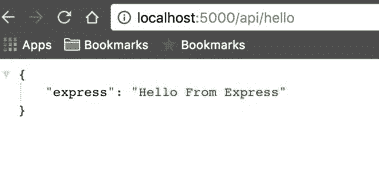
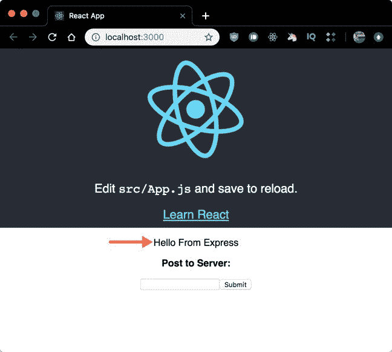
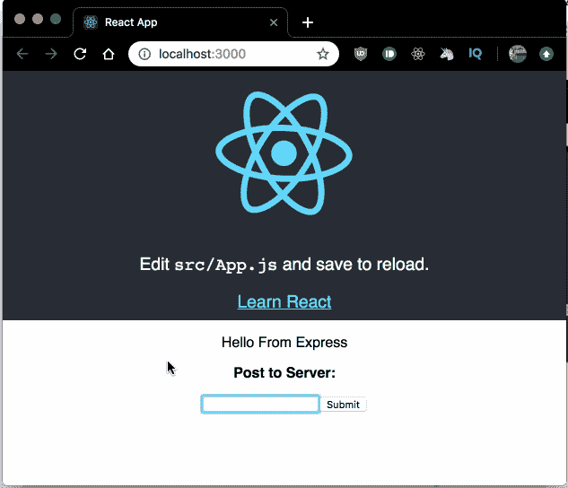
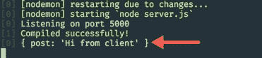
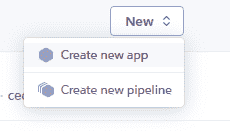
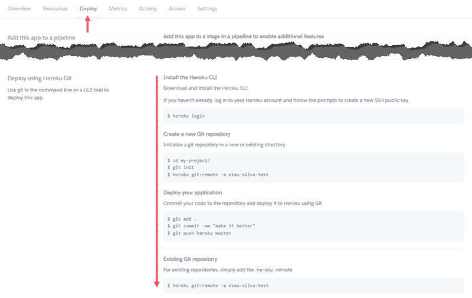
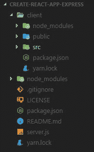

# 如何让 create-react-app 与节点后端 API 一起工作

> 原文：<https://www.freecodecamp.org/news/how-to-make-create-react-app-work-with-a-node-backend-api-7c5c48acb1b0/>

这是新 React 开发人员中非常常见的问题，也是我在开始使用 React 和 Node.js 时遇到的一个问题。在这个简短的示例中，我将向您展示如何让`create-react-app`与 Node.js 和 Express 后端一起工作。

#### 创建-反应-应用

使用`create-react-app`创建一个项目。

```
npx create-react-app example-create-react-app-express
```

在`example-create-react-app-express`目录下创建一个`/client`目录，并将所有由`create-react-app`创建的 React 样板代码移动到这个新的客户端目录下。

```
cd example-create-react-app-expressmkdir client
```

#### 节点快递服务器

在根目录(`example-create-react-app-express`)下创建一个`package.json`文件，复制以下内容:

```
{
  "name": "example-create-react-app-express",
  "version": "1.0.0",
  "scripts": {
    "client": "cd client && yarn start",
    "server": "nodemon server.js",
    "dev": "concurrently --kill-others-on-fail \"yarn server\" \"yarn client\""
  },
  "dependencies": {
    "body-parser": "^1.18.3",
    "express": "^4.16.4"
  },
  "devDependencies": {
    "concurrently": "^4.0.1"
  }
}
```

注意，我使用`concurrently` 来同时运行 React 应用程序和服务器。如果一个进程以非零状态码退出，那么`–kill-others-on-fail`标志将终止其他进程。

全局安装`nodemon` 和服务器依赖关系:

```
npm i nodemon -g
yarn
```

创建一个`server.js`文件，复制以下内容:

```
const express = require('express');
const bodyParser = require('body-parser');

const app = express();
const port = process.env.PORT || 5000;

app.use(bodyParser.json());
app.use(bodyParser.urlencoded({ extended: true }));

app.get('/api/hello', (req, res) => {
  res.send({ express: 'Hello From Express' });
});

app.post('/api/world', (req, res) => {
  console.log(req.body);
  res.send(
    `I received your POST request. This is what you sent me: ${req.body.post}`,
  );
});

app.listen(port, () => console.log(`Listening on port ${port}`));
```

这是一个简单的 Express 服务器，将运行在端口 5000 上，有两个 API 路由:`GET` - `/api/hello`和`POST` - `/api/world`。

此时，您可以使用以下命令运行 Express 服务器(仍然在根目录中):

```
node server.js
```

现在导航到`[http://localhost:5000/api/hello](http://localhost:5000/api/hello)`，您将看到以下内容:



一旦我们构建了 React 应用程序，我们将测试`POST`路线。

#### React 应用程序

现在切换到我们的 React 应用程序所在的`client`目录。

将下面一行添加到由`create-react-app`创建的`package.json`文件中。

```
"proxy": "http://localhost:5000/"
```

对于用`create-react-app`创建的项目，使用 Express 后端服务器的关键是使用代理。这告诉 Web-pack 开发服务器将我们的 API 请求代理到我们的 API 服务器，假设我们的 Express 服务器运行在`localhost:5000`上。

现在修改`./client/src/App.js`来调用我们的 Express API 后端，变化以粗体显示。

```
import React, { Component } from 'react';

import logo from './logo.svg';

import './App.css';

class App extends Component {
  state = {
    response: '',
    post: '',
    responseToPost: '',
  };

  componentDidMount() {
    this.callApi()
      .then(res => this.setState({ response: res.express }))
      .catch(err => console.log(err));
  }

  callApi = async () => {
    const response = await fetch('/api/hello');
    const body = await response.json();
    if (response.status !== 200) throw Error(body.message);

    return body;
  };

  handleSubmit = async e => {
    e.preventDefault();
    const response = await fetch('/api/world', {
      method: 'POST',
      headers: {
        'Content-Type': 'application/json',
      },
      body: JSON.stringify({ post: this.state.post }),
    });
    const body = await response.text();

    this.setState({ responseToPost: body });
  };

render() {
    return (
      <div className="App">
        <header className="App-header">
          
          <p>
            Edit <code>src/App.js</code> and save to reload.
          </p>
          <a
            className="App-link"
            href="https://reactjs.org"
            target="_blank"
            rel="noopener noreferrer"
          >
            Learn React
          </a>
        </header>
        <p>{this.state.response}</p>
        <form onSubmit={this.handleSubmit}>
          <p>
            <strong>Post to Server:</strong>
          </p>
          <input
            type="text"
            value={this.state.post}
            onChange={e => this.setState({ post: e.target.value })}
          />
          <button type="submit">Submit</button>
        </form>
        <p>{this.state.responseToPost}</p>
      </div>
    );
  }
}

export default App;
```

我们创建`callApi`方法来与我们的`GET` Express API 路由交互，然后我们在`componentDidMount`中调用这个方法，最后将状态设置为 API 响应，这将是来自 Express 的 *Hello。*

请注意，我们没有使用完全限定的 URL `[http://localhost:5000/api/hello](http://localhost:5000/api/hello)`来调用我们的 API，尽管我们的 React 应用程序运行在不同的端口(3000)上。这是因为`**proxy**` 行我们早先添加到了`package.json`文件中。

我们有一个只有一个输入的表单。提交时调用`handleSubmit`，它又调用我们的`POST` Express API route，然后保存对 state 的响应，并向用户显示一条消息:*我收到了你的 POST 请求。这是你发给我的:【来自输入的消息】*。

现在打开`./client/src/App.css`并修改`.App-header`类，如下所示(粗体变化)

```
.App-header {
...
  min-height: 50%;
...
  padding-bottom: 10px;
}
```

### 运行应用程序

如果服务器仍在运行，在终端中按 Ctrl+C 停止它。

从项目根目录运行以下命令:

```
yarn dev
```

这将启动 React 应用程序并同时运行服务器。

现在导航到`[http://localhost:3000](http://localhost:3000)`，你将点击 React 应用程序，显示来自我们的`GET`快速路线的消息。好看吗？！



Displaying GET route

现在，在输入字段中输入一些内容并提交表单，您将看到来自显示在输入字段正下方的`POST` Express route 的响应。



Calling POST route

最后看看您的终端，您将看到我们从客户端发送的消息，这是因为我们在`POST`快速路由中的请求体上调用了`console.log`。



Node

### 生产部署到 Heroku

打开`server.js`并用以下内容替换:

```
const express = require('express');
const bodyParser = require('body-parser');
const path = require('path');

const app = express();
const port = process.env.PORT || 5000;

app.use(bodyParser.json());
app.use(bodyParser.urlencoded({ extended: true }));

// API calls
app.get('/api/hello', (req, res) => {
  res.send({ express: 'Hello From Express' });
});

app.post('/api/world', (req, res) => {
  console.log(req.body);
  res.send(
    `I received your POST request. This is what you sent me: ${req.body.post}`,
  );
});

if (process.env.NODE_ENV === 'production') {
  // Serve any static files
  app.use(express.static(path.join(__dirname, 'client/build')));

  // Handle React routing, return all requests to React app
  app.get('*', function(req, res) {
    res.sendFile(path.join(__dirname, 'client/build', 'index.html'));
  });
}

app.listen(port, () => console.log(`Listening on port ${port}`));
```

打开`./package.json`并将以下内容添加到`scripts`条目中

```
"start": "node server.js",
"heroku-postbuild": "cd client && npm install && npm install --only=dev --no-shrinkwrap && npm run build"
```

Heroku 将默认运行`start`脚本，这将服务于我们的应用程序。然后，我们希望指导 Heroku 构建我们的客户端应用程序，我们使用`heroku-postbuild`脚本来完成。

现在，前往 [Heroku](https://www.heroku.com/) 并登录(如果你没有账户，也可以开一个)。

创建一个新的应用程序，并为其命名



Create new app on Heroku

点击 ***Deploy*** 选项卡，并按照部署说明进行操作(我认为这些说明是不言自明的，没有必要在这里重复它们？)



Deploy an app to Heroku

就是这样，你可以通过点击 Heroku 仪表盘右上角的 ***打开应用*** 按钮来打开你的应用。

访问本教程的部署应用:[https://cra-express.herokuapp.com/](https://cra-express.herokuapp.com/)

#### 其他部署选项

我在这里写了其他部署选项:

*   [Netlify](https://blog.bitsrc.io/react-production-deployment-part-1-netlify-703686631dd1)
*   [现在](https://blog.bitsrc.io/react-production-deployment-part-2-now-c81657c700b7)
*   [Heoku](https://blog.bitsrc.io/react-production-deployment-part-3-heroku-316319744885) (更深入的解释)

### 项目结构

这将是最终的项目结构。



在 [GitHub 库](https://github.com/esausilva/example-create-react-app-express)上获取完整代码。

谢谢你的阅读，我希望你喜欢它。任何问题，建议请在下面的评论中告诉我！

你可以在 [Twitter](https://twitter.com/_esausilva) 、 [GitHub](https://github.com/esausilva) 、 [Medium](https://medium.com/@_esausilva/latest) 、 [LinkedIn](https://www.linkedin.com/in/esausilva/) 或者全部关注我。

这篇帖子最初发布在我的个人[博客网站](https://esausilva.com/2017/11/14/how-to-use-create-react-app-with-a-node-express-backend-api/)。

* * *

**2019 年 8 月 25 日更新:** 我一直在建一个祷告 web app，叫“**我的安静时光——祷告日志**”。如果你想继续参与，请通过以下链接报名:[http://b.link/mqt](http://b.link/mqt)

该应用程序将在年底前发布，我对这个应用程序有很大的计划。点击下面的链接可以看到一些截图:[http://pc.cd/Lpy7](http://pc.cd/Lpy7)

如果您对该应用程序有任何疑问，我在 Twitter 上的 DMs 是开放的。