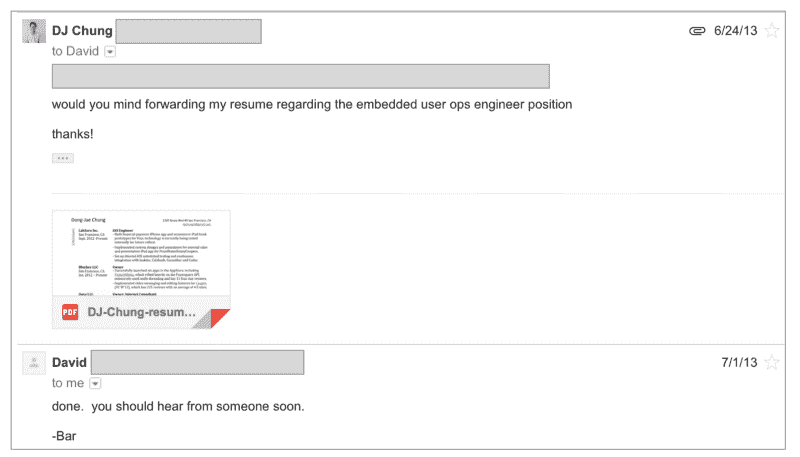

# 如何让别人更容易帮你找工作

> 原文：<https://www.freecodecamp.org/news/how-to-make-it-easy-for-others-to-help-you-in-your-job-search-67c15d05c907/>

DJ 钟

# 如何让别人更容易帮你找工作

在找工作的过程中，你会向别人寻求帮助。无论是寻求建议、推荐，还是给某人做介绍。你至少会向另外一个人寻求帮助。

我在 Dropbox 的工作是通过请求帮助和推荐得到的。下面是我发给朋友大卫的邮件，(经过多次对话！)让他提交我的简历:

有时候，你在问一个亲密的朋友，这很容易做到(尽管我知道情况并非总是如此)。但其他时候，你会向一个你不太了解的人，甚至是一个完全陌生的人伸出援手。这可能会让人感到紧张和尴尬。

### 让人们更容易帮助你

当你通过电子邮件或短信向他人寻求求职帮助时，要记住以下一些建议。

#### **1。做你的研究**

不要问那些稍加努力就能找到答案的问题。如果你的问题可以通过谷歌搜索、阅读那个人的博客或浏览他们的 LinkedIn 个人资料来回答，那就不是一个好问题。

此外，如果你向一个你不认识的人伸出援手，问一个有广泛答案的普通问题会使你不太可能得到回应。

#### **2。有一个非常具体的提问**

不要问一些普通的问题，比如“你是如何成为业务发展总监的？”

这种类型的问题很难回答，因为它太宽泛了，要做出一个深思熟虑的回答需要付出很多努力。相反，你应该问，“你积极努力提高的一项技能是什么，帮助你成为了业务发展总监？”

还有，像这样的问题，“你能帮我联系市场部的人吗？”不够具体。再一次，做你的研究，在 LinkedIn 上找到一个在公司做市场营销的人，问:“我在 LinkedIn 上看到你和 Lisa Stevens 有联系，你愿意帮我和她联系吗？如果她不是合适的谈话对象，你愿意帮我联系市场部的其他人吗？”

我想指出的一个具体情况是，当你给一个你不认识的人发一条冷冰冰的信息时。也许是你感兴趣的公司里的某个人，你想从他们那里得到推荐。或者，也许他们在你梦寐以求的工作中，你想知道更多关于他们是如何做到的。

像往常一样，尤其是在这些冷冰冰的信息场景中，请记住，你是在请一个陌生人，一个真正的人帮忙，所以要机智。

在你最初冷淡的信息中，试着用一个简短的自我介绍和一个小问题来建立联系。

比方说，你正在给一个人发短信(通过电子邮件或 LinkedIn ),这个人的职位是你渴望得到的。你可以发出这样的第一条信息:

嘿 X，

我在[Y 公司]网站上看到了你的技术博客帖子，觉得很吸引人！这些也是我想要解决的问题。

我目前是一名职业生涯早期的软件工程师，一直在思考如何提高学习速度，最终成为像你一样的技术领导者。

你愿意在电话上聊 30 分钟还是喝杯咖啡？我想问你一些具体的问题。

谢谢大家！

我想强调几件关于这个冷漠信息的事情。首先，当你指出他们写的一篇博文时，这表明你已经做了研究。找到你能与之相关的人的一些东西，赞美他们，因为这有助于温暖冰冷的信息。

第二，它给出了一个简短的关于你自己的背景。这有助于提供更多关于你是谁的背景信息。但是，不要写出你的人生故事——现在不是时候。

第三，你有一个具体的要求:打电话聊天或喝咖啡。此外，你要提到你想和他们谈些什么，并准备好具体的问题。

这些细微的差别对帮助接收者理解他们被要求做什么大有帮助。如果没有询问或者询问不明确，收件人需要花时间去弄清楚需要做什么，在这种情况下，你可能得不到回应。

有时，你可能会得到拒绝电话聊天或喝咖啡邀请的回复，但对方可能会通过电子邮件回答你的问题。接受他们的提议，把你准备好的问题发过来，但是要记住下一条建议。

#### **3。规则 3:只问 3 个问题**

没有人想打开一封有一墙文字的邮件或信息。不要冲动地一次问这个人所有的问题。

相反，作为一个规则，一次只问 3 个问题。同样，重申一下，问一些经过研究的和/或具体的问题，这样答案就不会太长。仅仅因为一个答案很短并不意味着它没有经过深思熟虑。

当你向某人寻求职业建议时，这一点尤为重要。职业建议问题往往很宽泛，回答起来很麻烦，因为它们需要一个背景故事。相反，你应该问一些抓住问题本质的问题，而不是那些需要描述性背景的问题。

以下是与职业发展相关的此类问题的示例:

*   有没有书籍、博客或其他资源极大地帮助了你提高软件工程技能？
*   有没有一种做法或习惯帮助你在工作中变得更有效率，你希望在职业生涯中早点开始这样做？

这类问题更有可能让你得到及时的回复。此外，来回交换可以导致互利的关系，而不是一次性的互动。

还有，确保你不要忘记要你想要的东西。本着建立温暖联系的精神，不要只是为了提问而编问题。例如，如果你正在寻找一份工作推荐，确保你明确地问(一旦你已经建立了一个热情的关系)，“你能给我推荐这个角色吗？”

#### **4。设置物流时给出时间范围**

如果你要求喝咖啡或打电话聊天，给出你有空的多个日期和时间范围。

不要问，“你什么时候有空？”而是问“我周四下午 3 点到 6 点或者周五下午 1 点到 3 点有空。如果这些时间对你都没用，那什么时间有用呢？”

这样，他们可以选择一个适合他们的位置，而不是来回尝试解决物流问题，众所周知，这是最糟糕的。

在找工作的过程中，我们会需要帮助，但是让我们尽我们所能让人们更容易帮助我们！

#### 你的求职被卡住了吗？想知道如何突破并在技术领域找到一份工作吗？

点击此处获得获得你想要的工作的一步一步的策略，并查看我在 Dropbox 获得工作的确切简历。

*最初发表于[hackcareer.com](http://hackcareer.com/)*