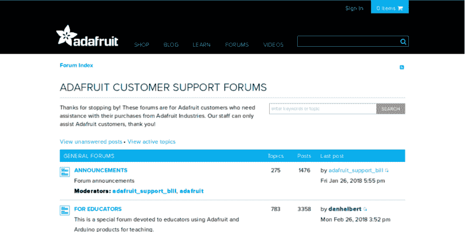
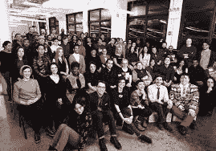
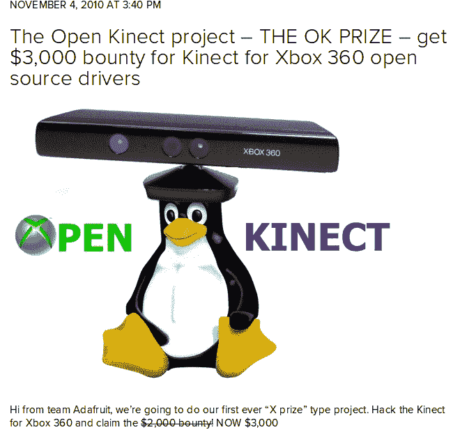

# 如何在没有任何风险投资的情况下在开源硬件上赚钱

> 原文：<https://www.freecodecamp.org/news/how-to-make-money-on-open-source-hardware-without-any-venture-capital-funding-76e5490aad00/>

Adafruit 是如何在开源硬件领域连续三年增长超过 700%的。

今天我将向你们展示 Adafruit 是如何连续三年成为美国增长最快的硬件制造商之一的。你可以复制这种策略，用开源硬件赚钱，并创建一个贡献者社区，帮助你以超乎想象的速度开发和推广你的项目。

Adafruit 的创始人 Limor Fried 是开放硬件先驱中的佼佼者。

你可能已经听说过她，但如果你没有

*   Adafruit 由麻省理工学院的黑客兼工程师 Limor“lady ada”Fried 于 2005 年创立。
*   她和 Adafruit 的目标是为所有年龄和技能水平的制造商创建学习电子产品和制作最佳设计产品的最佳在线场所。
*   2013 年至 2015 年间，她的制造公司增长了 742 %( T1 ),市值超过 3300 万美元。
*   Adafruit 位于纽约市中心，占地 50，000 多平方英尺，员工人数已超过 100 人。工厂。
*   她和创客运动的其他人物有过接触，比如马西莫·班兹和大卫·库阿蒂尔斯(Arduino 的创始人)，米奇·奥特曼(Mitch Altman)，TV-B-Gone 的创造者，等等。
*   她的公司网站每月有超过 100 万的独立访问者，其 YouTube 频道有超过 25 万的订户。

**所以她显然在做正确的事情……**

下面几节将详细阐述她是如何做到的。

### 第 0 步——找出人们想要什么……然后验证它

Limor Fried demo-ing the Project Glass alpha-version in 1999
Photo Source: [MIT Media](https://www.media.mit.edu/wearables/mithril/photos.html)

在 Limor Fried 出售电子设备之前，她是麻省理工学院的学生。在攻读计算机科学和电子工程硕士学位期间，她学会了如何自己绘制原理图。

她像麻省理工学院每年成千上万的其他学生一样去上学。但与其他大多数学生不同的是，她不只是在课堂上记笔记，或者记台词，然后继续自己的生活。

对她来说，与众不同的是她将课堂上学到的技能付诸实践。她通过使用定制的零件从零开始构建功能性物体，如 MP3 播放器、合成器和轻型玩具。

她就是这样变得有独创性的。通过实践。通过运用她所学到的东西。

这是在 YouTube 和智能手机出现之前。因此，她在个人网站上发布了自己项目的 DIY 教程。很快，一群观众通过电子邮件向她狂轰滥炸，要求出售预先组装的套件。

起初，她说她喜欢，“不，伙计，我真的很忙，让我一个人呆会儿”。但几个月后，她的粉丝让她筋疲力尽，并“强迫”她开设 Adafruit 来销售人们索要的工具包。

利莫尔当时没有意识到的是，她正在免费验证一个商业想法。而这是最好的创业方式。在你为一个商业想法花费金钱和时间之前，那是你在开始任何事情之前想要得到的那种确认。

所以，如果你想创业，在你担心卖东西之前，先学习一项对你和他人都有用的技能。但是不要光学。一直练习，直到找到自己的创意。然后分享你是怎么做到的。

即使你不能进入麻省理工学院，也有很多免费或便宜的课程，在那里你可以学到非常酷和有价值的技能。在像 [Coursera](https://www.coursera.org/) 、[自由代码营](https://www.freecodecamp.org/)、 [Udemy](http://udemy.com/) 、 [Udacity](https://www.udacity.com/) 、 [Instructables](https://www.instructables.com/) 这样的地方，有数百个免费或便宜的课程，但你也可以在 [Github](https://github.com/) 、 [Wevolver](https://www.wevolver.com/) 和几乎所有的互联网上找到许多令人惊叹的开源资源。

如果你正在学习或知道如何设计电子板、机器人、电脑、汽车、无人机、鞋子、竹制自行车、服装、室内水产养殖系统、3D 打印机，制作你自己的版本，有你自己的味道。然后去组织一次聚会或发布一些 YouTube 视频，教你周围的人如何自己做。

一旦你找到了别人赞不绝口的东西可以教，你就能围绕它建立几乎任何生意。这可能是一个初学者工具包，一个你用来构建某个东西的产品的策展，或者是为那些希望你手持它们的人提供的定制咨询。以下是一些如何找到有价值的想法的[创意](http://openitagency.eu/business-models/)。

今天，YouTube 和其他社交媒体上的噪音和竞争比以往任何时候都多，所以邀请一些朋友、同事或开一个聚会或一些线下活动来分享你的实践可能会更容易。一旦你足够自信，你就可以上线了。还有很多内容是没付诸实践的人教出来的。

一旦你开始教学，无论是在线还是离线，如果人们喜欢你的内容或呈现方式，他们会让你知道他们想要什么，你会发现你需要提供什么。如果他们没有，就听听他们有什么问题，看看你如何帮助他们。

**外卖**:

*   学习一项新技能，练习你的技能，为你自己或他人获得很酷的结果
*   教别人如何得到你得到的结果

### 步骤 1 -从简单的 3 个基本要素开始

因此，要建立自己的企业，她只需要三样超级简单的东西:

1.  一个产品 -为那些想通过她的教程学习如何创造他们自己的电子产品的人准备的工具包。
2.  一个营销渠道——免费的教程和她的工具包的开源蓝图，这样任何人都可以研究、修改、分发、制作和销售基于该设计的设计或硬件。通过这种方式，她会教人们如何组装电子产品，如何提高他们的技能，最终，如何在她的想法基础上创建一个企业。对每个人来说都是一个非常吸引人的想法。
3.  销售渠道 -一个简单的电子商务网站，人们可以在那里订购她的工具包。

一个开源的硬件业务在开始的时候应该是这么简单。所以如果你要创建一个开源项目，不要把它搞得太复杂，坚持这些基本原则。

例如，如果您销售套件，您可以在最近的私人实验室手动创建它们，或者组装一些您可以在互联网上订购的定制零件。

有了 YouTube 和 WordPress，你就拥有了创建自己的教程频道所需的一切。

有了 PrestaShop、WooCommerce 或任何其他电子商务网站，你可以很快创建一个免费或低价销售网站。

但是要注意，如果你想让你的开放项目真正发挥作用，有一个条件。必须没有之前的教程怎么做你要分享的内容。正如 Limor Fried 用她自己的话说，

> 我认为该公司的腾飞是因为，在这些工具之前，没有一个你会真正使用或想要保留的学习项目——Limor Fried

**外卖**:

*   确保你的想法或技能没有在别处被广泛传授。在线或线下传授你的技能。这将帮助你找到人们渴望的产品或想法。创建免费教程，开源你的蓝图来推广你的想法。
*   建立一种销售方式，比如一个简单的电子商务网站。

对于 Adafruit，人们渴望得到她预先组装好的电子套件。她通过创建和分享独特的网络教程来销售这些产品，这些教程教她如何通过自己的网站销售这些产品。

### 第二步——开源你的技术，创建一个共同创造者的社区……节省时间

为了让社区用 Adafruit 进行创新，Limor Fried 开源了它的设计，并允许每个人通过在 GitHub 上访问它[来构建它。](https://github.com/adafruit)

Adafruit 还为他们的每一个工具包创建了在线教程。每个产品页面上都有说明链接。[这里是](https://learn.adafruit.com/hacking-the-kinect?view=all)他们创建的一个教程的例子，用他们的零件逆向工程一个 Kinnect。

有了在线文档，Adafruit 可以轻松地更新说明，让人们快速轻松地使用他们的产品。

记录流程的每一步看起来确实需要大量的工作。但是一旦你完成了一个产品的全部文档，它将成为一种资源，成千上万的用户可以重复使用，而不需要你一遍又一遍地解释它，为你节省了数百个小时，使你的努力成倍增加。

“一切都被设计成无痛的，”弗里德说。“我花了很多时间思考顾客将如何与产品互动，这样他们就不会弄坏产品。当我们销售产品时，我们总是会提供良好的文档，以便在几分钟内完成销售。”

而且这不仅仅是对电子产品有用。其他开源硬件公司，如销售 aquaponic 工具包的[aqua 先锋](https://github.com/aquapioneers)、种植城市森林速度提高 10 倍的[绿化](http://www.afforestt.com/)或销售联网温室的 [Myfood](http://www.instructables.com/id/A-Connected-Greenhouse-for-Easy-and-Productive-Gar/) ，也为他们的社区记录了他们的流程，帮助吸引了大量的初始兴趣，以及来自用户社区、[媒体](http://aquapioneers.io/#the_news)和[合作伙伴](http://www.poc21.cc/myfood/)的[数百万次查看](https://www.ted.com/talks/shubhendu_sharma_an_engineers_vision_for_tiny_forests_everywhere)。

**外卖**:

*   开源你的设计和教程，这样你就可以建立一个社区，人们可以自由地在你的产品上构建，创造新的用例和创新。
*   通过包含您社区的创新和反馈来更新您的产品，从而始终保持领先。

### 步骤 3 -如何寻找资金、运输和扩大运营

弗里德的父母给了她 10，000 美元的学费，她买了大量的零件，并开始组装和销售她的工具包，每套大约赚 10 美元。

一旦她找到了为第一批订单融资的方法，公司的运营就包括每天从她宿舍隔壁的 24 小时邮局运送几个包裹。

随着订单的增加，她雇佣了朋友，在她意识到之前，她每周都在围绕陀螺传感器、太阳能电池板和热敏打印机等新奇组件设计一个新项目。

如果你没有一个家庭能够负担得起帮助你资助你的第一批订单，你应该在上面的步骤 1 和 2 中格外小心，以聚集一个想要支持你的紧密的社区。这样你就能众筹到你的第一批产品。

而当你跟不上需求的步伐时，请你的朋友帮忙。也问问你的开源网络，他们是否知道你可以雇佣一些优秀的人来帮助你加快这个步伐。

**外卖**:

*   硬件的启动成本很高，所以**为你的第一批订单**争取资金，要么通过你的家人和朋友，要么通过你的社区众筹。从你出售的每一套工具或产品中获利，为下一批提供资金。
*   当需求变得大到你无法应付时，找朋友来帮你扩大经营规模。
*   **不断更新您的产品**,加入您社区的创新和反馈。

在 Adafruit 的案例中，Limor Fried 获得了 10，000 美元的资金，用于从她的家人那里购买零件并将其转化为套件。随着订单的增加，她雇佣了朋友。

### 步骤 4——awesome 的开源圈:在社区中培养创新、人才和共享

为了鼓励人们留下来，并真正为他们的项目感到自豪，该公司建立了一个社区，在线和线下都有。

Adafruit 扩展了开源教程和客户支持，邀请每个用户在他们的硬件平台上发布他们的 DIY 项目，用第三方教程填充他们的网站。

事实上，每个人都被邀请参加 DIY 派对，从制作机械臂的小学生到使用 Flora 制作工作 LED 电影显示器的祖母，Flora 是一个具有导电线和可清洗硬件的可穿戴电子平台。

网络上充斥着 Adafruit 开源项目的第三方教程，但 Adafruit 也有三名全职工程师致力于故障排除。

让社区参与到内容和创新的创作中来，会创造一个令人敬畏的良性循环。

想象一下，你开始时有 1000 人通过脸书、YouTube 或你的时事通讯关注你，然后有 100 人向你购买产品。

在这 1000 人中，你可能会有 10 个人提交他们自己的新教程和产品创意，比如假肢、儿童玩具、电视控制器、3D 打印机等等。这反过来吸引并促使更多的人去创造新的想法，等等。

这才是乐趣真正开始的时候。**开源设计有助于分享文化，**数以万计的 Adafruit 客户正在分享彼此的创意，摆弄更强大的 MintyBoosts 和 iNecklaces，它们以不同的速度闪烁，并通过明亮的颜色循环。

弗里德说，人们学习并带着补丁回来，根据我们的工具包给我们寄来奇怪的万圣节服装。

> 我阅读客户的博客帖子和推文，我肯定会从他们那里得到我个人可能没有想到的想法——利莫尔·弗里德

*Adafruit’s community in action, building cosplay costume with their electronics and 3D printed parts*
[*Photo Source*](https://blog.adafruit.com/2016/04/13/genos-cosplay-with-adafruit-neopixels-wearablewednesday/)

这种良性循环的力量一点一点地帮助 Adafruit 的网站每月吸引数百万人，并使其连续 3 年增长超过 700%，每月有 100 万独立访客访问其网站。

**外卖**:

*   为你的社区创建与你互动的开放渠道，倾听他们的言论和创造，并在你的博客上推广他们自己的创新。这将创造额外的内容来创造你周围的嗡嗡声，并通过在一个平台上展示他们的工作来回馈你的社区，否则他们将无法访问。

下面列出了您可以创建的其他公开渠道的更多信息。

### 步骤 5 -一个老学校论坛做支持容易 10 倍

该论坛仅面向需要购买帮助的 Adafruit 客户。但是，即使它不是为“每个人”，它也是一扇开放透明的大门，让客户与公司互动，并寻找可能已经有答案的解决方案。

*Adafruit customer support forum- A.k.a How a jurassic tool (in digital terms) can do a lot of heavy lifting*

人们会问他们的问题，一旦他们在公共场合得到回答，重定向到那个线程比满足每个人的支持请求要容易得多。

事实上，有时用户社区会自发地帮助其他用户，帮助工作人员覆盖更多的范围。

**一句忠告:**如果你完全被制作淹没了，就不要开论坛。根据你的客户数量，回答和调节问题可能会占用你四分之一到一半的工作时间。

但是，再一次，在这里投入一点时间将会有很大的帮助，你应该把客户支持看作和销售或营销一样重要。

**外卖**:

*   如果您或您的员工中有人可以每天花 1 到 2 个小时提供客户支持，那么您可以开设一个论坛并回复支持问题。

### 第 6 步-继续与社区一起验证你的新产品想法

*Photo Source: Adafruit Industries*

**Show & Tell** 是 Adafruit 的现场秀，来自世界各地的制造商前来分享他们目前正在进行的电子项目。

该展览每周在户外进行 30 分钟，在这里他们邀请 8 到 10 名来自他们社区的制作者来展示他们一直在做的项目。

对 Adafruit 来说， **Show & Tell** 是一个很好的方式，不仅可以了解人们如何使用其产品，还可以了解他们对新产品的需求，而不是进行典型的市场研究来了解他们的客户想要什么。

在运行的四年中，Show & Tell 已经制作了 200 多次，收集了超过 280 万分钟的观看时间和惊人的 50 万次视频观看。

要找到一些展示和讲述节目的例子，你可以[点击这里](https://blog.adafruit.com/category/show-and-tell/)。

**外卖**:

*   主持和广播一个每周最多 10 人的聚会，在那里，制造商展示他们自己的创作，并从社区的其他人那里获得反馈，这将为你提供关于你可以接管的新创新的大量信息，并有可能发现你可以与之建立新伙伴关系的制造商。

### 第 7 步——通过使用零成本工具进行教学来提升

2010 年，利莫尔·弗里德在她的起居室里开始了每周一次的“问工程师”节目。从那天起，她的视频浏览量已经超过了 50 万次。

为了获得这些结果，她使用免费工具，如 YouTube 和 Periscope，每周播放有趣或有用的幕后内容，内容涉及:

*   商店里出现的本周产品
*   时间旅行——主持人回顾创客、黑客、艺术家和工程师的世界，并强调一个特殊的人或事件
*   3D 打印——他们展示与行业相关的特殊项目或产品
*   一个问答环节和一个小问题，第一个回答正确的观众将赢得一件产品
*   一个部分致力于 Raspberry Pi 和 Arduino 新闻，另一个部分是主持人阅读他们从一位满意的客户那里收到的积极的电子邮件。
*   每周，商店里的所有商品都会有 10%折扣的优惠券代码，并且只在晚上有效。

要找到他们广播的一些例子，你可以去他们的 YouTube 播放列表。

Adafruit 还制作了针对儿童的 YouTube 系列 [Circuit Playground](https://www.youtube.com/playlist?list=PLjF7R1fz_OOXWHQhEVEI5Jqf18TQRr5Hu) 。每集涵盖一个电气工程概念。比如有一集的题目是“F 代表频率”。弗里德说，她希望电子产品“对孩子们来说就像看他们最喜欢的电影一样令人愉快”。

所以正如你所看到的，这并不超级复杂，这只是一个常规的问题，并列出一个有趣的内容，你可以与你的观众分享。如果你担心没有话题可聊，你的社区里有很多有趣的人，你可以邀请他们来谈论他们正在做的很酷的事情。

你可能已经意识到了，Adafruit 的主要发展方式是教学。所以教，教，教！

**外卖**:

*   列出对你的社区有用和有趣的事情，比如你的产品的最新消息，或者你所在行业的人物，或者关于你的产品的补充产品的部分。每周计划一个固定的时间来播放这些内容。如果你在镜头前感觉良好，你可以开通一个 YouTube 直播频道，在那里你可以和你的社区谈论所有这些内容。如果你害怕面对镜头，做一个直播播客，写一篇博客，或者做任何你能想到的事情来表达你的想法。
*   考虑在节目结束时给观众一张优惠券。

### 步骤 8 -在创客社区中寻找有才华的员工

*Adafruit Employees*
*Photo Source: Adafruit Industries*

一旦你像 Adafruit 一样实现了高速增长，雇佣有潜力的人来带领公司跟上这一步伐就变得至关重要。

Adafruit 不做无薪实习，[只做有薪实习](https://blog.adafruit.com/2012/03/18/internships-at-adafruit-why-we-do-not-have-un-paid-internships/)，但正如他们自己所说的，“我们最近在 Adafruit 的大部分雇佣都是因为制作者在网上分享他们所做的事情。我们积极寻找在线分享和发布的优秀人才，如果你想在 Adafruit 获得一个带薪职位，这肯定是最好的方式！”

培育一个开源的制造商社区，使得 Adafruit 能够找到构建他们产品的人。这有一个额外的好处，那就是非常容易发现符合他们分享文化的有能力的人，消除了雇佣未经测试的潜在客户的可怕风险，这些人可能不是很合适。

**外卖**:

*   邀请你的社区在你的平台上提交他们的作品，作为交换，推广他们的作品。
*   一旦你需要招聘人才，你可以去你培养的社区招聘合适的人，他们已经熟悉公司，你知道他们做得很好。

### 第九步——开源奖励:选择一个大玩家的“公开战斗”

*A screenshot of the [article](https://blog.adafruit.com/2010/11/04/the-open-kinect-project-the-ok-prize-get-1000-bounty-for-kinect-for-xbox-360-open-source-drivers/) announcing the Challenge Prize to open source the kinect driver*

为了响应微软在 2010 年为 Xbox 360 推出的 Kinect，Adafruit 组织了一场[$ 3000 的挑战](https://www.cnet.com/news/bounty-offered-for-open-source-kinect-driver/)来创建运动控制系统的开源驱动程序。

微软的回应是谴责修改他们产品的挑战，但在开源驱动程序取得重大进展后，微软退缩了，并纠正自己说他们不谴责它。事实上，他们很兴奋地看到了社区的发展。

因此，这不仅是 Adafruit 的一次伟大的公关活动，也帮助微软理解并接受了开源和开发者社区的好处。

**外卖**:

*   从一个大玩家那里找到一个你和你的社区愿意看到的开源产品。
*   发起一个挑战奖，让社区开发一个开源的替代方案。

### Adafruit 开源数百万增长战略的 9+1 要点

正如马特·韦恩伯格报道的那样，与一些硅谷初创公司的曲棍球杆式增长相比，用 10 年时间达到 3300 万美元的销售收入似乎有些缓慢。

但弗里德引以为豪的是，她从未为 Adafruit Industries 接受过一分钱的风险投资，这意味着该公司可以支付账单，专注于帮助人们理解和开发技术的主要使命，而不必担心它的发展速度是否足够快。

因此，是的，Adafruit 已经成为电子世界的一个小巨人，但正如你所看到的，你不需要一个庞大的营销团队或风险资本来获得类似的结果。

你只需要一个聪明的计划来建立你的用户和贡献者社区。

以下是基于 Adafruit 的现实营销策略，你可以借鉴、修改和采用的 9+1 要点:

*   第 0 步- **学点有用的**。但是不要光学。应用你所学的知识并实践它，直到你发现你的创意。
*   第一步- **免费授课**。在线或线下免费教授你练习的内容。当你找到人们渴望的东西时，你就可以通过你的网站或线下销售套件或咨询。
*   步骤 2 - **开源你的设计和教程**。通过这种方式，你会发现一个可以自由构建在你的产品之上，并创造新的用例和创新的社区。
*   第 3 步- **寻找资金**。或者请朋友或家人帮忙为你的第一批订单提供资金，或者，如果你已经聚集了足够多的观众，在你的社区里为你的第一批订单提供资金。
*   步骤 4 - **创建与社区互动的公开渠道**。倾听你的创客社区在说些什么，创造些什么，并推广他们的发明。这将创造额外的内容来创造你周围的嗡嗡声，并通过给他们一个平台来回馈你的社区。
*   第 5 步- **利用论坛提供客户支持**。每天花 1 到 2 个小时回答论坛上的支持问题。
*   第 6 步- **发现并展示社区创新**。主持并广播一个每周最多 10 人的聚会，在那里，制作者可以展示他们自己的作品，并从社区的其他人那里获得反馈。
*   第 7 步- **创建对你的社区有用的内容**。你可以开通一个 YouTube 直播频道，在那里你可以和你的社区谈论一些对你的社区有用和有趣的事情，比如你的产品的最新消息，或者你所在行业的人物，或者一个关于你的产品的补充产品的部分。
*   步骤 8 - **雇佣你的创客社区**。每当你需要雇人的时候，你可以在那些在你的平台上做出贡献的人中找到最有才华的前景。
*   第 9 步- **发起一个挑战，邀请制造商为大玩家产品创造开源替代品**。发起并发起一个“挑战奖”,让社区开发一个你想看到开放的产品的开源替代方案。这将提供很好的公共关系，并向其他公司展示开源的好处。不要跳过步骤。只有当你开始赚钱时，才发起挑战奖！

通过这篇文章分享了很多信息。

最初发表于 2018 年 3 月 1 日 boldandopen.com。