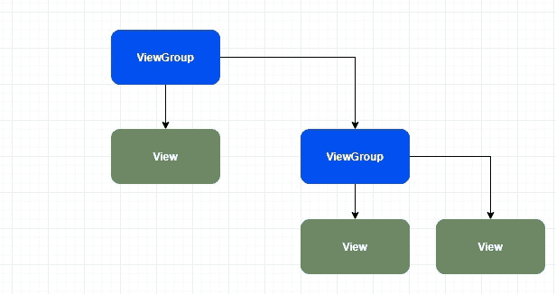
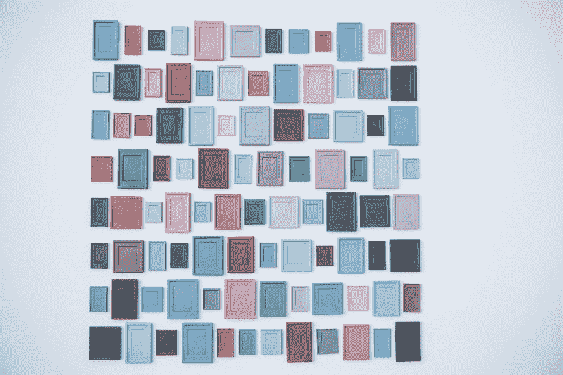
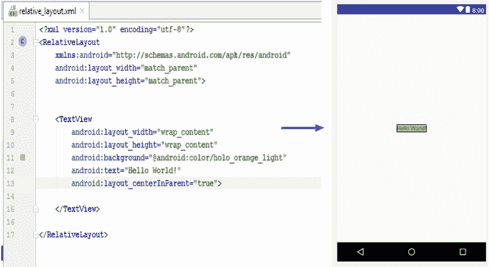
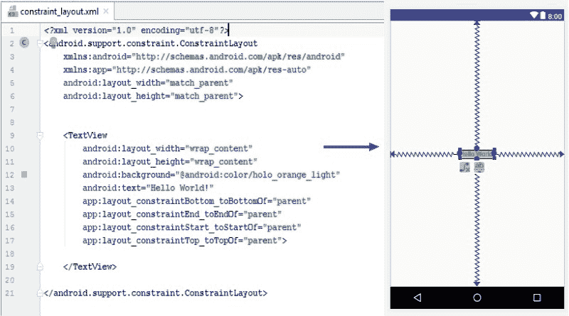
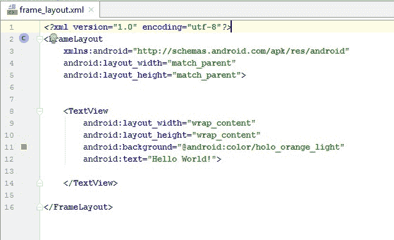
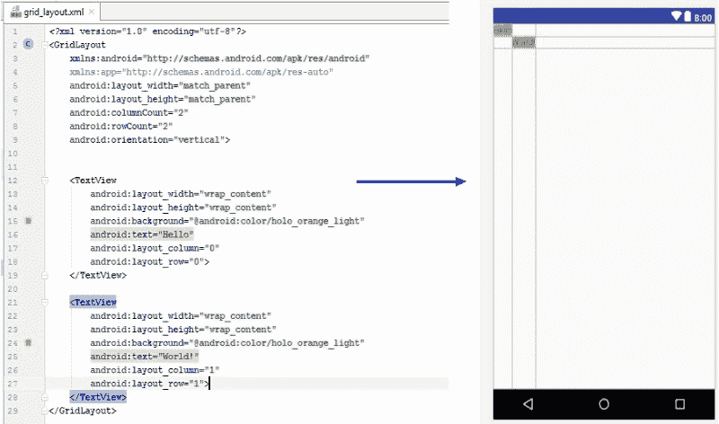
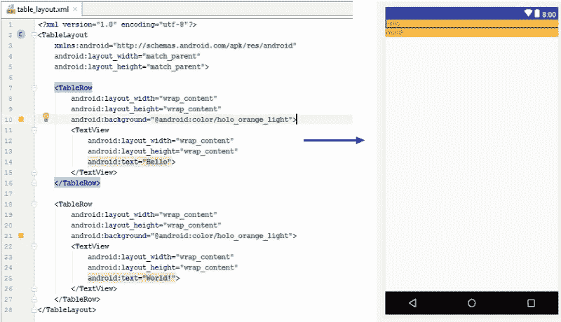

# 如何理解众多 Android 布局

> 原文：<https://www.freecodecamp.org/news/how-to-make-sense-of-the-many-android-layouts-693b262706e0/>

线性、相对、约束、表格、框架等等。当你想设计你的应用程序时，Android 应用程序有一大堆布局可供选择。问题是，哪一个是最好的？

在我们详细介绍不同的布局之前，我们将首先回顾一下视图对象的层次结构和 Android 的绘制过程。

### 视图和视图组

将 ViewGroup 视为任何视图的父类，也是布局的基类。它表示一个对象，该对象是其他视图的容器。例如， **LinearLayout** 是一个**视图组**，因为它也可以包含视图和其他布局。

另一方面，视图是 UI 元素的基本构建块。视图可以是视图组的一部分。例如，**文本视图**就是**视图**。



A hierarchy of ViewGroup and View

### 测量->布局->绘制->重复

布局在 Android 中保存为 [XML](https://whatis.techtarget.com/fileformat/XML-eXtensible-markup-language) 文件。但是它们是如何转换成我们在屏幕上看到的物体的呢？每个 XML 文件都被实例化(读取:膨胀),并形成一个视图层次结构树。这意味着，如果布局 B 嵌套在布局 A 中，它们将具有子-父关系(布局 A 是布局 B 的父)。一旦树形成，有 3 个阶段将发生:测量，布局和绘图。这些阶段中的每一个都以[深度优先搜索](https://en.wikipedia.org/wiki/Depth-first_search)的顺序遍历树。

#### 措施

在第一阶段，每个父节点找出其子节点在大小方面的某些限制。它将这些限制向下传递给它的孩子，每个孩子将评估自己的大小(它想要多大)，并考虑它已经被赋予的限制和它的孩子的限制。

#### 布局

这里，每个节点将决定每个子节点在屏幕上的最终大小和位置。

#### 画

从绘制自己的根节点开始，它告诉它的子节点绘制自己。在这种方式下，将会绘制一个父节点，并在其上绘制它的子节点。

> 记住上面的过程，你应该试着让你的应用程序的布局尽可能的浅，以减少遍历视图层次结构的时间



“assorted-color photo frame lot” by [Markus Spiske](https://unsplash.com/@markusspiske?utm_source=medium&utm_medium=referral) on [Unsplash](https://unsplash.com?utm_source=medium&utm_medium=referral)

### 布局细分

#### 线性的

以垂直或水平方向将其子级组织成一行。也就是说，视图要么都在一行中，要么都在一列中。您可以使用 **android:orientation** 属性来指定方向。

线性布局的一个有趣特性是 **layout_weight** 属性。这用于告诉线性布局如何划分子视图之间的空间。当您希望设备和方向之间的布局保持一致时，这很有用。

```
<?xml version="1.0" encoding="utf-8"?>
<LinearLayout xmlns:android="http://schemas.android.com/apk/res/android"
    xmlns:app="http://schemas.android.com/apk/res-auto"
    xmlns:tools="http://schemas.android.com/tools"
    android:layout_width="match_parent"
    android:layout_height="match_parent"
    tools:context=".MainActivity">

    <TextView
        android:layout_width="wrap_content"
        android:layout_height="wrap_content"
        android:text="Hello"
        />

    <TextView
        android:layout_width="wrap_content"
        android:layout_height="wrap_content"
        android:text="World!"
        />

</LinearLayout>
```

A simple linear layout

假设您希望包含单词 *Hello，*的第一个 TextView 总是占据屏幕宽度的 3/4。为此，我们可以使用 layout_weight 属性。

```
<?xml version="1.0" encoding="utf-8"?>
<LinearLayout xmlns:android="http://schemas.android.com/apk/res/android"
    xmlns:app="http://schemas.android.com/apk/res-auto"
    xmlns:tools="http://schemas.android.com/tools"
    android:layout_width="match_parent"
    android:layout_height="match_parent"
    android:layout_weight="4"        // <-- We added a total weight for our layout (4)
    tools:context=".MainActivity">

    <TextView
        android:layout_width="wrap_content"
        android:layout_height="wrap_content"
        android:layout_weight="3"   // <-- Will have a weight of 3 out of 4 (3/4)
        android:text="Hello" />

    <TextView
        android:layout_width="wrap_content"
        android:layout_height="wrap_content"
        android:text="World!"
        android:layout_weight="1"   // <-- Will have a weight of 1 out of 4 (1/4)
        />

</LinearLayout>
```

layout_weight

#### 亲戚

顾名思义，这种布局将在相对位置设置其内部子视图。这可以保持布局层次结构平坦，没有嵌套的视图组。然而，与此同时，每个相对布局必须经过两次测量过程，这可能会影响性能。

RelativeLayout 的一个有用特性是能够通过使用 **centerInParent** 属性将子视图居中。



layout_centerInParent centers the TextView

#### 限制

一个*约束*是一个到约束所绑定的元素的连接或对齐。您可以为每个子视图定义相对于其他视图的各种约束。这使您能够用平面视图层次结构(没有嵌套视图组)构建复杂的布局。与 RelativeLayout 类似，这种布局也需要两次测量。



Notice the constraints on the TextView

#### 基本框架

此布局仅用于保存单个子视图，因此会阻止布局中的任何其他视图。布局本身将与其最大的子视图(可见或不可见)一样大，加上一些填充。

避免在一个 FrameLayout 中有几个子视图，因为很难避免子视图相互重叠。您可以通过将 **layout_gravity** 属性分配给每个子视图来控制这些子视图的位置。



#### 列表视图/网格视图

当您需要在屏幕上显示几个项目时使用(如在餐馆菜单中)。列表视图是用户可以滚动浏览的单列列表。您可以将网格视图视为包含多列的列表视图。

了解这些布局很重要的一点是，视图是动态的，是在运行时创建的。为了在运行时填充项目，您需要使用一个 [AdapterView](https://developer.android.com/reference/android/widget/AdapterView) 。



You can specify the location of each item in the layout using layout_column and layout_row

#### 表格布局

与网格视图非常相似，这种布局将其子元素排列成行和列。每个布局将包含几个 TableRow 对象，每个对象定义一行。



We have two TableRow elements

不要害怕尝试不同的布局，直到你找到最适合你的。请在下面的评论中告诉我哪个布局对你最有用，为什么。