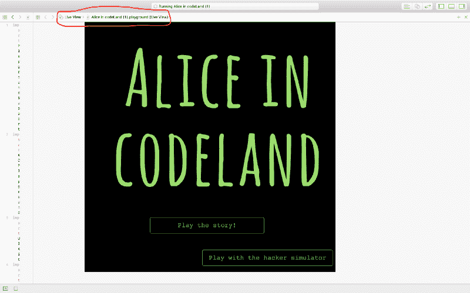
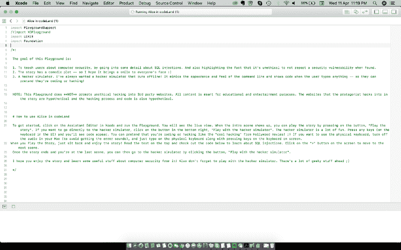
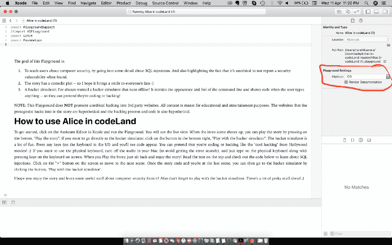

# 如何用 Swift Playgrounds 制作一些东西

> 原文：<https://www.freecodecamp.org/news/how-to-make-something-with-swift-playgrounds-33e560b84184/>

作者 Harshita Arora

# 如何用 Swift Playgrounds 制作一些东西


就在几天前，我完成了我的 [WWDC 2018 奖学金](https://developer.apple.com/wwdc/scholarships/)提交。在代码世界中创造[爱丽丝是如此有趣。这是我申请 WWDC 奖学金的第一年，我希望能被录取！](https://github.com/harshitaarora/Alice-in-codeLand)

《代码地》里的爱丽丝是三合一的。它是一个黑客/编码模拟器，看起来像可以离线玩的 Mac OS 终端。这也是一个有趣的故事，一个名叫爱丽丝的黑客在成功入侵 toothtube.com(牙膏评论的视频分享平台)和 macaroonsarethebest.com(像我一样的蛋白杏仁饼干爱好者的社交平台)后，试图未经授权访问苹果的 WWDC 门户网站。最后，它是 SQL 注入(一种黑客技术)的技术演示，让人们了解信息安全以及在发现网站是否存在漏洞后进行 SQL 注入的一步一步的过程。

自 2017 年以来，苹果公司向奖学金申请人提出了在 Swift Playgrounds 创造互动体验的挑战。

当我开始的时候，我很困惑。我以前从来没有在 Playgrounds 做过东西，因为我一直在做 Xcode 项目(让你创建真正的 iOS 应用程序)。当我开始学习 Swift 来学习和编写基本编程概念时，我只使用过 Playgrounds。我的在线课程的老师们正在使用它，但是那些课程只有两周，而且我从来没有在里面制作过任何图形或动画。

所以花了一些时间来熟悉操场。事后看来，如果我知道在哪里寻找正确的答案，以及如何开始使用它们，我可以节省一半的时间。

所以这篇文章是写给所有未来的 WWDC 奖学金申请者的，因为看起来苹果每年都会继续给奖学金分配这个任务。即使你和 WWDC 奖学金没有任何关系，我认为 Swift Playgrounds 是一个很棒的工具，可以快速构建和原型化一些东西。

注意:这篇文章假设你有 Swift 和像 UIKit 这样的 iOS 框架的背景。如果你以前开发过 iOS 应用，那将是一个巨大的奖励！

开始吧！

### 那么什么是 Swift Playgrounds，为什么要这么麻烦呢？

Swift Playgrounds 是苹果在 2014 年推出的一款 iPad 应用，可以帮助你学习用 Swift 编程。它也是 Xcode 中创建游乐场的工具。你可以在 iPad 上运行用 Xcode 创建的游乐场，反之亦然。

iPad 应用程序和 Xcode 工具的区别在于，在 iPad 上，您创建的游乐场可以访问摄像头、触摸屏等功能。但是在 Xcode 上经营游乐场的时候，你不能这么做。更多关于 Swift Playgrounds [的信息，请点击](https://developer.apple.com/swift-playgrounds/)。

虽然本文中的概念和示例使用 Xcode，但是也可以在 iPad 应用程序上创建和运行 Playgrounds。

### 一些需要学习的概念

#### 1.如何经营/玩游乐场，以及如何开始使用

你可以在这里下载开源游乐场[，在这里](https://github.com/wwdc/2017/)下载[，在这里](https://github.com/wwdc/2018/)下载[。为了播放它们，点击 Xcode 中的助手编辑器，并选择“实时视图”(如果没有自动选择的话)。](https://github.com/uraimo/Awesome-Swift-Playgrounds)

实时视图是显示代码输出或结果的地方。当您在代码中创建一些想要在实时视图中显示的对象时，您需要将 Playground 页面的实时视图属性分配给该对象。



Alice in codeLand’s Live View

现在，下面是将操场页面的实时视图属性分配给 UIView 对象的代码。您也可以分配一个类或一个视图控制器。

你必须为此导入框架 PlaygroundSupport，以及 UIKit。

```
let view = UIView(frame: CGRect(x: 0, y:0, width: 1024, height: 768)
```

```
PlaygroundPage.current.live = view 
```

在导航窗格中，您会看到有两个文件夹:Sources(用于所有辅助代码)和 Resources(用于所有图像和音频资源)。

根据我的经验，出于某种原因，从对象库中拖动 Swift 文件在 Playgrounds 中不起作用。相反，右键单击 Sources 文件夹并单击“新建文件”来创建一个新的 Swift 文件。

#### 2.如何创建视图？

游乐场没有故事板。您可以通过编程方式创建任意大小(最大 1024 x 768)的视图(UIView)。

我在上面的例子中创建了一个。

#### 3.什么是 PlaygroundSupport？

PlaygroundSupport 是一个框架，用于访问游乐场页面并管理其执行，管理实时视图，以及共享和访问持久数据。

基本上，您需要导入这个框架，以便能够将 playground 页面的实时视图属性分配给您创建的对象。

#### 4.用标记创建丰富的文档

Swift Playgrounds 允许你使用一种叫做标记的语言创建漂亮的文档(比普通的评论更容易阅读)。

富文档标记的基本语法如下:

1.  对单个注释使用“//: stuff”，如果你注意到的话，这意味着在//(用于常规注释)后面多加了一个“:”。
2.  多行注释使用“/*: stuff */”。
3.  在一行前面加上标签，例如“#stuff”来创建标题。
4.  将文本用星号括起来，例如，“*stuff*”以斜体显示。
5.  将文本放在两个星号内，例如，“**stuff**”以粗体显示。

在用语法写完内容之后，它就是原始的标记格式了。并以渲染标记格式(真正的富文档)显示它，进入编辑器，在“操场设置”下，选择“渲染文档”。



Example of raw markup format



Rendered documentation

在这里阅读更多关于标记的信息。

### 从建造一个简单的游乐场开始

好吧，让我们通过写一些代码来弄脏我们的手！让我们创造一个像 hackertyper.com 一样的黑客模拟器吧！:-D

让我们从创建黑客模拟器的背景开始。然后使用 [shouldChangeTextIn 方法](https://developer.apple.com/documentation/uikit/uitextviewdelegate/1618630-textview)，我们将把文本视图中显示的文本更改为来自一个数组的字符串，该数组包含我们希望在用户输入任何文本时显示的代码。这实质上创建了一个黑客模拟器，使代码在按下任何键后出现在屏幕上。

```
import PlaygroundSupportimport UIKit
```

```
let arrayOfStrings = ["Alices-MacBook-Pro:~ Alice$", "override func viewDidLoad() {", "super.viewDidLoad()", "makeBackgroundGradient()", "addGradientToPortfolio()", "addGradientToTopBar()", "addGradientToTopBar()", "setupPopup()", "addTradeButton.titleLabel?.minimumScaleFactor = 0.5;", "addTradeButton.titleLabel?.minimumScaleFactor = 0.5;"]
```

```
var variableThatChanges : Int = 0
```

```
let frameOfMainView = CGRect(x: 0, y: 0, width: 1024, height: 768)
```

```
class MainViewController: UIViewController, UITextViewDelegate {
```

```
override func viewDidLoad() {
```

```
let view = UITextView(frame: CGRect(x: 0, y:0, width: 1024, height: 768))
```

```
self.view.frame = frameOfMainViewview.backgroundColor = .blackview.textColor = .greenview.font = UIFont(name: "Courier", size: 20)view.isEditable = trueview.delegate = self self.view.addSubview(view)
```

```
} 
```

```
func textView(_ textView: UITextView,
```

```
shouldChangeTextIn range: NSRange,
```

```
replacementText text: String) -> Bool {
```

```
if variableThatChanges == (arrayOfStrings.count - 1)
```

```
{
```

```
variableThatChanges = 0
```

```
}
```

```
let text = textView.text ?? ""
```

```
textView.text = text + "\n" + arrayOfStrings[variableThatChanges]
```

```
variableThatChanges += 1
```

```
return false
```

```
}
```

```
}
```

```
let master = MainViewController()
```

```
master.preferredContentSize = frameOfMainView.size
```

```
PlaygroundPage.current.liveView = master
```

下面是上面的代码。把它复制粘贴到操场上。运行实时视图，你会看到一个黑色的背景。单击背景上的任何地方，您将看到 UI 中弹出一个键盘。按下上面的任何键，它就会显示字符串中的代码。

这就对了——您已经用不到 50 行代码制作了一个基本的黑客模拟器！现在轮到你去发挥游乐场的创造力了！；)

### 一些很棒的资源，请查看以了解更多

1.  [苹果文档](https://developer.apple.com/swift/resources/)。
2.  WWDC 会议视频。依次检查出[这个](https://developer.apple.com/videos/play/wwdc2014/408/)、[这个](https://developer.apple.com/videos/play/wwdc2015/405/)、[这个](https://developer.apple.com/videos/play/wwdc2016/408/)、[这个](https://developer.apple.com/videos/play/wwdc2017/408/)。
3.  [RWDevCon 2017 上的深度游乐场。](https://videos.raywenderlich.com/courses/81-rwdevcon-2017-vault-tutorials/lessons/16?_ga=2.88303579.1903739137.1521645549-332591240.1521522583)
4.  [卡西一家的视频](https://youtu.be/rL9A0LeGxFg)
5.  [代码 tutsplus 教程](https://code.tutsplus.com/tutorials/rapid-interactive-prototyping-with-xcode-playgrounds--cms-26637)
6.  [WWDC 2017 年](http://github.com/wwdc/2017/)和 [WWDC 2018 年](https://github.com/wwdc/2018)提交。此外，[令人敬畏的 Swift 游乐场](https://github.com/uraimo/Awesome-Swift-Playgrounds)可供查看并从中获得灵感。
7.  一本巨著中的一个小章节。

暂时就这样吧！在[媒体](https://medium.com/@harshitaisanerd)或[推特](https://twitter.com/aroraharshita33.)上关注我。下载[我创作的一个 app](https://apple.co/2DUzTqa) ！看看我推荐的一家[很棒的创业公司](https://www.producthunt.com/posts/cryptoshirt-by-woppal)！:)