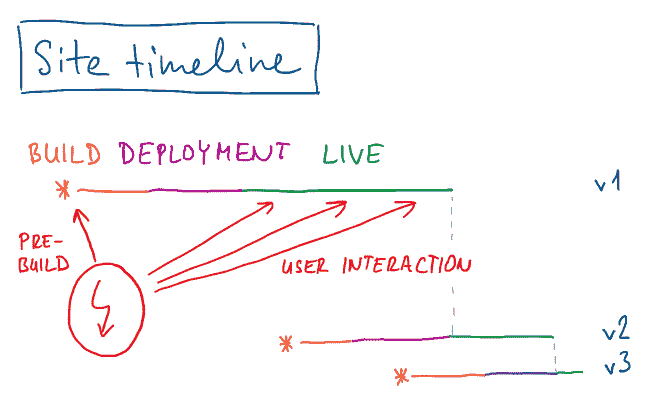
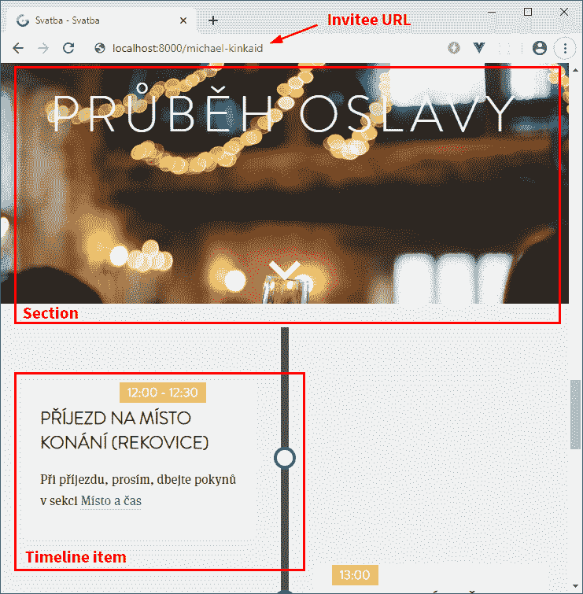
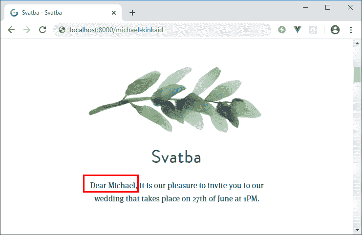
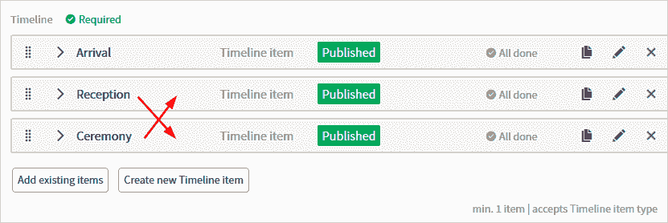
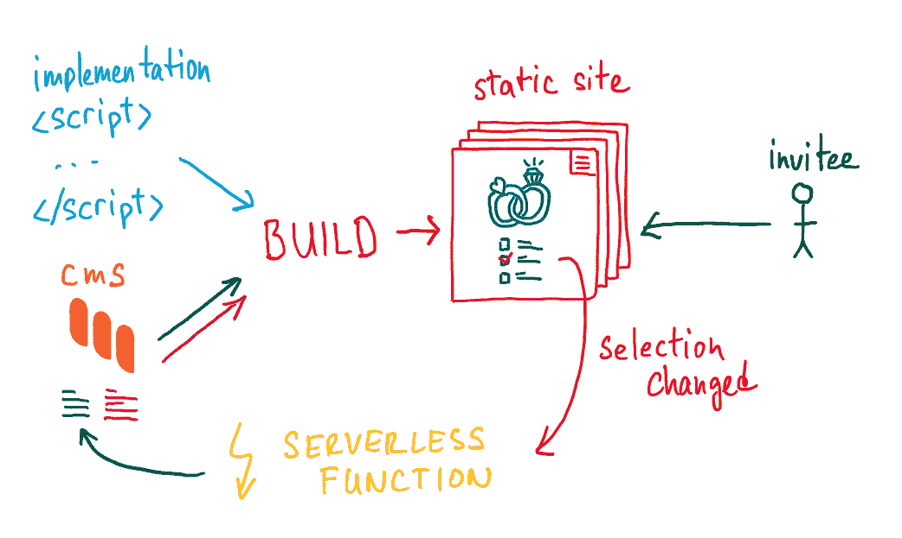
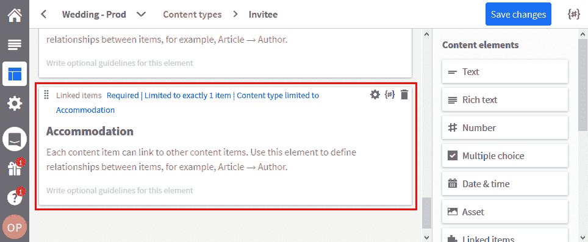
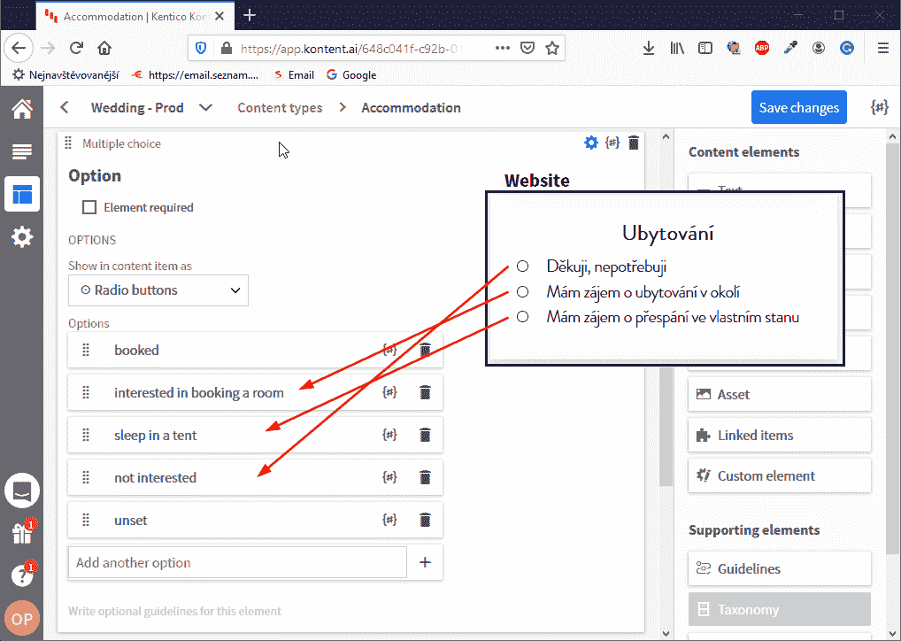
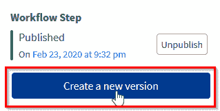
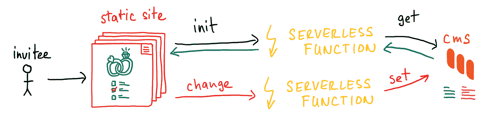

# 如何让你的静态网站变得动态

> 原文：<https://www.freecodecamp.org/news/how-to-make-static-site-dynamic/>

静态网站似乎很适合小型稳定的项目，对吗？就像不需要任何高级功能或与用户交互的那种。但是，如何在利用性能优势的同时，保持静态站点的动态性、个性化和交互性呢？

每当我向还没有使用过静态站点生成器的开发人员提到“静态站点”时，他们都会皱眉。如果你决定使用静态站点生成器(如 Gatsby 或 Gridsome ),这个术语对我不利，并不能真正描述你会得到什么。

因此，我向他们解释它是如何工作的，包括当内容或实现改变时自动重建。他们总是有相同的评论:

> “这很好，但预先生成网站不适用于电子商务或个性化等动态场景。因此，它只对小项目有好处。”

这不是真的。我会告诉你为什么。



有两种方法可以将静态站点变为动态站点:

*   现场预渲染期间
*   通过网站上的用户交互

我应该用一个真实的网站来解释这个。最近，我一直面临着创建一个婚礼网站的任务。我知道，有成千上万的简单模板。但是在 IT 行业工作，人们含蓄地期望网站是最先进的。所以我屈服了。我会给他们看的。

对于实现部分，我决定使用 Gridsome 静态站点生成器，因为我更喜欢 Vue.js 来反应。我将使用一个[无头 CMS](http://bit.ly/38aGvfn) 来存储内容，并使用两个无服务器函数来处理用户交互。

*更喜欢视频？在 YouTube 上观看* [*抽动系列*](http://bit.ly/2TbMo7D) *。并且一定要* [*跟我上 Twitch*](https://twitch.tv/ondrabus) *来捕捉所有即将到来的流。*

## 站点预渲染期间的动态内容

在我建立网站之前，我把所有我知道的信息收集在一起。我知道我想邀请谁。我知道事情发生的时间，也知道我要和谁结婚。就像你知道你想在你的网站上卖什么产品或者提供什么服务一样。

考虑到这一点，我为自己的网站创建了一系列内容模型:

*   被邀请者
*   住处
*   部分
*   时间线项目

这是它们在实际网站设计中的样子:



因为我知道所有被邀请者，所以我使用 headless CMS 的内容(自动)为每个被邀请者生成一个单独的页面(查看图片上的自定义 URL 标签)。因此，在构建时，组件知道被邀请者的上下文。想象一下个性化的可能性——我甚至可以为一些我最不喜欢的亲戚返回 404。

我实际上用它来显示个性化的问候和相关的时间轴项目。



如果您正在构建一个电子商务网站，您可以实现一个显示相似产品列表的产品页面。你也可以链接到你公司提供的与产品相关的服务。您知道构建时所有必要的细节。

### 内容建模是预构建网站的关键

我为我的网站确定了三种内容模型，但通常不止这些。处理内容建模的一个好方法是看看你未来网站的线框。这不仅仅是关于如何将数据放入 CMS，您需要考虑:

*   **内容将如何显示和消费？**
    以产品和类别为例。在大多数情况下，你会发现它们是一种 N:N 的关系，但是我在这里的目标是实现方面。想想对数据的查询会有多复杂。调整内容模型以更好地表示实际的站点结构可能对实现有很大帮助。
    在我的例子中，时间线项目从被邀请者(1:N)链接，这允许简单的实现，同时内容管理仍然是直接的。比如重新组织物品的顺序。



*   **该内容如何与其他内容项相关联？**
    产品、产品包、品类、特价或折扣之间有什么关系？这些问题的答案将帮助您选择正确的工具来连接内容项，如分类法或链接项。
*   如何创建内容？
    编辑们会理解你已经到位的内容的结构吗？此外，在大多数情况下，他们不能访问整个项目，只能访问与他们相关的部分。您的结构允许足够的权限粒度吗？你的内容模型是否有足够的限制性来避免在实时网站上遗漏内容的问题？

内容建模还有更多的内容。如果你感兴趣，可以看看由[迈克尔·金凯德](https://twitter.com/meandmyrobot)撰写的[这个关于内容建模的伟大系列](https://medium.com/@meandmyrobot/content-modelling-in-kentico-kontent-part-1-f820ad45d98a)。

## 动态组件

所以有了正确的内容模型，我们就可以生成静态站点。嗯，预生成可能是一个更好的标签。它的内容不是旧的和静态的——每一个内容的改变都会有效地重新构建网站。

但是如果我们需要和访客互动呢？有时，我们需要从他们那里获得一些信息，或者根据他们的行为向他们展示不同的内容。在这些情况下，我们可以使用动态组件。在网站构建期间，它们已经用值进行了预初始化，但是它们可以根据访问者的行为与后端系统保持交互。


在我的网站上，我有一个表格，受邀者可以用它来确认他们感兴趣的住宿类型。他们的选择需要存储回我最初在 headless CMS 中创建的同一个被邀请者内容项中。



我可以从网站上的组件直接与 CMS 通信。然而，我们在这里谈论的是客户端 JavaScript。暴露密钥将是一个主要的安全问题，尽管我不期望我的任何被邀请者理解什么是安全密钥或者它如何被滥用。因此，静态站点和 CMS 之间的中间人是一个无服务器的功能。

### 静态站点上的电抗组件

先说组件。我使用 Vue.js 和 Gridsome 作为 SSG，但是不管使用什么框架，动态组件的概念都是相同的。我在这里用过的无头 CMS 是[kon content](http://bit.ly/38aGvfn)。它有一个慷慨的免费层，但如果你喜欢开源(引用我的操作系统大学教授“除非我看到它的代码，否则我不信任它”)我听说 [Strapi](http://bit.ly/2POJ9Rk) 是一个不错的选择。

#### 组件实现

在构建时，组件将接收初始数据——我们在特定时间点知道的数据。如果迈克尔上周选择了其中一个选项，而我们今天正在重建网站，我们知道他的选择。

```
<RsvpAccommodation inviteeId="{GUID}" optionSelected="sleep_in_a_tent" howManyInvited="2" salutation="Michael" /> 
```

另一方面，如果他还没有与站点交互，那么选择将是空的。

```
<RsvpAccommodation inviteeId="{GUID}" optionSelected="" howManyInvited="2" salutation="Michael" /> 
```

该组件如下所示:

```
<template>
    ...
    <input type="radio" name="option" value="not_interested" id="none" v-model="option" />
    <label for="none">Děkuji, nepotřebuji</label>
    <input type="radio" name="option" value="interested_in_booking_a_room" id="hotel" v-model="option" />
    <label for="hotel">Mám zájem o ubytování v okolí</label>
    <input type="radio" name="option" value="sleep_in_a_tent" id="tent" v-model="option" /><label for="tent">Mám zájem o přespání ve vlastním stanu</label>
    ...
</template>
<script>
export default {
    props: {
        salutation: String,
        inviteeId: String,
        howManyInvited: Number,
	salutation: String,
        optionSelected: String
    },
    data: function(){
        option: this.optionSelected
    },
    ...
</script> 
```

Vue.js 正在监视使用的数据属性。当 Michael 更改他的选择时，data change 事件被触发。请注意，监视对象中属性的名称必须与数据属性的名称相匹配。

此时，我们需要存储他的选择——我们形成数据并向无服务器函数发出异步请求——所有这些都使用客户端 JS。

```
...
<script>
export default {
    ...
    watch: {
        option: function(newVal, oldVal) {
            let url = `{remote base URL}/action?id=${this.inviteeId}`;
            fetch(url, {
                method: 'POST',
                body: JSON.stringify({
                    option: this.option,
                })
            })
            .then(response => {
                if (response.status !== 200) {
                    alert("Unable to save, please try again.");
                }
            });
         }
    }
}
</script> 
```

### 无服务器功能实现

我使用 Netlify 来构建和部署无服务器功能。如果这是您的第一个 Netlify 函数，请随意看看我的介绍视频，在那里我展示了如何设置本地 Netlify 开发环境。

无头 CMS 有两个 API。一个用于数据交付——我用这个来获取站点构建期间的所有数据——另一个用于数据管理。在无服务器函数中，我需要使用这两个 API，所以我将项目 ID 和管理 API 键添加到。Netlify functions 项目根目录下的 env 文件:

```
KONTENT_PROJECT_ID={project ID}
KONTENT_CM_KEY={management API key} 
```

使用 SDK 总比纠结于简单的 REST API 调用要好:

```
npm i @dotenv --save
npm i @kentico/kontent-delivery --save
npm i @kentico/kontent-management --save 
```

函数的开头看起来像这样:

```
require("dotenv").config();
const KontentDelivery = require('@kentico/kontent-delivery')
const KontentManagement = require('@kentico/kontent-management') 
```

这个函数或多或少是公开的——它的 URL 以纯文本形式存储在客户端 JS 代码中——所以我们首先需要做一些基本的检查。对该函数的每个请求都需要在 querystring 中包含一个 ID 参数，该参数保存现有被邀请者的标识符。这是填表的人。如果 ID 丢失或无效，我们返回 404。

```
exports.handler = async (event, context, callback) => {
  const { KONTENT_PROJECT_ID, KONTENT_CM_KEY } = process.env;
  const deliveryClient = new KontentDelivery.DeliveryClient({ projectId: KONTENT_PROJECT_ID });
  let id = event.queryStringParameters.id;
  const invitee = await deliveryClient.items()
                    .type('invitee')
                    .elementsParameter(['accommodation'])
                    .equalsFilter('system.id', id)
                    .toPromise();
  if (invitee.items == null || invitee.items.length == 0)
  {
    return {
      statusCode: 404,
      body: `Invitee not found`
    };
} 
```

deliveryClient 请求仅限于单个元素- `accommodation`。这是因为表单中的信息不是存储在*被邀请者*模型中，而是存储在*住宿*类型的链接项中。



内容模型容纳直接对应于网站上的形式:



我们希望将从客户端 JS 获得的数据存储为新记录。更新现有的内容项也是一种可能，但是如果被邀请者将来改变了他们的选择，我们将丢失所有的历史记录。

首先，我们记下现有的*住宿*内容项的 ID，并初始化内容管理客户端。

```
let accommodationId = invitee.items[0].accommodation.value[0].system.id;
const client = new KontentManagement.ManagementClient({ projectId: KONTENT_PROJECT_ID, apiKey: KONTENT_CM_KEY }); 
```

然后，我们需要为 *Accommodation* 内容项创建一个新的语言变体。即使项目中只有一种语言，内容也存储在标有该语言代码名称的单独存储桶中。如果您将来决定添加其他语言，这可以确保平稳过渡。

```
await client.createNewVersionOfLanguageVariant()
      .byItemId(accommodationId)
      .byLanguageCodename('default')
      .toPromise(); 
```

这段代码做的事情与您在 UI 中单击“创建新版本”是一样的。



接下来，我们需要用数据填充变量。数据以 JSON 的形式出现在请求体中。

```
let accommodation = JSON.parse(event.body);
await client.upsertLanguageVariant()
    .byItemId(accommodationId)
    .byLanguageCodename('default')
    .withElements([{
        element: { codename: 'option' },
        value: [{ codename: accommodation.option }]
     }])
    .toPromise(); 
```

最后一步是发布新的变体:

```
await client.publishOrScheduleLanguageVariant()
    .byItemId(accommodationId)
    .byLanguageCodename('default')
    .withData()
    .toPromise();
return { statusCode: 200, body: `OK` } 
```

#### CORS 与 Netlify 的问题

即使您在本地运行函数和静态站点，您也会遇到 CORS 问题，因为这两个实现都是从不同的端口提供服务的。对于来自无服务器功能的所有响应，您需要返回“Access-Control-Allow-Origin”头。

Netlify 有一个简单的方法可以通过 functions 项目根目录下的`netlify.toml`配置文件来全局处理这个问题:

```
[build]
  Functions = "lambda"
[[headers]]
  for = "/*"
  [headers.values]
    Access-Control-Allow-Origin = "*" 
```

#### 页面刷新后的旧数据

现在组件对访问者的动作做出反应。但是，初始状态(如果访问者刷新页面，也会显示)仍然来自静态站点构建。如果访问者更改了他或她的选择，更改会保存在 CMS 中，但网站不会重建。

在每次用户交互后重建整个网站是没有效率的。即使我们这样做了，也需要几秒到几分钟的时间来完成构建和部署。

相反，我们在组件第一次呈现时进行异步请求:

```
<script>
...
    mounted: function () {
        let url = `${baseUrl}/delivery?id=${this.inviteeId}`;
        let response = fetch(`{remote base URL}/delivery?id=${this.inviteeId}`, { method: 'GET', mode: 'cors' })
            .then(response => response.json())
            .then(accommodationObj => {
                this.option = accommodationObj.option;
            });
    },
...
</script> 
```

该组件将在站点预构建期间用数据进行预初始化。但是一旦组件被创建，它将使用另一个无服务器功能从 CMS 获取新数据。该函数与前一个函数非常相似:

```
exports.handler = async (event, context, callback) => {
  const { KONTENT_PROJECT_ID } = process.env;
  let id = event.queryStringParameters.id;
  const deliveryClient = new KontentDelivery.DeliveryClient({ projectId: KONTENT_PROJECT_ID });
  const invitee = await deliveryClient.items()
                    .queryConfig({ waitForLoadingNewContent: true })
                    .type('invitee')
                    .elementsParameter(['accommodation', 'option'])
                    .equalsFilter('system.id', id)
                    .toPromise();
  if (invitee.items == null || invitee.items[0] == null)
  {
    return {
      statusCode: 404,
      body: `Invitee not found`
    };
  }
  return {
	statusCode: 200,
	body: JSON.stringify({
		option: invitee.items[0].accommodation.value[0].codename
	})
  };
}; 
```

在这种情况下，我们需要添加额外的配置到数据查询- `waitForLoadingNewContent`。来自 headless CMS 的内容是通过 CDN 缓存和交付的，因此如果它在过去几分钟内被更改，我们可能会收到过时的内容。配置选项确保响应将始终包含新数据。

因此，静态站点上动态组件的整个过程如下所示:



## 它快速且互动

你看，静态网站带来的最大好处是，在构建时所有可用的信息都可以作为静态文件，使用 CDN 可以快速轻松地扩展。

但是它们也可以提供动态功能，这种功能可以通过无服务器功能来实现——同样便宜且易于扩展。

如果你以我的网站为例——我不需要将整个应用程序部署到云中，我只需要托管一堆小的静态文件和两个小的无服务器功能。我还能够独立扩展这些功能。

静态网站可能不是 web 开发的最终选择，但对于许多项目来说，它带来了清晰性、性能和安全性方面的好处，并降低了维护成本。你的体验是什么？让我知道。

一定要看看我关于网络开发的 [Twitch streams](http://bit.ly/3akWp8l) 和 [YouTube 频道](http://bit.ly/2TbMo7D)。