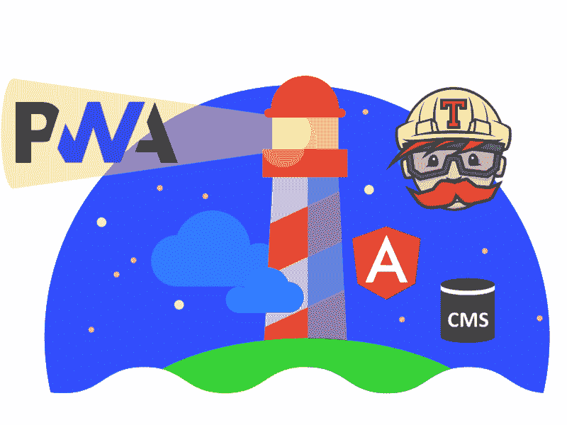
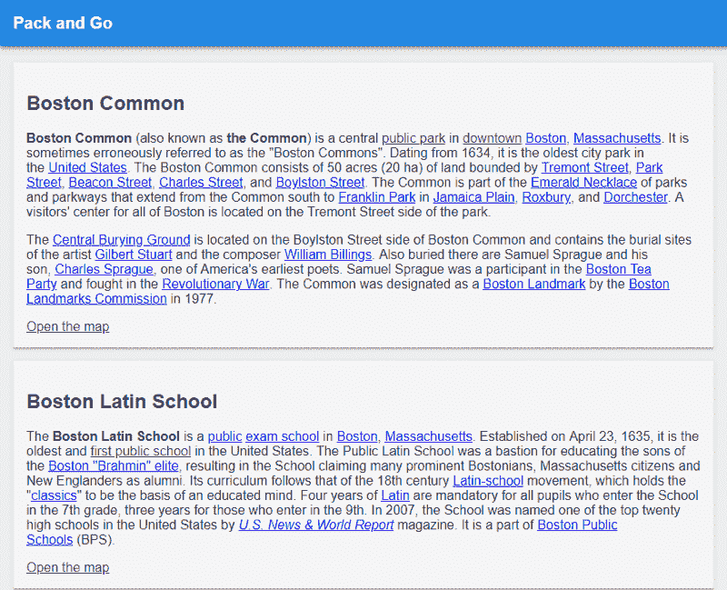
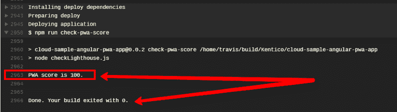

# 如何确保你的渐进式网络应用保持其灯塔审计分数

> 原文：<https://www.freecodecamp.org/news/how-to-make-sure-your-progressive-web-app-keeps-its-lighthouse-audit-score-4c11cf514e1a/>

by Ondrej Chrastina

# 如何确保你的渐进式网络应用保持其灯塔审计分数



我敢打赌，你们大多数人以前都实现过 web 应用程序。你们中的一些人甚至可能已经创建了一个[渐进式网络应用](http://bit.ly/create-pwa-with-angular-from-lighthouse) (PWA)，它可以作为安装在设备中的本地应用。你可能已经遵循了[我的建议](http://bit.ly/tune-pwa-score-from-lighthouse-ci)，通过 Lighthouse 审计工具使你的应用程序完全符合规定的 PWA 规则和惯例。

现在，每当您的一些同事更新代码库时，运行审计不是很好吗？意外时有发生，即使你和你的同事努力争取 100%符合 PWA，在每次构建后立即得到早期警告总是很好的。

在下面的文章中，我将描述如何通过将 [Lighthouse](https://github.com/GoogleChrome/lighthouse) PWA 审计嵌入到您的持续集成管道中来自动检查合规性。

我将从我上一篇文章中的[处开始(也就是说，使用示例旅游应用程序列出有趣的旅游景点)。该应用程序将其数据存储在](http://bit.ly/tune-pwa-score-from-lighthouse-ci) [Kentico Cloud headless CMS](http://bit.ly/kc-home-lighthouse) 中，并且符合所有 [PWA 要求](https://developers.google.com/web/progressive-web-apps/checklist)。在每个实现步骤之后，我将提供一个到代码状态的 GitHub 链接，允许您一步一步地尝试更改，而无需自己编写代码。


[Initial state](https://github.com/Kentico/cloud-sample-angular-pwa-app/tree/8521c612e273fc91670a408488dc981ad7023895)



Sample Application

我会用[灯塔 npm 包](https://www.npmjs.com/package/lighthouse)。虽然 Lighthouse 可以直接从命令行使用，但它的编程形式更好，因为它可以正确地报告成功、失败和审计分数。

我主要做两件事。首先，我将展示如何使用 package from 命令行将带有审计结果的 JSON 字符串发送到我的控制台窗口中。然后我将展示如何在持续集成管道中使用 npm 包。

### 如何从命令行使用 Lighthouse 包

让我们从安装 Lighthouse 作为项目的开发依赖项开始。

```
npm install --save-dev lighthouse
```

对于部署，我使用的是 [Surge](https://surge.sh/) 服务。您只需在其网站上注册并安装 CLI 工具(在下面的示例中是全局安装)。然后，您可以将该文件夹部署到*.surge.sh 子域中。

```
npm install -g surge
```

*   例如，将“dist”文件夹部署到指定的 URL。这需要你登录或者用登录和令牌设置浪涌环境变量。

在您的`package.json`文件中，定义一个将部署您的应用程序的公共 URL，如下所示:

```
{..."config": {   "deployUrl": "https://your-own-subdomain.surge.sh"},...}
```

Lighthouse 将被配置为根据该 URL 执行审计。但是，为了做到这一点，它需要等待几秒钟，然后应用程序(或其新版本)才可以公开访问。

Surge 在发布你的应用时，有时会花些时间。因此，您应该使用 [npm-delay](https://www.npmjs.com/package/npm-delay) 包(或类似的东西)在执行审计之前等待两秒钟。让我们熬过去。将包安装到开发依赖项中。

```
npm install --save-dev npm-delay
```

安装完成后，使用 Surge 为您的 URL 定义用于部署的脚本命令。然后，定义“lighthouse”脚本命令，该命令将在生产模式下将应用程序构建到`dist`文件夹中，使用“deploy”命令，等待两秒钟(以确保应用程序的最新版本可以公开访问)，然后根据应用程序的 URL 运行 PWA 审计。

```
{..."scripts": {    ...    "deploy": "surge dist %npm_package_config_deployUrl%",    "lighthouse": "npm run build && npm run deploy && npm-delay 2000 && lighthouse --chrome-flags=\"--headless\" --quiet --output=json %npm_package_config_deployUrl%",    ...  }...}
```

**好了，让我们运行命令:**

```
npm run lighthouse
```

在控制台中，您将看到一个巨大的 JSON 字符串和审计结果。你要检查的是`reportingCategories`属性，它的内部部分(报表)名为“Progressive Web App”，其属性名为`score`。

```
{  ...  "reportCategories": [    ....    {      "name": "Progressive Web App",      ...      "id": "pwa",      "score": 100    }  ...  }
```


[Lighthouse check](https://github.com/Kentico/cloud-sample-angular-pwa-app/commit/16da5916da8c14cbe090ce38cef73a93c0d90b31)

### 将灯塔检查添加到持续集成管道中

要将 PWA 审计插入 CI 管道，我们可以使用 Lighthouse 的[编程方法](https://github.com/GoogleChrome/lighthouse/blob/master/docs/readme.md#using-programmatically)。首先，您需要定义 JavaScript 脚本来检查您的 PWA 分数。

该脚本使用在`package.json`文件中定义的 URL。在这个脚本中，有一个函数用于运行无头浏览器 T2，并在其上执行灯塔审计。审计完成后，脚本将等待两秒钟，以确保您的应用程序已部署且可访问。最后，该脚本从审计结果 JSON 字符串中选择值，并检查它是否满足定义的分数级别——在本例中为 100。否则，它返回退出代码 1，这将导致 [Travis CI](http://travis-ci.org) 构建失败。

```
const lighthouse = require('lighthouse');const chromeLauncher = require('chrome-launcher');const appConfig = require('./package');
```

```
const opts = {    chromeFlags: ['--headless']};
```

```
function launchChromeAndRunLighthouse(url, opts, config = null) {    return chromeLauncher.launch({ chromeFlags: opts.chromeFlags }).then(chrome => {        opts.port = chrome.port;        return lighthouse(url, opts, config).then(results => {            delete results.artifacts;            return chrome.kill().then(() => results);        });    });}
```

```
launchChromeAndRunLighthouse(appConfig.config.deployUrl, opts).then(results => {    setTimeout(() => {      if (results.reportCategories.filter((item) => item.id === "pwa").length) {        const score = results.reportCategories.filter((item) => item.id === "pwa")[0].score        if (score >= 100) {            console.info(`PWA score is 100.`);            process.exit(0);        }        console.error(`Score is lower than 100\. It is ${score}`);        process.exit(1);    }    console.error(`No PWA score provided by lighthouse.`);    process.exit(1);    }, 2000);    });
```

让我们在`package.json`文件中定义新脚本。

```
{...    "scripts": {    ...    "check-pwa-score": "node checkLighthouse.js"    ...    }...}
```

最终触发 Travis build 并**发布一个 100%兼容的 PWA** ！

我使用 yaml 文件进行 Travis 配置。基本上，您只需通过 GitHub 帐户登录到[这个服务](https://travis-ci.org/)，在 Travis UI 中打开 CI to repository，然后您只需将文件`.travis.yml`提交到您的存储库的根目录。

```
sudo: requireddist: trustylanguage: node_jsnode_js:- "stable"before_script:- npm installbefore_deploy:- npm run builddeploy:  provider: surge  project: ./dist/  domain: https://kentico-cloud-sample-angular-pwa-app.surge.sh   skip_cleanup: trueafter_deploy:- npm run check-pwa-score
```

正如您在底部看到的，有一个部署后操作来检查 PWA 审计分数。


[Add PWA audit to the CI pipeline](https://github.com/Kentico/cloud-sample-angular-pwa-app/commit/5e5a6999cb499345808ea5833f40a293c0b4632c)

瞧吧！您的构建管道现在会自动检查 PWA 审计分数。



从现在开始，如果你的任何同事损害了你的 PWA 应用程序的合规性，他们将立即受到 Travis 的警告。

### 最后的话

干得好！如果您遵循了这些步骤，那么您已经成功地添加了 Lighthouse npm 包，以便将 JSON 字符串和结果一起发送到控制台。

您还设置了自动发布您的应用程序，等待两秒钟，并使用 Headless Chrome 中的 Lighthouse 功能来检查您在 Travis CI 管道中的得分。

现在，你再也不用为你珍贵的应用程序失眠了！