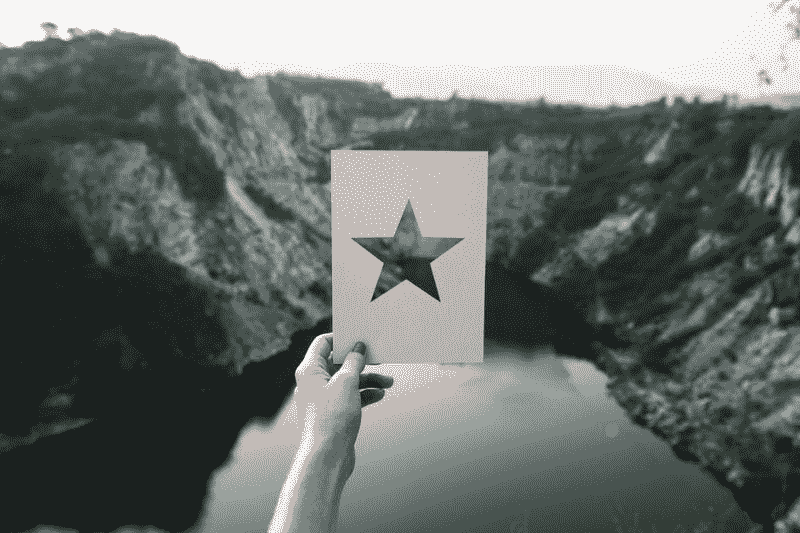

# 如何在 CSS 中用一点创意让不可能变成可能

> 原文：<https://www.freecodecamp.org/news/how-to-make-the-impossible-possible-in-css-with-a-little-creativity-bd96bb42b29d/>

法孔多·科拉迪尼

如果你曾经使用过 [CSS 兄弟选择器，](https://www.w3.org/TR/selectors-3/#adjacent-sibling-combinators)你知道只有两个。`+`兄弟组合子选择紧随其后的第一个匹配项，而`~`后续兄弟组合子匹配其后的所有匹配项。
但是没有办法选择之前发生的事情。无论是父选择器还是以前的兄弟选择器都不是一个东西。

我知道你想要，你知道我想要，但残酷的事实是，它们并不存在(很可能永远不会存在)。有一百万个关于为什么的帖子。甚至还有关于如何实施它们的建议。但是我们被困在 CSS 规则的单向处理中，这很可能是为了保护我们免受“缺乏专业知识”的困扰，使我们陷入回流甚至无限循环中。

幸运的是，正如大多数 CSS 限制一样，**我们可以伪造它**。

首先要考虑的是，为什么我们要以前的兄弟姐妹开始。我想到了两个案例:

1.  我们需要选择某个元素的所有兄弟元素，而`~`后续兄弟组合子只选择后面的元素。
2.  我们只需要选择之前的兄弟姐妹

### 1.选择所有同级

有时我们需要选择上一个和下一个兄弟姐妹。要做到这一点，我们实际上可以选择父母，并使用一些技巧。

例如，当我们将鼠标悬停在下面的结构中的任何一个上时，要选择其中的所有跨度，我们可以在父节点的鼠标悬停上使用子选择器。我们确保从父节点禁用`pointer-events`，并在子节点上重新设置它。因此，无论我们想要发生什么动作，都只会在我们进入子节点而不是父节点时触发。

如果你需要选择除了被悬停的之外的所有兄弟*，你可以结合前面的技术和`:not`选择器来排除它。*

一个典型的用例是菜单:

上面的代码将关闭所有`<`李>元素**元素**的不透明度，除了被悬停的那个。

此外，您可以使用诸如 type 和 nth 选择器之类的过滤器对您想要影响的同级进行额外的精确处理。

通过一些样式，它应该像这样工作:

**请注意**:如果您要运行`pointer-events:none`方法，请记住它会扰乱堆叠(可能允许您选择在堆叠顺序中“下面”的元素)。它在 IE10 及以下版本中也不起作用，除了暗示您可能需要指针事件来做其他事情。所以用的时候要格外小心。

### 2.选择之前出现的

对于这个用例，我们可以颠倒 HTML 上的顺序，然后在 CSS 中将其排序，并使用`~`后续兄弟组合符或`+`相邻兄弟选择器。这样，我们将选择下一个兄弟姐妹，但看起来像是我们在选择以前的兄弟姐妹。

有多种方法可以做到这一点。最简单也可能是最古老的方法是改变容器的书写方向:

如果您的元素需要显示实际的文本，您可以随时将其反转回来:

但这可能会在很多方面失去控制。幸运的是，现代 CSS 工具箱使它变得更加简单和安全。我们可以在容器上使用 Flexbox，并使用`flex-direction:row-reverse`反转顺序:

Flexbox 方法最好的一点是我们不会打乱书写方向。我们不需要重置孩子，一切都更容易预测。

### 使用“以前的兄弟姐妹”创建一个仅 CSS 星级系统

从语义上来说，评级系统可以被认为只是一个简单的单选按钮列表及其相应的标签。这很方便，因为它允许我们使用`:checked`伪选择器来修改兄弟节点。

所以让我们从这里开始:

正如我们前面所讨论的，元素的顺序是相反的，以支持“前一个兄弟”选择器。注意，我们使用 unicode“白星”字符(U+2606)来表示空星。

让我们按照正确(相反)的顺序并排展示它们:

现在隐藏单选按钮本身，没有人想看到:

并将一些样式应用于明星角色:

唯一真正重要的一行是`position:relative`。它将允许我们在它上面绝对定位一个填充的星形(U+2605)伪元素，它最初是隐藏的。

当我们悬停在一颗恒星上时，填充的恒星伪元素应该对它和所有*之前的*兄弟星可见。

通过匹配所有在选中单选按钮的之前*出现的标签，对所选评级也是如此:*

**记住**使用！重要的标志是**正好相反**的一个好做法。我在这里这样做是因为没有它就没有其他方法来实现下一节讨论的附加功能。

最后但同样重要的是，我们需要“记住”当前的评级，以防用户想要更改它。例如，如果他们选择了五颗星，并且出于某种原因想要将其更改为四颗星，那么我们应该将 1 到 4 颗星显示为已填充，当悬停在第四颗星上时，第五颗星显示为半透明。

这可以通过当鼠标悬停在容器上时改变选中输入的*前*兄弟的不透明度来实现:

这也是我们在最初的悬停声明中需要`opacity:1 !important`的原因。否则，这最后一条规则将赢得特异性竞赛，并对所有内容应用半透明填充。

这就是我们拥有的，一个跨浏览器，全功能的 CSS 星级系统，使用“以前的兄弟姐妹”选择器。

如你所见，“不可能”并不意味着你不应该尝试。编程就是挑战极限。所以每当你撞到墙的时候，只要稍微用力一点。或者我想找到你的方法可能是一个更好的类比？…不管怎样，你知道我的意思。继续黑！

### 关于可达性的一个注记

前面的片段是为了便于理解而进行的简化。这是**而不是**由于许多可访问性限制，我建议在生产中使用。

为了让代码片段更容易访问，首先要做的是用除了`display:none`之外的几乎任何技术隐藏单选按钮，使它们可聚焦。我们还应该通过伪选择器`:focus-within`在整个 stars 片段中添加一些焦点环，当其中的任何元素被聚焦时。

相同的“∞”标签对于屏幕阅读器来说毫无意义，所以最好的方法是在标签中有一个`<sp`和一个>的“n 颗星”文本，这对视力正常的用户来说是隐藏的。

此外，反向 HTML source + `display:row-reverse`方法使得键盘评级变得尴尬，因为它不会被反向。 [Flexbox 和键盘可访问性](https://tink.uk/flexbox-the-keyboard-navigation-disconnect/)是一个相当混乱的话题，但最接近解决这个问题的方法是给每个元素添加`aria-flowto`标签，这至少解决了一些屏幕阅读器+浏览器组合的问题。

对于一个更容易理解的片段(使用修改下一个兄弟姐妹看起来为空的替代技术，而不是试图评估前一个)，请检查 [Patrick Cole](https://www.freecodecamp.org/news/how-to-make-the-impossible-possible-in-css-with-a-little-creativity-bd96bb42b29d/undefined) 的，正如我们在下面的答案中讨论的。