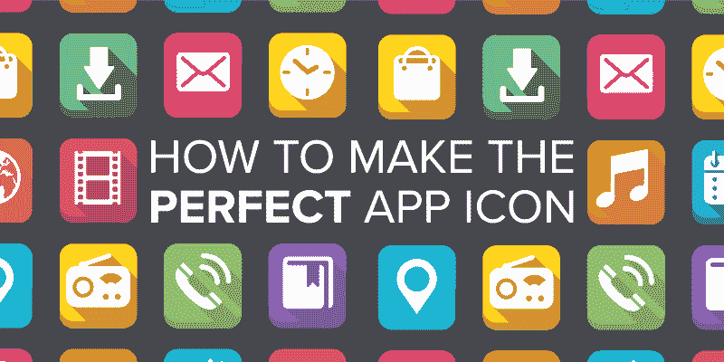
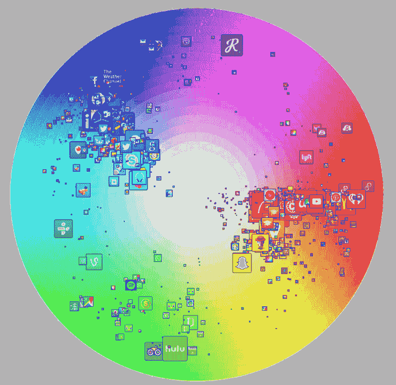
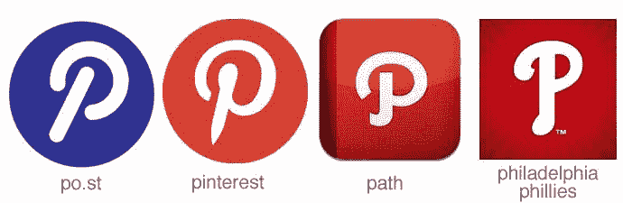
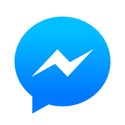
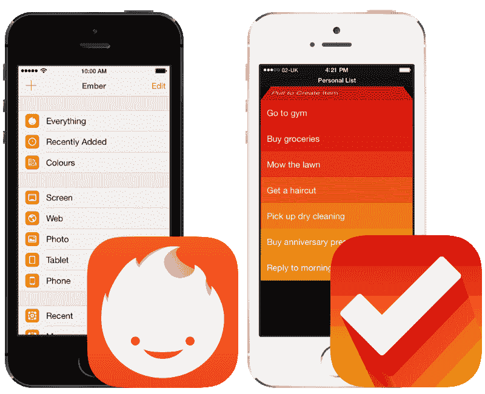
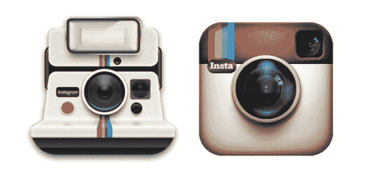
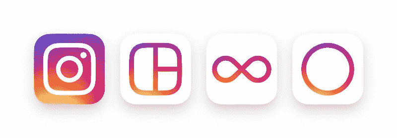

# 如何制作完美的 App 图标

> 原文：<https://www.freecodecamp.org/news/how-to-make-the-perfect-app-icon-f3a6f0d190e6/>

作者:Nabeena Mali

# 如何制作完美的 App 图标

iPhone 主屏幕的第一页上只有 24 个应用程序图标，如果你有一个漂亮的 iPhone 7，则有 28 个，创建完美的应用程序图标是用户采用的关键一步。

我曾经遇到过一个人，他的主屏幕上有一个包含字母表中每个字母的应用程序图标，但这种滑稽的美学并不适合每个人——对于一般的下载者来说，应用程序图标代表着用户与新应用程序的第一次接触。所以需要是好的！

如果你的应用程序图标难看，用户要么删除应用程序，要么把它藏在某个文件夹里，他们可能会忘记它。不幸的是，这是外表非常重要的一个领域。那么，你能做些什么来确保你的应用程序的图标是返校节女王，而不是邻家的害羞女孩呢？

### 坚持流行的颜色

有各种各样的文章致力于为你的应用图标选择颜色背后的科学。一个乐于助人的人甚至为应用程序图标创建了如下最受欢迎的颜色图:

Source: [GraphicMac](http://www.thegraphicmac.com/red-green-blue-the-colors-of-app-icons)

这意味着两个方面:在你的应用程序图标上主要使用红色、蓝色或者绿色是一个相当安全的方法。另一方面，你可以选择粉色、紫色或黄色，让自己更加突出。

显然，这些路线各有利弊。安全和熟悉的东西也有被遗忘的风险，而打破模式会带来看起来太不同以及不能与其他应用很好融合的风险。

### 使用一个字母(或者不要…)

Source: [PXLR](http://pxlr.com/blog/2012/03/16/logo-showdown-part-1-path-pinterest-post-and-phillies-letter-p-and-branding)

从脸书的“F”和 Hotels.com 的“H”到 Dailymotion 的“D”和 Skype 的“S”，市面上不乏在应用图标中使用公司名称首字母的应用。

虽然这无疑是一个聪明而直接的举措，但如果你的应用程序的名称以一个非常流行的字母开头，也不是没有风险。

想想已经存在的应用程序，特别是如果你将与它们直接竞争，如果你担心混淆或过于相似，就走不同的路线。

也许，鉴于 Skype 长期以来与云中的字母“S”联系在一起，这就是促使 Skyscanner 为他们的应用程序图标想出这个简洁的抽象符号的原因。

使用字母是一个非常安全的选择，尤其是如果你的应用程序标志有一个与众不同的字体。

以独特的脸书“f”为例，由于公司标志与 Klavika Bold 字体的修改版本不断关联，它可以立即被识别出来。

但作为一家公司，似乎连脸书都无法决定字母还是符号最适合作为应用程序图标。否则，为什么他们在为 Messenger 设计一个图标而不是在一个语音泡泡中使用一个“m”时，会引导他们内心的哈利波特呢？

### 使用一致的配色方案

如果有什么比丑陋的应用程序图标更糟糕的话，那就是一个漂亮的应用程序图标，打开后会显示出一个没有吸引力或看起来过时的应用程序。第一印象很重要，但是，如果你不能达到他们设定的高标准，无论如何你都会失败。

向 Dan Counsell 致敬，他给出了以下例子，说明 Ember 和 Clear 如何从打开应用程序到实际使用应用程序，始终保持一致的体验:

Source: [Dan Counsell](https://www.dancounsell.com/why-you-need-a-great-app-icon/)

但这并不是说一切都必须完全一样。

以“与朋友的话”为例，它分别在情人节和圣帕特里克节的应用图标上添加了心形和三叶草。当然，这是一个保持相关性的好方法……只要用户能及时更新他们的应用程序。

然后是他们的教育产品:

### 反映你的应用的目的

你还记得 Instagram 什么时候换了他们的图标吗？我知道，尤其是因为我被要求为《疯狂的蛋》写一些关于 T1 的东西。但是很多人都不知道 Instagram 还有另外一个应用图标，在他们把它改成大家都知道并且喜爱的棕色彩虹图标之前:

创始人给出了第一次更换 logo 的如下理由:“旧图标与 Instagram 无关。”有了这种想法，就很容易理解为什么 Instagram 决定把他们的标志套件改成这样了:

老式的棕色相机图标与怀旧有关，就像宝丽来照片的摆动所唤起的怀旧，与摄影的未来无关。而且，Instagram 上每天有 8000 万张照片被分享，不管你喜欢与否，这就是 Instagram。

### 结论

令人失望的是，但可以预见的是，创造完美的应用程序图标没有直接的途径。因此，有这么多不同外观的图标！

上面的建议很有用，但它们不是你可以用来设置手表的东西——例如，一个针对儿童或青少年的应用程序看起来与主要由商人或退休人员使用的应用程序非常不同。

当你试图寻找应用程序图标的灵感时，还有另一个好地方可以开始，它可能在你的口袋里或躺在你的桌子上。或者你正在阅读这篇文章。我说的是你的智能手机！

大多数创始人、应用程序创建者等。开发产品或应用来解决他们在生活中发现的问题。换句话说，你可能是你的目标市场的一个很好的代表。想想你觉得有吸引力的应用程序图标，或者至少愿意在你的主屏幕上腾出空间的图标，你就会走向应用程序图标的成功。

嘿，即使你最终创建了一个非常丑陋的应用程序图标，它也总是会在 Reddit 上引起恶名。

你可以在[appinstitute.com](https://appinstitute.com/app-icons/)上读到更多我的文章。