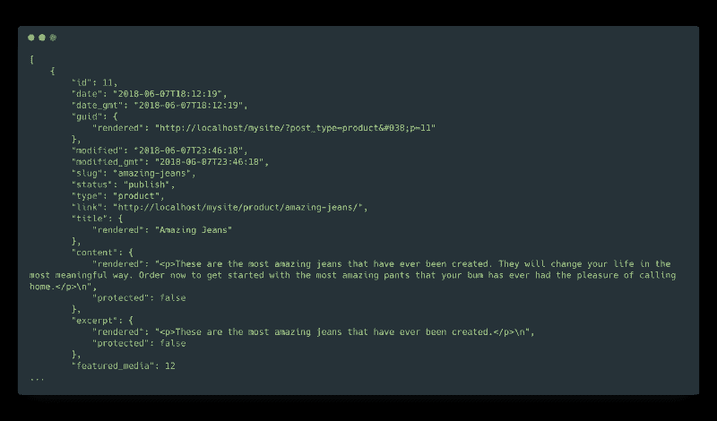
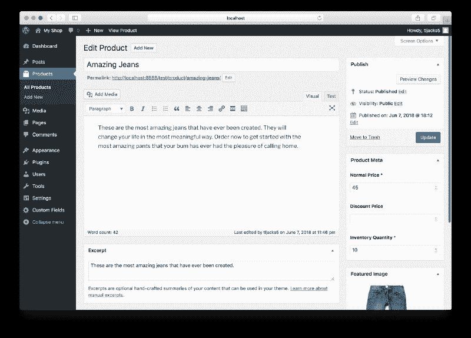
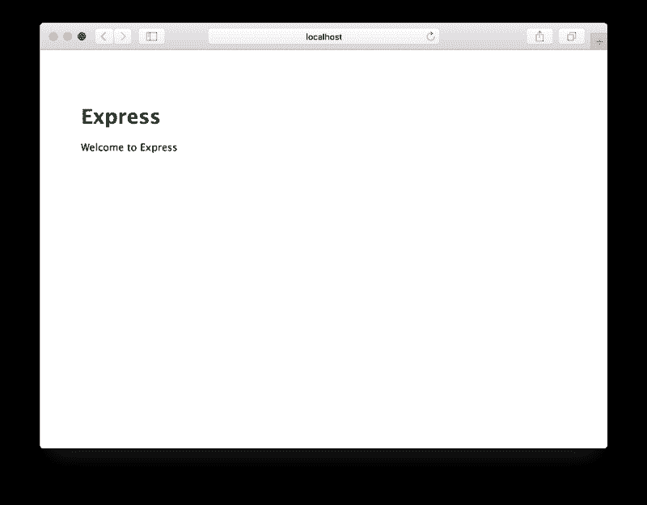

# 如何用 Wordpress API、ACF 和 Express.js 让 Wordpress 更令人兴奋

> 原文：<https://www.freecodecamp.org/news/how-to-make-wordpress-more-exciting-with-the-wordpress-api-acf-express-js-9dc33b8fb133/>

泰勒·杰克逊

# 如何用 Wordpress API、ACF 和 Express.js 让 Wordpress 更令人兴奋


自从 Wordpress 成为内容管理系统以来，我一直在使用它。当客户或同事再提起它时，我几乎不会感到兴奋。我在更健壮的框架中“发现了光明”,了解了更多关于定制 web 应用程序的不同部分。

因此，为了恢复我对 Wordpress 的热情，我开始寻找不同的方法来实现这个框架。其中一个方法是将前端和后端分开，避免一些使用 Wordpress 模板标签和主题系统的麻烦。让我们来看看。

### 单一应用与分布式应用

Wordpress 是一个整体框架，这意味着框架的不同部分(数据库、文件存储、表示结构和资产文件、业务逻辑文件)都打包在一起。这是 Wordpress 如此容易安装和运行的一个重要原因。安装 MAMP，复制最新的 Wordpress 文件，创建一个数据库，并更改`wp-config.php`文件。可以走了。

我们将打破单一的惯例，把这个 Wordpress 站点分成两个不同的部分:前端和后端，展示和管理。

我们将使用 Wordpress 对我们的应用程序进行数据管理，并利用一个插件来帮助创建和管理我们的自定义帖子类型的属性(字段)。对于表示方面，我们将完全放弃主题，从 Express.js 应用程序中使用 API 端点。

### 例子

在本例中，我们将构建一个简单的产品列表。这个想法是，你已经有了一个由 Wordpress 支持的网站，并希望通过相同的界面来管理销售产品的列表。但是你想为商店创建一个完全不同的网站。

### Wordpress API

从 4.7 版本开始，Wordpress 通过它的 [REST API](https://developer.wordpress.org/rest-api/) 自动公开你发布的文章(和其他数据)，以 JSON 格式呈现。如果你已经使用 Wordpress 4.7+开发了一个网站，只需在根 URL 上添加`/wp-json`，你会惊叹于返回的文本之墙。

有了这个自动集成到 Wordpress 安装中的 API，很多分布式应用程序的工作已经为我们完成了。当开始用这种新的方式思考应用程序时，API 创建可能是一个障碍。Wordpress 已经创建了一个奇妙的、基本的 API，可以用我们喜欢的任何方式使用我们的数据。

在这一点上，我只会通过写一篇关于如何在本地安装 Wordpress 的教程来扰乱互联网。因此，相反，我将[引导你找到主题](https://codex.wordpress.org/Installing_WordPress_Locally_on_Your_Mac_With_MAMP)的可靠来源。

无论你采取什么方法来启动并运行一个 Wordpress 实例，你都应该能够通过`http://localhost`或者其他 URL 来访问它。一旦我们有了一个 URL，让我们做一个快速测试，以确保我们有数据返回。我更喜欢像 Postman 这样的工具，但我们会保持简单，在浏览器中访问下面的 URL(当然，相应地更改 URL)。

`http://localhost/mysite/wp-json`

这将返回 Wordpress 安装的 REST API 的所有可用端点的列表。

但是说真的，邮差…

[**邮差**](https://www.getpostman.com/)
[*邮差是唯一完整的 API 开发环境，面向 API 开发者，被超过 500 万开发者使用……*www.getpostman.com](https://www.getpostman.com/)

### 自定义帖子类型

由于 Wordpress 限制我们使用两种数据类型(文章和页面),我们需要为我们的产品创建一个自定义的文章类型。这将创建一个明确的产品职位和我们有任何其他职位的分离。

有许多不同的方法来创建自定义文章类型。这里，我们将创建一个单独的文件 Wordpress 插件来注册产品文章类型。

```
<?php/*Plugin Name: Product Custom Post Type*/
```

```
function create_product_cpt() {  $labels = array(   'name' => __( 'Products', 'Post Type General Name', 'products' ),   'singular_name' => __( 'Product', 'Post Type Singular Name', 'products' ),   'menu_name' => __( 'Products', 'products' ),   'name_admin_bar' => __( 'Product', 'products' ),   'archives' => __( 'Product Archives', 'products' ),   'attributes' => __( 'Product Attributes', 'products' ),   'parent_item_colon' => __( 'Parent Product:', 'products' ),   'all_items' => __( 'All Products', 'products' ),   'add_new_item' => __( 'Add New Product', 'products' ),   'add_new' => __( 'Add New', 'products' ),   'new_item' => __( 'New Product', 'products' ),   'edit_item' => __( 'Edit Product', 'products' ),   'update_item' => __( 'Update Product', 'products' ),   'view_item' => __( 'View Product', 'products' ),   'view_items' => __( 'View Products', 'products' ),   'search_items' => __( 'Search Product', 'products' ),   'not_found' => __( 'Not found', 'products' ),   'not_found_in_trash' => __( 'Not found in Trash', 'products' ),   'featured_image' => __( 'Featured Image', 'products' ),   'set_featured_image' => __( 'Set featured image', 'products' ),   'remove_featured_image' => __( 'Remove featured image', 'products' ),   'use_featured_image' => __( 'Use as featured image', 'products' ),   'insert_into_item' => __( 'Insert into Product', 'products' ),   'uploaded_to_this_item' => __( 'Uploaded to this Product', 'products' ),   'items_list' => __( 'Products list', 'products' ),   'items_list_navigation' => __( 'Products list navigation', 'products' ),   'filter_items_list' => __( 'Filter Products list', 'products' ),  );
```

```
 $args = array(   'label' => __( 'Product', 'products' ),   'description' => __( '', 'products' ),   'labels' => $labels,   'menu_icon' => 'dashicons-products',   'supports' => array('title', 'editor', 'excerpt', 'thumbnail'),   'taxonomies' => array('products'),   'public' => true,   'show_ui' => true,   'show_in_menu' => true,   'menu_position' => 5,   'show_in_admin_bar' => true,   'show_in_nav_menus' => true,   'can_export' => true,   'has_archive' => true,   'hierarchical' => false,   'exclude_from_search' => false,   'show_in_rest' => true,   'rest_base' => 'products',   'publicly_queryable' => true,   'capability_type' => 'post',  );
```

```
 register_post_type( "product", $args );}%>
```

虽然冗长，但这是在 Wordpress 中创建自定义文章类型的标准代码。在我们的`$args`数组中需要注意两件事:

*   rue 使定制的文章类型可以通过 REST API 访问
*   ts '设置我们通过 REST API 端点访问产品时使用的名称

一旦你在 Wordpress admin 中显示了你的自定义文章类型，让我们确保我们可以通过 API 得到一个响应(你需要创建一个产品，这样它就不会返回空)。

`http://localhost/mysite/wp-json/wp/v2/products`

这是我们得到的结果…



太棒了。

### 高级自定义字段

我尽可能地限制插件的使用，但是我会为高级自定义域(ACF)破例。ACF 消除了为文章类型创建和管理定制字段的所有工作。进入你的插件页面，搜索高级自定义字段，然后点击“安装”和“激活”。完成了。

对我来说，通过使用高级定制字段来创建字段组也是多余的，所以[如果你不知道怎么做，我将让他们的文档来引导你。](https://www.advancedcustomfields.com/resources/creating-a-field-group/)

让我们创建一个名为“Product Meta”的字段组，添加“正常价格”、“折扣价”和“库存数量”字段，并将它们放置在侧栏区域。



很好。

现在到了棘手的部分。默认情况下，我们刚刚通过 ACF 创建的字段不会通过 REST API 公开。我们必须利用`add_filter` 和`rest_prepare_{$post_type}`将定制字段值添加到 JSON 响应中。这里，为了简洁起见，我只是将这段代码添加到了我们的自定义 post 类型插件文件的底部。

```
function my_rest_prepare_post($data, $post, $request) {  $_data = $data->data;    $fields = get_fields($post->ID);
```

```
 foreach ($fields as $key => $value){    $_data[$key] = get_field($key, $post->ID);  }
```

```
 $data->data = $_data;    return $data;}
```

```
add_filter("rest_prepare_product", 'my_rest_prepare_post', 10, 3);
```

*感谢[科迪·桑德](https://www.codysand.com/adding-advanced-custom-fields-to-wordpress-rest-api-response/)提供的上述花絮。*

### 快递. js

我们的 Express.js 应用程序将为我们提供一个使用 Wordpress API 和在商店网站展示产品的框架。因为我们只是在使用一个 API，所以我们可以使用我们选择的任何框架。Vue.js 棱角分明。骨气。做出反应。铁轨。姜戈。中间人。哲基尔。前端世界是你的牡蛎。

我假设您已经安装了 Node.js。如果没有，[那就死简单了](https://nodejs.org/en/download/)。让我们开始一个新的 Express.js 应用程序。

```
npm install -g express-generator nodemonexpress --css=sass --view=jade --git mystorecd mystorenpm install --save request request-promise && npm install
```

这里，我们使用 Express Generator 包为我们的 Express 应用程序生成一个框架。我们还将为样式表和 Jade 模板引擎使用 SASS。选择你觉得舒服的东西。当文件改变时，Nodemon 会自动为我们重启应用程序，请求库会帮助我们向 Wordpress API 发出 HTTP 请求。让我们提供我们的快速应用程序:

`nodemon`

现在，当我们拉起`http://localhost:3000` 时，我们应该看到我们的 Express 应用程序正在运行。



好的，现在让我们把产品拉进来。

```
var express = require('express');var router = express.Router();const rp = require('request-promise');
```

```
/* GET index page. */router.get('/', function(req, res, next) {  rp({uri: 'http://127.0.0.1:8888/test/wp-json/wp/v2/products', json: true})  .then((response) => {    console.log(response);    res.render('index', {products: response});  })  .catch((err) => {    console.log(err);  });});
```

```
module.exports = router;
```

在我们的`index.js`路由文件中，让我们包含请求-承诺库，然后调用根路由(`/`)中的`products`端点。

如果请求成功，那么我们呈现我们的`index`视图。如果请求有错误，我们只需记录它。现在，景色…

```
extends layout
```

```
block content h1 MyStore ul  each product in products   li    product.title.rendered    product.price
```

使用 Jade，我们将简单地列出产品。好吧，让我们来看看我们的商店网站。


？这是你的奖品。我将让您继续探索这条捷径，并弄清楚如何让产品列表和索引页面正常工作。

### 超出

这是一个相当简单的例子，说明分布式应用程序如何使用 Wordpress 工作。我们可以通过集成 CDN 进行媒体存储或将数据库转移到单独的服务器上，继续将应用程序分成更多部分。我们也没有讨论 Wordpress API 的认证，这是生产中绝对需要的。

从这里开始，您可以实现 Stripe 或另一个支付处理器，并拥有一个功能齐全的商店网站。我希望这能激励你们中的一些人以不同的方式使用 Wordpress，并继续使用最普遍的 CMS 解决方案之一。编码快乐！