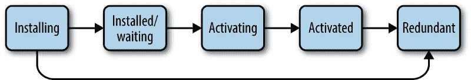

# 如何利用 JavaScript 的力量让你的应用程序离线工作

> 原文：<https://www.freecodecamp.org/news/how-to-make-your-app-work-offline-with-the-power-of-javascript-685d968bcfbb/>

在当今世界，连接使我们比以往任何时候都更加移动，这(矛盾地)导致我们有时会离线:当我们处于飞行模式时，有一个糟糕的连接，没有更多的数据，在地铁上…等等。

这种移动性的第二个影响是沉重网站的缓慢加载:亚马逊发现仅仅 100 毫秒的额外加载时间就花费了他们 1%的销售额。

在这些情况下，我们希望能够离线访问我们的内容。这就是为什么像 [Instapaper](https://www.instapaper.com) 和 [Pocket](https://getpocket.com) 这样的工具存在。 [Spotify](https://support.spotify.com/us/listen_everywhere/on_phone_tablet_desktop/listen-offline/) 和[网飞](https://techcrunch.com/2016/11/30/netflix-adds-offline-viewing-for-smartphones-and-tablets/)也允许你下载媒体供离线使用。

我们可以很容易地看到对这一功能的需求，以及它如何能使您的业务受益。

是时候让网络下线了。

幸运的是，我们不再需要构建本地应用来实现这个目标。多亏了新的**服务工作者**和**缓存 API** 特性，我们可以用 JavaScript 的力量创建一个离线网站。

### 什么是服务人员？

服务人员是在你的网站后台运行的 JavaScript 代码，即使当页面关闭时也是如此。对于离线使用，他们的目标之一是在浏览器缓存中存储网络请求或图像。

代理机构 BETC 为法国电信公司布伊格制作了一个名为[whentheinternetisdown.com](https://whentheinternetisdown.com/)的演示网站。它只能离线工作，感觉有点神奇。去试试吧:)

> 正是缓存让这个网站变得神奇:你可以在 3 周、1 个月、1 年后再次访问，仍然没有连接，并访问所有内容。—马克西姆·休伊格，BETC 数字工作室负责人

**好的，这很酷，那告诉我怎么做。**

好了，让我们从一些先决条件开始:

*   为了使用 SWs，您必须在您的网站上启用 https。
*   你应该对 [JavaScript promises](https://scotch.io/tutorials/javascript-promises-for-dummies) 的工作原理有很好的理解。
*   SWs 可以在所有现代浏览器中运行，除了我们的朋友 IE。
*   即使是 JavaScript，它们也是在 [web workers](https://developer.mozilla.org/en-US/docs/Web/API/Web_Workers_API) 的上下文中运行的。这意味着:没有 DOM，并且在主线程之外运行。
*   了解数据库如何运行。
*   您的服务人员的代码需要在一个单独的 JavaScript 文件中。示例:service-worker.js

### 服务人员生命周期

为了能够工作，SWs 必须在您的应用程序中注册，然后安装。在这样做之前，您应该检查 SWs 是否与您的客户端兼容。

#### **1)注册**

如果可用，注册您的软件文件。它将返回一个承诺，因此您可以处理错误。您也可以在[注册选项](https://developer.mozilla.org/en-US/docs/Web/API/ServiceWorkerContainer/register)中指定 URL 的范围。

#### **2)安装**

服务人员是基于事件的。简而言之，你必须给事件附加回调，就像你对[元素所做的那样。您需要使用的第一个事件是安装事件。这是缓存所有重要资源的好时机，如 Javascript、CSS、HTML、图像…这是](https://developer.mozilla.org/fr/docs/Web/API/EventTarget/addEventListener)[缓存 API](https://developer.mozilla.org/fr/docs/Web/API/Cache) 加入的地方！

然后打开该方法或创建一个链接到所需名称的缓存。返回的承诺需要包装到 event.waitUntil()中，这将延迟服务工作器的安装，直到承诺得到解决。否则，安装事件将失败，服务人员将被丢弃。

请谨慎缓存:你的用户存储很珍贵，不要滥用。另外，要小心:install 事件只能被调用一次，您需要更新您的 SW 来修改它。

#### **3)激活**

这个有点微妙。

安装完成后，服务人员还不是活动的:我们处于已安装状态。

在这种状态下，它等待控制页面。然后，它进入生命周期的下一个阶段，即激活阶段。

当你更新一个软件时，激活阶段是很方便的。最常见的情况是清除先前安装的软件的缓存。

请注意，一旦成功安装，更新的 worker 将等待，直到现有 worker 控制零个客户端(客户端在刷新期间重叠)。

self.skipWaiting()防止等待，这意味着服务人员在安装完成后立即激活。这种方法的优点是可以更快地接收 fetch 事件。

当你调用 skipWaiting()的时候并不重要，只要是在等待期间或者之前。在 install 事件中调用它是很常见的。

唷！让我们休息一下，总结一下我们所看到的:

*   服务工作者是 JavaScript 的一部分，支持缓存等离线功能。
*   我们探讨了软件生命周期:注册、安装、激活
*   我们学习了如何实现常见的用例，例如:缓存资源和使用缓存 API 清除缓存。
*   我们看到 self.skipWaiting 和 self.clients.claim 允许我们更快地激活 SWs，以便更快地捕捉事件。

好的，继续前进…

#### 4)获取

fetch 事件允许我们拦截网络请求，存储响应或定制响应。

这个钩子的主要优点是返回缓存的资源，而不是发出请求调用。您应该看看用于处理请求调用的 [Fetch API](https://developer.mozilla.org/en-US/docs/Web/API/Fetch_API/Using_Fetch) 。

我们无法在一篇文章中涵盖服务人员提供的所有可能性。尽管如此，我还是鼓励你看看什么是可能的:[自定义 404](https://gohugohq.com/howto/go-offline-with-service-worker/) ，[用于离线分析的后台同步 API](https://developers.google.com/web/updates/2016/07/offline-google-analytics)，[服务人员端模板](https://developers.google.com/web/fundamentals/instant-and-offline/offline-cookbook/#serviceworker-side-templating) …未来看起来很刺激！

到目前为止，我们已经了解了什么是服务工作者，它在其生命周期中是如何工作的，以及通过使用缓存和获取 API 最常见的用例。这两个 API 为我们提供了一种全新的方式来管理浏览器中的 URL 可寻址资源。为了完成本指南，让我们看看如何存储其他类型的数据，例如来自您的数据库的用户的 [JSON](https://en.wikipedia.org/wiki/JSON) 。

### 用 IndexedDB 存储自定义数据

*数据存储的一个通用准则是，URL 可寻址资源应该用[缓存](https://developer.mozilla.org/en-US/docs/Web/API/Cache)接口存储，其他数据应该用 [IndexedDB](https://developer.mozilla.org/en-US/docs/Web/API/IndexedDB_API) 存储。例如，HTML、CSS 和 JS 文件应该存储在缓存中，而 JSON 数据应该存储在 IndexedDB 中。请注意，这只是一个指导方针，而不是一个坚定的规则。([来源](https://developers.google.com/web/ilt/pwa/live-data-in-the-service-worker) )*

简而言之，当你不应该使用缓存 API 而是使用 [IndexedDB](https://developer.mozilla.org/en-US/docs/Web/API/IndexedDB_API/Using_IndexedDB) 时，我们会看到**。两者都是异步的，可以在服务工作者、网络工作者和[窗口界面](https://developer.mozilla.org/fr/docs/Web/API/Window)中访问。好消息是[它得到了很好的支持](https://caniuse.com/#feat=indexeddb)，即使是在 IE 的最新版本中。**

IndexedDB 是一个 NoSQL 数据库。IndexedDB 数据作为键值对存储在**对象存储**中，而不是表中。单个数据库可以包含任意数量的对象存储。每当值存储在对象存储中时，它都与一个键相关联。看起来是这样的:

很经典，对吧？主要要理解的是[关键路径](https://developer.mozilla.org/en-US/docs/Web/API/IndexedDB_API/Basic_Concepts_Behind_IndexedDB#gloss_keypath)的概念。它告诉浏览器使用哪个键从对象存储或索引中提取数据。

在这个例子中，我们可以看到我们的键路径是属性 id，它是在第 10 行定义的。然后我们返回数据库中的所有项目。这是一个非常基本的用例，所以如果你想了解更多关于 IndexedDB 是如何工作的，我建议你阅读这篇优秀的[文章](https://itnext.io/getting-started-with-persistent-offline-storage-with-indexeddb-1af66727246c)。

### 结论

利用离线网络对用户体验很有好处，一些公司已经开始在这方面下手了。它主要依赖于服务人员，即在网站后台运行的 JavaScript 脚本。

我们已经了解了如何在服务工作者生命周期中使用它们，以及通过使用缓存和获取 API 可以做些什么。可能性几乎是无限的。所以要有创意，不要太贪设备存储。

你甚至可以离线使用数据库:这就是索引数据库的用途。这些离线功能肯定是网络未来的一部分，因此它与谷歌正在创建的新型网站——渐进式网络应用——配合得很好。

### 延伸阅读:

*   离线食谱:[https://developers . Google . com/web/fundamentals/instant-and-Offline/Offline-Cookbook/](https://developers.google.com/web/fundamentals/instant-and-offline/offline-cookbook/)
*   PWA 和离线:[https://developers . Google . com/web/ILT/PWA/lab-offline-quick start](https://developers.google.com/web/ilt/pwa/lab-offline-quickstart)
*   实验室:使用服务工作者缓存文件:[https://developers . Google . com/web/ILT/pwa/lab-Caching-Files-with-Service-Worker](https://developers.google.com/web/ilt/pwa/lab-caching-files-with-service-worker)
*   服务工作者生命周期:[https://developers . Google . com/web/fundamentals/primers/Service-workers/life cycle](https://developers.google.com/web/fundamentals/primers/service-workers/lifecycle)
*   揭开服务工作者生命周期的神秘面纱:[https://scotch . io/tutorials/揭开服务工作者生命周期的神秘面纱](https://scotch.io/tutorials/demystifying-the-service-worker-lifecycle)
*   更快地激活服务人员:[https://davidwalsh.name/service-worker-claim](https://davidwalsh.name/service-worker-claim)
*   服务工作器中的实时数据:[https://developers . Google . com/web/ILT/pwa/live-Data-in-the-Service-Worker](https://developers.google.com/web/ilt/pwa/live-data-in-the-service-worker)
*   IndexedDB 基本概念:[https://developer . Mozilla . org/en-US/docs/Web/API/indexed db _ API/Basic _ Concepts _ Behind _ indexed db](https://developer.mozilla.org/en-US/docs/Web/API/IndexedDB_API/Basic_Concepts_Behind_IndexedDB)
*   带索引的持久脱机存储入门 db:[https://it next . io/getting-Started-with-Persistent-Offline-Storage-with-indexed db-1af 66727246 c](https://itnext.io/getting-started-with-persistent-offline-storage-with-indexeddb-1af66727246c)