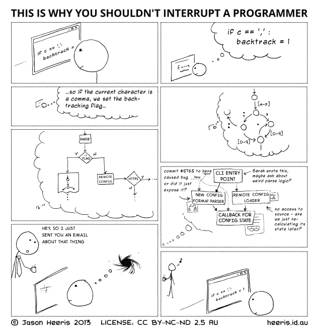
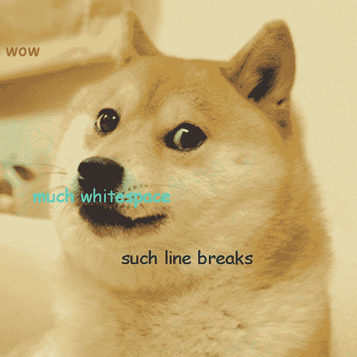
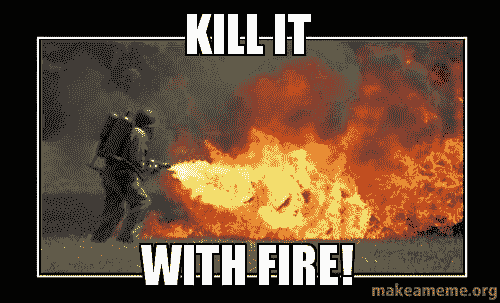
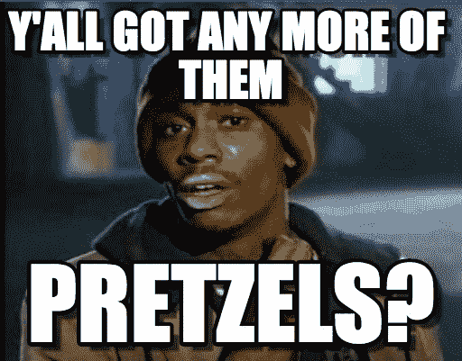
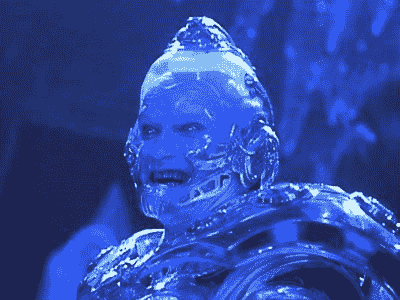
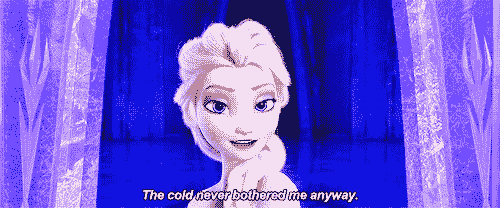
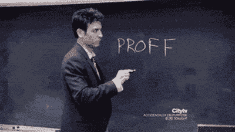
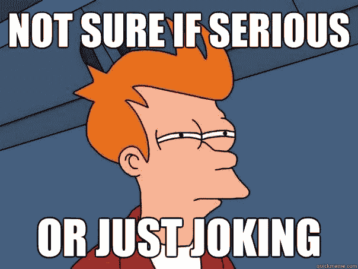

# 如何让你的代码审查有趣(而不是可怕)

> 原文：<https://www.freecodecamp.org/news/how-to-make-your-code-reviews-fun-and-not-dreadful-daf4dbabc428/>

我已经完成了我的代码审查工作。我说的公平份额是指很多。你曾经对一个史诗般的特性做过代码审查吗？我有。这不是一次很好的经历，因为当第 100 个文件被审查时，我已经厌倦了看代码。我差一点就可以说“是的，我看起来不错”，然后给出我的认可。

但这不是代码审查的工作方式。一旦开始，你就必须坚持到底。当然，你可以休息一下，但之后你会失去上下文，不得不重新开始，就像这样:

[Cartoon by Jason Heeris](http://heeris.id.au/2013/this-is-why-you-shouldnt-interrupt-a-programmer/)

不过，我跑题了。疼痛不是我应该谈论的。

那么，我们如何让它不那么可怕呢？首先，甚至在发出拉请求之前，甚至在我们开始编码之前，我们应该把特性分解成漂亮的小块。开发和部署变得更快，因为部署迷你特性总是比大型特性更容易。这使得代码审查执行起来更加容易和快速，因为变化相当小。

太好了！我希望你喜欢我的文章。我们都回家吧…

等等，**停**！

这是关于如何让它不那么可怕，但如何让它变得有趣？

### 在代码评审中使用模因

免责声明:以下是我自己的想法，不代表我的雇主。

我只是想说清楚，因为这可能是一个有争议的话题。无论如何，我们通过添加[迷因](http://knowyourmeme.com/memes/memes)使我们的代码审查变得轻松愉快。

我在这里就能听到你翻白眼！请听我说完。[还有什么比链接到其他乐于解释的人更好的解释呢](https://medium.com/@adamkoszary/look-at-this-absolute-unit-763207207917)？

语气有助于让审查者和被审查代码的人都觉得有趣。我的`image wallet`中的第一个“订书钉”就是一个例子。我注意到 [Rubocop](https://github.com/bbatsov/rubocop) 在我们的文件中缺少一些双空格，所以当有人提交带有一堆额外空格的拉请求时，给他们一个 [doge](http://knowyourmeme.com/memes/doge) 是显而易见的。

wow. much whitespace. such line breaks.

这是一个简单的图像，然而信息却非常有效。我记得人们看到它时都笑了。人们不想被“套住”,所以每个人都在他们额外的空白区域更加警惕。

更容易打开 finder，将 doge 拖到评论中，然后发布，而不是在 pull request (PR)中简单地键入旧的`Please remove the extra whitespace`,尤其是在有多个 doge 的情况下。

### 不会适得其反吗？

完全有可能。我不是说每个人都应该跟随我们的团队。这真的取决于团队的个性。我们的平均年龄比我小六岁，这意味着大多数人都与迷因有关。如果你的团队平均年龄为 40 岁，情况就不同了(当然，除非他们是 4chan 的居民，或者有最新的迷因！).

你最了解你的队友，真的。经过几个月的相处(特别是因为我们几乎 100%的时间都在配对)，可以说我们对彼此的幽默有了一些感觉。这让我们很乐意在我们的公关中看到迷因，并对此一笑置之(当然是在解决问题的同时)。

### 你从模因中获得了什么好处？

嗯，一个好处是它让复习更快(至少对我来说)。同样提交 PR 的人实际上知道他们需要更快地做什么。你看到的不是几句话，而是一幅图像——我们都知道图像比语言更有说服力。以下是我的`personal image wallet™`中的几个例子:

Delete this line!

当我第一次展示一个图像时，我会添加一个描述/解释，告诉他们需要做什么/修复什么。上面基本上说的是去掉上面的“遗留”代码。删除它。摧毁它！

Mmmmm pretzels

这是 Ruby 特有的——`[pretzel dot](http://mitrev.net/ruby/2015/11/13/the-operator-in-ruby/)`操作符基本上是`try-catch`的快捷方式。我只是突出显示需要椒盐卷饼的片段，然后粘贴这张图片。又快又简单！

AH-AH-AH!

It actual does bother me (the cold)

这两个我只是反复交替使用，主要是在 Ruby 中，我们总是在文件的顶部添加`# frozen_string_literal: true`魔法注释。然而，随着 rubo COP(T2)的掌舵，我们越来越少看到 Elsa 和 Freeze 先生。它们还会出现在任何需要冻结的常量中。

Love this GIF

这非常简单(我希望)。当同事们看到这个，这是一个信号，他们有一个打印错误。我通常还会突出显示错别字，这样就可以很快很容易地看到(并修复)。

这只是其中的一部分。不过请记住，过犹不及通常不是好事。所以添加迷因时要小心。最好不要添加太多的迷因，因为有时会分散注意力。找到正确的语气平衡，并尽可能快地将信息传递出去，是结束拉取请求的最佳方式。

### 就这些了，伙计们

总之，如果你想玩得开心，或者只是在工作中保持严肃和专业，这真的取决于你。有些人可能认为迷因不专业——当然，在正式的工作中它们可能是。有人可能会说，拉式请求可以是或确实是一种正式的与工作相关的东西，但我认为它只适用于文档或审查。否则，我认为这是“言论自由”(是的，拉了那张牌！)并且应该照原样接受。

对我来说，它传达了我想说的内容:删除多余的空格、修改拼写、冻结常量或删除一行或多行代码。我不用打太多字，我的同事也不用对着另一堆字读一堆字，心情也轻松了一些。大家都赢了！就这样，我用我的另一张照片来结束我的演讲:

I WONDER