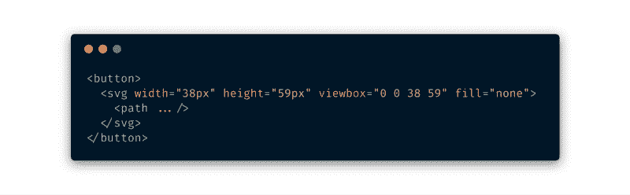
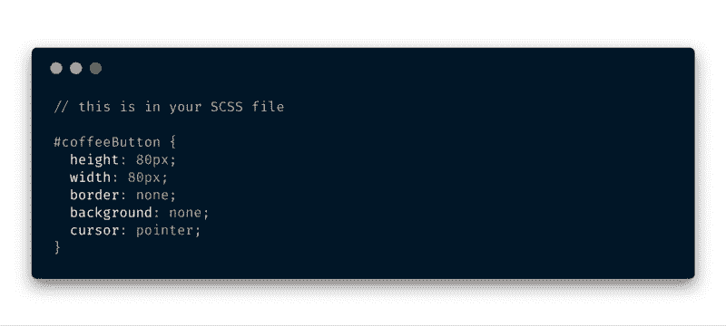
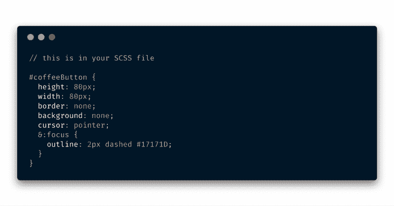
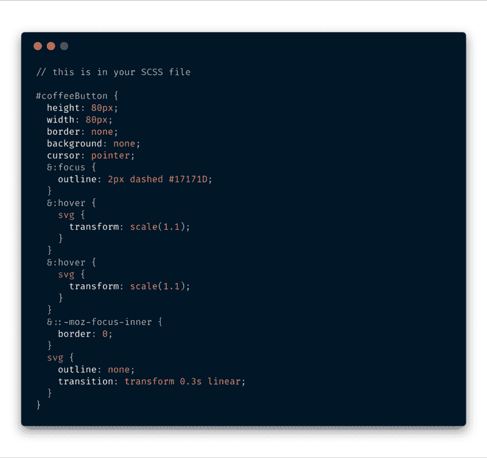
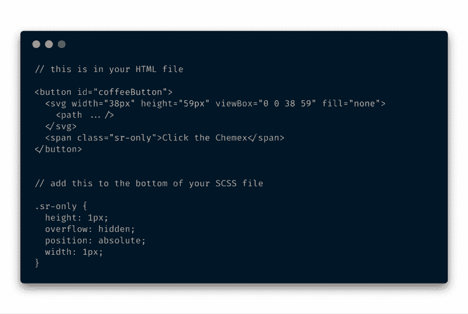
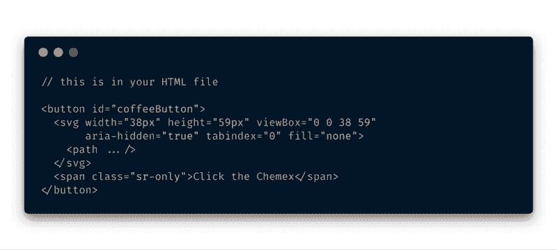

# 如何让你的 SVG 按钮变得可访问

> 原文：<https://www.freecodecamp.org/news/how-to-make-your-fancy-svg-button-accessible-83c9172c3c15/>

乔纳森·斯皮克

你很可能会发现自己有一天不得不制作一些设计师想象出来的疯狂按钮。你可能会开始寻找那辆老爷车`<d` iv >，但是容易吗，大变形人？—我们试试用`that <`；你在回避的按钮>元素？

我们首先简单地获取我们想要使用的 SVG 图标的代码。我很快做了一个 Chemex 图标，你可以在这里使用(我喜欢☕️).咖啡将它粘贴在 HTML 中的`<butt`和>标签之间，就像这样(SVG 代码会很长)。

Initial <button> with SVG code inside

我们希望这个按钮去掉它的默认样式，所以让我们给这个按钮一个“id ”,并用一些 CSS 来定位它。

Strip the default styling of the <button> so we can make it better ?

给按钮一个比我们的 SVG 大的宽度/高度——这将有助于轮廓的可见性。说到这个，确保你的轮廓颜色和背景颜色的对比度[通过这个](https://userway.org/contrast-checker)。去掉讨厌的边框和背景，确保光标设置为指针。

此时，您有了一个可点击的按钮，当点击它时，显示您的浏览器为焦点状态选择的默认轮廓。让我们改变这种状况，让它变得更好。

Giving the button some focus ?

现在，当我们点击或切换到按钮时，我们会得到一个很酷的小虚线轮廓，让我们知道我们关注的是哪里。

我们还想确保单击 SVG 本身不会得到一个轮廓。我们希望确保 Firefox 不会添加默认的虚线轮廓。当我们这样做的时候，我们可以给 SVG 一点悬停效果。

Adding our flavorful hover effect ?

现在我们可以开始最酷的部分了？我们不想让我们的屏幕阅读器用户因我们的按钮而烦恼或困惑。所以我们需要一个好的简短的描述来说明会发生什么。你通常也希望视觉用户知道他们点击的是什么，现在让他们猜猜看...

我们可以通过在按钮中的文本周围放置一个`<sp`和一个>元素并在视图之外对其进行样式化来轻松实现这一点。使 **su** re 不要将 display 设置为“none ”,因为这也将阻止我们的屏幕阅读器访问它。

Telling our screen reader users what they’re clicking on ?

最后，让我们确保:

*   对任何使用辅助技术的人隐藏 SVG
*   将 tabindex 设置为“0 ”,以便浏览器对任何键盘用户使用预期的 tab 键顺序。

Setting the proper tab order ⌨️

你现在应该有一个真正可以使用的按钮，你可以感到自豪？除了拍拍自己的背——现在就做——展望未来，你现在有一些可重用的模式，你可以实现它们来帮助 web 变得更容易访问？

这里有一个到 CodePen 示例的[链接，可以随意分叉自己的副本？](https://codepen.io/JonathanSpeek/pen/JeRwgp)

感谢阅读。如果你有一些关于可访问性的知识，一定要留下评论。

你可以在推特上关注我。