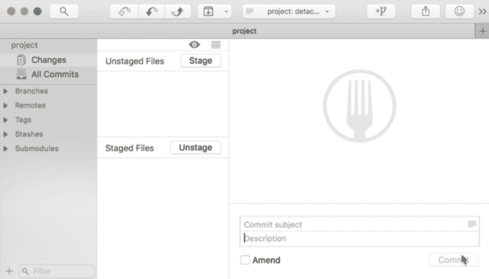
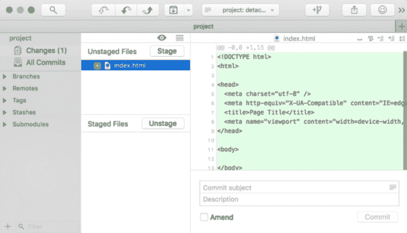
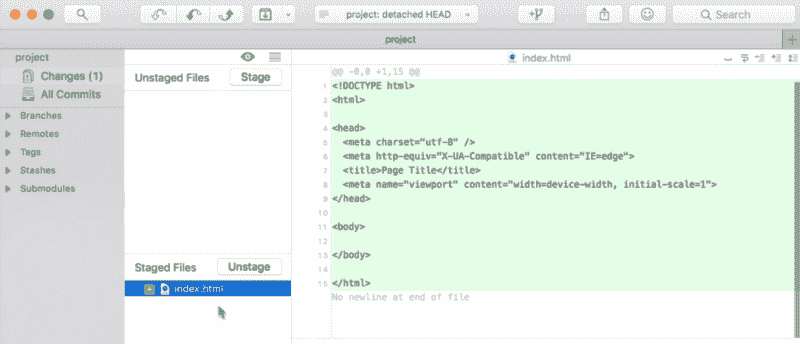
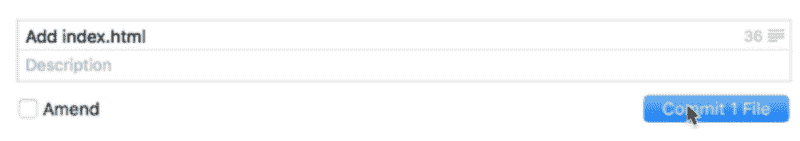
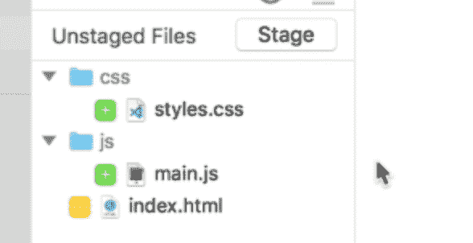
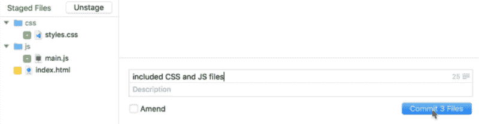

# 如何提交你的第一个 Git

> 原文：<https://www.freecodecamp.org/news/how-to-make-your-first-git-commit-a0581cb774f7/>

注意:这是我的 Git 初学者系列的第二个视频。[在这里看第一个视频](https://zellwk.com/blog/setting-up-git)。

今天我们将讨论如何让你的第一个 Git 提交。

如果您从我们在之前停止的地方[打开 Fork，您将看到项目屏幕。如果你点击更改，屏幕将分成两部分。](https://medium.freecodecamp.org/how-to-set-up-a-git-client-in-just-a-few-minutes-3d78b8d2264f)

在屏幕左侧，您会看到一个显示未转移文件的部分。在这一部分的下方，您会看到另一个显示分段文件的部分。

在右边，您会看到一个显示 Fork 图标的占位符。在底部，您会看到几个字段:

1.  提交消息字段
2.  描述字段
3.  修改后的复选框
4.  提交按钮

这被称为**集结地**。您可以在这里决定要将哪些文件保存到 Git 中。

### 暂存文件

在保存任何内容之前，您需要在 Git 存储库中进行更改。

在像 VS Code 这样的文本编辑器中打开你的 Git 项目。创建一个名为`index.html`的文件，开始时给它一些 HTML。

保存该文件后，您将在临时区域看到该文件。它应该出现在转移区域的未转移文件部分。

**未暂存文件是指自您上次提交到 Git 存储库以来已经更改的文件。**

如果您想要提交一个文件(在本例中为`index.html`文件)，您可以单击该文件并单击 stage。此文件将从“未转移文件”部分移到“转移文件”部分。

**当你在暂存文件段**中有一个文件时，你说的是**你想在提交**时保存那个文件。

如果您单击该文件，您将看到将保存到存储库中的代码行(绿色)。

### 创建提交

要创建提交，您可以在右下角写下提交消息，然后单击“创建提交”按钮。

单击“提交”按钮后，暂存文件将从暂存区域消失。这是因为文件已保存—存储库中不再有新的文件更改。

### 提交多个文件

您可以同时提交许多文件。为此，您需要更改许多文件。

在这个例子中，我向存储库添加了一个 CSS 文件和一个 JavaScript 文件。我还在`index.html`文件中添加了指向 CSS 和 JavaScript 文件的代码。

如果您现在回到 Fork，您应该会看到被更改的文件夹和文件。

要一次提交所有三个文件，请选择这些文件并单击 stage 按钮。然后，编写提交消息并提交文件。

### 检查 Git 历史记录

如果您点击侧边栏中的所有提交，您将看到您到目前为止已经提交的内容。在一些 Git 客户机中，这被称为 Git 历史。

### 锻炼

尝试用 Fork 对您的 Git 存储库进行一些提交。在下一个视频中，我将向您展示如何推送到 git remote，以及如何从 git remote 拉取。

感谢阅读。这篇文章对你有什么帮助吗？如果我有，[我希望你考虑分享它](http://twitter.com/share?text=Your%20first%20Git%20commit%20by%20@zellwk%20?%20&url=https://zellwk.com/blog/your-first-git-commit/&hashtags=)。在阅读这篇文章之前，你可能只是帮助了和你有同样感受的人。谢谢你。

本文最初发布在[我的博客](https://zellwk.com/blog/your-first-git-commit) *。*

如果你想要更多的文章来帮助你成为一个更好的前端开发者，注册我的[时事通讯](https://zellwk.com/)。