# 如何在 GitHub 上提出第一个拉取请求

> 原文：<https://www.freecodecamp.org/news/how-to-make-your-first-pull-request-on-github-3/>

## 什么是分叉？

当我们喜欢某人的存储库，并希望将它放在我们的 GitHub 帐户中时，我们会将它分叉，以便我们可以单独使用它。

当我们派生一个存储库时，我们获得了整个存储库的一个实例及其全部历史。分叉后，在不影响原版本的情况下，我们可以做任何我们想做的事情。

## 什么是拉取请求？

拉式请求是我们对团队项目或开源项目做出贡献的方式。

例如，用户 Harry 派生出一个 ThanoshanMV 的存储库，并对该存储库进行了更改。现在哈利可以向 ThanoshanMV 提出拉请求，但接受或拒绝由 ThanoshanMV 决定。就像说“ThanoshanMV，请你拉我的零钱好吗？”

## 贡献意味着什么

我们不仅可以用代码为开源项目做贡献，还可以用许多其他方式做贡献。下面描述了其中的一些方法。

正如 IT 公司的黑客入门指南所说，我们可以通过以下方式为开源项目做出贡献:

1.  设计:您可以构建项目的布局以提高其可用性，根据用户研究计划改进项目的导航和菜单，为徽标或 t 恤创作艺术，并为项目提供风格指南。
2.  写作:你可以撰写和改进项目的文档或翻译文档，为项目撰写时事通讯或为项目撰写教程，并整理邮件列表中的亮点，或整理一个展示项目如何使用的示例文件夹。
3.  组织:您可以链接重复的问题，建议新的问题标签，建议关闭旧的开放问题，并就最近开放的问题提出问题，以推动讨论。
4.  帮助他人:回答公开问题，审查他人提交的代码，主动提出指导另一个贡献者。
5.  编码:帮助解决任何未解决的问题，询问你是否能提供任何新的特性并改进工具和测试。

## 让我们提出第一个拉动请求！

如果你对 Git & GitHub 不是很熟悉，请去复习一下[Git&GitHub](https://medium.com/@mvthanoshan9/ubuntu-a-beginners-guide-to-git-github-44a2d2fda0b8)的入门指南。

### 1.派生存储库

通过单击页面顶部的 Fork 按钮来派生存储库。这将在您帐户中创建整个存储库的一个实例。

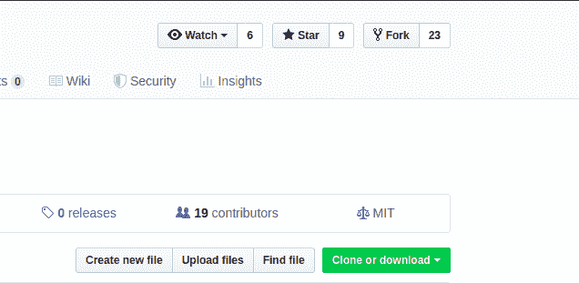

### 2.克隆存储库

一旦存储库在您的帐户中，将其克隆到您的机器上，以便在本地使用它。

要克隆，单击克隆按钮并复制链接。

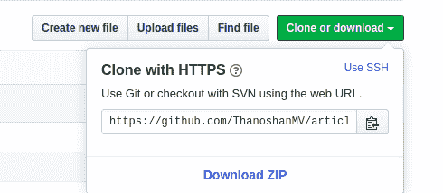

打开终端并运行以下命令。它将在本地克隆存储库。

```
$ git clone [HTTPS ADDRESS]
```

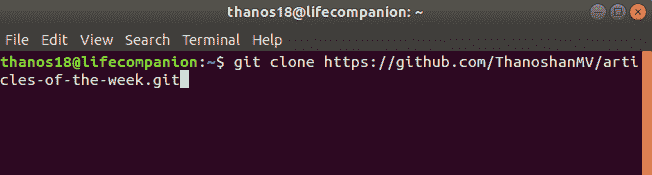

现在我们已经从主在线项目存储库中建立了一个主分支的副本。

我们需要通过运行以下命令转到克隆的目录:

```
$ cd [NAME OF REPOSITORY]
```

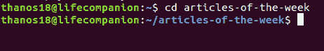

### 3.创建分支

在使用存储库时创建一个新的分支是一个很好的实践，无论是一个小项目还是为一个小组的工作做贡献。

分支机构的名称应该简短，它应该反映我们正在做的工作。

现在使用`git checkout`命令创建一个分支:

```
$ git checkout -b [Branch Name]
```

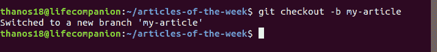

### 4.做出更改并提交

对项目进行必要的更改并保存。

然后执行`git status`，你会看到变化。

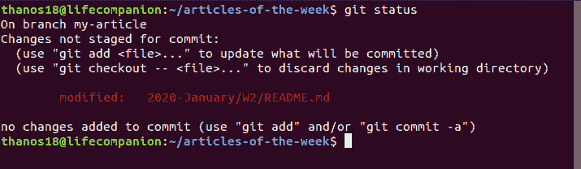

使用`git add`命令将这些更改添加到您刚刚创建的分支中:

```
$ git add .
```

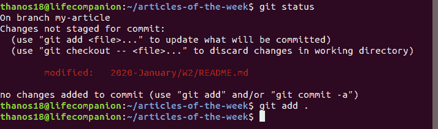

现在使用`git commit`命令提交这些更改:

```
$ git commit -m "Adding an article to week 02 of articles of the week"
```

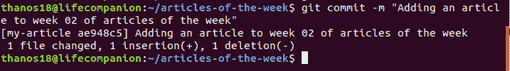

### 5.将更改推送到 GitHub

为了将更改推送到 GitHub，我们需要识别遥控器的名称。

```
$ git remote
```


对于这个存储库，遥控器的名称是“origin”。

识别出遥控器的名称后，我们可以安全地将这些更改推送到 GitHub。

```
git push origin [Branch Name]
```

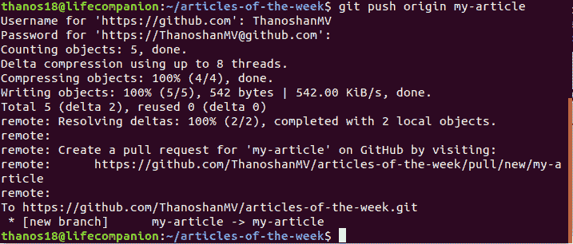

### 6.创建拉式请求

转到你在 GitHub 上的资源库，你会看到一个按钮“比较&拉请求”并点击它。

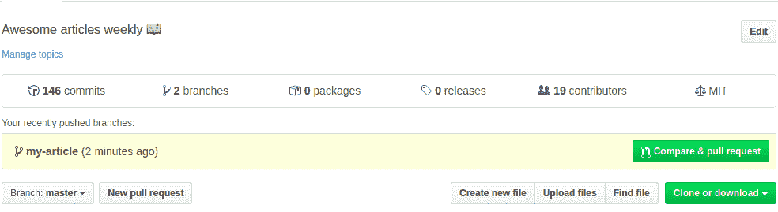

请提供您所做工作的必要详细信息(您可以使用“#”引用问题)。现在提交拉取请求。

恭喜你！您已经发出了第一个拉取请求。


如果您的拉取请求被接受，您将收到一封电子邮件。

### 7.同步您的分叉主分支

在向原始存储库提交任何拉请求之前，您必须将您的存储库与原始存储库同步。

即使您不打算向原始存储库提交一个 pull 请求，也最好与原始存储库同步，因为在您派生原始存储库之后，可能已经完成了一些附加功能和错误修复。

按照以下步骤将这些更改更新/同步到您的主分支:

1.  首先，检查你在哪个分行。

```
$ git branch
```


它将列出所有分支，并以绿色显示当前或活动分支。

2.切换到主分支。

```
$ git checkout master
```


3.将原始存储库添加为上游存储库。

为了将变更从原始存储库拉入分叉版本，您需要添加原始 Git 存储库作为上游存储库。

```
$ git remote add upstream [HTTPS]
```

这里，[HTTPS]是您必须从所有者的存储库中复制的 URL。

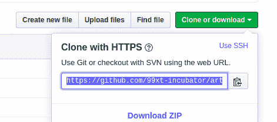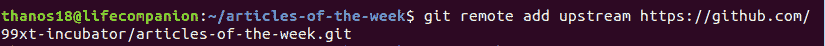

4.获取存储库。

从原始存储库中获取所有的更改。对原始存储库的提交将存储在名为 upstream/master 的本地分支中。

```
$ git fetch upstream
```


5.合并它。

将上游/主分支的更改合并到本地主分支。这将使 fork 的主分支与上游存储库同步，而不会丢失本地更改。

```
$ git merge upstream/master
```

6.将更改推送到 GitHub

此时，您的本地分支与原始存储库的主分支同步。如果你想更新 GitHub 库，你需要推送你的修改。

```
$ git push origin master
```

**注意:**同步分叉主分支后，如果您愿意，您可以移除该遥控器。但是您将来也需要更新/同步您的存储库，所以最好的做法是保留它。


```
$ git remote rm [Remote Name]
```

### 8.删除不必要的分支

分支是为特殊目的而创建的。一旦这个目的实现了，那些分支就不再需要了，所以你可以删除它们。

```
$ git branch -d [Branch Name]
```

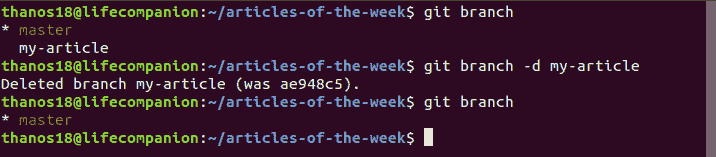

你也可以在 GitHub 上删除它的版本。

```
git push origin --delete [Branch Name]
```

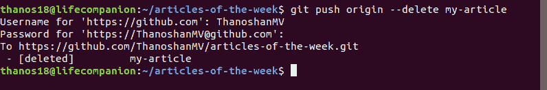

## 结论

GitHub 是控制版本历史的强大工具。每个人都可以通过请求来为开源项目做贡献。贡献并不总是代码——还有其他的贡献方式。

最后，我必须告诉您，如果您的拉取请求被拒绝，您不必担心。维护人员花很多时间改进他们的项目，他们比我们更了解他们的项目。所以，如果你的请求没有被合并，不要担心。

> 保持坚强，保持积极，永不放弃。
> ——罗伊·t·贝内特，[心中的光](https://www.goodreads.com/work/quotes/49604402)

本文原载于[媒体](https://medium.com/@mvthanoshan9/how-to-make-your-first-pull-request-on-github-9aefca5cc837)。

你可以在 [Twitter](https://twitter.com/ThanoshanMV) 上联系我。

继续为开源世界做贡献！