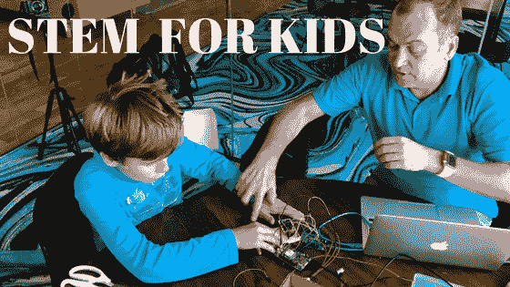

# 如何让你的孩子对 STEM 和 Tech 感兴趣？

> 原文：<https://www.freecodecamp.org/news/how-to-make-your-kids-interested-in-stem-and-tech-7828cc1277fd/>

作者:Savva Osipov

# 如何让你的孩子对编程和技术感兴趣

我叫萨夫瓦·奥西波夫。我十三岁了，我在加州诺瓦托的一所中学学习。

我的数学一直很好，在学校的课堂上也很出色。在我的空闲时间，我玩电子产品、3D 打印，并基于 Arduino 板和 Raspberry Pi 进行自己的 DIY 项目。我也为我的 YouTube 频道拍摄视频。

我还决定打造自己的产品，一台我自己想出来的游戏机，用我的 3D 打印机和 Arduino 组装起来。在我爸爸的帮助下，我将在一月份为这个我称之为 WOWCUBE 的小玩意发起一个 Kickstarter 活动。我们还将在美国最大的消费电子活动(CES 2018)上展示和展示该发明。

#### 我是如何获得灵感和动力的？

许多父母问我爸爸，他是如何让我对电子、机器人和类似的东西保持兴趣的。很简单，他通过不断支持我来激励我。他带我参加许多不同的活动，比如黑客马拉松，这些活动激发了我的兴趣和想象力。我们还一起做很多项目，他帮我做编码和其他有时需要大人帮忙的工作。

我爸爸和我整理了一些有用的链接，可以帮助您的孩子对技术更感兴趣:

#### 儿童玩具和开发板

有各种各样的高科技应用程序、玩具和书籍。你可以在 Adafruit Industry 网站上找到任何符合你口味的东西。关注 Raspberry Pi powered 产品，LittleBits(类似乐高的东西)，还有 Piper。

#### 参加“动手”黑客马拉松

不要害怕参加黑客马拉松。组织者提供玩和试验电子产品所需的一切。这是免费提供的，或者价格非常合理。你可以在周末的几个小时内创造一些新的东西。黑客马拉松的人非常友好，组织者会提供一步一步的说明来指导你。

[这是我最近参加的一次黑客马拉松](https://medium.com/the-mission/why-do-you-need-to-bring-your-teen-to-a-hackathon-670fc078946e)。

#### 参加科技娱乐活动:看看 Eventbrite 和 Meetups.com

你可以在 EventBrite 和 Meetup 等网站上找到各种娱乐活动。搜索儿童技术、儿童和青少年技术聚会等。参加这些活动会帮助你找到和你有同样兴趣的青少年发明家。这是我对旧金山最近事件的评论。

#### 在家构建 DIY 项目

当想到一个新项目时，请访问 Hackster.io 和 Hackaday 获取灵感。他们有视频、您需要的硬件列表以及许多其他有用的提示。每个 DIY 项目的说明都非常详细。您可以创建和上传自己的项目，并接收反馈！

#### 一起参加比赛

像 Hackaday 这样的网站在一年中不断举办比赛。大部分比赛都免费提供硬件来创建一个 DIY 项目。你只需要提交你的项目想法！

[**我的计划参加由 Hackster.io 主办的全息新星挑战赛和全息**](https://medium.com/@cubios_inc/my-plans-for-the-hologram-nova-challenge-hosted-by-hackster-io-and-hologram-7ce35d77497)
[*今年 10 月，我报名参加了由 Hackster.io 和全息主办的电子竞赛，名为……*medium.com](https://medium.com/@cubios_inc/my-plans-for-the-hologram-nova-challenge-hosted-by-hackster-io-and-hologram-7ce35d77497)

灵感？你可以在 Twitter @cubios_inc 上问我问题，或者关注我在 wowcube.com 的项目进展