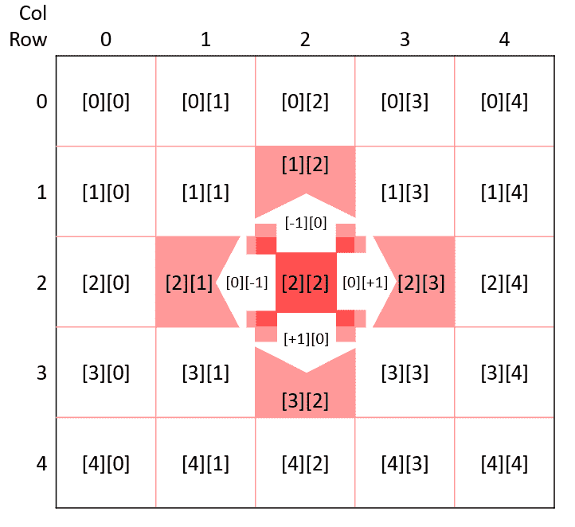

# 如何使用随机漫步算法编写你自己的程序地牢地图生成器

> 原文：<https://www.freecodecamp.org/news/how-to-make-your-own-procedural-dungeon-map-generator-using-the-random-walk-algorithm-e0085c8aa9a/>

随着技术的发展和游戏内容变得更加算法化，不难想象为每个玩家创造一个具有独特体验的逼真模拟。

技术突破、耐心和精炼的技能会让我们达到目的，但第一步是理解**程序性内容生成**。

尽管有许多现成的地图生成解决方案，本教程将教你使用 JavaScript 从头开始制作自己的二维地牢地图生成器。

有许多二维地图类型，并且都具有以下特征:

1.可进入和不可进入的区域(隧道和墙壁)。

2.玩家可以导航的连接路线。

本教程中的算法来自于[随机行走算法](https://en.wikipedia.org/wiki/Random_walker_algorithm)，这是最简单的地图生成解决方案之一。

在制作了墙壁的网格状地图之后，该算法从地图上的随机位置开始。它不断制造隧道，并随机轮流完成所需数量的隧道。

要观看演示，请打开下面的 CodePen 项目，单击地图以创建新地图，并更改以下值:

1.  **尺寸:**地图的宽度和高度。
2.  **MaxTunnels:** 制作地图时算法可以进行的最大转弯次数。
3.  **MaxLength:** 在进行水平或垂直转弯之前，算法将选择的每个隧道的最大长度。

[https://codepen.io/abdolsa/embed/zEKdop?height=700&theme-id=light&default-tab=result](https://codepen.io/abdolsa/embed/zEKdop?height=700&theme-id=light&default-tab=result)

See the Pen [CreatMap](https://codepen.io/abdolsa/pen/zEKdop) by Ahmad Abdolsaheb ([@abdolsa](https://codepen.io/abdolsa)) on [CodePen](https://codepen.io).

**注意:**与尺寸相比， *maxTurn* 越大，贴图越密集。与尺寸相比， *maxLength* 越大，看起来就越“隧道 y”。

接下来，让我们来看看地图生成算法如何:

1.  制作墙壁的二维地图
2.  在地图上随机选择一个起点
3.  虽然隧道的数量不为零
4.  从最大允许长度中选择一个随机长度
5.  选择一个随机的转向方向(右、左、上、下)
6.  在那个方向画一条隧道，同时避开地图的边缘
7.  减少隧道数量并重复 [while 循环](https://en.wikipedia.org/wiki/While_loop)
8.  返回包含更改的地图

这个循环一直持续到隧道的数量为零。

### 代码中的算法

由于地图由隧道和墙单元组成，我们可以将其描述为二维数组中的 0 和 1，如下所示:

```
map = [[1,1,1,1,0],
       [1,0,0,0,0],
       [1,0,1,1,1],       
       [1,0,0,0,1],       
       [1,1,1,0,1]]
```

因为每个单元格都在一个二维数组中，所以我们可以通过知道它的行和列(如 map [row][column])来访问它的值。

在编写算法之前，您需要一个 helper 函数，它以一个字符和维度作为参数，并返回一个二维数组。

```
createArray(num, dimensions) {
    var array = [];    
    for (var i = 0; i < dimensions; i++) { 
      array.push([]);      
      for (var j = 0; j < dimensions; j++) {  
         array[i].push(num);      
      }    
    }    
    return array;  
} 
```

要实现随机行走算法，请设置地图的尺寸(宽度和高度)、`maxTunnels`变量和`maxLength`变量。

```
createMap(){
 let dimensions = 5,     
 maxTunnels = 3, 
 maxLength = 3; 
```

接下来，使用预定义的辅助函数创建一个二维数组(一个二维数组)。

```
let map = createArray(1, dimensions);
```

设置随机列和随机行，以创建第一个隧道的随机起点。

```
let currentRow = Math.floor(Math.random() * dimensions),       
    currentColumn = Math.floor(Math.random() * dimensions);
```

为了避免对角线转弯的复杂性，算法需要指定水平和垂直方向。每个单元格都位于一个二维数组中，可以用它的行和列来标识。因此，方向可以被定义为列号和行号的减少和/或增加。

例如，要转到单元格[2][2]周围的单元格，您可以执行以下操作:

*   要从**上升到**，从其行[1][2]中减去 1
*   要使**向下**，向其行[3][2]添加 1
*   要向右移动**，在其列[2][3]中添加 1**
*   要向左移动**，从它的列[2][1]中减去 1**

下图说明了这些操作:



Operational options grid

现在，将`directions`变量设置为以下值，算法将在创建每个隧道之前从中选择:

```
let directions = [[-1, 0], [1, 0], [0, -1], [0, 1]];
```

最后，初始化`randomDirection` 变量以保存来自方向数组的随机值，并将`lastDirection`变量设置为空数组，该空数组将保存旧的`randomDirection` 值。

**注意:**`lastDirection`数组在第一次循环时为空，因为没有旧的`randomDirection`值。

```
let lastDirection = [], 
    randomDirection;
```

接下来，确保`maxTunnel`不为零，并且尺寸和`maxLength`值已被接收。继续寻找随机的方向，直到你找到一个与`lastDirection`不相反或相同的方向。这个 [do while 循环](https://en.wikipedia.org/wiki/Do_while_loop)有助于防止覆盖最近绘制的隧道或连续绘制两条隧道。

例如，如果您的`lastTurn`是[0，1]，则 do while 循环会阻止函数向前移动，直到`randomDirection`被设置为不是[0，1]或相反的[0，-1]的值。

```
do {         
randomDirection = directions[Math.floor(Math.random() * directions.length)];      
} while ((randomDirection[0] === -lastDirection[0] &&    
          randomDirection[1] === -lastDirection[1]) || 
         (randomDirection[0] === lastDirection[0] &&  
          randomDirection[1] === lastDirection[1])); 
```

在 do while 循环中，有两个主要条件被||(或)符号分开。条件的第一部分也由两个条件组成。第一个检查`randomDirection`的第一个项目是否与`lastDirection` *的*第一个项目相反。第二个检查`randomDirection`的第二个项目是否与`lastTurn`的第二个项目相反。

举例来说，如果`lastDirection`为[0，1]，`randomDirection`为[0，-1]，条件的第一部分检查是否【T2[0]= = =—【T3][0])，等于 0 = =—0，并且为真。

然后，它检查是否(`randomDirection` [1] === — `lastDirection` [1])等于(-1 === -1)，并且也为真。由于两个条件都成立，算法返回去寻找另一个`randomDirection`。

条件的第二部分检查两个数组的第一个和第二个值是否相同。

选择一个满足条件的`randomDirection`后，设置一个变量从`maxLength`中随机选择一个长度。将`tunnelLength`变量设置为零，作为迭代器提供给服务器。

```
let randomLength = Math.ceil(Math.random() * maxLength),       
    tunnelLength = 0;
```

当`tunnelLength`小于`randomLength` *时，通过将单元格的值从 1 变为零来创建隧道。*如果在循环中隧道碰到了地图的边缘，循环应该会被打破。

```
while (tunnelLength < randomLength) { 
 if(((currentRow === 0) && (randomDirection[0] === -1))||  
    ((currentColumn === 0) && (randomDirection[1] === -1))|| 
    ((currentRow === dimensions — 1) && (randomDirection[0] ===1))||
 ((currentColumn === dimensions — 1) && (randomDirection[1] === 1)))   
 { break; }
```

否则，使用`currentRow`和`currentColumn.`将地图的当前单元设置为零，通过设置`currentRow`和`currentColumn`将值添加到`randomDirection`数组中，它们需要在即将到来的循环迭代中出现。现在，递增`tunnelLength`迭代器。

```
else{ 
  map[currentRow][currentColumn] = 0; 
  currentRow += randomDirection[0];
  currentColumn += randomDirection[1]; 
  tunnelLength++; 
 } 
} 
```

在循环创建隧道或通过撞击地图的边缘而中断后，检查隧道是否至少有一个街区长。如果是，将`lastDirection`设置为`randomDirection`并减少`maxTunnels`，然后返回使用另一个`randomDirection` *创建另一个隧道。*

```
if (tunnelLength) { 
 lastDirection = randomDirection; 
 maxTunnels--; 
} 
```

该 IF 语句防止了命中地图边缘并且没有建立至少一个单元的隧道的 for 循环，以减少`maxTunnel`并改变`lastDirection`。当这种情况发生时，算法会继续寻找另一个`randomDirection`。

当它完成绘制隧道并且`maxTunnels`为零时，返回结果地图及其所有转弯和隧道。

```
}
 return map;
};
```

您可以在下面的代码片段中看到完整的算法:

祝贺您通读本教程。你现在已经准备好制作你自己的地图生成器或者改进这个版本。在 [CodePen](https://codepen.io/anon/pen/aLpORx) 和 [GitHub](https://github.com/ahmadabdolsaheb/mapgen) 上检查项目，作为 react 应用程序。

*感谢阅读！如果你喜欢这个故事，别忘了在社交媒体上分享它。*

特别感谢 [Tom](https://github.com/moT01) 共同撰写本文。