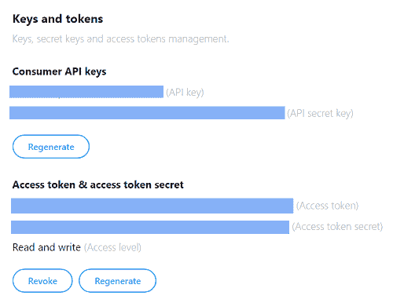
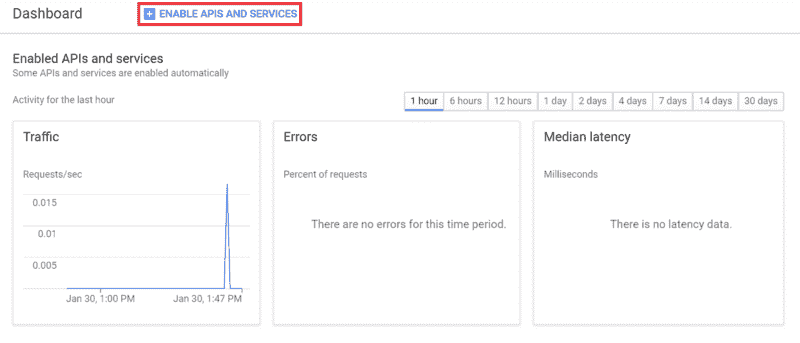
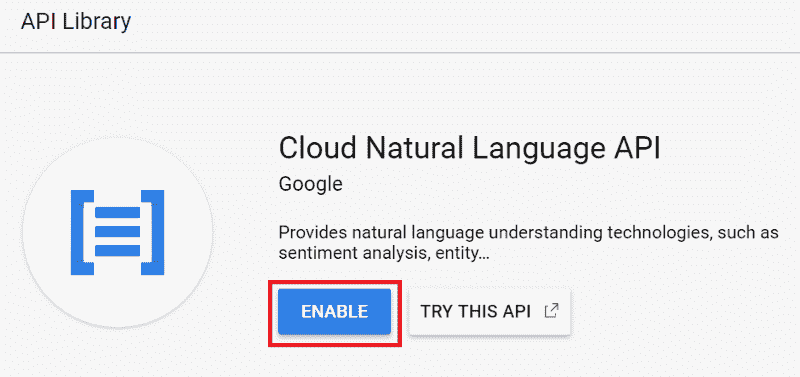
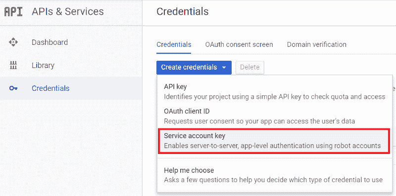
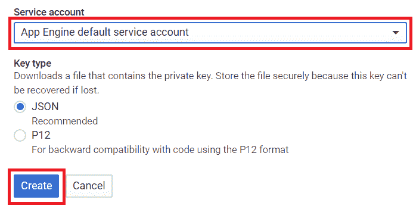
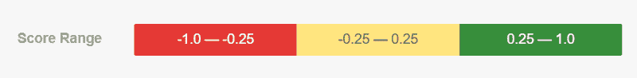

# 如何使用 Python 和 Google 的自然语言 API 制作自己的情感分析器

> 原文：<https://www.freecodecamp.org/news/how-to-make-your-own-sentiment-analyzer-using-python-and-googles-natural-language-api-9e91e1c493e/>

假设你是一个产品负责人，想知道人们在社交媒体上对你的产品有什么评价。也许你的公司推出了新产品，你想知道人们对它的反应。你可能想要使用一个情绪分析器，比如 [MonkeyLearn](https://monkeylearn.com/) 或者 [Talkwalker](https://www.talkwalker.com/sentiment-analysis) 。但是，如果我们能制作自己的情感分析器，岂不是很酷？那我们就去吧！

在本教程中，我们将制作一个电报机器人，它将对与我们定义的关键词相关的推文进行情感分析。

如果这是你第一次制作电报机器人，你可能想先读一下这篇文章。

### 入门指南

#### 1.安装库

我们将使用 [tweepy](http://www.tweepy.org/) 来收集推文数据。我们将使用 [nltk](https://www.nltk.org/) 来帮助我们清理推文。[谷歌自然语言 API](https://cloud.google.com/natural-language/) 会做情感分析。 [python-telegram-bot](https://github.com/python-telegram-bot/python-telegram-bot) 将通过电报聊天发送结果。

```
pip3 install tweepy nltk google-cloud-language python-telegram-bot
```

#### 2.获取 Twitter API 密钥

为了能够从 Twitter 收集 tweets，我们需要创建一个开发者帐户来首先获得 Twitter API 密钥。

去 [Twitter 开发者](https://developer.twitter.com/)网站，如果你没有的话，创建一个账户。

打开[应用](https://developer.twitter.com/en/apps)页面，点击“创建应用”，填写表格，点击“创建”。

单击“密钥和令牌”选项卡，复制“消费者 API 密钥”部分中的 API 密钥和 API 秘密密钥。

单击“访问令牌和访问令牌密码”部分下的“创建”按钮。复制已经生成的访问令牌和访问令牌密码。



太好了！现在您应该有四个密钥了——API 密钥、API 秘密密钥、访问令牌和访问令牌秘密。保存这些密钥以备后用。

#### 3.启用 Google 自然语言 API

如果我们想使用这个服务，我们需要首先启用 Google 自然语言 API。

转到[谷歌开发者控制台](https://console.developers.google.com/)并创建一个新项目(或选择你已有的项目)。

在项目仪表盘中，点击“启用 API 和服务”，搜索云自然语言 API。



单击“启用”以启用 API。



#### 4.创建服务帐户密钥

如果我们想像谷歌自然语言一样使用谷歌云服务，我们需要一个服务账号密钥。这就像是我们使用谷歌服务的凭证。

进入[谷歌开发者控制台](https://console.developers.google.com/)，点击“凭证”标签，选择“创建凭证”并点击“服务账户密钥”。



选择“App Engine 默认服务帐户”和 JSON 作为密钥类型，然后单击“创建”。



有一个. json 文件会自动下载，命名为`creds.json`。

在终端中用我们的`creds.json`文件的路径设置`GOOGLE_APPLICATION_CREDENTIALS`。

```
export GOOGLE_APPLICATION_CREDENTIALS='[PATH_TO_CREDS.JSON]'
```

如果一切顺利，那么就该写我们的程序了。

### 写程序

该程序将收集过去 24 小时内包含定义的关键字的所有推文，最多 50 条推文。然后它会逐个分析推文的情绪。我们将通过电报聊天发送结果(平均情绪得分)。

这是我们程序的简单工作流程。

> **将**连接到 Twitter API-&g**t；根据关键字**->-**搜索** ch 条推文清理所有推文- >获取**推文的 sentim** ent **分数** - >发送结果

让我们用一个函数来定义每个流。

#### 1.连接到 Twitter API

我们需要做的第一件事是收集 tweets 的数据，所以我们必须首先连接到 Twitter API。

导入 tweepy 库。

```
import tweepy
```

定义我们之前生成的密钥。

```
ACC_TOKEN = 'YOUR_ACCESS_TOKEN'
ACC_SECRET = 'YOUR_ACCESS_TOKEN_SECRET'
CONS_KEY = 'YOUR_CONSUMER_API_KEY'
CONS_SECRET = 'YOUR_CONSUMER_API_SECRET_KEY'
```

创建一个名为`authentication`的函数来连接 API，它有四个参数，都是键。

```
def authentication(cons_key, cons_secret, acc_token, acc_secret):
    auth = tweepy.OAuthHandler(cons_key, cons_secret)
    auth.set_access_token(acc_token, acc_secret)
    api = tweepy.API(auth)
    return api
```

#### 2.搜索推文

我们可以用两个标准搜索推文，基于时间或数量。如果是基于时间，我们定义时间间隔，如果是基于数量，我们定义我们想要收集的推文总数。因为我们希望收集过去 24 小时内最多 50 条推文的推文，所以我们将使用这两个标准。

因为我们想要收集过去 24 小时的推文，所以让我们将昨天的日期作为我们的时间参数。

```
from datetime import datetime, timedelta

today_datetime = datetime.today().now()
yesterday_datetime = today_datetime - timedelta(days=1)
today_date = today_datetime.strftime('%Y-%m-%d')
yesterday_date = yesterday_datetime.strftime('%Y-%m-%d')
```

使用我们之前定义的函数连接到 Twitter API。

```
api = authentication(CONS_KEY,CONS_SECRET,ACC_TOKEN,ACC_SECRET)
```

定义我们的搜索参数。`q`是我们定义关键字的地方，`since`是我们搜索的开始日期，`result_type='recent'`意味着我们将获取最新的推文，`lang='en'`将只获取英文推文，`items(total_tweets)`是我们定义我们将获取的最大推文的地方。

```
search_result = tweepy.Cursor(api.search, 
                              q=keyword, 
                              since=yesterday_date,
                              result_type='recent', 
                              lang='en').items(total_tweets)
```

将这些代码包装在一个名为`search_tweets`的函数中，以`keyword`和`total_tweets`作为参数。

```
def search_tweets(keyword, total_tweets):
    today_datetime = datetime.today().now()
    yesterday_datetime = today_datetime - timedelta(days=1)
    today_date = today_datetime.strftime('%Y-%m-%d')
    yesterday_date = yesterday_datetime.strftime('%Y-%m-%d')
    api = authentication(CONS_KEY,CONS_SECRET,ACC_TOKEN,ACC_SECRET)
    search_result = tweepy.Cursor(api.search, 
                                  q=keyword, 
                                  since=yesterday_date, 
                                  result_type='recent', 
                                  lang='en').items(total_tweets)
    return search_result
```

#### 3.清理推文

在我们分析推文情感之前，我们需要稍微清理一下推文，以便谷歌自然语言 API 可以更好地识别它们。

在这个过程中，我们将使用 nltk 和 regex 库来帮助我们。

```
import re
from nltk.tokenize import WordPunctTokenizer
```

我们删除了每条推文中的用户名，所以基本上我们可以删除以`@`开头的所有内容，我们使用 regex 来完成这项工作。

```
user_removed = re.sub(r'@[A-Za-z0-9]+','',tweet.decode('utf-8'))
```

我们还删除了每条推文中的链接。

```
link_removed = re.sub('https?://[A-Za-z0-9./]+','',user_removed)
```

所有推文中的数字也被删除。

```
number_removed = re.sub('[^a-zA-Z]',' ',link_removed)
```

最后，将所有的字符转换成较低的空间，然后删除所有不必要的空间。

```
lower_case_tweet = number_removed.lower()
tok = WordPunctTokenizer()
words = tok.tokenize(lower_case_tweet)
clean_tweet = (' '.join(words)).strip()
```

将这些代码封装到一个名为`clean_tweets`的函数中，并将`tweet`作为我们的参数。

```
def clean_tweets(tweet):
    user_removed = re.sub(r'@[A-Za-z0-9]+','',tweet.decode('utf-8'))
    link_removed = re.sub('https?://[A-Za-z0-9./]+','',user_removed)
    number_removed = re.sub('[^a-zA-Z]', ' ', link_removed)
    lower_case_tweet= number_removed.lower()
    tok = WordPunctTokenizer()
    words = tok.tokenize(lower_case_tweet)
    clean_tweet = (' '.join(words)).strip()
    return clean_tweet
```

#### 4.获取 tweet 的情绪

为了能够获得一条推文的情感，我们将使用谷歌自然语言 API。

API 提供了情感分析、实体分析和语法分析。在本教程中，我们将只使用情感分析。

在谷歌的情感分析中，有`score`和`magnitude`。`Score`情绪的得分范围是从-1.0(非常负面)到 1.0(非常正面)。`Magnitude`是情绪的强度，范围从 0 到无穷大。

为了本教程的简单起见，我们将只考虑`score`。如果你想做深度 NLP 分析，你也应该考虑一下`magnitude`。

导入 Google 自然语言库。

```
from google.cloud import language
from google.cloud.language import enums
from google.cloud.language import types
```

做一个名为`get_sentiment_score`的函数，以`tweet`为参数，返回`sentiment`的分数。

```
def get_sentiment_score(tweet):
    client = language.LanguageServiceClient()
    document = types\
               .Document(content=tweet,
                         type=enums.Document.Type.PLAIN_TEXT)
    sentiment_score = client\
                      .analyze_sentiment(document=document)\
                      .document_sentiment\
                      .score
    return sentiment_score
```

#### 5.分析推文

让我们创建一个函数，它将循环从`search_tweets`函数获得的推文列表，并使用`get_sentiment_score`函数获得每条推文的情感分数。然后我们来计算平均值。平均分将决定给定的关键词是否有正面、中性或负面的情绪。

定义`score`等于`0`，然后使用`search_tweets`函数获取与我们定义的关键词相关的推文。

```
score = 0
tweets = search_tweets(keyword, total_tweets)
```

遍历 tweets 列表，并使用我们之前创建的`clean_tweets`函数进行清理。

```
for tweet in tweets:
    cleaned_tweet = clean_tweets(tweet.text.encode('utf-8'))
```

使用`get_sentiment_score`函数获得情感得分，并通过添加`sentiment_score`来增加`score`。

```
for tweet in tweets:
    cleaned_tweet = clean_tweets(tweet.text.encode('utf-8'))
    sentiment_score = get_sentiment_score(cleaned_tweet)
    score += sentiment_score
```

让我们打印出每条推文及其观点，这样我们就可以在终端上看到进度细节。

```
for tweet in tweets:
    cleaned_tweet = clean_tweets(tweet.text.encode('utf-8'))
    sentiment_score = get_sentiment_score(cleaned_tweet)
    score += sentiment_score
    print('Tweet: {}'.format(cleaned_tweet))
    print('Score: {}\n'.format(sentiment_score))
```

计算平均分数并将其传递给`final_score`变量。将所有代码打包到`analyze_tweets`函数中，以`keyword`和`total_tweets`为参数。

```
def analyze_tweets(keyword, total_tweets):
    score = 0
    tweets = search_tweets(keyword, total_tweets)
    for tweet in tweets:
        cleaned_tweet = clean_tweets(tweet.text.encode('utf-8'))
        sentiment_score = get_sentiment_score(cleaned_tweet)
        score += sentiment_score
        print('Tweet: {}'.format(cleaned_tweet))
        print('Score: {}\n'.format(sentiment_score))
    final_score = round((score / float(total_tweets)),2)
    return final_score
```

#### 6.发送推文的情感评分

让我们制作工作流中的最后一个函数。这个功能将采取用户的关键字，并计算平均情绪的分数。那我们就通过电报机器人发送。

从用户处获取关键字。

```
keyword = update.message.text
```

使用`analyze_tweets`函数获得最终分数，`keyword`作为我们的参数，并设置`total_tweets = 50`，因为我们想要收集 50 条推文。

```
final_score = analyze_tweets(keyword, 50)
```

我们使用谷歌的分数范围来定义一个给定的分数是负面的、中性的还是正面的，如下图所示。



source: [https://cloud.google.com/natural-language/](https://cloud.google.com/natural-language/)

```
if final_score <= -0.25:
    status = 'NEGATIVE ❌'
elif final_score <= 0.25:
    status = 'NEUTRAL ?'
else:
    status = 'POSITIVE ✅'
```

最后，通过电报机器人发送`final_score`和`status`。

```
bot.send_message(chat_id=update.message.chat_id,
                 text='Average score for '
                       + str(keyword) 
                       + ' is ' 
                       + str(final_score) 
                       + ' ' 
                       + status)
```

将代码打包成一个名为`send_the_result`的函数。

```
def send_the_result(bot, update):
    keyword = update.message.text
    final_score = analyze_tweets(keyword, 50)
    if final_score <= -0.25:
        status = 'NEGATIVE ❌'
    elif final_score <= 0.25:
        status = 'NEUTRAL ?'
    else:
        status = 'POSITIVE ✅'
    bot.send_message(chat_id=update.message.chat_id,
                     text='Average score for '
                           + str(keyword) 
                           + ' is ' 
                           + str(final_score) 
                           + ' ' 
                           + status)
```

#### 7.主程序

最后，创建另一个函数`main`来运行我们的程序。**别忘了把** `YOUR_TOKEN`换成你的机器人令牌。

```
from telegram.ext import Updater, MessageHandler, Filters

def main():
    updater = Updater('YOUR_TOKEN')
    dp = updater.dispatcher
    dp.add_handler(MessageHandler(Filters.text, send_the_result))
    updater.start_polling()
    updater.idle()

if __name__ == '__main__':
    main()
```

最后，您的代码应该是这样的

```
import tweepy
import re

from telegram.ext import Updater, MessageHandler, Filters
from google.cloud import language
from google.cloud.language import enums
from google.cloud.language import types
from datetime import datetime, timedelta
from nltk.tokenize import WordPunctTokenizer

ACC_TOKEN = 'YOUR_ACCESS_TOKEN'
ACC_SECRET = 'YOUR_ACCESS_TOKEN_SECRET'
CONS_KEY = 'YOUR_CONSUMER_API_KEY'
CONS_SECRET = 'YOUR_CONSUMER_API_SECRET_KEY'

def authentication(cons_key, cons_secret, acc_token, acc_secret):
    auth = tweepy.OAuthHandler(cons_key, cons_secret)
    auth.set_access_token(acc_token, acc_secret)
    api = tweepy.API(auth)
    return api

def search_tweets(keyword, total_tweets):
    today_datetime = datetime.today().now()
    yesterday_datetime = today_datetime - timedelta(days=1)
    today_date = today_datetime.strftime('%Y-%m-%d')
    yesterday_date = yesterday_datetime.strftime('%Y-%m-%d')
    api = authentication(CONS_KEY,CONS_SECRET,ACC_TOKEN,ACC_SECRET)
    search_result = tweepy.Cursor(api.search, 
                                  q=keyword, 
                                  since=yesterday_date, 
                                  result_type='recent', 
                                  lang='en').items(total_tweets)
    return search_result

def clean_tweets(tweet):
    user_removed = re.sub(r'@[A-Za-z0-9]+','',tweet.decode('utf-8'))
    link_removed = re.sub('https?://[A-Za-z0-9./]+','',user_removed)
    number_removed = re.sub('[^a-zA-Z]', ' ', link_removed)
    lower_case_tweet= number_removed.lower()
    tok = WordPunctTokenizer()
    words = tok.tokenize(lower_case_tweet)
    clean_tweet = (' '.join(words)).strip()
    return clean_tweet

def get_sentiment_score(tweet):
    client = language.LanguageServiceClient()
    document = types\
               .Document(content=tweet,
                         type=enums.Document.Type.PLAIN_TEXT)
    sentiment_score = client\
                      .analyze_sentiment(document=document)\
                      .document_sentiment\
                      .score
    return sentiment_score

def analyze_tweets(keyword, total_tweets):
    score = 0
    tweets = search_tweets(keyword,total_tweets)
    for tweet in tweets:
        cleaned_tweet = clean_tweets(tweet.text.encode('utf-8'))
        sentiment_score = get_sentiment_score(cleaned_tweet)
        score += sentiment_score
        print('Tweet: {}'.format(cleaned_tweet))
        print('Score: {}\n'.format(sentiment_score))
    final_score = round((score / float(total_tweets)),2)
    return final_score

def send_the_result(bot, update):
    keyword = update.message.text
    final_score = analyze_tweets(keyword, 50)
    if final_score <= -0.25:
        status = 'NEGATIVE ❌'
    elif final_score <= 0.25:
        status = 'NEUTRAL ?'
    else:
        status = 'POSITIVE ✅'
    bot.send_message(chat_id=update.message.chat_id,
                     text='Average score for '
                           + str(keyword) 
                           + ' is ' 
                           + str(final_score) 
                           + ' ' 
                           + status)

def main():
    updater = Updater('YOUR_TOKEN')
    dp = updater.dispatcher
    dp.add_handler(MessageHandler(Filters.text, send_the_result))
    updater.start_polling()
    updater.idle()

if __name__ == '__main__':
    main()
```

保存文件并将其命名为`main.py`，然后运行程序。

```
python3 main.py
```

通过访问以下网址转到您的电报机器人:`[https://telegram.me/YOUR_BOT_USERNAME](https://telegram.me/YOUR_BOT_USERNAME.)`。键入任何产品、人名或任何你想要的东西，然后发送给你的机器人。如果一切运行正常，终端中应该会有每条推文的详细情绪评分。机器人会回复平均情绪分数。

下面的图片是一个例子，如果我输入`valentino rossi`并发送给机器人。


the detailed sentiment score


the bot’s response

如果你设法按照步骤直到本教程结束，那真是太棒了！你现在有了你的情感分析器，这多酷啊！？

也可以查看我的 [GitHub](https://github.com/dzakyputra/sentweetbot) 获取代码。如果您有任何问题，请随时联系我，并在我的 [Linkedin](https://www.linkedin.com/in/dzakywp/) 个人资料中留言。

如果您认为我的代码或文字中有任何错误，请留下评论。

谢谢你，祝你好运！:)