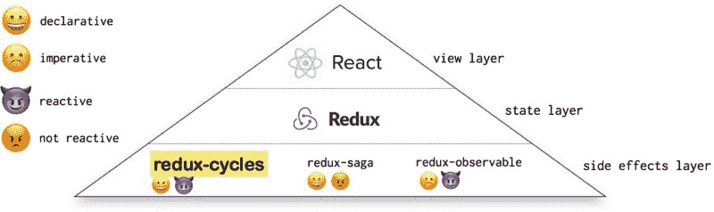
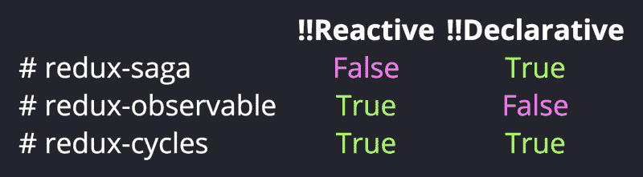
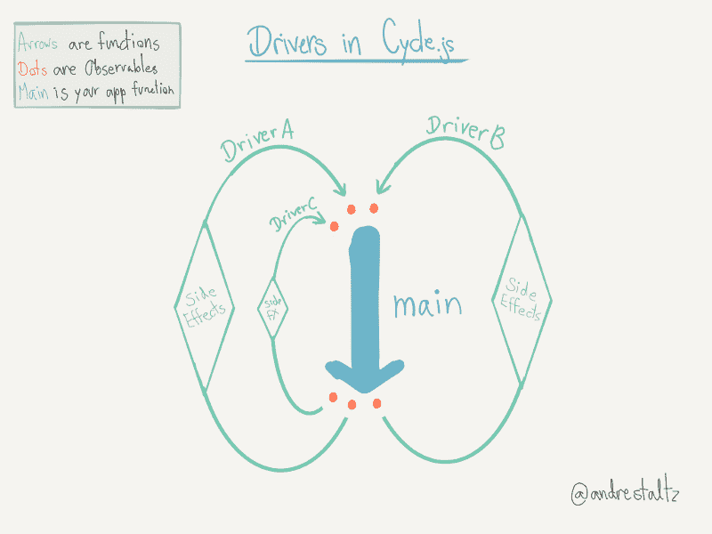
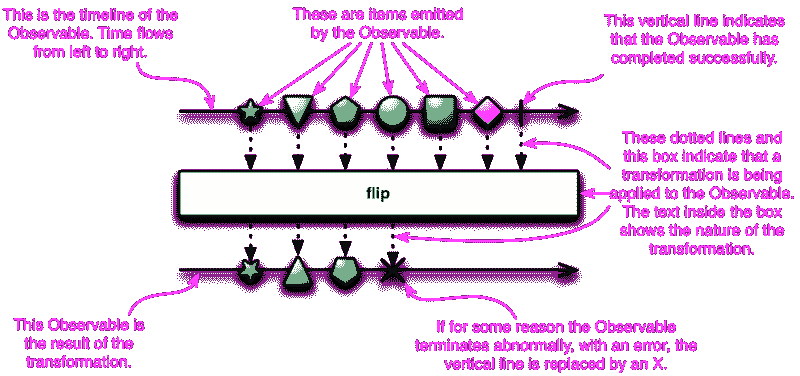
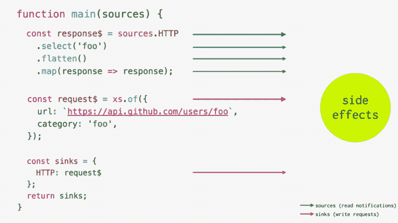
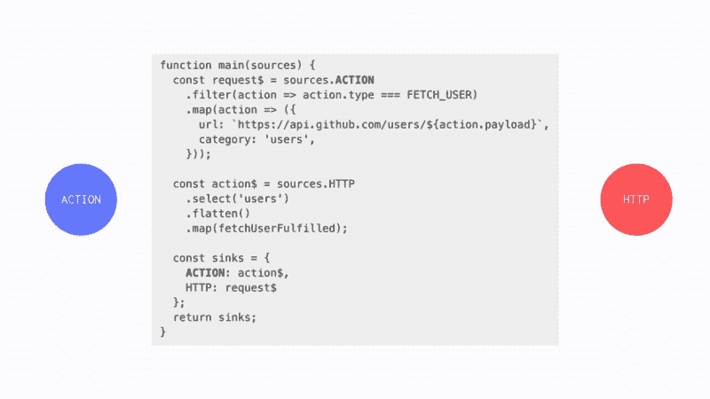
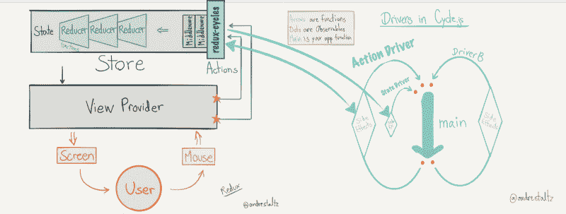
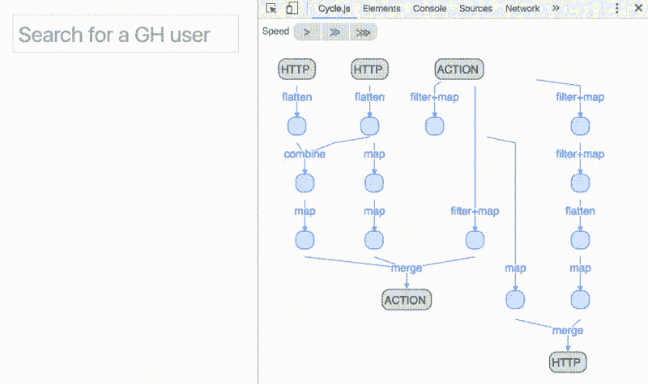
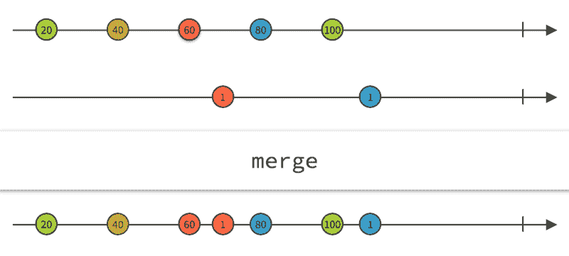

# 如何让您的 React 应用程序功能齐全、反应灵敏，并能够处理所有这些疯狂的…

> 原文：<https://www.freecodecamp.org/news/how-to-make-your-react-app-fully-functional-fully-reactive-and-able-to-handle-all-those-crazy-e5da8e7dac10/>

由卢卡事项

# 如何让你的 React 应用功能齐全，反应灵敏，并能够处理所有这些疯狂的副作用


函数式反应式编程(FRP)是一种范式，最近获得了很多关注，尤其是在 JavaScript 前端世界。这是一个超载的术语，但它描述了一个简单的想法:

> 一切都应该是纯粹的，所以很容易测试和推理**(功能)**，异步行为应该使用随时间变化的值进行建模**(反应)**。

React 本身并不是完全功能性的，也不是完全反应性的。但是它受到了 FRP 背后的一些概念的启发。[功能组件](https://facebook.github.io/react/docs/components-and-props.html)例如就其属性而言是纯功能。和[它们对道具或状态变化有反应](https://facebook.github.io/react/docs/react-component.html#updating)。

但是当涉及到**处理副作用**时，React——仅仅是视图层——需要其他库的帮助，比如 [Redux](https://github.com/reactjs/redux) 。

在这篇文章中，我将谈论 [redux-cycles](https://github.com/cyclejs-community/redux-cycles) ，这是一个 redux 中间件，它通过利用 [Cycle.js](https://cycle.js.org/) 框架，帮助你以功能反应的方式处理 React 应用程序中的副作用和异步代码——这是其他 Redux 副作用模型尚未共享的特性。



Redux-cycles is both declarative and reactive

### 有什么副作用？

一个副作用改变了外部世界。应用程序中处理 HTTP 请求、写入 localStorage 甚至操纵 DOM 的一切都被认为是副作用。

副作用不好。它们很难测试，维护起来很复杂，而且通常它们是你的大多数 bug 所在的地方。因此，你的目标是将它们最小化/本地化。


Two programmers after localizing side effectful code ([source](https://www.pexels.com/photo/sunset-beach-people-sunrise-40815/))

> “在存在副作用的情况下，程序的行为依赖于过去的历史；也就是说，评估的顺序很重要。因为理解一个有效的程序需要考虑所有可能的历史，副作用通常会使程序更难理解。诺曼·拉姆齐

以下是 Redux 中处理副作用的几种流行方法:

1.  将你的副作用代码放入动作创建器中
2.  [redux-saga](https://github.com/redux-saga/redux-saga) —使用 saga 使你的副作用逻辑声明化
3.  [redux-observable](https://github.com/redux-observable/redux-observable) —使用反应式编程对副作用进行建模

问题是，这些都不是纯粹的和反应性的。其中一些是纯的(redux-saga ),而另一些是反应性的(redux-observable ),但它们都不具备我们之前介绍的关于 FRP 的所有概念。

[](https://github.com/cyclejs-community/redux-cycles)****既是纯的又是无功的。****

**

Checkout [these redux-cycles slides](http://nick.balestra.ch/talk/redux-cycles/) by [Nick Balestra](https://www.freecodecamp.org/news/how-to-make-your-react-app-fully-functional-fully-reactive-and-able-to-handle-all-those-crazy-e5da8e7dac10/undefined)** 

**我们将首先更详细地解释这些功能性和反应性概念，以及为什么您应该关注这些概念。然后我们将详细解释 redux-cycles 是如何工作的。**

### **用 Cycle.js 处理纯副作用**

**HTTP 请求可能是最常见的副作用。下面是一个使用 redux-thunk 的 HTTP 请求示例:**

```
`function fetchUser(user) {  return (dispatch, getState) =>     fetch(`https://api.github.com/users/${user}`)}`
```

**这个功能是必不可少的。是的，这是对一个承诺的回应，你可以把它和其他承诺联系在一起，但`fetch()`是在那个特定的时刻打电话。它不纯。**

**这同样适用于 redux-observable:**

```
`const fetchUserEpic = action$ =>  action$.ofType(FETCH_USER)    .mergeMap(action =>      ajax.getJSON(`https://api.github.com/users/${action.payload}`)        .map(fetchUserFulfilled)    );`
```

**`ajax.getJSON()` 让这段代码变得势在必行。**

**为了使一个 HTTP 请求变得纯粹，你不应该考虑“现在就发出一个 HTTP 请求”,而应该考虑“让我描述一下我希望我的 HTTP 请求是什么样子的”,而不要担心它实际上什么时候发生或者是谁发出的。**

**在 [Cycle.js](https://cycle.js.org/) 中，这基本上就是你如何编码所有东西。你使用框架所做的一切都是为了创建你想要做的事情的描述。这些描述然后被发送给这些叫做 [**驱动**](https://cycle.js.org/drivers.html) (通过反应流)的东西，它们实际上负责发出 HTTP 请求:**

```
`function main(sources) {  const request$ = xs.of({    url: `https://api.github.com/users/foo`,  });`
```

```
 `return {    HTTP: request$  };}`
```

**正如您在这段代码中看到的，没有函数调用来实际发出请求。如果您运行这段代码，您将看到请求无论如何都会发生。那么幕后到底发生了什么呢？**

**奇迹的发生要感谢车手。Cycle.js 知道当您的函数返回一个带有`HTTP`键的对象时，它需要处理从这个流接收的消息，并相应地执行一个 HTTP 请求(通过一个 HTTP 驱动程序)。**

**

Drivers allow you to handle side effects in a pure way.** 

****关键的一点是，您没有消除副作用 HTTP 请求仍然需要发生——但是您在应用程序代码之外对它进行了本地化。****

**您的函数更容易推理，尤其是更容易测试，因为您可以简单地测试您的函数是否发出正确的消息——不需要奇怪的嘲笑或计时。**

### **反应性副作用**

**在前面的例子中，我们谈到了反应性。需要有一种方法来与这些所谓的司机就“在外部世界做事情”进行交流，并被通知“在外部世界发生的事情”。**

**对于这种异步通信来说，可观察对象(又名流)是完美的抽象。**

****

**每当你想“做某事”时，你就向输出流发出一个你想做的事情的描述。这些输出流在 Cycle.js 中被称为**接收器**。**

**每当您想要“得到关于发生的事情的通知”时，您使用一个输入流(称为 **sources** )并简单地映射流值来了解发生了什么。**

**这形成了一种**反应式** **循环**，这需要不同于普通命令式代码的思维来理解。让我们使用以下范例来模拟 HTTP 请求/响应生命周期:**

```
`function main(sources) {  const response$ = sources.HTTP    .select('foo')    .flatten()    .map(response => response);`
```

```
 `const request$ = xs.of({    url: `https://api.github.com/users/foo`,    category: 'foo',  });`
```

```
 `const sinks = {    HTTP: request$  };  return sinks;}`
```

**HTTP 驱动程序知道这个函数返回的`HTTP`键。它是一个包含 GitHub url 的 HTTP 请求描述的流。它告诉 HTTP 驱动程序:“我想向这个 url 发出一个请求”。**

**然后，驱动程序知道执行请求，并将响应作为源(`sources.HTTP`)发送回主函数—注意，接收器和源使用相同的对象键。**

**让我们再次解释一下:**我们使用`sources.HTTP`来“通知 HTTP 响应”。并且我们返回`sinks.HTTP`来“发出 HTTP 请求”。****

**为了解释这一重要的反应循环，这里有一个动画:**

**

Reactive loop between your app and the outside world** 

**与普通的命令式编程相比，这似乎是反直觉的:为什么读取响应的代码会在负责请求的代码之前存在？**

**这是因为代码在 FRP 中的什么位置并不重要。你所要做的就是发送描述，并倾听变化。代码顺序并不重要。**

**这允许非常容易的代码重构。**

### **引入冗余循环**

**

Redux-cycles is a combination of Redux and Cycle.js** 

**此时你可能会问，所有这些与我的 React 应用程序有什么关系？**

**你已经了解了通过只写你想做的事情的描述来使你的代码纯净的好处。你已经了解了使用可观察物体与外界交流的优势。**

**现在，您将看到如何在现有的 React 应用程序中使用这些概念，以实现完全的功能性和反应性。**

#### **拦截和调度 Redux 操作**

**使用 Redux，您可以分派动作来告诉 reducers 您想要一个新的状态。**

**这个流程是同步的，这意味着如果您想要引入异步行为(为了副作用)，您需要使用某种形式的中间件来拦截动作，产生异步副作用，并相应地发出其他动作。**

**这正是 [redux-cycles](https://github.com/cyclejs-community/redux-cycles) 所做的。它是一个中间件，拦截 redux 操作，进入 Cycle.js 反应循环，并允许您使用其他驱动程序执行其他副作用。然后，它根据函数中描述的异步数据流分派新的操作:**

```
`function main(sources) {  const request$ = sources.ACTION    .filter(action => action.type === FETCH_USER)    .map(action => ({      url: `https://api.github.com/users/${action.payload}`,      category: 'users',    }));  const action$ = sources.HTTP    .select('users')    .flatten()    .map(fetchUserFulfilled);  const sinks = {    ACTION: action$,    HTTP: request$  };  return sinks;}`
```

**在上面的例子中，redux-cycles 引入了一个新的源和汇— `**ACTION**`。但是交流模式是一样的。**

**它使用`sources.ACTION`监听 Redux 世界发出的动作。它通过返回`sinks.ACTION`向 Redux 世界分派新的动作。**

**具体来说，它发射标准的[通量动作对象](https://github.com/acdlite/flux-standard-action)。**

**最酷的事情是你可以把其他车手发生的事情结合起来。在前面的例子**中，`HTTP`世界发生的事情实际上触发了`ACTION`世界的变化，反之亦然**。**

**—注意，与 Redux 的通信完全通过`ACTION`源/接收器进行。Redux-cycles 的司机为您处理实际的调度。**

**

How different drivers interact with each other** 

### **更复杂的应用程序呢？**

**如果你只是编写转换数据流的纯函数，如何开发更复杂的应用程序呢？**

**事实证明，使用已经构建好的驱动程序，你几乎可以做任何事情。或者你可以很容易地构建你自己的——这里有一个简单的驱动程序，它记录写到它的接收器的消息。**

```
`run(main, {  LOG: msg$ => msg$.addListener({    next: msg => console.log(msg)  })});`
```

**`run`是 Cycle.js 的一部分，它运行您的主函数(第一个参数)并传递所有驱动程序(第二个参数)。**

**Redux-cycles 引入了两个驱动程序，允许你与 Redux 通信；`makeActionDriver()` & `makeStateDriver()`:**

```
`import { createCycleMiddleware } from 'redux-cycles';`
```

```
`const cycleMiddleware = createCycleMiddleware();const { makeActionDriver, makeStateDriver } = cycleMiddleware;`
```

```
`const store = createStore(  rootReducer,  applyMiddleware(cycleMiddleware));`
```

```
`run(main, {  ACTION: makeActionDriver(),  STATE: makeStateDriver()})`
```

**`makeStateDriver()`是只读驱动程序。这意味着您只能在主函数中读取`sources.STATE`。你不能告诉它做什么；你只能从中读取数据。**

**每次 Redux 状态改变时，`sources.STATE`流都会发出新的状态对象。当你需要根据应用程序的当前状态编写特定的逻辑时，这是很有用的[。](https://github.com/cyclejs-community/redux-cycles#drivers)**

**

Redux and Cycle.js are kept separate. They only communicate via redux-cycles drivers.** 

### **复杂异步数据流**

**

Observables come with operators, allowing you to build complex async flows** 

**反应式编程的另一个巨大优势是能够使用操作符将流组合成其他流——随着时间的推移，有效地将它们视为值的数组:您可以`[map](https://github.com/Reactive-Extensions/RxJS/blob/master/doc/gettingstarted/categories.md)` [、`filter`甚至`reduce`](https://github.com/Reactive-Extensions/RxJS/blob/master/doc/gettingstarted/categories.md) 它们。**

**运算符使显式数据流图成为可能；即推理操作之间的依赖关系。允许您像上面的动画一样可视化流经各种运算符的数据。**

**Redux-observable 还允许您编写复杂的异步流——他们使用一个多路复用 WebSocket 示例作为卖点——然而，以一种纯粹的方式编写这些流的能力才是真正让 Cycle.js 与众不同的地方。**

> **由于一切都是纯数据流，我们可以想象未来编程将只不过是把操作符块组合在一起。**

### **用大理石图测试**

**

A marble diagram. Each arrow represents a stream. Each circle is a value emitted on that stream.** 

**最后但同样重要的是测试。这是 redux-cycles(以及所有 Cycle.js 应用程序)真正闪光的地方。**

**因为在你的应用程序代码中一切都是纯的，为了测试你的主函数，你只需给它流作为输入，并期望特定的流作为输出。**

**使用精彩的 [@cycle/time](https://github.com/cyclejs/time) 项目，你甚至可以绘制[大理石图](http://rxmarbles.com/)并以非常直观的方式测试你的功能:**

```
`assertSourcesSinks({  ACTION: { '-a-b-c----|': actionSource },  HTTP:   { '---r------|': httpSource },}, {  HTTP:   { '---------r|': httpSink },  ACTION: { '---a------|': actionSink },}, searchUsers, done);`
```

**[这段代码](https://github.com/cyclejs-community/redux-cycles/blob/master/example/cycle/test/test.js)执行`[searchUsers](https://github.com/cyclejs-community/redux-cycles/blob/master/example/cycle/index.js#L31)`函数，将特定的源作为输入传递给它(第一个参数)。给定这些源，它期望函数返回提供的接收器(第二个参数)。如果没有，断言就会失败。**

**当您需要测试异步行为时，以这种方式图形化定义流特别有用。**

**当`HTTP`源发出`r`(响应)时，你马上会期望`a`(动作)出现在`ACTION`接收器中——它们同时发生。然而，当`ACTION`源发出一阵`-a-b-c`时，你不要指望在那一瞬间`HTTP`接收器中会出现任何东西。**

**这是因为`searchUsers`意在对其接收的动作进行去抖。它只会在动作源码流不活动 800 毫秒后发送一个 HTTP 请求:它实现了自动完成功能。**

**对于纯函数和反应函数来说，测试这种异步行为是微不足道的。**

### **结论**

**在这篇文章中，我们解释了玻璃钢的真正力量。我们介绍了 Cycle.js 及其新颖的范例。如果你想了解这项技术的更多信息，Cycle.js [awesome list](https://github.com/cyclejs-community/awesome-cyclejs) 是一个重要的资源。**

**单独使用 Cycle.js 不使用 React 或 Redux——需要一点心态上的转变，但如果您愿意放弃 React/Redux 社区中的一些技术和资源，这是可以做到的。**

**另一方面，Redux-cycles 允许您在使用 FRP 和 Cycle.js 的同时继续使用所有优秀的 React 工具。**

**特别感谢 [Gosha Arinich](https://www.freecodecamp.org/news/how-to-make-your-react-app-fully-functional-fully-reactive-and-able-to-handle-all-those-crazy-e5da8e7dac10/undefined) 和 [Nick Balestra](https://www.freecodecamp.org/news/how-to-make-your-react-app-fully-functional-fully-reactive-and-able-to-handle-all-those-crazy-e5da8e7dac10/undefined) 与我一起维护该项目，并感谢 [Nick Johnstone](https://twitter.com/widdnz) 校对本文。**