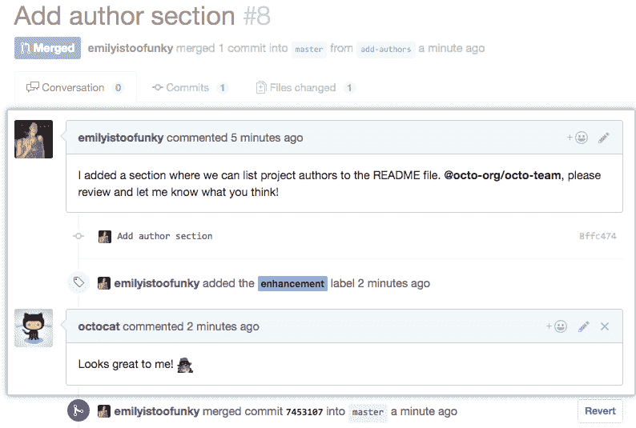

# 如何让你的开发团队更有效率

> 原文：<https://www.freecodecamp.org/news/how-to-make-your-team-more-productive/>

无论你是初创公司的创始人还是长期开发团队的经理，你都希望你的开发团队尽可能地高效。

这里有一些技巧，你可以用来帮助你的团队改进，变得更有效率，更快地交付项目。

## 工程师提高团队生产力的方法

为你的团队提供合适的工具的重要性怎么强调都不为过。这不是唯一重要的因素，我们后面会看到，但它肯定能让某些过程进行得更顺利。

例如，由于代码调试是开发人员需要执行的最乏味的任务之一，您可以为您的团队配备工具，帮助他们更快、更方便地进行调试。

假设您观察到您的开发人员，他们在世界的不同地方远程工作，正被调试代码所困扰。

调试自己的代码已经够有挑战性了。但是如果你不得不调试其他人的程序——而他们生活在不同的时区——这会导致大量的延迟。

使用调试器可以帮助管理这样的问题，并使整个团队更快、更有效。

### 超越体制——面向人民

然而，提高生产力不仅仅是找到合适的工具来完成工作。开发团队是一群人，而不仅仅是代码。而人类是复杂的有机体。

此外，软件开发人员是非常聪明的个体。因此，如果他们所做的事情没有挑战性，他们往往表现不好。

关键是不要只从系统层面来看生产力。你还需要看到这个系统中的人。

这是我在大多数初创公司创始人或开发团队经理身上看到的一个大问题。大多数人忽视培养领导技能。

一个开发团队和其他类型的团队没有什么不同。它是一群人为了完成一个目标而聚集在一起。无论你认为你的团队应该有多“水平”,最终如果没有领导，它将会分崩离析。

作为一个热衷于学习领导力的人，我将从约翰·C·麦斯威尔的《团队合作的 17 条无可争议的法则》中汲取一些智慧。

## 确保你的团队有愿景

愿景为团队指明方向。它提供了一个战斗口号，将使每个成员在情感上投入到团队的目标中。

愿景还能确保个人成就不会成为毫无意义的战利品。每个成员现在可以将他们的个人目标与整个团队最终想要实现的目标联系起来。

例如，看看苹果的愿景声明:

> “我们在地球上制造伟大的产品，这一点不会改变。我们不会满足于任何不优秀的东西。”

有了这种愿景，每个团队成员都会相信他们编写的每一行代码都有助于创造出优秀的产品，并且不会满足于任何不优秀的东西。

生产力自然会产生，因为每个成员都会对他们对团队的贡献有更高的看法。

## 关注你团队的优势

团队中有有才华的开发人员并不一定意味着卓越的性能。团队中的每个成员都有特定的专长，需要在针对该专长的正确任务中加以利用。

团队的动态变化取决于成员的位置。例如，将一个人安排在错误的任务中，你会得到一个混乱的团队。或者更糟，它会产生挫败感(和怨恨)。

但是将正确的人与正确的任务配对将会在团队中创造进步和高水平的动力(以及生产力)。

那么，你如何确保自己专注于团队的优势呢？这里有一些提示:

1.  你个人必须熟悉团队愿景和共同价值观的每个方面。
2.  你不仅要熟悉团队的愿景和核心价值观，还要知道如何根据不同情况调整团队。僵化和不愿适应会扼杀生产力。
3.  作为一名领导者，你应该亲自了解每个成员，这一点很重要，这样你就可以很容易地了解他们更适合做哪些工作。

## 不断改善沟通

这听起来可能是老生常谈，但我不能过分强调沟通的重要性。

软件开发人员，尤其是当他们戴着耳机处于“最佳状态”时，会把自己与外界隔绝开来。他们这样做是为了集中注意力。

太棒了。编码是一门艺术。编码者是艺术家。任何分心都会毁掉杰作。

但这并不意味着我们不能引入鼓励每个人畅所欲言和分享想法的系统和工具。

[站立会议](https://blog.bird-office.com/en/2017/08/23/advantages-stand-meeting/)为每个人提供了一个简短但非常有效的方式来了解团队的最新进展。

Slack 或 Telegram 等通信工具确保信息在[实时](https://smallbusiness.chron.com/pros-using-im-workplace-10534.html)共享。

Github 和 Gitlab 也有允许团队讨论问题并解决问题的工具。

例如，团队成员可以审查彼此的代码，并确保在改进发布的代码方面进行适当的协作:

Image courtesy of: https://docs.github.com/en/github/collaborating-with-issues-and-pull-requests/commenting-on-a-pull-request

## 结论

底线是增加你的开发团队的生产力是任务系统化(比如给他们配备合适的工具)和增强他们作为人的潜力的混合。

这不仅能确保你有一个高效的团队，还能让一群快乐的人避免精疲力尽，享受做他们最擅长的事情。