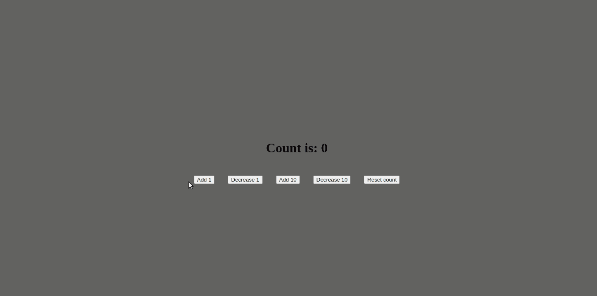
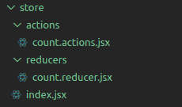

# 如何在 React 应用中管理状态——使用钩子、Redux 等等

> 原文：<https://www.freecodecamp.org/news/how-to-manage-state-in-a-react-app/>

嗨！在本文中，我们将了解在 React 应用程序中管理状态的许多方法。

我们将从讨论什么是状态开始，然后讨论可以用来管理它的许多工具。

我们将看看简单的 useState 钩子，并学习更复杂的库，如 Redux。然后，我们将检查最近的选项，如反冲和 Zustand。

## 目录

*   React 中的状态是什么？
*   [如何使用使用状态挂钩](#howtousetheusestatehook)
    *   [如何使用 useEffect 读取状态更新](#howtouseuseeffecttoreadstateupdates)
    *   [如何向状态更新函数传递回调](#howtopassacallbacktostateupdatefunction)
*   [管理规模和复杂性](#managingscaleandcomplexity)
    *   [反应上下文](#reactcontext)
    *   [如何使用 UseReducer 挂钩](#howtousetheusereducerhook)
    *   【Redux 呢？
*   [Redux 的替代方案](#alternativestoredux)
    *   [Redux 工具包](#reduxtoolkit)
        *   [提及 Redux Thunk 和 Redux Saga](#amentionforreduxthunkandreduxsaga)
    *   [反冲](#recoil)
    *   [的作者](#jotai)
    *   [祖斯坦德](#zustand)
*   [结论](#conclusion)

# React 中的状态是什么？

在 modern React 中，我们用**功能组件**构建我们的应用程序。组件本身是 JavaScript 函数，独立且**可重用的**位代码。

用组件构建应用程序的目的是拥有一个模块化的体系结构，有一个清晰的关注点分离。这使得代码更容易理解，更容易维护，并且在可能的情况下更容易重用。

**状态是保存关于某个组件的信息**的对象。普通的 JavaScript 函数不具备存储信息的能力。其中的代码会执行，并在执行完成后“消失”。

但是多亏了状态，React 功能组件甚至可以在执行后存储信息。当我们需要一个组件来存储或“记忆”某些东西，或者根据环境以不同的方式行动时，状态就是我们使它以这种方式工作所需要的。

值得一提的是，并不是 React 应用程序中的所有组件都必须有状态。还有一些无状态组件，它们只是呈现内容，而不需要存储任何信息，这就很好。

另一个需要提及的重要事情是，状态变化是使 React 组件重新呈现的两个因素之一(另一个是道具的变化)。通过这种方式，状态存储关于组件的信息，并控制其行为。

# 如何使用 UseState 挂钩

为了在我们的组件中实现状态，React 为我们提供了一个名为 **useState** 的钩子。让我们通过下面的例子来看看它是如何工作的。

我们将使用经典的计数器示例，其中我们显示一个数字，我们有几个按钮来增加、减少或重置该数字。

这是一个很好的应用程序的例子，我们需要存储一条信息，并在每次信息改变时呈现不同的内容。



该应用程序的代码如下所示:

```
// App.js
import { useState } from 'react'

function App() {

  const [count, setCount] = useState(0)

  return (
    <div className="App">
      <p>Count is: {count}</p>

      <div>
        <button onClick={() => setCount(count+1)}>Add 1</button>
        <button onClick={() => setCount(count-1)}>Decrease 1</button>

        <button onClick={() => setCount(count+10)}>Add 10</button>
        <button onClick={() => setCount(count-10)}>Decrease 10</button>

        <button onClick={() => setCount(0)}>Reset count</button>
      </div>
    </div>
  )
}

export default App 
```

*   首先我们从 React: `import { useState } from 'react'`导入钩子

*   然后我们初始化状态: `const [count, setCount] = useState(0)`

这里我们为状态提供了一个变量名(`count`)和一个函数名，我们将在每次需要更新状态时使用这个函数名(`setCount`)。最后，我们设置状态的初始值(`0`)，这将是应用程序每次启动时默认加载的值。

*   最后，如上所述，每次我们想要更新状态时，我们都必须使用我们声明的函数:`setCount`要使用它，我们只需要调用它，并将我们想要的新状态作为参数传递给它。也就是说，如果我们要在之前的 estate 上加 1，我们就调用`setCount(count+1)`。

如前所述，这将导致状态更新，从而重新呈现组件。在我们的应用程序中，这意味着我们将在屏幕上看到计数器在上升。

## 如何使用 useEffect 读取状态更新

值得一提的是，setState 函数是异步的。因此，如果我们尝试在更新状态后立即读取它，就像这样:

```
<button onClick={() => {
          setCount(count+1)
          console.log(count)
}}>Add 1</button> 
```

在没有更新的情况下，我们将获得状态的先前值。

更新后读取状态的正确方法是使用 **useEffect** 钩子。它让我们在每个组件重新呈现后(默认情况下)或在我们声明的任何特定变量更改后执行一个函数。

大概是这样的:

```
useEffect(() => console.log(value), [value]) 
```

## 如何向状态更新函数传递回调

此外，当考虑到非常频繁和快速的状态更改时，useState 是异步的这一事实也有所暗示。

例如，假设一个用户连续多次按下 ADD 按钮，或者一个循环发出一定次数的 click 事件。

通过更新像`setCount(count+1)`这样的状态，我们冒着在下一个事件被触发时`count`还没有被更新的风险。

比如说开始的时候`count = 0`。然后调用`setCount(count+1)`，异步更新状态。
但是在状态更新完成之前，再次调用`setCount(count+1)`。这意味着仍然是`count = 0`，这意味着第二个`setCount`不会正确地更新状态。

更具防御性的方法是给`setCount`一个回调，就像这样:`setCount(prevCount => prevCount+1)`

这确保了要更新的值是最新的值，并使我们远离上面提到的问题。每次我们对以前的状态执行更新时，我们都应该使用这种方法。

# 管理规模和复杂性

迄今为止，国家管理似乎是小菜一碟。我们只需要一个钩子、一个值和一个函数来更新它，就可以开始了。

但是一旦应用程序变得越来越大越来越复杂，仅仅使用它可能会引发一些问题。

## 反应上下文

第一个可能出现的问题是，当我们有很多嵌套的组件，我们需要很多“兄弟”组件来共享相同的状态。

这里显而易见的答案是“提升”状态，这意味着父组件将保存状态，并将其作为道具传递给子组件。

这很好，但是当我们有许多嵌套组件时，我们可能需要通过许多组件级别传递道具。这被称为**“道具训练”**，不仅看起来很难看，而且会产生难以维护的代码。

道具钻还会导致**不必要的重新渲染**，这会影响我们应用的性能。如果在我们的父组件(存储状态)和我们的子组件(消费状态)之间有其他组件(“中间组件”)，我们也需要通过这些中间组件传递道具，即使它们不需要道具。

这意味着当道具改变时，这些“中间组件”将重新渲染，即使它们没有什么不同的要渲染。

对此的解决方案是使用 **React context** ，简而言之，这是一种创建包装器组件的方法，该组件包装我们想要的任何组件组，并可以将属性直接传递给这些组件，而不需要“钻取”不一定使用该状态的组件。

使用上下文时要注意的是，当上下文状态改变时，所有接收到该状态的包装组件都将重新呈现。根据具体情况，这可能是不必要的，也可能导致性能问题。

因此，平衡我们是否真的需要使一个状态对许多组件可用，或者我们是否可以只将它保存在单个组件的本地，这总是很重要的。如果我们需要让它对许多组件可用，把它放在上下文中真的是一个好主意吗，或者我们只是把它提升一个层次。

肯特·C·多兹有一篇关于这个话题的很酷的文章。

## 如何使用 UseReducer 挂钩

另一个问题可能会出现在使用 useState 时，在这种情况下，要设置的新状态依赖于以前的状态(就像我们的 count 示例)，或者在应用程序中状态变化非常频繁时。

在这些情况下，useState 可能会引发一些意外和不可预测的行为。进来**减速机**解决这个问题。

一个 **reducer** 是一个纯函数，它把前一个状态和一个动作作为自变量，返回下一个状态。之所以称之为 reducer，是因为它与传递给数组的函数类型相同: `Array.prototype.reduce(reducer, initialValue)`。

useReducer 是钩子 Reacts 提供的，让我们实现 Reducer 来管理我们的状态。使用这个挂钩，我们之前的示例应用程序将如下所示:

```
// App.js
import { useReducer } from 'react'
import './App.scss'

function App() {

  function reducer(state, action) {
    switch (action.type) {
      case 'ADD': return { count: state.count + 1 }
      case 'SUB': return { count: state.count - 1 }
      case 'ADD10': return { count: state.count + 10 }
      case 'SUB10': return { count: state.count - 10 }
      case 'RESET': return { count: 0 }
      default: return state
    }
  }

  const [state, dispatch] = useReducer(reducer, { count: 0 })  

  return (
    <div className="App">
      <p>Count is: {state.count}</p>

      <div>
        <button onClick={() => dispatch({type: 'ADD'})}>Add 1</button>

        <button onClick={() => dispatch({type: 'SUB'})}>Decrease 1</button>

        <button onClick={() => dispatch({type: 'ADD10'})}>Add 10</button>
        <button onClick={() => dispatch({type: 'SUB10'})}>Decrease 10</button>

        <button onClick={() => dispatch({type: 'RESET'})}>Reset count</button>
      </div>
    </div>
  )
}

export default App 
```

*   我们再次从 React: `import { useReducer } from 'react'`导入钩子开始

*   然后，我们将声明一个 reducer 函数，它将当前状态和要对其执行的操作作为参数。在其中，它将有一个 switch 语句，该语句将读取动作类型，对状态执行相应的动作，并返回更新后的状态。

> 通常的做法是在 reducers 上使用 switch 语句和大写字母来声明动作。；)

```
function reducer(state, action) {
    switch (action.type) {
      case 'ADD': return { count: state.count + 1 }
      case 'SUB': return { count: state.count - 1 }
      case 'ADD10': return { count: state.count + 10 }
      case 'SUB10': return { count: state.count - 10 }
      case 'RESET': return { count: 0 }
      default: return state
    }
  } 
```

*   之后，是时候声明我们的 **useReducer** 钩子了，它看起来与 useState 钩子非常相似。我们为我们的状态(在我们的例子中为“state”)声明一个**值，我们将使用一个**函数来修改它**(“dispatch”)，然后 useReducer 将把**缩减函数**作为第一个参数，把**默认状态**作为第二个参数。**

```
const [state, dispatch] = useReducer(reducer, { count: 0 }) 
```

*   最后，为了更新我们的状态，我们不会直接调用 reducer，而是调用我们刚刚创建的函数(‘dispatch’)，向它传递我们想要执行的相应动作类型。在后台，dispatch 函数将与 reducer 连接，并实际修改状态。

```
<button onClick={() => dispatch({type: 'ADD'})}>Add 1</button> 
```

这比使用 useState 要老套得多，但是 useReducer 毕竟没有那么复杂。

综上所述，我们只需要:

*   一个缩减器，它是整合所有可能的状态变化的函数
*   一个调度函数，它将修改动作发送给 reducer。

这里的问题是 UI 元素不能像以前那样用值调用 setState 时那样直接更新状态。现在他们将不得不调用一个动作类型并通过缩减器，这使得状态管理更加模块化和可预测。；)

## Redux 呢？

[Redux](https://redux.js.org/) 是一个由来已久的库，在 React 环境中被广泛使用。

Redux 是一个工具，它可以解决前面提到的两个问题(prop drilling 和在频繁和复杂的状态变化时不可预测的状态行为)。

值得一提的是，Redux 是一个不可知的库，这意味着它可以在任何前端应用程序上实现，而不仅仅是 React。

Redux 工具集与我们刚刚看到的 useReducer 非常相似，但是多了一些东西。Redux 中有三个主要构件:

*   **存储** —保存应用程序状态数据的对象
*   **reducer**——返回一些状态数据的函数，由一个动作类型触发
*   **一个动作**——一个告诉减速器如何改变状态的对象。它必须包含类型属性，并且可以包含可选的有效负载属性

实现 Redux 后，我们的示例应用程序将如下所示:

```
// App.js
import './App.scss'

import { Provider, useSelector, useDispatch } from 'react-redux'
import { addOne, subOne, addSome, subSome, reset } from './store/actions/count.actions'

import store from './store'

function App() {

  const dispatch = useDispatch()
  const count = useSelector(state => state.count)

  return (
    <Provider store={store}>
      <div className="App">
        <p>Count is: {count}</p>

        <div>
          <button onClick={() => dispatch(addOne())}>Add 1</button>

          <button onClick={() => dispatch(subOne())}>Decrease 1</button>

          <button onClick={() => dispatch(addSome(10))}>Add 10</button>
          <button onClick={() => dispatch(subSome(10))}>Decrease 10</button>

          <button onClick={() => dispatch(reset())}>Reset count</button>
        </div>
      </div>
    </Provider>
  )
}

export default App 
```

此外，我们现在需要一个新的**存储**目录，以及相应的存储、缩减器和动作文件。



```
// index.js (STORE)
import { createStore } from 'redux'
import CountReducer from './reducers/count.reducer'

export default createStore(CountReducer) 
```

```
// count.reducer.js
import { ADD, SUB, ADDSOME, SUBSOME, RESET } from '../actions/count.actions'

const CountReducer = (state = { count: 0 }, action) => {
    switch (action.type) {
      case ADD: return { count: state.count + 1 }
      case SUB: return { count: state.count - 1 }
      case ADDSOME: return { count: state.count + action.payload }
      case SUBSOME: return { count: state.count - action.payload }
      case RESET: return { count: 0 }
      default: return state
    }
}

export default CountReducer 
```

```
// count.actions.js
export const ADD = 'ADD'
export const addOne = () => ({ type: ADD })

export const SUB = 'SUB'
export const subOne = () => ({ type: SUB })

export const ADDSOME = 'ADDSOME'
export const addSome = (value) => ({
    type: ADDSOME,
    payload: value
})

export const SUBSOME = 'SUBSOME'
export const subSome = (value) => ({
    type: SUBSOME,
    payload: value
})

export const RESET = 'RESET'
export const reset = () => ({ type: RESET }) 
```

这是比我们之前看到的更多的样板文件(这是 Redux 主要被批评的地方)，所以让我们把它分成几部分:

*   正如我提到的，Redux 是一个外部库，所以在做任何事情之前，我们需要通过运行`npm i redux react-redux`来安装它。`redux`将带来我们管理状态所需的核心函数，`react-redux`将安装一些很酷的钩子来轻松读取和修改组件的状态。

*   现在，首先是**商店**。在 Redux 中，商店是拥有所有应用程序状态信息的实体。多亏了 Redux，我们将能够从任何想要的组件访问商店(就像使用上下文一样)。

为了创建一个商店，我们导入了`createStore`函数，并将一个缩减器作为输入传递给它。

知道您也可以组合不同的 reducer，并将其传递给同一个存储，以防您想要将关注点分离到不同的 reducer 中。

```
import { createStore } from 'redux'
import CountReducer from './reducers/count.reducer'

export default createStore(CountReducer) 
```

*   然后是**减速器**，它的工作原理和我们见过的 useReducer 一模一样。它将默认状态和一个动作作为参数，然后在其中有一个 switch 语句来读取动作类型，执行相应的状态修改，并返回更新后的状态。

```
import { ADD, SUB, ADDSOME, SUBSOME, RESET } from '../actions/count.actions'

const CountReducer = (state = { count: 0 }, action) => {
    switch (action.type) {
      case ADD: return { count: state.count + 1 }
      case SUB: return { count: state.count - 1 }
      case ADDSOME: return { count: state.count + action.payload }
      case SUBSOME: return { count: state.count - action.payload }
      case RESET: return { count: 0 }
      default: return state
    }
}

export default CountReducer 
```

*   然后是**动作**。动作是我们将要用来告诉 reducer 如何更新状态的。在代码中你可以看到，对于每个动作，我们都声明了常量来使用它们而不是普通的字符串(这是一个提高可维护性的好习惯)，以及只返回一个类型或者一个类型和一个有效载荷的函数。为了改变状态，我们将从组件中调度这些函数。；)

请注意，我对这个例子做了一点修改，以便展示在讨论动作时有效负载的含义。如果我们想在调度一个动作时从组件传递一个参数，**有效载荷就是该信息将要出现的地方**。

在这个例子中，你可以看到当我们调用 ADDSOME/SUBSOME 时，我们可以直接从组件中传递我们想要加/减的数字。

```
export const ADD = 'ADD'
export const addOne = () => ({ type: ADD })

export const SUB = 'SUB'
export const subOne = () => ({ type: SUB })

export const ADDSOME = 'ADDSOME'
export const addSome = value => ({
    type: ADDSOME,
    payload: value
})

export const SUBSOME = 'SUBSOME'
export const subSome = value => ({
    type: SUBSOME,
    payload: value
})

export const RESET = 'RESET'
export const reset = () => ({ type: RESET }) 
```

*   最后是我们的组件。这里我们有 3 点需要注意:

1.  首先，我们有一个接收**商店**作为道具的**提供者**组件。这是从包装在其中的所有组件访问我们的存储的授权。

2.  然后我们有一个名为 **useDispatch()** (我们将使用它来分派动作)的钩子和另一个名为 **useSelector()** (我们将使用它来从存储中读取状态)。

3.  最后，请注意我们正在**调度我们在 actions 文件中声明的函数**，并在对应时传递一个值作为输入。这个值是动作的有效负载，也是 reducer 用来修改状态的值。；)

```
import './App.scss'

import { useSelector, useDispatch } from 'react-redux'
import { addOne, subOne, addSome, subSome, reset } from './store/actions/count.actions'

function App() {

  const dispatch = useDispatch()
  const count = useSelector(state => state.count)

  return (
      <div className="App">
        <p>Count is: {count}</p>

        <div>
          <button onClick={() => dispatch(addOne())}>Add 1</button>

          <button onClick={() => dispatch(subOne())}>Decrease 1</button>

          <button onClick={() => dispatch(addSome(10))}>Add 10</button>
          <button onClick={() => dispatch(subSome(10))}>Decrease 10</button>

          <button onClick={() => dispatch(reset())}>Reset count</button>
        </div>
      </div>
  )
}

export default App 
```

Redux 是一个很好的工具，可以同时解决两个问题(道具钻取和复杂的状态变化)。尽管如此，它确实产生了许多样板文件，并使状态管理成为一个难以理解的主题，特别是在处理不同的文件和实体(如动作、reducers、存储)时...

这里要提到的一件重要的事情是，这些管理状态的工具或方法并不相互排斥，它们可以并且可能应该同时使用，各自解决它们擅长的特定问题。

在 Redux 的情况下，问题是处理**全局状态**(意味着影响整个应用程序或其中很大一部分的状态)。像我们的例子那样使用 Redux 来处理计数器或者打开和关闭一个模态是没有意义的。

一个很好的黄金法则是组件状态的使用状态，应用状态的还原状态。

# Redux 的替代方案

如果这个主题对您来说还不够复杂，那么在过去几年中，出现了许多新的库来替代 Redux，每一个都有自己的状态管理方法。

只是为了得到一个好的概述，让我们快速了解他们。

## Redux 工具包

Redux toolkit 是一个构建在 Redux 之上的库，旨在消除 Redux 生成的一些复杂性和样板文件。

Redux toolkit 建立在两个基础之上:

*   一个**商店**，它的工作方式与普通的 Redux 商店完全一样
*   和**片**，它们将简单的 Redux 动作和 reducers 压缩成一个单一的东西

实现 Redux Toolkit，我们的示例应用程序将如下所示:

```
// App.js
import './App.scss'

import { useSelector, useDispatch } from 'react-redux'
import { addOne, subOne, addSome, subSome, reset } from './store/slices/count.slice'

function App() {

  const dispatch = useDispatch()
  const count = useSelector(state => state.counter.count)

  return (
      <div className="App">
        <p>Count is: {count}</p>

        <div>
          <button onClick={() => dispatch(addOne())}>Add 1</button>

          <button onClick={() => dispatch(subOne())}>Decrease 1</button>

          <button onClick={() => dispatch(addSome(10))}>Add 10</button>
          <button onClick={() => dispatch(subSome(10))}>Decrease 10</button>

          <button onClick={() => dispatch(reset())}>Reset count</button>
        </div>
      </div>
  )
}

export default App 
```

```
// index.js
import React from 'react'
import ReactDOM from 'react-dom'
import App from './App'
import { Provider } from 'react-redux'
import store from './store/index'

ReactDOM.render(
  <React.StrictMode>
    <Provider store={store}>
      <App />
    </Provider>
  </React.StrictMode>,
  document.getElementById('root')
) 
```

```
// Index.jsx (STORE)
import { configureStore } from '@reduxjs/toolkit'
import counterReducer from './slices/count.slice'

export const store = configureStore({
  reducer: {
      counter: counterReducer
  },
})

export default store 
```

```
// count.slice.jsx
import { createSlice } from '@reduxjs/toolkit'

const initialState = { count: 0 }

export const counterSlice = createSlice({
  name: 'counter',
  initialState,
  reducers: {
    addOne: state => {state.count += 1},
    subOne: state => {state.count -= 1},
    addSome: (state, action) => {state.count += action.payload},
    subSome: (state, action) => {state.count -= action.payload},
    reset: state => {state.count = 0}
  },
})

export const { addOne, subOne, addSome, subSome, reset } = counterSlice.actions

export default counterSlice.reducer 
```

*   首先我们需要通过运行`npm install @reduxjs/toolkit react-redux`来**安装**

*   在我们的**商店**上，我们从 Redux toolkit 导入`configureStore`函数，并通过调用该函数并向其传递一个带有 reducer 的对象来创建商店，Redux toolkit 本身是一个包含切片的对象。

```
export const store = configureStore({
  reducer: {
      counter: counterReducer
  },
}) 
```

*   一个**片段**，正如我提到的，是一种将动作和缩减器浓缩到同一个事物中的方法。我们从 Redux toolkit 导入`createSlice`函数，然后声明初始状态并初始化切片。

这个函数将接收片的名称、初始状态和我们将从组件中调度的函数作为参数，以便修改状态。

请注意，这里没有动作。UI 将直接调用 reducer 函数。这就是复杂性 Redux 工具包“带走”的东西。

```
export const counterSlice = createSlice({
  name: 'counter',
  initialState,
  reducers: {
    addOne: state => {state.count += 1},
    subOne: state => {state.count -= 1},
    addSome: (state, action) => {state.count += action.payload},
    subSome: (state, action) => {state.count -= action.payload},
    reset: state => {state.count = 0}
  },
}) 
```

*   在 index.js 上，我们将应用程序包装在一个提供者组件中，这样我们就可以从任何地方访问状态。

```
 <Provider store={store}>
      <App />
    </Provider> 
```

*   最后，从我们的组件中，我们使用钩子读取状态并分派修改函数，就像使用普通 Redux 一样。

```
function App() {

  const dispatch = useDispatch()
  const count = useSelector(state => state.counter.count)

  return (
      <div className="App">
        <p>Count is: {count}</p>

        <div>
          <button onClick={() => dispatch(addOne())}>Add 1</button>

          <button onClick={() => dispatch(subOne())}>Decrease 1</button>

          <button onClick={() => dispatch(addSome(10))}>Add 10</button>
          <button onClick={() => dispatch(subSome(10))}>Decrease 10</button>

          <button onClick={() => dispatch(reset())}>Reset count</button>
        </div>
      </div>
  )
} 
```

Redux toolkit 旨在成为处理 Redux 的一种更简单的方式，但在我看来，它仍然是几乎相同的样板文件，与普通的 Redux 没有太大的区别。

### 提到 Redux Thunk 和 Redux Saga

[Redux thunk](https://github.com/reduxjs/redux-thunk) 和 [Redux Saga](https://redux-saga.js.org/) 是另外两个流行的中间件库，与**和**Redux 一起使用。

具体来说，Thunk 和 Saga 都是在处理副作用或同步任务时使用的。

## 报应


[反冲](https://recoiljs.org/)是一个开源的状态管理库，由脸书(或 Meta，随便什么)专门为 React 构建...).根据他们网站的说法，反冲是为了“最小化和反应性”而构建的，从某种意义上来说，它看起来和感觉上都像普通的反应代码。

反冲是基于**原子**的想法。引用他们的文件，

> “一个原子代表一片状态。原子可以从任何组件中读取和写入。读取原子值的组件隐式订阅该原子，因此任何原子更新都将导致订阅该原子的所有组件的重新呈现”。

使用反冲，我们的示例应用程序将如下所示:

```
// App.js
import countState from './recoil/counter.atom'
import './App.scss'

import { useRecoilState } from 'recoil'

function App() {

  const [count, setCount] = useRecoilState(countState)

  return (
      <div className="App">
        <p>Count is: {count}</p>

        <div>
          <button onClick={() => setCount(count+1)}>Add 1</button>

          <button onClick={() => setCount(count-1)}>Decrease 1</button>

          <button onClick={() => setCount(count+10)}>Add 10</button>
          <button onClick={() => setCount(count-10)}>Decrease 10</button>

          <button onClick={() => setCount(0)}>Reset count</button>
        </div>
      </div>
  )
}

export default App 
```

```
// index.js
import React from 'react'
import ReactDOM from 'react-dom'
import App from './App'
import { RecoilRoot } from 'recoil'

ReactDOM.render(
  <React.StrictMode>
    <RecoilRoot>
      <App />
    </RecoilRoot>
  </React.StrictMode>,
  document.getElementById('root')
) 
```

```
// counter.atom.jsx
import { atom } from 'recoil'

const countState = atom({
  key: 'countState', // unique ID (with respect to other atoms/selectors)
  default: 0 // default value (aka initial value)
})

export default countState 
```

您可能马上就能看到，这比 Redux 的样板文件要少得多。=D

*   首先，我们通过运行`npm install recoil`来安装它

*   使用反冲状态的组件需要`RecoilRoot`出现在父树的某处。所以我们用它来包装我们的应用程序。

```
 <React.StrictMode>
    <RecoilRoot>
      <App />
    </RecoilRoot>
  </React.StrictMode> 
```

*   然后我们声明我们的**原子**，它只是一个包含一个键和一个默认值的对象:

```
const countState = atom({
  key: 'countState', // unique ID (with respect to other atoms/selectors)
  default: 0 // default value (aka initial value)
}) 
```

*   最后，在我们的组件中，我们导入钩子`useRecoilState`,用它声明我们的状态，向它传递我们刚刚在 atom 中声明的惟一键。

```
const [count, setCount] = useRecoilState(countState) 
```

如您所见，这看起来非常类似于常规的 useState 挂钩。*反应*...=P

在我们的 UI 中，我们只需调用 `setCount`函数来更新我们的状态。

```
<button onClick={() => setCount(count+1)}>Add 1</button> 
```

最小，非常容易使用。反冲仍然是一种实验，并没有广泛使用，但你可以看到世界各地的开发人员将如何转向这个工具。

## 喝一杯

Jotai 是一个开源的状态管理库，是为 React 设计的，灵感来自于反冲。它与反冲的不同之处在于寻找一个更加简约的 API——它不使用字符串键，并且是面向类型脚本的。

与反冲一样，Jotai 使用原子。一个**原子**代表一片状态。你只需要指定一个初始值，它可以是原始值，比如字符串和数字，对象和数组。然后在你的组件中，你消耗那个原子，并且在每个原子改变时，组件将重新呈现。

使用 Jotai，我们的示例应用程序如下所示:

```
// App.js
import './App.scss'

import { useAtom } from 'jotai'

function App() {

  const [count, setCount] = useAtom(countAtom)

  return (
      <div className="App">
        <p>Count is: {count}</p>

        <div>
          <button onClick={() => setCount(count+1)}>Add 1</button>

          <button onClick={() => setCount(count-1)}>Decrease 1</button>

          <button onClick={() => setCount(count+10)}>Add 10</button>
          <button onClick={() => setCount(count-10)}>Decrease 10</button>

          <button onClick={() => setCount(0)}>Reset count</button>
        </div>
      </div>
  )
}

export default App 
```

```
// counter.atom.jsx
import { atom } from 'jotai'

const countAtom = atom(0)

export default countAtom 
```

如你所见，它比后坐力更小。

*   我们通过运行`npm install jotai`来安装它

*   然后，我们用默认值声明一个原子:

```
const countAtom = atom(0) 
```

*   并使用我们的组件使用`useAtom`:

```
const [count, setCount] = useAtom(countAtom) 
```

真的好简单！

## 状态(t)

[Zustand](https://github.com/pmndrs/zustand) 是另一个为 React 打造的开源状态管理库。它的灵感来自 Flux，这是一个在 Redux 出现之前广泛使用的库，它的目标是

> 一个小型、快速、无偏见、可扩展的准系统状态管理解决方案，具有基于钩子的舒适 API，几乎没有样板文件。

Zustand 使用 store 的方式与 Redux 类似，但不同的是，在 Zustand 中，store 现在是一个挂钩，它需要的样板文件少得多。

使用 Zustand，我们的示例应用程序将如下所示:

```
// App.js
import './App.scss'
import useStore from './store'

function App() {

  const count = useStore(state => state.count)
  const { addOne, subOne, add10, sub10, reset } = useStore(state => state)

  return (
      <div className="App">
        <p>Count is: {count}</p>

        <div>
            <button onClick={() => addOne()}>Add 1</button>

          <button onClick={() => subOne()}>Decrease 1</button>

          <button onClick={() => add10()}>Add 10</button>
          <button onClick={() => sub10()}>Decrease 10</button>

          <button onClick={() => reset()}>Reset count</button>
        </div>
      </div>
  )
}

export default App 
```

```
// Index.jsx (STORE)
import create from 'zustand'

const useStore = create(set => ({
  count: 0,
  addOne: () => set(state => ({count: state.count += 1})),
  subOne: () => set(state => ({count: state.count -= 1})),
  add10: () => set(state => ({count: state.count += 10})),
  sub10: () => set(state => ({count: state.count -= 10})),
  reset: () => set({count: 0})
}))

export default useStore 
```

*   我们通过运行`npm install zustand`来安装它

*   我们用从 Zustand 导入的`create`函数创建一个商店。在里面，我们设置默认状态和我们将用来修改状态的函数。

```
const useStore = create(set => ({
  count: 0,
  addOne: () => set(state => ({count: state.count += 1})),
  subOne: () => set(state => ({count: state.count -= 1})),
  add10: () => set(state => ({count: state.count += 10})),
  sub10: () => set(state => ({count: state.count -= 10})),
  reset: () => set({count: 0})
})) 
```

*   然后，在我们的组件中，我们导入刚刚创建的存储，并通过以下方式从中读取状态和修改函数:

```
 const count = useStore(state => state.count)
  const { addOne, subOne, add10, sub10, reset } = useStore(state => state) 
```

我们的 UI 可以像这样调用修改函数:

```
<button onClick={() => addOne()}>Add 1</button> 
```

您可以看到 Zustand 是如何从 Redux 的相同概念发展而来的，并且使用了更简洁的方法。

# 结论

就前端开发而言，状态管理是最复杂的主题之一。你可以看到有多少人试图让它以一种可预测和可扩展的方式工作，而且是以干净和易于使用的方式工作。

特别是在过去的几年里，出现了许多好的工具，提供了处理状态管理的好方法。

但是，作为开发人员，我们必须记住，Redux 和其他库是为了解决特定的状态管理问题而创建的，特别是在非常大、复杂和频繁使用的应用程序中。

我认为，如果你没有遇到这些问题，真的没有必要添加额外的样板文件和复杂的代码。即使是几乎没有添加样板文件的现代图书馆。

React 本身是一个非常强大和可靠的库，像 useState、useReducer 和 useContext 这样的工具足以解决大多数问题。所以我会坚持做基础的，除非因为某些原因基础已经不够了。

当需要一个更具体和健壮的状态管理库时，我认为选择是在可靠性和简单性之间做出决定。

Redux 是最成熟和最常用的库，它提供了大量的文档、在线社区，以及在每个新版本中发现和解决的以前的错误。

不好的一面是，作为开发者，它给我们提出了一些我们必须学习和思考的新概念。我们还需要添加相当多的代码来使它工作，这可能会增加比它帮助解决的问题更多的复杂性。

相反，像我们所看到的现代库要简单得多，而且直截了当，但是没有被广泛使用和测试，并且仍然是实验性的。

但就我们目前所见，它们中的一个或一些率先成为更广泛使用的工具似乎只是时间问题。

就是这样！我希望你喜欢这篇文章，并学到一些新东西。如果你愿意，你也可以在 [linkedin](https://www.linkedin.com/in/germancocca/) 或 [twitter](https://twitter.com/CoccaGerman) 上关注我。
干杯，下期再见！