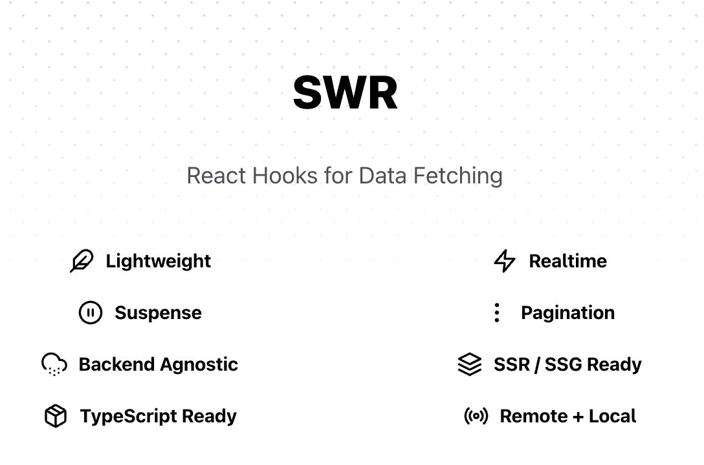

# 如何管理 React 应用程序中的状态

> 原文：<https://www.freecodecamp.org/news/how-to-manage-state-in-your-react-apps/>

在 React 应用中管理状态不像使用`useState`或`useReducer`那么简单。

不仅有许多不同种类的状态，而且通常有许多管理每种状态的方法。你应该选择哪个？

在本指南中，我们将揭示您可能没有意识到的 React 应用程序中的几种状态，以及如何以最有效的方式管理它们。

> 想要学习 React 的第一资源？如果你每天用 [**React 训练营**](https://reactbootcamp.com) 学习 30 分钟，你就可以成为 React pro。

## 管理的四种反应状态

当我们在应用程序中讨论状态时，清楚什么类型的状态真正重要是很重要的。

在 React 应用程序中，您需要正确管理四种主要类型的状态:

1.  地方州
2.  全球状态
3.  服务器状态
4.  URL 状态

让我们来详细讨论一下这些问题:

**本地(UI)状态**–本地状态是我们在一个或另一个组件中管理的数据。

在 React 中，本地状态通常是使用`useState`钩子来管理的。

例如，当表单被禁用时，需要本地状态来显示或隐藏模式组件或跟踪表单组件的值，如表单提交和表单输入的值。

**全局(UI)状态**–全局状态是我们跨多个组件管理的数据。

当我们想在应用程序中的任何地方，或者至少在多个组件中获取和更新数据时，全局状态是必要的。

全局状态的一个常见示例是经过身份验证的用户状态。如果用户登录到我们的应用程序，就有必要在整个应用程序中获取和更改他们的数据。

有时我们认为应该是地方性的国家可能会变成全球性的。

**服务器状态**–来自外部服务器的数据必须与我们的 UI 状态集成。

服务器状态是一个简单的概念，但是很难与我们所有的本地和全局 UI 状态一起管理。

每次从外部服务器获取或更新数据时，都必须管理几个状态，包括加载和错误状态。

幸运的是，像 SWR 和 React Query 这样的工具使得管理服务器状态变得更加容易。

**URL 状态**–存在于我们的 URL 上的数据，包括路径名和查询参数。

URL 状态作为一个状态类别经常被忽略，但是它是一个重要的类别。在许多情况下，我们应用程序的很多主要部分都依赖于访问 URL 状态。试着想象一下，建立一个博客，却不能根据 URL 中的 slug 或 id 来获取帖子！

毫无疑问，我们可以识别更多的状态，但是对于您构建的大多数应用程序来说，这些是值得关注的主要类别。

## 如何在 React 中管理本地状态

本地状态可能是 React 中最容易管理的一种状态，因为 React 核心库中内置了如此多的工具来管理它。

是管理组件状态的第一个工具。

它可以接受任何有效的数据值，包括原语和对象值。此外，它的 setter 函数可以作为回调函数传递给其他组件(不需要像`useCallback`这样的优化)。

```
import { useState } from "react";

function Layout() {
  const [isSidebarOpen, setSidebarOpen] = useState(false);

  return (
    <>
      <Sidebar isSidebarOpen={isSidebarOpen} closeSidebar={() => setSidebarOpen(false)} />
      {/* ... */}
    </>
  );
} 
```

`useReducer`是另一个可用于本地或全局状态的选项。它在许多方面与引擎盖下的`useState`相似，尽管它不只是一个初始状态，而是接受一个减速器。

`useReducer`的好处在于，它提供了一种内置的方式，在 reducer 函数的帮助下执行许多不同的状态操作，这使得它在整体上比`useState`更加动态。

在这个投票跟踪示例中，您可以看到`useReducer`相对于`useState`的优势。要更新状态，我们所要做的就是向回调函数`dispatch`传递一个字符串(然后传递给 reducer ),而不是新的状态本身。

```
const initialState = { votes: 0 };

function reducer(state, action) {
  switch (action.type) {
    case 'upvote':
      return {votes: state.votes + 1};
    case 'downvote':
      return {votes: state.votes - 1};
    default:
      throw new Error();
  }
}

function VoteCounter() {
  const [state, dispatch] = useReducer(reducer, initialState);

  return (
    <>
      Current Votes: {state.votes}
      <button onClick={() => dispatch({type: 'upvote'})}>Upvote</button>
      <button onClick={() => dispatch({type: 'downvote'})}>Downvote</button>
    </>
  );
} 
```

## 如何在 React 中管理全局状态

一旦您试图跨多个组件管理状态，事情就会变得有点棘手。

在你的应用程序中，你将会到达这样一个点，像“提升状态”和向下传递回调以从组件更新你的状态这样的模式会导致很多很多的道具。

如果你想在应用程序的任何地方更新一个组件的状态，你该怎么做？你把它变成全球状态。

但是，要管理它，您应该选择第三方解决方案。许多开发人员倾向于使用像上下文 API 这样的内置 React 特性来管理他们的状态。

> 需要明确的是:上下文 API 不是一个状态管理解决方案。它是一种避免道具钻取(在不需要的组件中创建一堆道具)之类问题的方法，但它只对读取状态有帮助，对更新状态没有帮助。

不使用上下文进行全局状态管理的原因在于它的工作方式。如果作为属性提供给上下文的值发生变化，上下文的默认行为是重新呈现所有子组件。

例如，将`useReducer`和`useContext`组合在一起是不好的做法:

```
function App() {
  const [state, dispatch] = useReducer(reducer, initialState);

  return (
    <StateProvider.Provider value={{ state, dispatch }}>
      <ComponentA />
      <ComponentB />
      <ComponentC />
    </StateProvider.Provider>
  )
} 
```

在许多情况下，您不希望所有子节点都响应全局状态更新而更新，因为所有子节点可能都不使用或依赖该全局状态。如果他们的道具或状态改变，你只需要重新渲染。

> 为了管理你的全球状态，你可以使用久经考验的第三方库，比如 **Zustand** 、 **Jotai** 和**反冲**。


Zustand, Jotai and Redux Toolkit Libraries

Redux 也很棒，但是请确保您开始使用 Redux Toolkit。

像 Zustand 这样的库的好处是它很小，使你的整个全局状态成为一个定制的钩子，要读取或更新状态，你只需在你的组件中调用这个钩子。

要使用 Zustand，运行`npm install zustand`。之后，创建一个专用的存储文件或文件夹，并创建您的存储:

```
import create from 'zustand'

const useStore = create(set => ({
  votes: 0,
  upvote: () => set(state => ({ vote: state.votes + 1 })),
  downvote: () => set(state => ({ vote: state.votes - 1 })),
}))

function VoteCounter() {
  const { votes, upvote, downvote } = useStore();

  return (
    <>
      Current Votes: {votes}
      <button onClick={upvote}>Upvote</button>
      <button onClick={downvote}>Downvote</button>
    </>
  );
} 
```

我推荐使用 Zustand 而不是 Redux 这样的库的一个重要原因是，它提供了您需要的所有功能，而没有动作、reducers 等样板文件和概念开销。

另外，您不需要将组件包装在上下文提供者中。只需安装并运行！

## 如何在 React 中管理服务器状态

服务器状态可能难以管理。

起初，似乎您只需要获取数据并将其显示在页面中。但是在等待数据时，您需要显示一个装载微调器。然后，您需要处理错误，并在它们出现时向用户显示。

出现网络错误时会发生什么？如果数据没有改变，我真的需要在每次用户访问主页时点击我的服务器吗？我需要在每个组件中添加`useState`和`useEffect`来获取我的数据吗？

为了解决这个问题，有几个很棒的库让 React 中的数据获取变得轻而易举: **SWR** 和 **React Query** 。



SWR and React Query Libraries

它们不仅为我们提供了一个方便的钩子来从 API 获取和更改数据，而且它们跟踪所有必要的状态并为我们缓存数据。

下面是一个从客户端的 API 获取用户配置文件的例子。我们调用`useSWR`并指定请求数据的端点，数据被传递给我们的`fetcher`函数，`useSWR`给我们`data`和`error`状态。

```
import useSWR from 'swr'

const fetcher = url => fetch(url).then(r => r.json())

function User() {
  const { data, error } = useSWR('/api/user', fetcher)

  if (error) return <div>failed to load</div>
  if (!data) return <div>loading...</div>

  return <div>hello {data.name}!</div>
} 
```

SWR 使得管理不成功的请求变得更加容易，我们的组件看起来也更加漂亮。

此外，如果你一次又一次地执行相同的操作，你可以在你自己的定制钩子中使用`useSWR`来在你的应用中重用。

```
function useUser (id) {
  const { data, error } = useSWR(`/api/user/${id}`, fetcher)

  return {
    user: data,
    isLoading: !error && !data,
    isError: error
  }
}

function Avatar ({ id }) {
  const { user, isLoading, isError } = useUser(id)

  if (isLoading) return <Spinner />
  if (isError) return <Error />

  return 
} 
```

最后，您可以向`useSWR`提供全局选项，包括您的`fetcher`函数(因此您不需要每次都传递它)以及在出错后多次重新提取数据。

```
import useSWR, { SWRConfig } from 'swr'

function Admin () {
  // no need to pass in the fetcher function
  const { data: courses } = useSWR('/api/courses')
  const { data: orders } = useSWR('/api/orders')
  const { data: users } = useSWR('/api/users')

  // ...
}

function App () {
  return (
    <SWRConfig 
      value={{
        errorRetryCount: 2, 
        errorRetryInterval: 5000,
        fetcher: (resource, init) => fetch(resource, init).then(res => res.json())
      }}
    >
      <Admin />
    </SWRConfig>
  )
} 
```

这只是 SWR 库的一点好处，React Query 带给您的好处一样多，甚至更多。

请确保使用其中任何一种来管理您的服务器状态。它会让你的生活变得更容易。

## 如何在 React 中管理 URL 状态

以积极的方式结束这个困难的话题，如果您使用像 Next.js 或 React Router 的当前版本这样的框架，URL 状态在很大程度上已经为您管理好了。

URL 状态很容易管理，通常是通过自定义的钩子来提供我们需要的关于位置、历史和路径名的所有信息。

如果你正在使用 React 路由器，你可以使用`useHistory`或`useLocation`获得你需要的所有信息。

```
import { useHistory, useLocation } from 'react-router-dom';

function BlogPost() {
  const history = useHistory();
	console.log("you are here: ", history.location);

	const location = useLocation();
  console.log('your pathname is: , location.pathname);

  // ...
} 
```

此外，如果您有任何需要使用的路由参数，例如根据获取数据，您可以使用`useParams`钩子。

```
import { useParams } from 'react-router-dom';

function ChatRoom() {
  const { roomId } = useParams();
  const { chatRoom, isLoading, isError } = useChatRoom(roomId);

  // ...
} 
```

如果你用的是 Next.js，几乎所有东西都可以通过调用`useRouter`直接访问。

```
function Orders() {
  const router = useRouter();
  console.log('the entire url is: ', router.asPath);
  console.log('your current route is: ', router.pathname);
  console.log('your query params are: ', router.query);

  function handleSubmit(item) {
    setQuery("");
    // push to new route
    router.push(item.href);
    closeDropdown();
  }

  // ...
} 
```

## 想让 React 变得简单吗？

如果你想以最简单的方式学习所有这些棘手的概念，请查看 [**React Bootcamp**](https://reactbootcamp.com/) 。

它将为您提供所需的所有技能:

*   每天只需 30 分钟，就能从完全的初学者变成专业的反应者
*   从零开始到部署，构建 4 个全栈 React 项目
*   了解构建您喜欢的任何应用程序的强大技术堆栈

[](https://reactbootcamp.com) 
*点击加入 React 训练营*