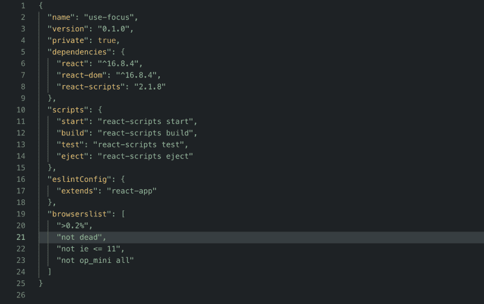
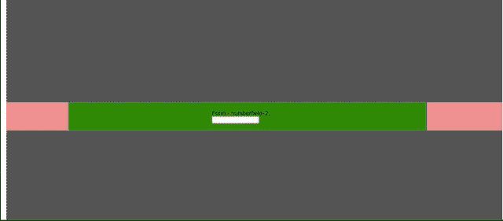

# 如何使用自定义的 React 挂钩管理视口交叉点和输入焦点

> 原文：<https://www.freecodecamp.org/news/how-to-manage-viewport-intersection-and-input-focus-with-custom-react-hooks-1ec3403a8d80/>

戴恩·大卫

# 如何使用自定义的 React 挂钩管理视口交叉点和输入焦点



package.json of the project… closely resembles that of a project created using create-react-app

[React Hooks](https://reactjs.org/docs/hooks-intro.html) 已经有一段时间了，有很多包，配方，讨论都进行的差不多了。本文也经历了类似的过程。它通过两个定制的钩子实现来说明代码是如何被重用的。可能有一些库或 gists 执行了本文所解释的精确(或改进的)功能。为你的需求编写定制的代码，你可以思考的代码，总是有帮助的。

本文假设对 React 和 React 挂钩有基本的理解和知识。如果没有，您可以阅读文档并找到更多关于 React Hooks API 的信息。

#### 设置

我们可以先看看我们要构建什么功能，而不是在最后才透露。我们将要建造的现场版就在这里:[https://danedavid.github.io/use-focus](https://danedavid.github.io/use-focus/)。

该应用程序由一个可以滚动的 React 组件的水平列表组成。每个组件可能不同，也可能相同(这里使用了两种不同类型的组件，*仅用*来表示代码可以跨组件重用)。它们都有一个共同点:一个输入字段。



The element in the viewport is always the active element ( highlighted in green ) and has focus.

**我们的目标**:总是让视窗内的元素成为“活动”元素。在整个滚动过程中，将焦点放在该组件内的输入字段上。

我们可以在我们的根组件中管理一个`activeElement`状态，它存储了一个 ID，对应于在任何给定时间活动的元素。根组件的代码是:

组件`NumberInputFormElement`和`TextInputFormElement`是非常相似的组件。第一个渲染一个`input[type="number"]`。而后者呈现文本输入字段。这是唯一的区别。

#### useActiveOnIntersect

要添加的第一个钩子将在元素到达视口时设置活动元素。也就是说，一旦元素在视口中，钩子`useActiveOnIntersect`必须调用从父元素传递来的`setActiveElement`。同样有一个著名的浏览器 API:`window.IntersectionObserver`。如果你不熟悉，我建议你在这里阅读更多关于它的[。](https://developer.mozilla.org/en-US/docs/Web/API/Intersection_Observer_API)

钩子基本上必须创建一个`IntersectionObserver`的实例，并监听它何时进入视图。我们为最外层的`div`赋予了一个`id=intersector`属性。这个`div`将作为 IntersectionObserver 的根元素。当元素完全(或至少 95%)位于根元素内部时，它必须侦听。我们使用`useEffect`钩子来注册 IntersectionObserver 实例。并传递一个在交集上调用`setActiveElement`的回调函数(在我们的例子中，当交集比大于 95%时)。`useActiveOnIntersect`的代码如下所示:

钩子做它应该做的事情:注册一个`observer`实例，监听与根元素的交集，在选项中给定为`document.querySelector('#intersector')`，如果元素相交，则调用`setActiveElement`。`elementRef`是指向 DOM 容器元素的 React ref。

`setActiveElement`如何知道**哪个**元素是活动的？当我们调用这个钩子时，我们将从组件内部传递它:

```
useActiveOnIntersect(() => setActiveElement(id), containerEl);
```

这里，`id`是被设置为`App`组件中的`activeElement`的值。`containerEl`是引用输入字段容器的 React ref。

#### useFocusOnActive

既然我们已经确定`activeElement`在任何给定的时间总是指向视窗内部的元素(根元素),我们需要确保组件内部的输入字段获得焦点。同样，我们使用`useEffect`钩子来聚焦激活的输入字段，一旦输入字段不再是激活的元素，清理函数就会模糊输入字段。代码简洁明了:

`inputRef`是指向输入字段的 React ref，`active`是包含元素的活动状态。

#### 结论

下面给出了使用这两个挂钩的组件的代码:

我们已经使用`useRef` hook 为容器和输入元素创建了 refs，并将其传递给各自的钩子。这个功能甚至可以写在一个钩子中。编写两个独立钩子的原因是因为每个钩子代表不同的效果。

完整的代码可以在这里找到:[https://github.com/danedavid/use-focus](https://github.com/danedavid/use-focus)。

希望这篇文章是有帮助的&简短！现在就开始编写您自己的自定义 React 挂钩吧！

如果你喜欢这篇文章，点击下面的鼓掌按钮。您也可以在 medium 或 [twitter](https://twitter.com/this_dane) 上关注我，了解更多信息！！

快乐编码…！