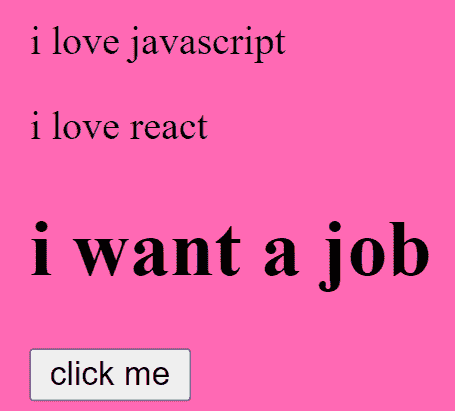
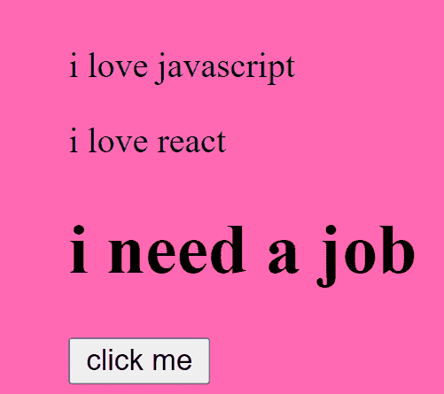
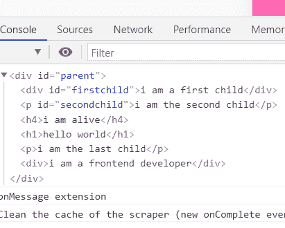
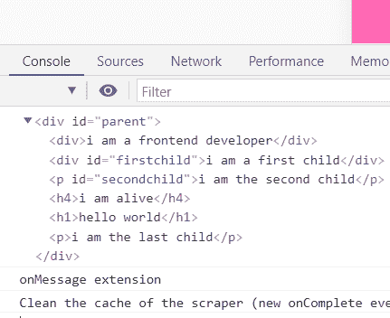
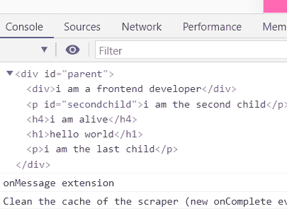
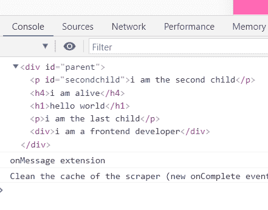
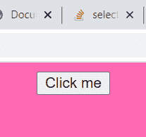
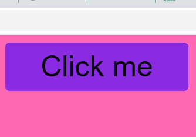
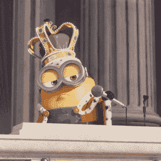

# 如何操作 DOM -最终初学者指南

> 原文：<https://www.freecodecamp.org/news/how-to-manipulate-the-dom-beginners-guide/>

好吧，我假设你听说过全能的 DOM——这就是你在这里的原因，对吗？如果您觉得很难，我可以向您保证，在阅读完本文之后，您会对整个 DOM 操作感到足够舒服。

但是在我开始之前，请允许我与你分享我是如何知道大教堂的小故事(这是一个有趣的故事)。

## 我是如何了解大教堂的

在我的 web 开发生涯的几个月里，我仍然在学习传统的 HTML 和 CSS。我在 w3schools 上偶然发现了一门 DOM 课程。他们的第一个例子是有一个灯泡和两个按钮的。

点击其中一个按钮将“打开”灯泡，点击第二个按钮将“关闭”灯泡。我简直惊呆了。

网站上的按钮是如何打开灯泡的？怎么！？

我甚至发了微博。然后我发现他们只是改变了图像的源属性(src)。我心碎了，但不管怎样，那次小小的经历让我爱上了 DOM。这让我想知道更多。

在这篇文章中，我将带你了解它。我保证，如果你坚持到最后，并实践我所写的一切，整个 DOM 的事情将不再是你的问题。你准备好了吗？Ok Allons-y(走吧！).

> 为了更容易理解，我将所有内容分成了以下几个部分。

*   DOM 的定义和基本概念
*   如何在 DOM 中选择元素
*   如何在 DOM 中遍历和移动
*   如何操作 DOM 中的元素
*   常规造型
*   DOM 中的事件处理

所以，拿一杯咖啡或任何你喜欢的东西，在我带你走过每一部分时放松一下。


## DOM 的定义和基本概念

### 这只狗是什么

DOM 代表文档对象模型。可以简单理解为浏览器创建的节点树。每个节点都有自己的属性和方法，可以使用 JavaScript 进行操作。

操纵 DOM 的能力是 JavaScript 最独特和最有用的能力之一。

下图直观地展示了 DOM 树的样子。


这里我们有文档对象。这是 DOM 的核心/基础。要执行任何形式的 DOM 操作，必须首先访问文档对象。

接下来是`html`根元素，它是文档对象的子元素。

下一行是`body`和`head`元素，它们是彼此的兄弟，也是`html`元素的子元素。

在 head 元素下，我们有 title 元素，您可以同意它是 head 元素的子元素，也是文本节点“my text”的父元素。

在 body 元素的正下方有两个元素(`a`标签和`h1`标签)，它们是彼此的兄弟，也是 body 元素的子元素。

最后，`href`属性和文本节点——“我的链接”——是`a`标签的子节点。与文本节点“我的标题”完全相同，它是`h1`元素的子元素。

如果你是一个完全的初学者，这可能看起来有点混乱，但是相信我——它总是会变得更好(当然是通过练习)。

## 如何在 DOM 中选择元素

为了能够操作 DOM 中的元素，您必须选择那个特定的元素。幸运的是，我们有 4 种选择元素的主要方法。

### 如何用 getElementById 方法选择 DOM 元素

访问 HTML 元素最常见的方式是使用元素的 id。

在下面的例子中，`getElementById()`方法使用 id="master "来查找元素

```
<p id="master">i love javascript</p>

 <script>
const masterEl = document.getElementById('master')
console.log(masterEl) //<p id="master">i love javascript</p> 
 </script>
```

id 区分大小写。例如，“主人”和“主人”是完全不同的 id。

一旦选择了一个元素，就可以向该元素添加样式，操作其属性，并遍历父元素和子元素。

### 如何用 getElementsByClassName()方法选择 DOM 元素

此方法返回文档中具有指定类名的所有元素的集合。

例如，我们下面的 HTML 页面包含三个 class="master2 "的元素，我选择了 id 为' btn '的按钮。

如果你点击这个按钮，它将选择类名为“master2”的所有元素，并改变第三个元素的 innerHTML。

```
 <p class="master2">i love javascript</p>
        <p class="master2">i love react</p>
        <h1 class="master2">i want a job</h1>

        <button id="btn">click me</button>

 <script>

 const btn = document.getElementById('btn')

        btn.addEventListener('click', function master(){
            var master = document.getElementsByClassName("master2");
            master[2].innerHTML = 'i need a job';
        })

</script>
```

在单击按钮之前，您会看到以下内容:



单击该按钮后，您会看到:



> 我知道我用了`addEventListener()`这个词，我还没解释清楚，但请坚持使用。这肯定是我将在下面向您解释的一部分:)

### 如何用 getElementsByTagName()方法选择 DOM 元素

该方法接受一个标记名，并按照它们在文档中出现的顺序返回指定标记名的所有元素。

下面的代码通过获取页面上的所有`p`元素并更改第二个元素的内容来说明`getElementsByTagName()`的语法。

```
 <p>VsCode</p>
 <p>Atom</p>
 <p>Sublime text</p>
        <button id="btn">click me</button>

 <script>

const btn = document.getElementById('btn')

        btn.addEventListener('click', function master(){
            let master = document.getElementsByTagName('p');
            let masterEl = master[1].innerHTML = 'Code editors';
            console.log(masterEl) //Code editors
        })

//<p>Atom</p> changes to <p>Code editors</p>
</script>
```

### 如何用 CSS 选择器选择 DOM 元素

#### 。查询选择器()

这将返回与给定的选择器匹配的第一个值。这个方法可以接受所有的 CSS 样式选择器，允许它通过标签、类或 ID 进行选择。

```
<div id=master>i am a frontend developer</div>

<script>
const master = document.querySelector("#master") 
</script>
```

上面的方法有一个参数，它是一个 CSS 选择器，返回第一个匹配选择器的元素。

#### 。querySelectorAll()

这类似于上面返回所有匹配元素的节点列表集合。

```
 <p class="master">React</p>
     <p class="master">Vue</p>
     <p class="master">Angular</p>

<script>
const master = document.querySelectorAll(".master") 
console.log(master[1])  //<p class="master">Vue</p>
</script>
```

### 如何选择 DOM 元素的概述

当您需要选择一个 DOM 元素时，您有四个不同的选项可供选择，四种不同的方式来做一件特定的事情(选择一个元素)。

所以如果你不记得第一个，你就用第二个。如果你不记得这两个选项，你还有第三和第四个选项。仅仅是我还是 JavaScript 让我们的生活变得更简单了？:)

我个人的建议是坚持选项 1 或者选项 4a(带 Id 的 queryselector)。在学习 HTML 的早期，您可能理解元素不应该有相同的 id，也就是说 id 是文档中元素的唯一标识符。

考虑到这一点，选择带有 id 的元素是一个“安全的赌注”,因为您不会对不同的元素应用相同的“操作”(除非这可能是您想要实现的——那么请随意使用其他选项)。

## 如何遍历文档

在这个阶段，你可能会同意我的观点，HTML 文档中的一切都是一个节点。HTML 元素中的文本也是文本节点。

使用 HTML DOM，您可以导航节点树，并使用我们之前讨论过的节点关系(父节点、子节点、兄弟节点等)访问树中的节点。

> 可以创建新节点，也可以修改或删除所有节点。

### 一点回顾

*   每个节点只有一个父节点，除了顶层节点(它没有父节点)。
*   一个节点可以有多个子节点。
*   兄弟姐妹是具有相同父节点的节点。

在这一节中，我们将看到如何获取父元素、元素的兄弟元素和元素的子元素。我将使用以下节点属性来实现这些功能:

*   parentNode
*   子节点
*   firstelemontchild
*   lastelemontchild
*   nextElementSibling
*   前一个月兄弟姐妹

此外，我将只使用下面的 HTML 页面向您展示我们如何使用这些节点属性。从上面的第 4 节开始，我将向您展示如何操作 DOM。

这就是本文的目的——了解如何操作 DOM。如果不知道如何操作，那么知道如何选择元素和遍历 DOM 并不重要。了解如何添加 CSS 样式、创建和追加元素、设置 innerHTML 和处理事件非常重要。

这是这篇文章的精华所在，所以请继续关注我。我们继续。

```
 <div id="parent">
        <div id="firstchild">i am a first child</div>
        <p id="secondchild">i am the second child</p>
        <h4>i am alive</h4>
        <h1>hello world</h1>
        <p>i am the last child</p>
    </div>  

    const parent = document.getElementById('parent').lastElementChild
    console.log(parent) //<p>i am the last child</p>

    const parent2 = document.getElementById('parent').children[3]
    console.log(parent2) //<h1>hello world</h1>

    const secondchild = document.getElementById('secondchild')
    console.log(secondchild) //<p id="secondchild">i am the second child</p>

    console.log(secondchild.parentNode) //<div id="parent">...</div>

    console.log(secondchild.nextElementSibling) //<h4>i am alive</h4>

    console.log(secondchild.previousElementSibling) //<div id="firstchild">i am a first child</div>
```

## 如何操作 DOM 中的元素

在本节中，我们将了解:

*   如何创建元素
*   如何设置元素的 innerHTML/ text 内容
*   如何追加元素
*   如何在一个元素之前插入另一个元素
*   如何替换子元素
*   如何移除子元素

```
 <div id="parent">
        <div id="firstchild">i am a first child</div>
        <p id="secondchild">i am the second child</p>
        <h4>i am alive</h4>
        <h1>hello world</h1>
        <p>i am the last child</p>
    </div> 
```

### 如何创建元素

上面的代码显示了一个包含 5 个子元素的父元素。假设我们想用 JavaScript 添加另一个`div`标签。我们肯定要用`createElement()`方法创建一个新元素，就像这样:

```
 const createEl = document.createElement('div')
 console.log(createEl) //<div></div>
```

### 如何设置 innerHTML

我们已经成功创建了一个`div`标签，但是目前它没有任何文本节点。我们将使用`.innerHTML()`属性来添加它的文本节点。

```
 const innerhtml = createEl.innerHTML = 'i am a frontend developer'
 console.log(createEl) //<div>​i am a frontend developer​</div>​ 
```

### 如何追加元素

到目前为止，我们已经创建了一个元素并插入了它的文本节点。但是这个创建的元素还不是 DOM 树的一部分。

所以现在，我将在这一节向您展示如何将它附加到 HTML 页面。基于上面的代码:

```
 const createEl = document.createElement('div')

 const innerhtml = createEl.innerHTML = 'i am a frontend developer'

 const parentEl = document.getElementById('parent')

 parentEl.appendChild(createEl)

 console.log(parentEl) 
```



### 如何在一个元素之前插入另一个元素

如果您从上面的控制台日志图像中注意到，附加的子标签`div`会自动添加到底部。

如果出于某种原因，您想将它附加到您选择的任何位置，该怎么办？可能在第一个元素之前，也可能在第四个元素之前。我在这里告诉你，这是非常可能的。在下面的代码中，我们将把它添加到当前的第一个元素之前。

我们将使用接受两个参数的`insertBefore()` JavaScript 方法，即`newNode`和`existingNode`，顺序为= > `document.insertBefore(newNode, existingNode)`。

```
 const parentEl = document.getElementById('parent')
 const firstchildEl = document.getElementById('firstchild')

 const createEl = document.createElement('div')

 const innerhtml = createEl.innerHTML = 'i am a frontend developer'

 parentEl.insertBefore(createEl, firstchildEl)
   console.log(parentEl) 
```



### 如何替换子元素

我们将使用接受两个参数的`replaceChild()` JavaScript 方法，用新创建的元素替换我们的第一个元素。它的工作顺序= > `document.replaceChild(newNode, existingNode)`。

```
 const firstchildEl = document.getElementById('firstchild')
 const parentEl = document.getElementById('parent')

 const createEl = document.createElement('div')
 const innerhtml = createEl.innerHTML = 'i am a frontend developer'

 parentEl.replaceChild(createEl, firstchildEl)

   console.log(parentEl) 
```



### 如何移除子元素

我们将使用`removeChild()` JavaScript 方法，该方法只接受一个参数()，即您想要移除的元素，在本例中是我们最初的第一个元素。它的工作顺序= > `document.removeChild(element)`

```
const firstchildEl = document.getElementById('firstchild')
 const parentEl = document.getElementById('parent')

 parentEl.removeChild(firstchildEl)

 console.log(parentEl)
```



## 如何用 CSS 添加样式

从前面的例子中，我们看到了如何创建一个元素并将其附加到指定的父元素。

因此，为了让一个元素有一个样式，我们必须给它添加一个 CSS 类。在这种情况下，我们将使用 JavaScript。

我不仅要向你展示如何添加一个类。我还将向您展示如何删除一个类，以及如何在类之间切换。

放心吧，不难。我会陪你经历这一切。

### 如何添加 CSS 类

目前我们有一个 id 为“master”的普通 HTML 按钮，但是没有应用任何样式。请参见下图:



我们要做的第一件事是为按钮创建 CSS 样式。

接下来，在我们的 JavaScript 中，我将向按钮添加一个事件侦听器，这样，当您单击它时，JavaScript 会自动添加带有“button”类的 CSS 样式。

```
 <style>
        body{
            background-color: hotpink;
            display: flex;
            align-items: center;
        }

        .button{
            background-color: blueviolet;
            width: 200px;
            border: none;
            font-size: 2rem;
            padding: 0.5rem;
            border-radius: 5px;
            cursor: pointer;
        }
    </style>

  <button id="master">Click me</button>

const buttonEl = document.getElementById('master')
buttonEl.addEventListener('click', addFunction)

 function addFunction(){
     buttonEl.classList.add('button')
  }
```

单击该按钮后，您将看到下面的。漂亮吧？



### 如何删除一个类

仍然使用上面的同一个例子，我们将移除 CSS 样式，这次是用 JavaScript 中的`classList.remove()`。你大概已经猜到会发生什么了吧？

没错，按钮会回到默认状态。

```
 const buttonEl = document.getElementById('master')
buttonEl.addEventListener('click', addFunction)

function addFunction(){
    buttonEl.classList.remove('button')
 } 
```

### 如何切换类别

假设您不想完全删除 CSS 样式。您需要一种在样式化和非样式化按钮之间切换的方式。

JavaScript 方法给了你这种能力。

`classList.toggle()`方法通常用于大多数社交媒体平台，如 Twitter。它可以让你喜欢一个有按钮的帖子，而不像它一样，只要你想就有同样的按钮。

所以 JavaScript 检查我们的按钮是否有 CSS 类。

如果它有类别，并且您按一下按钮，它会移除类别。如果它没有类，你点击按钮，它会添加它。

```
 const buttonEl = document.getElementById('master')
buttonEl.addEventListener('click', addFunction)

function addFunction(){
    buttonEl.classList.toggle('button')
 } 
```

# 事件处理

### 什么是 HTML 事件？

HTML 事件是发生在 HTML 元素上的“事情”，比如单击按钮、在文本区域输入等等。当像上面这样的事件发生时，您可以编写 JavaScript 代码，我们称之为将被执行的事件处理程序。

这些事件处理程序是 JavaScript 函数。所以当一个事件发生在一个元素上时，处理函数被执行。

### 事件监听器

到目前为止，我们已经在上面的每个例子中使用了事件监听器。这应该表明事件监听器在操作 DOM 中有多重要。

要向元素或任何 DOM 对象添加事件监听器，我们需要一个方法`addEventListener()`。这种方法优于旧方法，在旧方法中，我们在 html 标记中包含要处理的事件。

这样，JavaScript 就从 html 标记中分离出来了，这使得它更干净，可读性更好。

我喜欢单独的 JS、单独的 CSS 等等的想法，所以如果你像我一样，你会喜欢这个事件监听器。

事件侦听器接受 3 个参数。

*   第一个是事件的类型，比如“点击”等等。
*   第二个参数是要执行的函数。
*   第三个参数是一个布尔值，指定是使用事件冒泡还是事件捕获。**该参数是可选的。**

> 您可以向一个元素添加许多事件处理程序。

> 您还可以向一个元素添加许多相同类型的事件处理程序，比如两个“click”事件。

## 结论

知道如何用 JavaScript 操作 DOM 是非常重要的。这不是你能决定不知道的事。

如果你理解了我上面给出的例子/插图，你也许能够构建**小型** JS 项目。如果你想成为一名优秀的开发者，我不能过分强调构建项目的重要性。

