# 我把我玩过的每一个炉石游戏的数据都可视化了。全部 4700 个。

> 原文：<https://www.freecodecamp.org/news/how-to-measure-hearthstone-e6d9bdafaaf9/>

艾伦·威尔逊

# 我把我玩过的每一个炉石游戏的数据都可视化了。全部 4700 个。

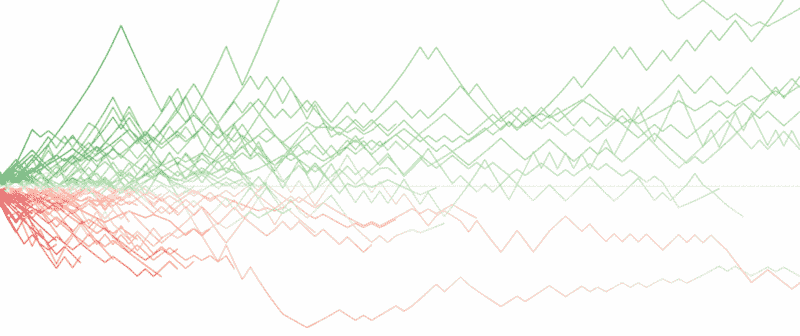

我从 beta 版就开始玩炉石了。我是一个相当随意的玩家，但我渴望最终达到享有盛誉的“传奇”排名。

早在三月份，我就开始跟踪我的游戏，看看我是否有机会成功。我的大部分游戏都是在 iPad 上玩的，所以这是谷歌表单中的一个手动过程。

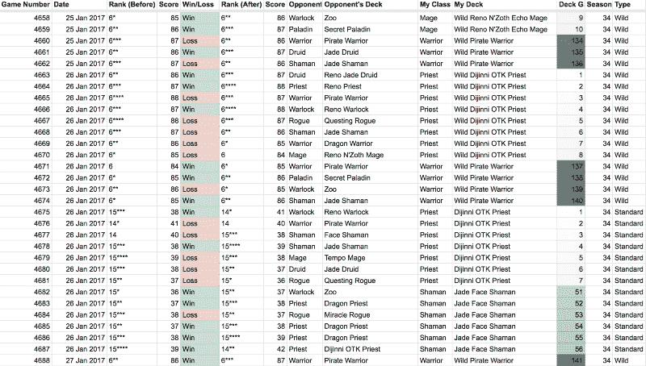

I’ve tracked every ranked game since March. That’s 4,700+ games so far. Sure wish there was a way to get this data more easily (ahem… [@playhearthstone](https://twitter.com/playhearthstone)?).

#### 绘制阶梯等级图

我使用了一些简单的条件格式来使表格更容易阅读，但我的大部分分析是在一个名为 [Tableau Public](https://public.tableau.com/s/) 的免费工具中进行的。它开始时非常基础——只是我的等级的线形图——但即使这样也很有用。现在我可以看到我对传奇的尝试进行得有多顺利了。

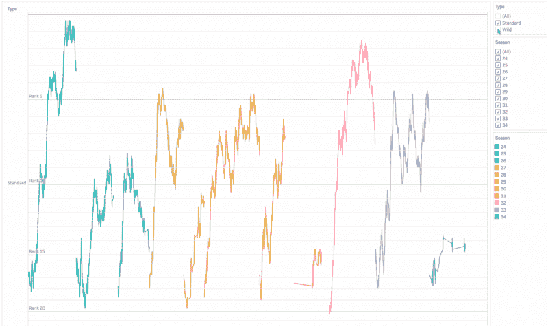

I play in both ranked formats: Standard and Wild.

如你所见，我的排名相当不稳定，所以我使用移动平均线来改进可视化。原始数据仍然在那里(在点中)，但是线现在代表 25 场比赛的移动平均线。这让我更容易看到我的排名的真实趋势，并减少在连败时倾斜的趋势。

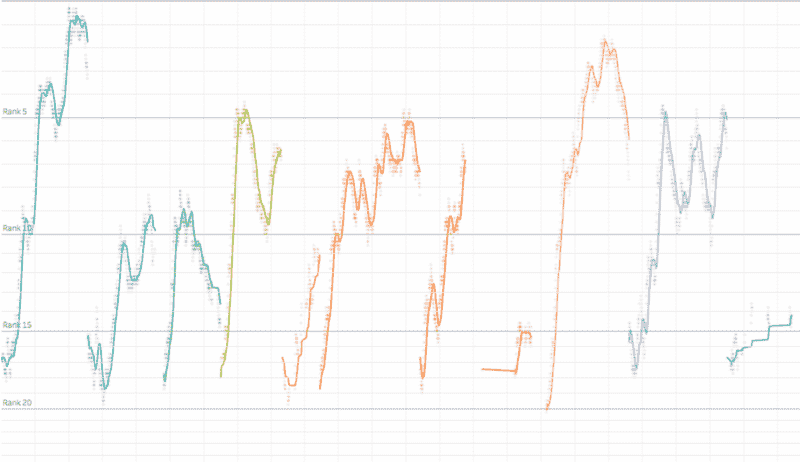

Those moving averages help to calm my ladder anxiety.

接下来，我把四季一个接一个地画出来，这样我就可以比较它们了。

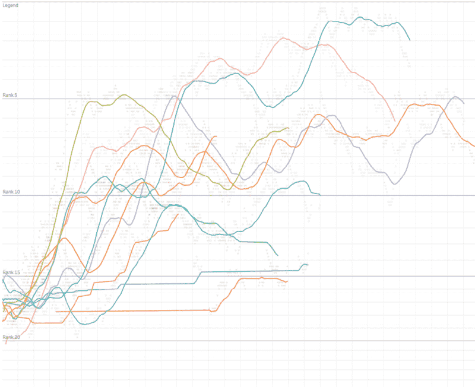

You’re seeing that correctly — I was **one win** away from Legend **7 different times** in season 24\. Sigh.

现在我可以看到我每个季节的攀爬效率有多高，以及它与当前季节相比如何。但我仍然不知道赛季还剩多少时间。

我还剩一天还是一周？在赛季的第五天，我的排名通常会更高吗？

为了回答这些问题，我创建了一个图表来跟踪一个季节中每天的进度。这里我有每天的带状图和一条连接每天最高等级的线。这是一个更好的方法来评估我在一个特定的赛季达到传奇的机会。

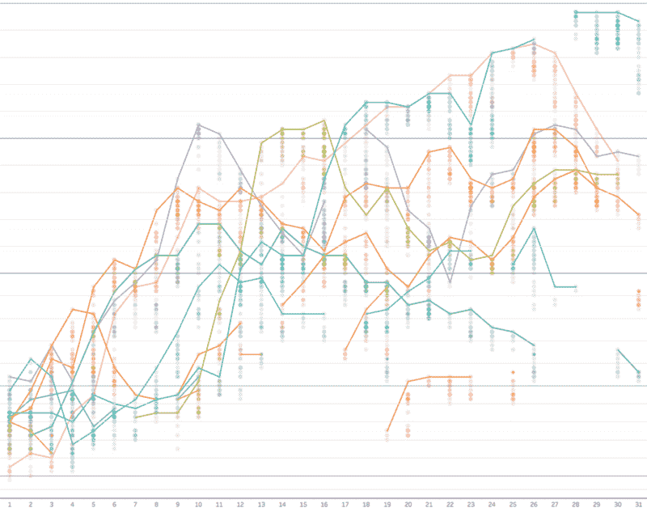

#### 图表甲板性能

但是甲板呢？显然，它们起着巨大的作用。说到牌，都是关于胜率的，所以我把每副牌想象成一条线。有点混乱，但是我可以看到胜率，当它稳定下来的时候，以及一副牌和另一副的比较。Tableau 的突出特点是*真的*在这里很有帮助。

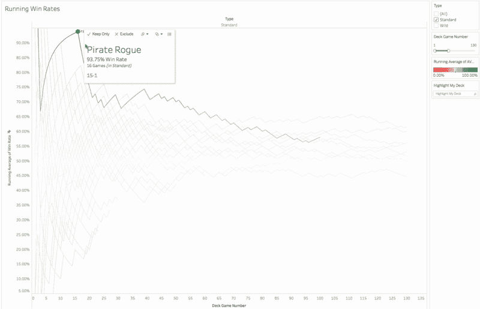

Note how it takes about 100 games for a deck to stabilize. Remember that next time you read about someone’s “*amazing”* 82.35% win rate (after just 17 games).

接下来，我将创建该图表的特定于面板的视图，以查看它在不同类别中的表现。在趋势出现之前，我不得不玩很多游戏，但是一旦趋势出现，我就能感觉到每个职业有多普通，以及我如何对抗它。根据 meta，我也可以了解牌组的搭配。

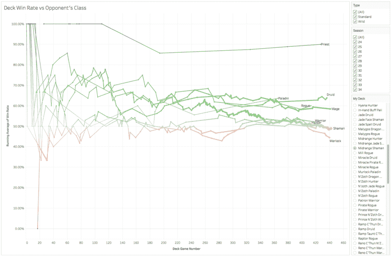

现在，不言而喻，我的胜率会随着我进入更高的等级而下降，所以我创建了一个气泡图来帮助我更好地了解我的牌组在不同等级和季节的表现。

My Zoo deck performed very well until I got to Rank 5.

### 炉石的排名系统是如何运作的

所有这些让我想到了难度、季节和排名系统(如果你精通炉石的排名系统，请原谅我)。首先，排名系统并不像人们想象的那样是线性的。等级(从 25 开始到 1)并不是均匀分布的，因为随着你往上爬，每个等级之间的星星数量会发生变化。总共有 120 个可能的位置。

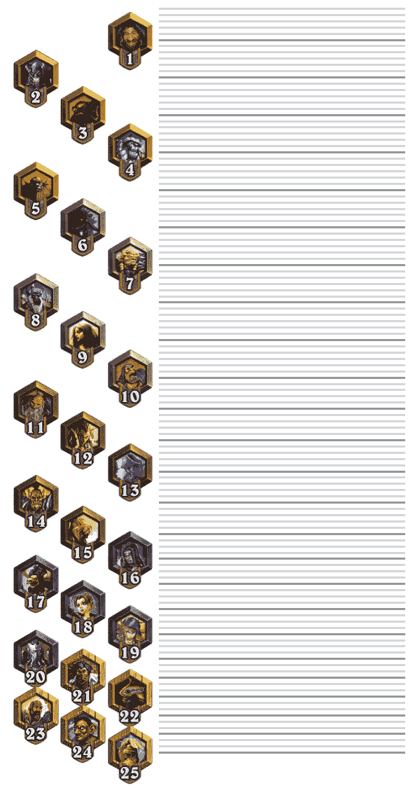

但是暴雪并没有就此止步。他们从 20 级开始制造了额外的阻力，然后又在 5 级制造了额外的阻力。

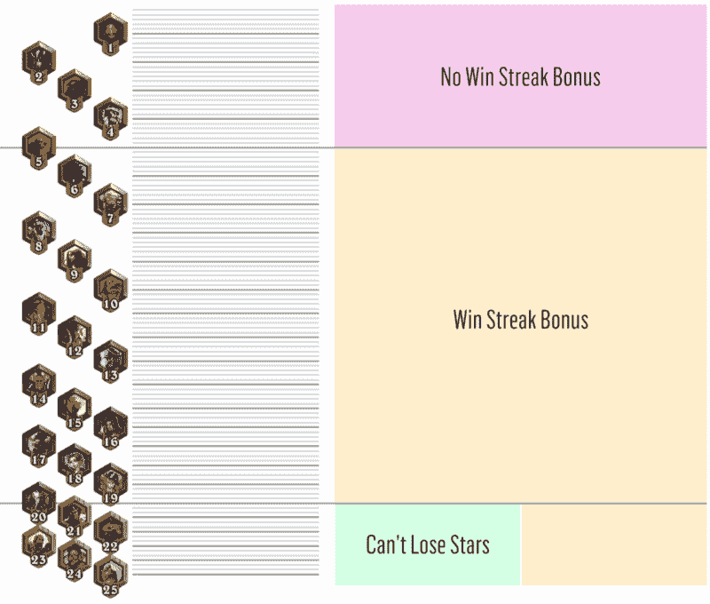

最后，炉石的季节非常短——只有一个月。每个月底，每个人都被送回最底层。

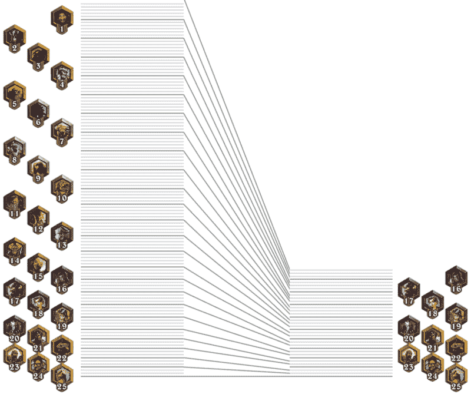

对于经常玩排名游戏的人来说，这已经不是什么新闻了。但这又把我带回了我最初的问题:我如何衡量一个给定游戏的难度？

### 模拟游戏难度

我从几个简单的假设开始:

1.  本赛季最困难的游戏是在每月的第一天排名第一，有 5 颗星。
2.  本赛季最轻松的比赛是在本月最后一天没有明星的排名 25。
3.  在一个月的晚些时候在给定等级下玩的任何游戏都比在一个月的早些时候在相同等级下玩的游戏容易。

以这些假设为指导，我创建了一个困难模型。起初它非常简单(而且不准确)。

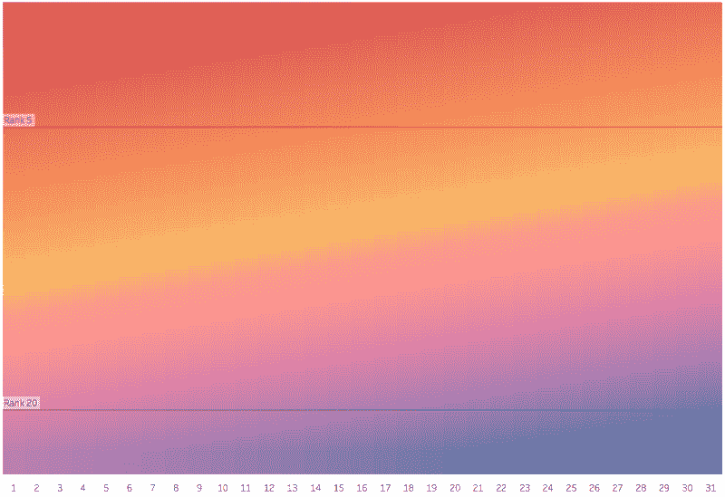

A very rough model.

我不断完善它，直到它反映出我对困难的理解。请注意，这不是由任何数据驱动的，我怀疑它是否完全准确，但在衡量难度方面，它比单独排名要好。

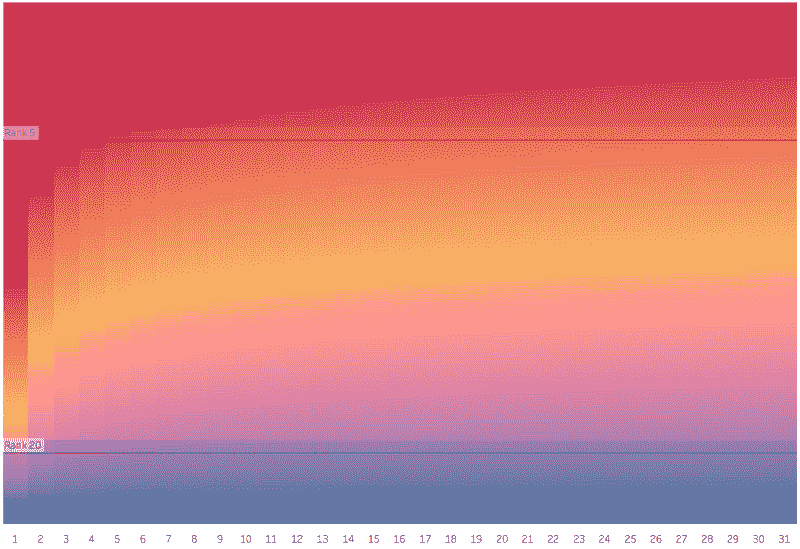

A better model.

现在让我们用这个新的“难度”指标来代替等级，重温一些早期的图表。这提供了一个不同的视角——希望是一个更准确的视角。

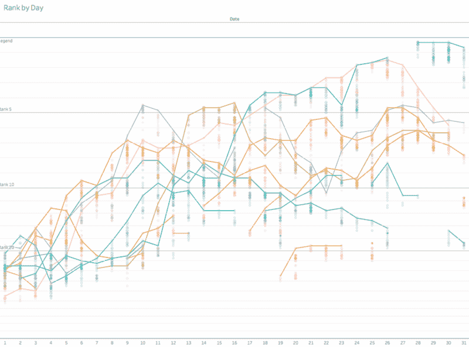

那个气泡图呢？我已经把困难分成了类别，就像我对等级做的那样，我已经对它提供的视角感觉更好了。在赛季初和赛季末都同样有价值。

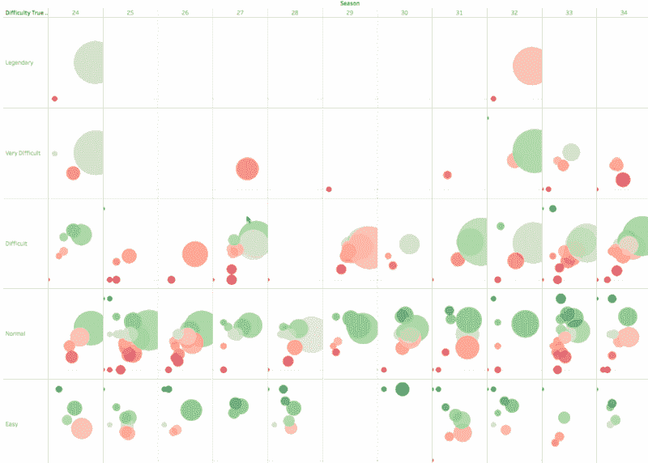

#### 评估甲板性能

接下来，我使用难度来创建另一个指标*。这个很简单。我称之为“质量”如果我赢了一场比赛，我会增加比赛的难度。如果我输了一场比赛，我会从质量中减去比赛的难度。*

> 如果“赢”那么+难度

> 否则如果“损失”,那么——困难

这让我可以奖励赢了困难游戏的人比赢了容易游戏的人多，并且产生了一些非常有趣的结果。还记得那张显示纸牌胜率的图表吗？这又是一个例子，但是我们新的质量指标在 y 轴上(颜色仍然是胜率)。

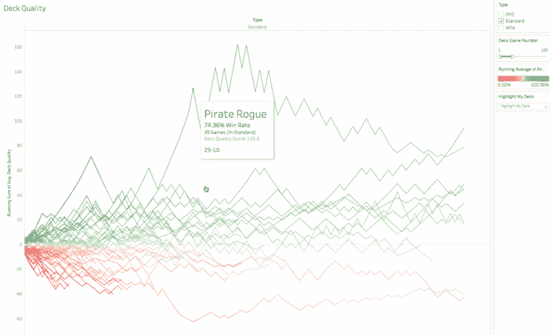

我也把这个总结成一个简单的排名。

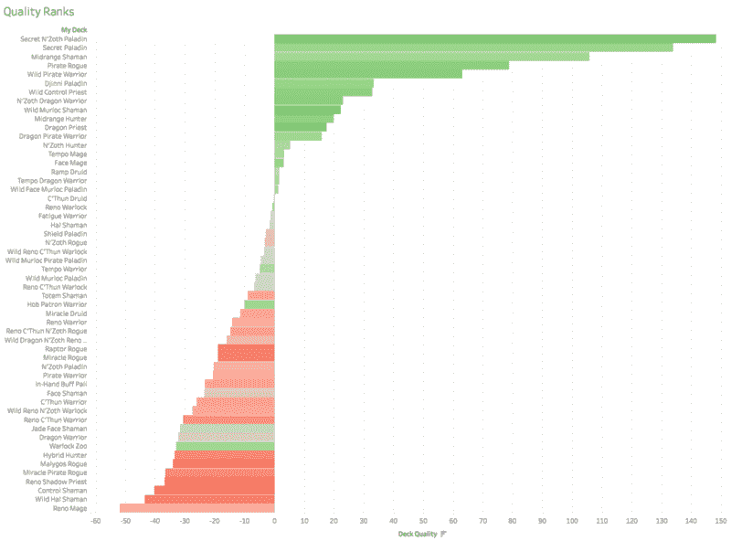

Not even a 53.9% win-rate could salvage the performance of my season 27 Zoo Warlock.

#### 下一步是什么？

我还想用我的数据集进一步探索很多东西。将这些技术应用于职业玩家并相互比较也是很有趣的。他们是因为赢得艰难的比赛而排名第一的传奇人物吗？胜率是技能的最佳预测指标吗？玩游戏的数量对等级提升有什么作用？

如果你不能从数据中看出我还没有成为传奇，但老实说，我在玩游戏的同时也在享受分析数据的乐趣。

### _ _ (茨) _ /