# 如何使用 Quickmetrics 衡量 Next.js 网站的重要指标

> 原文：<https://www.freecodecamp.org/news/how-to-measure-next-js-web-vitals-using-quickmetrics/>

开发人员花费大量时间优化网站，以提供更好的用户体验。Web Vitals 是一组有用的指标，旨在捕捉用户在网页上的体验。

这些是我们将在本文中考虑的重要的网络要素。

## [到达第一个字节的时间](https://developer.mozilla.org/en-US/docs/Glossary/Time_to_first_byte) (TTFB)

到第一个字节的时间测量用户发送请求后，客户端浏览器从 web 服务器接收页面的第一个字节所用的时间。

你应该瞄准 200-500 毫秒之间的任何东西。如果你的网站需要的时间比这个长，那么你一定要尝试优化这个值。

## [第一幅内容丰富的画](https://developer.mozilla.org/en-US/docs/Glossary/First_contentful_paint) (FCP)

First contentful paint 测量页面开始加载后呈现第一个图像或文本所用的时间。

为了提供良好的用户体验，网站应该在页面开始加载的 **1 秒**内实现 FCP。

在下图中，FCP 发生在第四个图像中，因为这是第一个文本和图像加载的时间。


## [最大含量涂料](https://web.dev/lcp/) (LCP)

最大内容绘画测量页面开始加载后呈现最大图像或文本所用的时间。

为了提供良好的用户体验，LCP 应该在页面首次开始加载的 **2.5 秒**内发生。

## [第一次输入延迟](https://web.dev/fid/) (FID)

第一输入延迟测量在处理与页面的第一用户交互中的任何延迟。它可以是按钮点击、页面滚动或链接点击。

例如，它测量从用户单击按钮到浏览器开始处理事件所用的时间。

为了提供良好的用户体验，页面的 FID 应该小于 100 毫秒。

## [累计布局移位](https://web.dev/cls/) (CLS)

累积布局移动测量页面中的元素在加载期间移动的次数。在下图中，如果你仔细观察的话，页面会先加载所有的文本和文本框。但是一旦图像加载，所有其他组件都被推到底部。在这里，CLS 是图像加载后发生的变化。

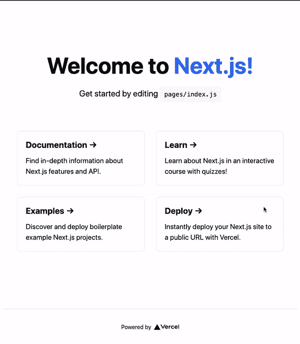

为了提供良好的用户体验，页面应该保持小于 0.1 的 CLS。

Next.js 是一个 React 框架，提供 SSR 和静态网站生成。在这篇博客中，我将向您展示如何使用 [Quickmetrics](https://quickmetrics.io/) 为您的 Next.js 应用程序跟踪这些网络关键点。

## 创建 Quickmetrics 帐户

Quickmetrics 是一个简单的指标收集提供者。它有一个非常慷慨的免费层，您可以使用它来跟踪足够的用户指标，以获得重要的见解。

要设置您的帐户，请前往[此处](https://app.quickmetrics.io/signup)。您可以使用您的电子邮件和密码注册。

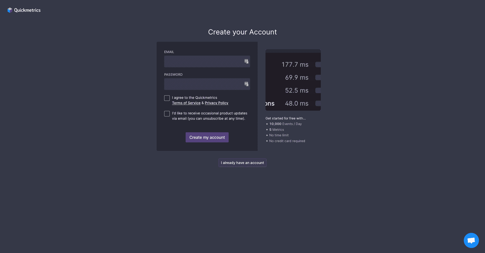

Quickmetrics Signup Page

注册成功后，您将获得您的`API_KEY`。请将此密钥保存在安全的地方，以便以后使用。

## 如何在你的 Next.js 应用中测量网络生命周期

Next.js 提供了一种测量各种性能指标的内置方法。为了测量任何支持的指标，您需要创建一个[定制应用](https://nextjs.org/docs/advanced-features/custom-app)组件，并定义一个`reportWebVitals`函数。

> 如果您还没有准备好应用程序，请参考本指南的[来创建一个。](https://nextjs.org/docs/getting-started)

```
import "../styles/globals.css";

export function reportWebVitals(metric) {
  switch (metric.name) {
    case 'FCP':
      // handle FCP results
      break
    case 'LCP':
      // handle LCP results
      break
    case 'CLS':
      // handle CLS results
      break
    case 'FID':
      // handle FID results
      break
    case 'TTFB':
      // handle TTFB results
      break
    default:
      break
  }
}

function MyApp({ Component, pageProps }) {
  return <Component {...pageProps} />;
}

export default MyApp; 
```

`pages/_app.js`

在上面的例子中，我们使用`metric.name`来过滤网络生命。一旦您过滤了指标并获得了 web 重要数据，我们需要将这些指标发送给 Quickmetrics。

```
const sendMetric = ({ name, value }) => {
  const url = `https://qckm.io?m=${name}&v=${value}&k=${process.env.NEXT_PUBLIC_QUICK_METRICS_API_KEY}`;

  // Use `navigator.sendBeacon()` if available, falling back to `fetch()`.
  if (navigator.sendBeacon) {
    navigator.sendBeacon(url);
  } else {
    fetch(url, { method: "POST", keepalive: true });
  }
}; 
```

`pages/_app.js`

现在我们将从`reportWebVitals`提供的度量对象中获取名称和值。我们将这个值传递给`sendMetric`方法。在这个方法中，我们正在构建 Quickmetrics URL 来提高度量(您可以参考[文档](https://app.quickmetrics.io/docs/send-events/url-params)来了解更多关于这个的信息)。

我们使用`sendBeacon`将指标发送到 Quickmetrics(如果存在的话)。如果不是，我们回退到 fetch(它是由 Next.js 提供的，你不用安装任何东西)。

> 要了解我们为什么使用`sendBeacon`的更多信息，请阅读[这个](https://developer.mozilla.org/en-US/docs/Web/API/Navigator/sendBeacon)。

现在，您只需从每个交换机案例中调用 sendMetrics。您的代码应该是这样的:

```
import "../styles/globals.css";

const sendMetric = ({ name, value }) => {
  const url = `https://qckm.io?m=${name}&v=${value}&k=${process.env.NEXT_PUBLIC_QUICK_METRICS_API_KEY}`;

  // Use `navigator.sendBeacon()` if available, falling back to `fetch()`.
  if (navigator.sendBeacon) {
    navigator.sendBeacon(url);
  } else {
    fetch(url, { method: "POST", keepalive: true });
  }
};

export function reportWebVitals(metric) {
  switch (metric.name) {
    case "FCP":
      sendMetric(metric);
      break;
    case "LCP":
      sendMetric(metric);
      break;
    case "CLS":
      sendMetric(metric);
      break;
    case "FID":
      sendMetric(metric);
      break;
    case "TTFB":
      sendMetric(metric);
      break;
    default:
      break;
  }
}

function MyApp({ Component, pageProps }) {
  return <Component {...pageProps} />;
}

export default MyApp; 
```

`pages/_app.js`

如果你想看完整的代码，这里有到 [repo](https://github.com/imumesh18/nextjs-quickmetrics) 的链接。

现在将您的 Quickmetrics API 键存储在`.env`中，以便发送指标。

```
NEXT_PUBLIC_QUICK_METRICS_API_KEY=your_key 
```

.env

接下来，使用`yarn dev`或`npm run dev`运行您的网站。在`http://localhost:3000`上访问你的网站。多次刷新它，以便生成足够的数据进行可视化。

## 在 Quickmetrics 上可视化指标

现在转到 Quickmetrics 指标[页面](https://app.quickmetrics.io/metrics)。您应该会看到这样的指标:

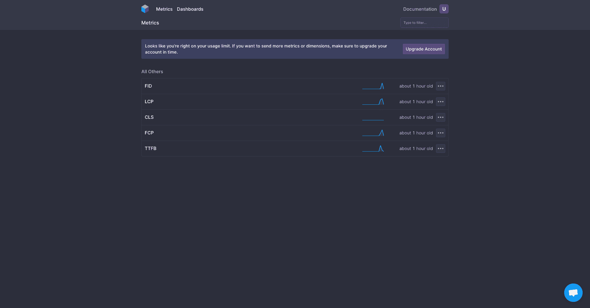

Quickmetrics Metrics Page

您可以单击这些单独的指标来查看数据和解释结果。

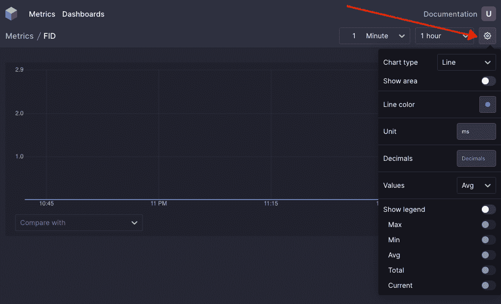

Individual Metric Panel

您可以单击如上图所示的设置图标来自定义图表。您可以设置图表类型、单位和值操作，如平均值、总和、最大值、最小值等。

让我们看一下这些图表，以便更详细地理解它们。

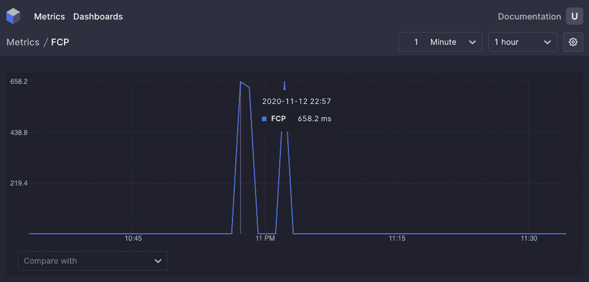

FCP Metric

上面的图表代表了我的网站的 FCP 指标。我在这里取平均值。如果你看一下图表，你可以看到我的网站的 FCP 值大约是 600-700 毫秒，这是相当不错的(因为我们预计它是< **1s** )。

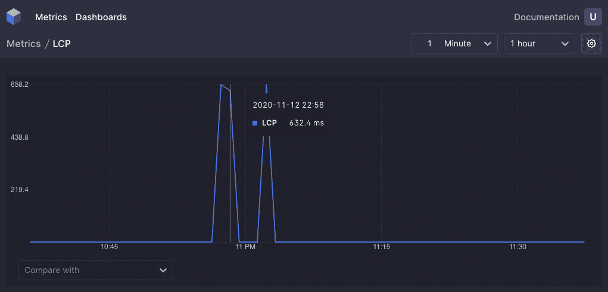

LCP metric 

上图显示了网站的 LCP 指标。600-700ms 左右，远低于推荐的 **2.5s.** 所以那也不错。

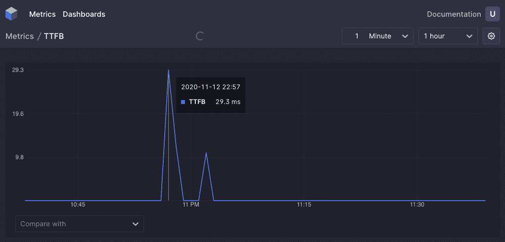

TTFB metric

此图显示了网站的 TTFB 指标。大约 30 毫秒，比预期的 200-300 毫秒要好得多。

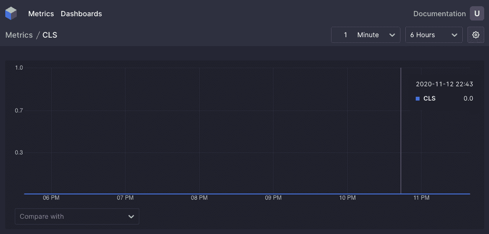

CLS metric

我目前正在使用 started Next.js 网站，它几乎没有 CLS。该值应始终低于 0.1。

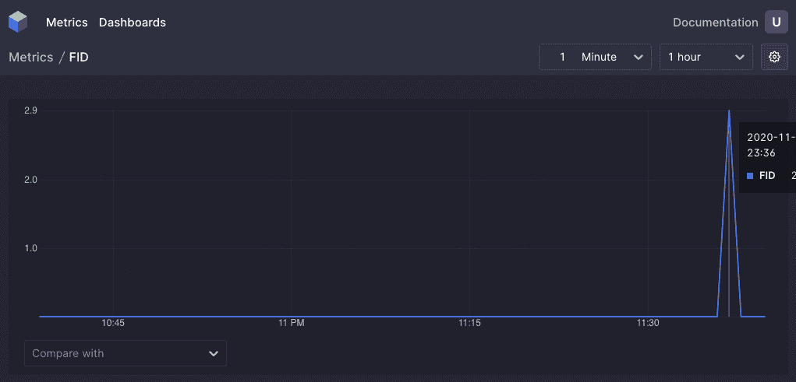

FID metric

在上图中，FID 为 23.5 毫秒。同样，该值低于 100 毫秒，远远好于建议的时间<**100 毫秒。**

要从单个页面查看所有这些指标，您可以创建一个仪表板，然后在该仪表板中添加这些指标。

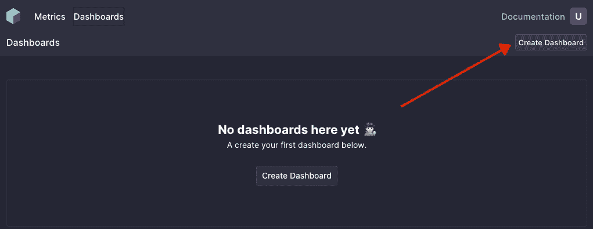

Quickmetrics Dashboard

您可以单击“创建仪表板”来创建自定义仪表板。在控制面板中，您可以点击“添加图表”来创建单独的指标图表。

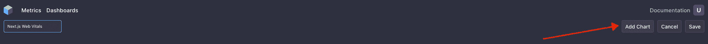

Add charts to dashboard

单击添加图表后，您可以选择要绘制图表的指标。您还可以指定绘制到图表的值操作(平均值、总和、最小值、最大值)。

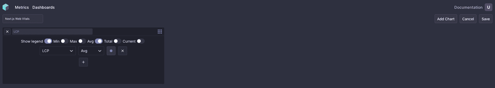

Create chart inside dashboard

一旦您在控制面板中创建了所有图表，您的控制面板应该如下所示:

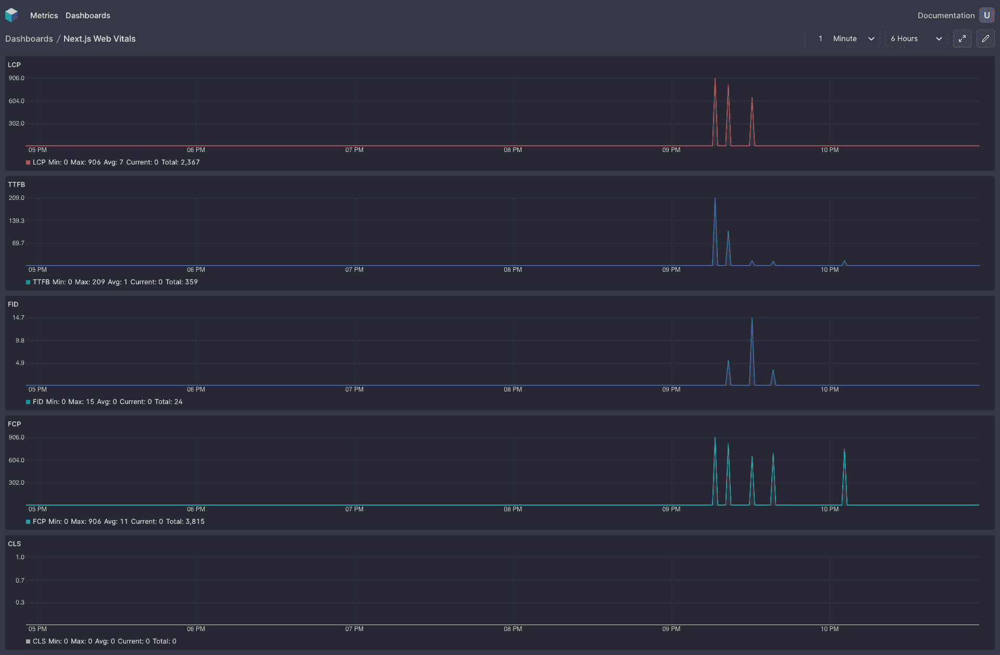

Next.js Web Vitals Dashboard

## 结论

网站活力是帮助你量化网站体验的最佳可用指标。从实际访问者那里收集数据有助于您对代码进行可操作的修改。你可以从访问者使用的实际设备上收集网络生命数据，而不是在你的笔记本电脑上进行测量。

如果你喜欢这篇文章，你可以去我的个人博客看看我写的更多东西。

我经常写关于编程和软件的文章，所以请订阅我的时事通讯，让我的最新文章直接发送到你的收件箱。你也可以在推特上和我联系。

参考资料:
-[https://nextjs . org/docs/advanced-features/measuring-performance](https://nextjs.org/docs/advanced-features/measuring-performance)
-【https://app.quickmetrics.io/docs/getting-started】
-[https://web.dev/vitals/](https://web.dev/vitals/)