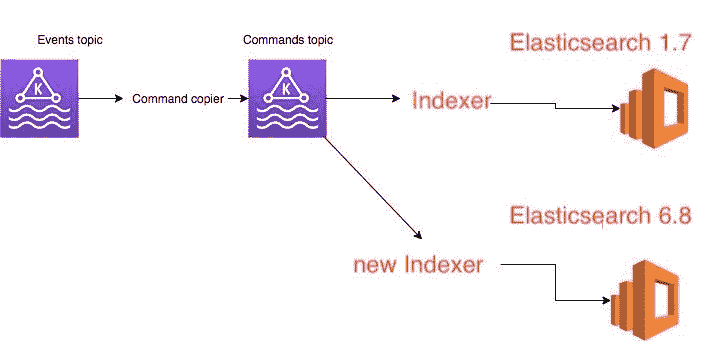

# 如何在零宕机的情况下从 Elasticsearch 1.7 迁移到 6.8

> 原文：<https://www.freecodecamp.org/news/how-to-migrate-from-elasticsearch-1-7-to-6-8-with-zero-downtime/>

我在 [BigPanda](https://www.bigpanda.io) 的最后一项任务是将使用 Elasticsearch 1.7 版本的现有服务升级到更新的 elastic search 版本 6.8.1。

在这篇文章中，我将分享我们如何从 Elasticsearch 1.6 迁移到 6.8，并有严格的限制，如零宕机、无数据丢失和零错误。我还将为您提供一个为您完成迁移的脚本。

这篇文章包含 6 章(其中一章是可选的):

*   对我有什么好处？->促使我们升级版本的新功能是什么？
*   约束->我们的业务需求是什么？
*   问题解决->我们如何解决约束？
*   前进->计划。
*   [可选章节] ->我们是如何处理臭名昭著的映射爆炸问题的？
*   最后->如何在集群之间进行数据迁移。

# 第 1 章—对我有什么好处？

通过升级我们的数据存储，我们期望获得哪些好处？

有几个原因:

1.  性能和稳定性问题—我们经历了大量的长 MTTR 停机，这让我们非常头疼。这反映在频繁的高延迟、高 CPU 使用率和更多问题上。
2.  旧的 Elasticsearch 版本中不存在支持—我们在 Elasticsearch 中缺少一些操作知识，当我们搜索外部咨询时，我们被鼓励向前迁移以获得支持。
3.  我们的模式中的动态映射——我们当前在 Elasticsearch 1.7 中的模式使用了一个叫做动态映射的特性，这个特性使得我们的集群[多次爆炸](https://www.elastic.co/guide/en/elasticsearch/reference/6.1/mapping.html#mapping-limit-settings)。所以我们想解决这个问题。
4.  我们现有集群的可见性差——我们希望在引擎盖下有一个更好的视图，并看到后来的版本有很好的指标导出工具。

# 第 2 章—约束条件

*   零停机迁移—我们的系统上有活跃的用户，我们不能承受迁移期间系统停机。
*   恢复计划—无论代价如何，我们都承受不起“丢失”或“损坏”数据的后果。因此，我们需要准备一个恢复计划，以防迁移失败。
*   零 bug——我们无法为最终用户改变现有的搜索功能。

# 第 3 章——问题解决和计划思考

让我们从最简单到最困难来解决这些限制:

## 零 bug

为了满足这个需求，我研究了服务接收到的所有可能的请求及其输出。然后我在需要的地方添加了单元测试。

此外，我添加了多个指标(到`Elasticsearch Indexer`和`new Elasticsearch Indexer`)来跟踪延迟、吞吐量和性能，这允许我验证我们只是改进了它们。

## 恢复计划

这意味着我需要解决下面的情况:我将新代码部署到产品中，但是东西没有按预期工作。那我能做什么呢

由于我在一个使用[事件源的服务中工作，](https://www.youtube.com/watch?v=STKCRSUsyP0)我可以添加另一个监听器(下图所示)并开始写入一个新的 Elasticsearch 集群，而不会影响生产状态

## 零停机迁移

当前服务处于实时模式，不能“停用”超过 5–10 分钟。做好这件事的诀窍是:

*   存储您的服务正在处理的所有操作的日志(我们在生产中使用 Kafka)
*   离线启动迁移过程(并在开始迁移之前跟踪偏移量)
*   当迁移结束时，使用记录的偏移启动新服务，并弥补延迟
*   当延迟结束时，更改您的前端来查询新服务，这样就完成了

# 第 4 章—计划

我们当前的服务使用以下架构(基于 Kafka 中的消息传递):


1.  `Event topic`包含由其他应用程序产生的事件(例如，`UserId 3 created`
2.  `Command topic`包含将这些事件翻译成该应用程序使用的特定命令(例如:`Add userId 3`)
3.  Elasticsearch 1.7 —由`Elasticsearch Indexer`读取的`command Topic`的数据存储。

我们计划向`command topic`添加另一个消费者(`new Elasticsearch Indexer`)，它将读取完全相同的消息并将它们并行写入 Elasticsearch 6.8。



# 我应该从哪里开始？

老实说，我认为自己是 Elasticsearch 的新手用户。为了自信地完成这项任务，我必须思考处理和学习这个话题的最佳方式。一些有帮助的事情是:

1.  文档——它是所有弹性搜索的极其有用的资源。花时间阅读并做笔记(不要错过:[映射](https://www.elastic.co/guide/en/elasticsearch/reference/current/mapping.html)和[查询](https://www.elastic.co/guide/en/elasticsearch/reference/current/query-dsl.html))。
2.  HTTP API——在 [CAT](https://www.elastic.co/guide/en/elasticsearch/reference/current/cat.html) API 下的所有内容。这对于本地调试和查看 Elasticsearch 如何响应非常有用(不要错过:集群健康、cat 索引、搜索、删除索引)。
3.  指标(❤️)——从第一天开始，我们就配置了一个闪亮的新仪表板，上面有许多很酷的指标(摘自[**elasticsearch-exporter-for-Prometheus**](https://github.com/justwatchcom/elasticsearch_exporter))，这些指标帮助并推动我们了解更多关于 elastic search 的信息。

# 代码

我们的代码库使用的是名为 [elastic4s](https://github.com/sksamuel/elastic4s) 的库，并且使用的是库中可用的最老版本——这是一个非常好的迁移理由！所以要做的第一件事就是迁移版本，看看出了什么问题。

关于如何进行代码迁移，有一些策略。我们选择的策略是在新的 Elasticsearch 版本中首先尝试恢复现有功能，而不是从头重写所有代码。换句话说，在新版 Elasticsearch 上使用现有功能。

对我们来说幸运的是，代码已经包含了几乎全部的测试覆盖，所以我们的任务要简单得多，这需要大约 2 周的开发时间。


需要注意的是，如果不是这样，我们将不得不投入一些时间来填补这个空白。只有这样，我们才能进行迁移，因为我们的约束之一是不能破坏现有的功能。

# 第 5 章——映射爆炸问题

让我们更详细地描述我们的用例。这是我们的模型:

`class InsertMessageCommand(tags: Map[String,String])`

例如，此消息的一个实例是:

`new InsertMessageCommand(Map("name"->"dor","lastName"->"sever"))`

考虑到这个模型，我们需要支持以下查询需求:

1.  按值查询
2.  按标签名称和值查询

在我们的 Elasticsearch 1.7 模式中建模的方式是使用动态模板模式(因为标签键是动态的，不能提前建模)。

由于映射爆炸问题，动态模板导致我们多次中断，模式如下所示:

```
curl -X PUT "localhost:9200/_template/my_template?pretty" -H 'Content-Type: application/json' -d '
{
    "index_patterns": [
        "your-index-names*"
    ],
    "mappings": {
            "_doc": {
                "dynamic_templates": [
                    {
                        "tags": {
                            "mapping": {
                                "type": "text"
                            },
                            "path_match": "actions.tags.*"
                        }
                    }
                ]
            }
        },
    "aliases": {}
}'  

curl -X PUT "localhost:9200/your-index-names-1/_doc/1?pretty" -H 'Content-Type: application/json' -d'
{
  "actions": {
    "tags" : {
        "name": "John",
        "lname" : "Smith"
    }
  }
}
'

curl -X PUT "localhost:9200/your-index-names-1/_doc/2?pretty" -H 'Content-Type: application/json' -d'
{
  "actions": {
    "tags" : {
        "name": "Dor",
        "lname" : "Sever"
  }
}
}
'

curl -X PUT "localhost:9200/your-index-names-1/_doc/3?pretty" -H 'Content-Type: application/json' -d'
{
  "actions": {
    "tags" : {
        "name": "AnotherName",
        "lname" : "AnotherLastName"
  }
}
}
' 
```

```
 curl -X GET "localhost:9200/_search?pretty" -H 'Content-Type: application/json' -d'
{
    "query": {
        "match" : {
            "actions.tags.name" : {
                "query" : "John"
            }
        }
    }
}
'
# returns 1 match(doc 1)

curl -X GET "localhost:9200/_search?pretty" -H 'Content-Type: application/json' -d'
{
    "query": {
        "match" : {
            "actions.tags.lname" : {
                "query" : "John"
            }
        }
    }
}
'
# returns zero matches

# search by value
curl -X GET "localhost:9200/_search?pretty" -H 'Content-Type: application/json' -d'
{
    "query": {
        "query_string" : {
            "fields": ["actions.tags.*" ],
            "query" : "Dor"
        }
    }
}
' 
```

## 嵌套文档解决方案

在解决映射爆炸问题时，我们的第一反应是使用嵌套文档。

我们阅读了弹性文档中的嵌套数据类型教程，并定义了以下模式和查询:

```
curl -X PUT "localhost:9200/my_index?pretty" -H 'Content-Type: application/json' -d'
{
        "mappings": {
            "_doc": {
            "properties": {
            "tags": {
                "type": "nested" 
                }                
            }
        }
        }
}
'

curl -X PUT "localhost:9200/my_index/_doc/1?pretty" -H 'Content-Type: application/json' -d'
{
  "tags" : [
    {
      "key" : "John",
      "value" :  "Smith"
    },
    {
      "key" : "Alice",
      "value" :  "White"
    }
  ]
}
'

# Query by tag key and value
curl -X GET "localhost:9200/my_index/_search?pretty" -H 'Content-Type: application/json' -d'
{
  "query": {
    "nested": {
      "path": "tags",
      "query": {
        "bool": {
          "must": [
            { "match": { "tags.key": "Alice" }},
            { "match": { "tags.value":  "White" }} 
          ]
        }
      }
    }
  }
}
'

# Returns 1 document

curl -X GET "localhost:9200/my_index/_search?pretty" -H 'Content-Type: application/json' -d'
{
  "query": {
    "nested": {
      "path": "tags",
      "query": {
        "bool": {
          "must": [
            { "match": { "tags.value":  "Smith" }} 
          ]
        }
      }
    }
  }
}
'

# Query by tag value
# Returns 1 result 
```

这个解决方案奏效了。然而，当我们试图插入真实的客户数据时，我们发现索引中的文档数量增加了大约 500 倍。

我们思考了以下问题，并继续寻找更好的解决方案:

1.  我们集群中的文档数量大约为 5 亿个。这意味着，使用新的模式，我们将达到 2500 亿个文档(即 2500 亿个文档？).
2.  我们阅读了这篇非常好的博文—[https://blog . gojekenengineering . com/elastic search-the-trouble-with-nested-documents-e97b 33 b 46194](https://blog.gojekengineering.com/elasticsearch-the-trouble-with-nested-documents-e97b33b46194)，这篇博文强调了嵌套文档会导致查询中的高延迟和堆使用问题。
3.  测试—由于我们将旧集群中的 1 个文档转换为新集群中未知数量的文档，因此很难跟踪迁移过程是否成功且没有任何数据丢失。如果我们的转换是 1:1，我们可以断言旧簇中的计数等于新簇中的计数。

## 避免嵌套文档

真正的技巧是关注我们正在运行的支持查询:按标签值搜索，以及按标签键和值搜索。

第一个查询不需要嵌套文档，因为它只处理一个字段。对于后者，我们做了以下几招。我们创建了一个包含键和值的字段。每当用户查询一个键，值匹配时，我们将他们的请求翻译成相应的文本并查询该字段。

示例:

```
curl -X PUT "localhost:9200/my_index_2?pretty" -H 'Content-Type: application/json' -d'
{
    "mappings": {
        "_doc": {
            "properties": {
                "tags": {
                    "type": "object",
                    "properties": {
                        "keyToValue": {
                            "type": "keyword"
                        },
                        "value": {
                            "type": "keyword"
                        }
                    }
                }
            }
        }
    }
}
'

curl -X PUT "localhost:9200/my_index_2/_doc/1?pretty" -H 'Content-Type: application/json' -d'
{
  "tags" : [
    {
      "keyToValue" : "John:Smith",
      "value" : "Smith"
    },
    {
      "keyToValue" : "Alice:White",
      "value" : "White"
    }
  ]
}
'

# Query by key,value
# User queries for key: Alice, and value : White , we then query elastic with this query:

curl -X GET "localhost:9200/my_index_2/_search?pretty" -H 'Content-Type: application/json' -d'
{
  "query": {
        "bool": {
          "must": [ { "match": { "tags.keyToValue": "Alice:White" }}]
  }}}
'

# Query by value only
curl -X GET "localhost:9200/my_index_2/_search?pretty" -H 'Content-Type: application/json' -d'
{
  "query": {
        "bool": {
          "must": [ { "match": { "tags.value": "White" }}]
  }}}
' 
```

# 第 6 章—迁移过程

我们计划在零停机时间内迁移约 5 亿份文档。为此，我们需要:

1.  如何将数据从旧弹性域转移到新弹性域的策略研究
2.  关于如何缩短迁移开始和结束之间的时间间隔的策略

我们缩小差距的两个选择是:

1.  我们的信息系统是基于卡夫卡的。我们可以在迁移开始前获取当前偏移量，在迁移结束后，从该特定偏移量开始使用。这个解决方案需要一些手动调整的补偿和其他一些东西，但将工作。
2.  解决这个问题的另一种方法是从 Kafka 中的主题开始消费消息，并使我们在 Elasticsearch 上的操作幂等——这意味着，如果更改已经“应用”,那么在 Elastic store 中什么也不会改变。

我们的服务对 Elastic 发出的请求已经是等幂的了，所以我们选择选项 2，因为它不需要手工操作(不需要获取特定的偏移量，然后在新的消费者组中设置它们)。

## 我们如何迁移数据？

这些是我们想到的选择:

1.  如果我们的卡夫卡包含了时间之初的所有信息，我们可以从头开始播放，结束状态将是相等的。但是，由于我们将保留应用于我们的主题，这不是一个选项。
2.  将消息转储到磁盘，然后直接接收到 Elastic 这种解决方案看起来有点奇怪。为什么要将它们存储在磁盘中，而不是直接写入 Elastic？
3.  在旧的 Elastic 和新的 Elastic 之间传递消息——这意味着编写某种“脚本”(有人提到 Python 吗？？)将连接到旧的 Elasticsearch 集群，查询条目，将它们转换为新的模式，并在集群中对它们进行索引。

我们选择最后一个选项。这些是我们心中的设计选择:

1.  除非需要，否则我们不要试图考虑错误处理。让我们试着写一些超级简单的东西，如果出现错误，让我们试着解决它们。最后，我们不需要解决这个问题，因为在迁移过程中没有发生任何错误。
2.  是一次性手术，所以先干嘛/亲。
3.  指标—由于迁移过程可能需要几个小时到几天的时间，我们希望从第一天起就能够监控错误计数，并跟踪脚本的当前进度和复制率。


我们经过深思熟虑，选择 Python 作为我们的首选武器。代码的最终版本如下:

```
dictor==0.1.2 - to copy and transform our Elasticsearch documentselasticsearch==1.9.0 - to connect to "old" Elasticsearchelasticsearch6==6.4.2 - to connect to the "new" Elasticsearchstatsd==3.3.0 - to report metrics 
```

```
from elasticsearch import Elasticsearch
from elasticsearch6 import Elasticsearch as Elasticsearch6
import sys
from elasticsearch.helpers import scan
from elasticsearch6.helpers import parallel_bulk
import statsd

ES_SOURCE = Elasticsearch(sys.argv[1])
ES_TARGET = Elasticsearch6(sys.argv[2])
INDEX_SOURCE = sys.argv[3]
INDEX_TARGET = sys.argv[4]
QUERY_MATCH_ALL = {"query": {"match_all": {}}}
SCAN_SIZE = 1000
SCAN_REQUEST_TIMEOUT = '3m'
REQUEST_TIMEOUT = 180
MAX_CHUNK_BYTES = 15 * 1024 * 1024
RAISE_ON_ERROR = False

def transform_item(item, index_target):
    # implement your logic transformation here
    transformed_source_doc = item.get("_source")
    return {"_index": index_target,
            "_type": "_doc",
            "_id": item['_id'],
            "_source": transformed_source_doc}

def transformedStream(es_source, match_query, index_source, index_target, transform_logic_func):
    for item in scan(es_source, query=match_query, index=index_source, size=SCAN_SIZE,
                     timeout=SCAN_REQUEST_TIMEOUT):
        yield transform_logic_func(item, index_target)

def index_source_to_target(es_source, es_target, match_query, index_source, index_target, bulk_size, statsd_client,
                           logger, transform_logic_func):
    ok_count = 0
    fail_count = 0
    count_response = es_source.count(index=index_source, body=match_query)
    count_result = count_response['count']
    statsd_client.gauge(stat='elastic_migration_document_total_count,index={0},type=success'.format(index_target),
                        value=count_result)
    with statsd_client.timer('elastic_migration_time_ms,index={0}'.format(index_target)):
        actions_stream = transformedStream(es_source, match_query, index_source, index_target, transform_logic_func)
        for (ok, item) in parallel_bulk(es_target,
                                        chunk_size=bulk_size,
                                        max_chunk_bytes=MAX_CHUNK_BYTES,
                                        actions=actions_stream,
                                        request_timeout=REQUEST_TIMEOUT,
                                        raise_on_error=RAISE_ON_ERROR):
            if not ok:
                logger.error("got error on index {} which is : {}".format(index_target, item))
                fail_count += 1
                statsd_client.incr('elastic_migration_document_count,index={0},type=failure'.format(index_target),
                                   1)
            else:
                ok_count += 1
                statsd_client.incr('elastic_migration_document_count,index={0},type=success'.format(index_target),
                                   1)

    return ok_count, fail_count

statsd_client = statsd.StatsClient(host='localhost', port=8125)

if __name__ == "__main__":
    index_source_to_target(ES_SOURCE, ES_TARGET, QUERY_MATCH_ALL, INDEX_SOURCE, INDEX_TARGET, BULK_SIZE,
                           statsd_client, transform_item) 
```

# 结论

在实时生产系统中迁移数据是一项复杂的任务，需要投入大量精力和仔细规划。我建议花时间完成上面列出的步骤，并找出最适合您需求的方法。

根据经验，总是尽可能地降低你的要求。例如，是否需要零停机时间迁移？您能承受数据丢失吗？


升级数据存储通常是一场马拉松，而不是短跑，所以深呼吸，试着享受这个过程。

*   上面列出的整个过程花了我大约 4 个月的时间
*   本帖中出现的所有 Elasticsearch 示例都已经过 6.8.1 版本的测试