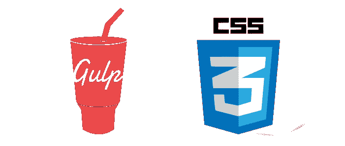
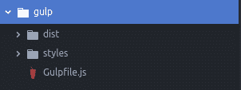

# 如何用 gulp 缩小你的 CSS

> 原文：<https://www.freecodecamp.org/news/how-to-minify-your-css-with-gulp-6ff3f4a896b5/>

由 Vinicius Gularte

# 如何用 gulp 缩小你的 CSS

在这篇文章中，我将展示一个简单的方法来自动缩小你的 CSS 文件。？

### **首先，什么是吞咽？**

Gulp 是一个 JavaScript 任务运行器，可以让你自动完成任务，比如…

*   捆绑和缩小库和样式表。
*   保存文件时刷新浏览器。
*   快速运行单元测试。
*   运行代码分析。
*   Less/Sass 对 CSS 编译。
*   还有更多！

gulp 工作流程如下:

我们可以创造我们想要完成的任务。在这些任务中，我们加载我们希望 gulp 处理的文件(修改或不修改)，然后将它们返回到某个返回文件夹。

很简单。

在这个小教程中，我将教你如何创建一个任务来缩小你文件夹中的所有 CSS 文件。然后把缩小的放在另一个文件夹里。

### 我们开始吧

对于本教程，请确保您的计算机上安装了最新版本的 npm 软件包。如果没有，可以在 这里下载 [**。**](http://www.npmjs.com)

一旦你安装了 npm，在你的项目的基本目录中，我们将使用以下命令安装 gulp:

`npm install gulp-cli -g`

`npm install gulp -D`

我们还将使用一个名为 **gulp-clean-css** 的 gulp 插件来缩小 CSS，因此将其安装在项目类型中:

`npm install gulp-clean-css --save-dev`

很好，现在项目中安装了依赖项，让我们创建一个名为 **Gulpfile.js** 的文件。这个文件将负责我们的任务。

我们也将在这个存储库中创建两个文件夹。一个名为 styles，存放我们的样式文件，另一个名为 dist，存放缩小的文件。

最终，我们的项目将具有这样的结构:

### 在 Gulpfile.js 中

在文件的开始，我们调用将要使用的包。

调用包后，我们将通过缩小文件来创建负责任的任务。

你可能想知道——你已经能够缩小你的文件了？可以，在终端中执行 gulp 命令，后跟任务名称。

但是一直运行这个命令有点烦人，不是吗？我们可以创建一个方法来观察 styles 文件夹中文件的变化。

这样，运行 gulp 命令将等待所选文件中的更改来激活 minify-css 任务。

### 结论

这只是 gulp 可以帮助我们开发应用程序的一个小方法。

你可以在 GitHub 的这个库中找到这个项目的代码。

*感谢您的阅读，请随意？并帮助他人找到它。*

回头见。？

### 参考

[**gulp . js**](https://gulpjs.com/)
[*通过偏好代码而非配置、节点最佳实践和最小化的 API surface——gulp 使事情变得简单，比如……*gulpjs.com](https://gulpjs.com/)[**gulp-clean-css**](https://www.npmjs.com/package/gulp-clean-css)
[*用 clean-css 缩小 CSS。*www.npmjs.com](https://www.npmjs.com/package/gulp-clean-css)