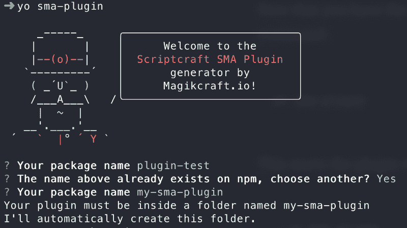
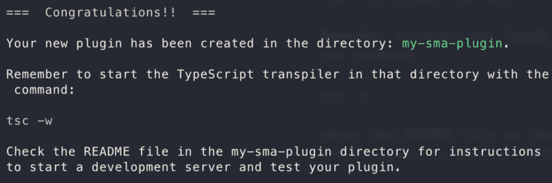
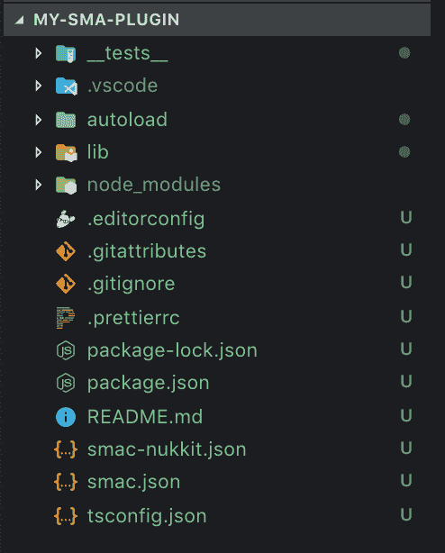
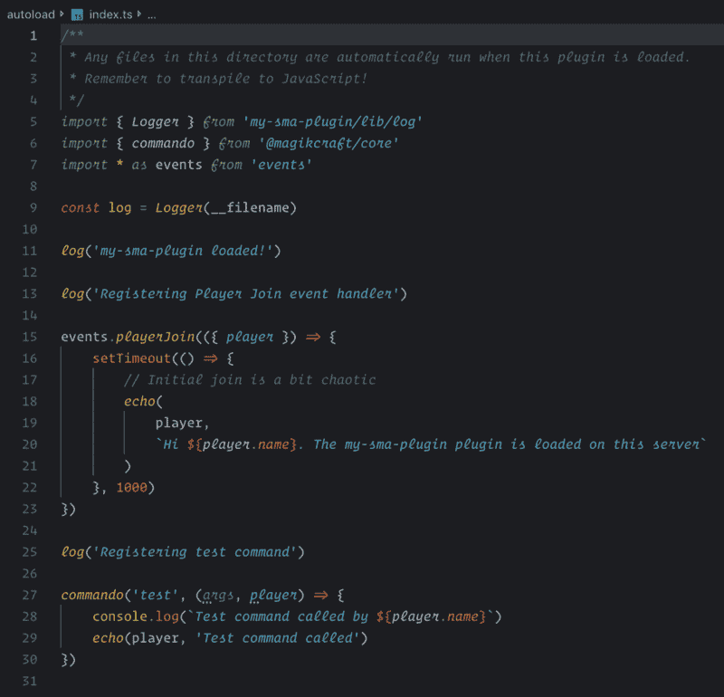
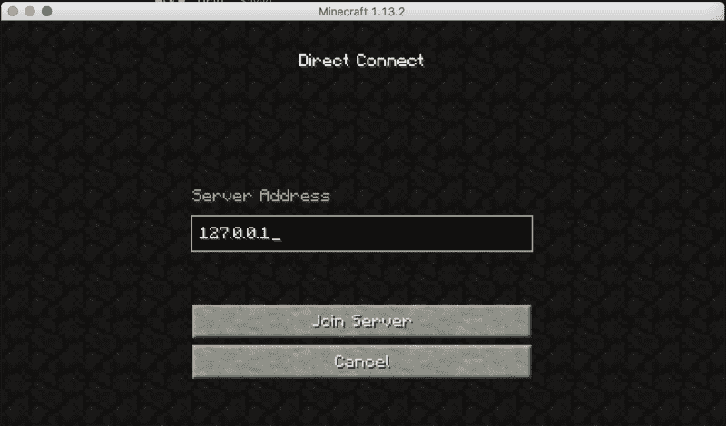
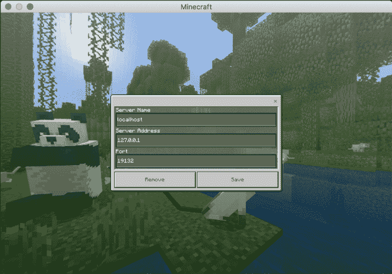

# 如何用打字稿简单修改《我的世界》

> 原文：<https://www.freecodecamp.org/news/how-to-mod-minecraft-without-java-f076ddaec01c/>

乔希·伍尔夫

# 如何用打字稿简单修改《我的世界》

通常，修改《我的世界》需要用 Java 编写代码，以及大量的搭建工作。现在你可以使用 TypeScript/Javascript 编写和分享 Minecraft mods 了。

ScriptCraft 是一个开源的 JavaScript《我的世界》模块库，我们已经编写了对 TypeScript 的支持，以及一系列工具来为来自 JavaScript 领域的人(包括约曼和 NPM)创建熟悉的开发体验。

在这篇文章中，我将带您在一个小时内完成设置和构建您的第一个 TypeScript《我的世界》模型——根据您的互联网连接，只有 20 分钟。

在这个视频中([点击这里](https://www.youtube.com/watch?v=RqohEXw9yvw)如果上面的嵌入不起作用)我向你展示了如何使用 TypeScript 编写一个基本的《我的世界》模式，并在你的本地计算机上运行它，包括一个桌面和一个移动《我的世界》服务器。

下面，我将带您浏览这些步骤，并提供参考资料的链接。

### 先决条件

你需要在电脑上安装一些软件，来运行《我的世界》服务器和编写插件的工具。安装以下所有四个组件:

*   [Docker](https://www.docker.com/get-started) —集装箱化解决方案。
*   [Node.js](https://nodejs.org/en/) —一个 JavaScript 执行引擎和库。
*   [Portainer](https://www.portainer.io/) —用于管理 Docker 容器的基于 web 的 GUI。
*   [Visual Studio 代码](https://code.visualstudio.com/) —一个代码编辑器。

#### 《我的世界》客户

你需要一个《我的世界》客户端来测试你的插件。

至少安装以下软件之一:

*   《我的世界》Java 版——桌面客户端，如果你想测试 Bukkit 服务器的话。
*   [《我的世界》口袋版](https://play.google.com/store/apps/details?id=com.mojang.minecraftpe) —一个移动客户端，如果你想对 Nukkit 服务器(手机/平板电脑/Xbox)进行测试。如果你使用这个，你可以使用[《我的世界》袖珍版基岩发射器](https://mcpelauncher.readthedocs.io/en/latest/)在你的电脑上运行移动客户端。

### 装置

既然已经安装了先决条件，那么是时候为服务器和插件开发安装工具了。

1.  运行以下命令:

```
npm i -g smac yo generator-sma-plugin typescript
```

这将在您的计算机上安装四样东西:

*   `smac` — *Scriptcraft 模块化架构控制器，*一个为你的插件运行《我的世界》服务器的程序。
*   `yo` — *约曼*，脚手架工具。
*   使用 Scriptcraft 模块化架构生成新《我的世界》插件的 Yeoman 插件。
*   `typescript`—TypeScript trans piler，用于将 TypeScript 代码转换成可以在《我的世界》运行的 ES5 JavaScript。

### 创建新插件

现在您已经安装了工具集，通过运行以下命令创建一个新插件:

```
yo sma-plugin
```

这将启动插件向导:

```
➜ yo sma-plugin
```

```
 _-----_     ╭──────────────────────────╮    |       |    │      Welcome to the      │    |--(o)--|    │  Scriptcraft SMA Plugin  │   `---------´   │       generator by       │    ( _´U`_ )    │      Magikcraft.io!      │    /___A___\   /╰──────────────────────────╯     |  ~  |   __'.___.'__ ´   `  |° ´ Y `
```

```
? Your package name (workspace)
```

这里你只需要回答一个问题——你的插件的名字。向导将用插件的名称创建一个新文件夹，并将新插件的文件放在其中。



这个截屏向您展示了这一过程:

[**Scaffold 一个使用 Magikcraft 的《我的世界》插件**](https://asciinema.org/a/242028)
[*magic craft . io 允许你用 TypeScript/JavaScript 编写将在桌面/移动上运行的《我的世界》插件。*asciinema.org](https://asciinema.org/a/242028)

一旦向导完成，它会发出一条类似如下的消息(在本例中我选择了名称`my-sma-plugin`):



### 编辑您的新插件

启动 Visual Studio 代码并打开包含新插件的目录。



以下是对新插件中文件的描述:

*   `__tests__` —包含插件单元测试的目录。这些是用茉莉做的。当你开发你的插件时，在这里添加更多的测试。
*   `.vscode`—Visual Studio 代码的设置。
*   `autoload` —当您的插件在《我的世界》服务器中启用时，这里的任何文件都会自动执行。将它用于初始化任务、注册事件处理程序等等。
*   `lib` —放置不应自动加载的文件(或自动加载文件所需的文件)的地方。如果你的插件向其他插件提供功能，那么你可以通过`lib/index.ts`导出它。
*   `node_modules`—NPM 的模块安装在这里。您不能使用 npm 中使用 V8 APIs(如 fs 或 http)的模块。你需要的许多特性都由 [Scriptcraft API](https://github.com/walterhiggins/ScriptCraft) 和`[@magikcraft/core](https://github.com/Magikcraft/magikcraft-core)` [包提供。](https://github.com/Magikcraft/magikcraft-core)
*   `.editorconfig` —编辑器的设置。
*   `.gitattributes`—`git`的设置。
*   `.gitignore` —对于`git`要忽略的文件。
*   `.prettierrc` —代码格式设置。
*   `package-lock.json`—已安装依赖项的版本。
*   `package.json`—此插件的配置，包括依赖项和脚本。
*   `README.md` —开发和测试插件的说明。
*   `smac-nukkit.json` —运行加载了插件的 Nukkit 服务器的配置。
*   `smac.json` —加载插件后运行 Bukkit 服务器的配置。
*   `tsconfig.json` —将插件转换成 JavaScript 的类型脚本配置。

打开`autoload/index.ts`:



这个文件在插件加载时自动执行。当你(重新)加载插件时，你在这里所做的更改将会可见。

### 启动开发服务器

您可以在开发服务器中加载您的插件。您可以使用两个服务器—一个用于桌面 Java 客户端，另一个用于移动 Pocket Edition 客户端。

#### 启动桌面服务器

运行以下命令启动桌面服务器:

```
npm run start:bukkit
```

这将:

1.  从 Docker Hub 获取 Bukkit 服务器映像。
2.  启动 Bukkit 服务器并加载插件。
3.  启动 TypeScript transpiler 将您的代码转换到 ES5。

现在，您可以使用桌面客户端连接到服务器。点击`Multiplayer`然后`Direct Connect`，然后使用服务器地址`127.0.0.1`:



#### 启动移动服务器

运行以下命令启动移动服务器:

```
npm run start:nukkit
```

这将:

1.  从 Docker Hub 中提取 Nukkit 服务器映像。
2.  加载插件，启动 Nukkit 服务器。
3.  启动 TypeScript transpiler 将您的代码转换到 ES5。

现在，您可以使用 pocket edition 客户端连接到服务器。点击`Play`然后`Servers`，然后添加一个地址为`127.0.0.1`的服务器:



### 将更改重新加载到插件中

当您更改插件并保存更改后的类型脚本时，它会自动转换为 JavaScript。

要在开发服务器中重新加载更改，请在服务器控制台中键入以下内容:

```
ts onrefresh()
```

请看下面的截屏，看看这是什么样子。

### 停止服务器

要停止服务器，请在服务器控制台键入以下命令:

```
smac stop
```

请看下面的截屏，看看运行这个命令时是什么样子。

### 截屏:开始、重新加载和停止

这个截屏展示了如何启动桌面服务器，重新加载插件代码，以及停止开发服务器。

[**启动 magic raft 开发服务器**](https://asciinema.org/a/242023)
[*启动 magic raft 开发服务器。*asciinema.org](https://asciinema.org/a/242023)

### 更多资源

*   [GitHub 上的 magic craft](https://github.com/Magikcraft)
*   [YouTube 上的 magic craft](https://www.youtube.com/channel/UC9cEOcTkQEyiKr2nCZDBYeg)
*   [MCT1 源代码(示例插件)](https://github.com/Magikcraft/mct1)
*   [GitHub 上的 script craft](https://github.com/walterhiggins/ScriptCraft)
*   [bukit API docs](https://bukkit.magikcraft.io)