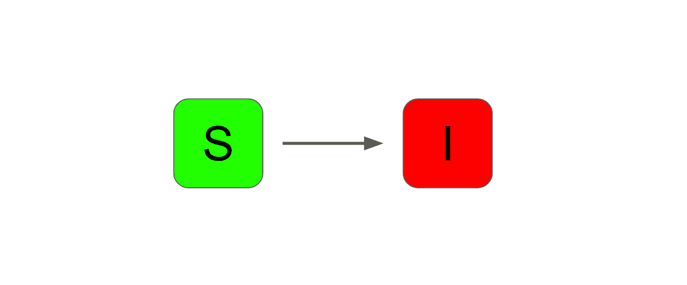
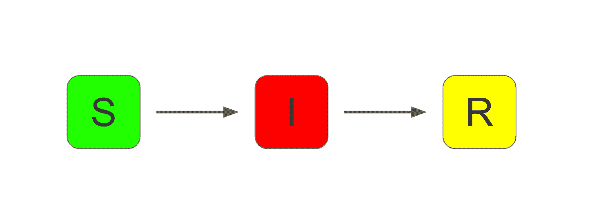
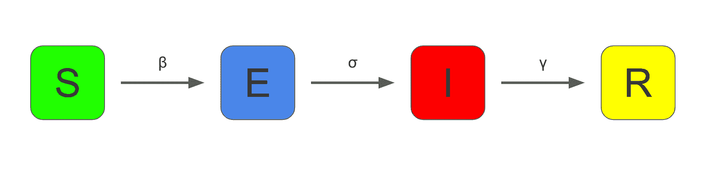
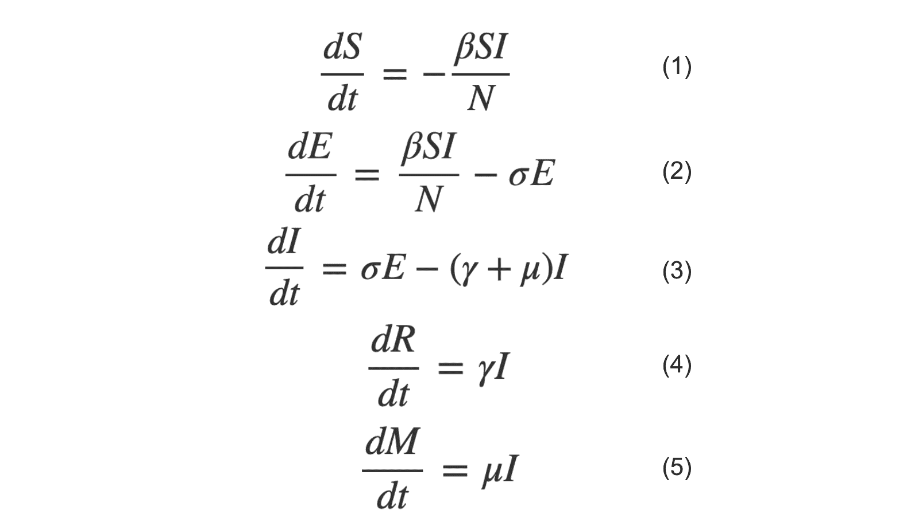

# 如何用 R 建立流行病模型

> 原文：<https://www.freecodecamp.org/news/how-to-model-an-epidemic-with-r/>

流行病学从未如此热门。它是关于健康和疾病如何影响人群的科学研究，包括像新冠肺炎这样的传染病。

理解这类疾病传播的关键是流行病建模的实践。这包括建立定量模型来描述和预测疾病的传播。

流行病建模的经典方法是使用一种称为“房室模型”的数学模型。

方法如下:

1.  根据感染状况，将群体中的每个个体分配到几个区间中的一个。
2.  然后，定义个人在状态更新时在区间之间移动的比率。
3.  使用这个模型来定义可以预测疫情进程的微分方程。

SI 模型是房室模型的最基本形式。它有两个部分:“易感”和“传染性”。



SIR 车型增加了一个额外的车厢，叫做“回收”。这个模型经常被用作流行病学的基线。这是一个过于简单的模型，但却相当好地描述了流行病的发展过程。



SIR 模型的一个扩展(也是我们将在本文中更详细考虑的)是 SEIR 模型。这又增加了一个“暴露”的隔间。

## 什么是 SEIR 模式？

基本的 SEIR 模型有四个部分:



*   “易感者”——没有接触过病毒的人
*   “暴露”——暴露于病毒，但还没有传染性的个人
*   “传染性”——受感染的人会变得有传染性
*   “康复的”——恢复并对病毒免疫的感染个体

种群大小 N 取四个隔室中个体的总和。

隔间之间的个体流动由许多参数来表征。

**β-**

β是透射系数。把它想成是人群中一个传染性个体在每个时间段内的平均传染性接触次数。β值高意味着病毒有更多的机会传播。

**σ-【σ】**

σ是暴露个体变得具有传染性的速率。把它想象成具有传染性的平均时间的倒数。也就是说，如果一个个体平均 4 天后变得有传染性，σ将是 1/4(或 0.25)。

**γ-【γ】**

γ是感染个体恢复的速率。和之前一样，把它想成是平均恢复时间的倒数。即如果平均需要 10 天才能恢复，则γ为 1/10(或 0.1)。

**μ-【mu】t1**

μ是描述传染个体死亡率的可选参数。μ越高，病毒越致命。

从这些参数，你可以构建一组微分方程。这些描述了每个隔间改变大小的速率。

先说“易感”车厢，s。

### 等式(1) -易受影响

从模型中首先看到的是，S 不可能随着时间的推移而增加。没有流回到隔间中。等式(1)必须是负的，因为 S 只能减少。

一个人可以通过什么方式离开 S 车厢？

它们会被人群中具有传染性的个体感染。

在任一阶段，感染个体在人群中的比例= I/N。

易感个体的比例将是 S/N。

在完全混合的假设下(即，个体与群体中任何其他个体接触的可能性相等)，传染性和易感个体之间任何给定接触的概率为(I / N) * (S / N)。

这乘以群体中的接触数量。这是通过将透射系数β乘以群体大小 n 得到的。

将所有这些结合在一起并简化得到等式(1):


### 等式(2) -暴露

接下来，让我们考虑“暴露”隔间，即个体可以流入和流出这个隔间。

流入 E 的流量将与流出 s 的流量相匹配，因此下一个等式的第一部分将与前一项正好相反。

个体可以通过进入传染区室而离开 E。这以两个变量决定的速率发生——速率σ和 e。

因此，总等式(2)为:


### 等式(3) -传染性

下一个要考虑的部分是“传染性”部分。

有一条路可以进入这个隔间，那就是从“暴露”的隔间。

一个人有两种方式可以离开“传染”室。

有些人会搬到“恢复”。这以γ的速率发生。

其他人将无法幸免于感染。它们可以用死亡率μ来建模。

因此，等式(3)看起来像:


### 方程式(4) -恢复

现在让我们来看看“恢复”车厢，r。

这一次，个体可以流入隔间(由速率γ决定)。

并且没有个体可以流出隔室(尽管在一些模型中，假设有可能移回到“易感”隔室)。

因此，整个等式(4)如下所示:


### 等式(5) -死亡率(可选)

使用类似的推理，您也可以构建死亡率变化的方程(5)。你可以认为这是模型中的第五个隔间。

如果将μ设置为零，则可以排除模型的这一方面。


所以现在你有了完整的微分方程组(1-5)。



任何流行病模型中的一个重要数字被称为基本再生数，或 R₀.这被定义为:


这个数字估计的是平均感染个体将会感染的人数。

因此，这是一个至关重要的数字:

*   如果 R₀指数高于 1，那么病毒的爆发很可能会成为流行病
*   如果 R₀低于 1，那么疫情就有可能得到控制

### 如何解这些方程

为了使用该模型来预测流行病的进程，有必要求解该方程组。

这可以使用 [R 编程语言](https://www.r-project.org/)来完成。

特别是，你可以使用一个叫做 [deSolve](https://www.rdocumentation.org/packages/deSolve/versions/1.27.1) 的包来求解关于时间变量的微分方程。

在 R 中，粘贴以下代码:

```
require(deSolve)

SEIR <- function(time, current_state, params){

  with(as.list(c(current_state, params)),{
    N <- S+E+I+R
    dS <- -(beta*S*I)/N
    dE <- (beta*S*I)/N - sigma*E
    dI <- sigma*E - gamma*I - mu*I
    dR <- gamma*I
    dM <- mu*I

    return(list(c(dS, dE, dI, dR, dM)))
  })
}
```

这段代码导入 deSolve 包。

然后它定义了一个名为`SEIR`的函数。它需要三个参数:

*   当前时间步长。
*   系统当前状态的列表(即，当前时间步长下 S、E、I 和 R 的估计值)。
*   等式中使用的参数列表(回想一下，这些参数是β、σ、γ和μ)。

在函数体内，你可以如上所述定义微分方程系统。对给定的时间步长进行计算，并作为列表返回。它们返回的顺序必须与您提供当前状态的顺序相匹配。

现在看一下下面的代码:

```
params <- c(beta=0.5, sigma=0.25, gamma=0.2, mu=0.001)

initial_state <- c(S=999999, E=1, I=0, R=0, M=0)

times <- 0:365
```

这将初始化模型的参数和初始状态(启动条件)。

它还生成一个从零到 365 天的时间向量。

现在，创建模型:

```
model <- ode(initial_state, times, SEIR, params)
```

这使用 deSolve 的`ode()`函数来求解关于时间的方程。

参见[此处](https://www.rdocumentation.org/packages/deSolve/versions/1.27.1/topics/ode)获取文档。

所需的参数是:

*   每个隔间的初始状态
*   时间向量(本例求解 365 天)
*   `SEIR()`函数，它定义了方程组
*   传递给`SEIR()`函数的参数向量

跑步:

```
summary(model)
```

...会给出模型的汇总统计。

```
 S            E            I         R         M
Min.    108263.6 3.616607e-07 0.000000e+00      0.00    0.0000
1st Qu. 108263.7 5.957435e-03 1.414971e-02  63894.43  319.4721
Median  108395.7 8.470071e+00 1.273726e+01 886814.36 4434.0718
Mean    362798.6 9.745754e+03 1.212158e+04 612272.74 3061.3637
3rd Qu. 852375.5 1.734331e+03 2.533956e+03 887299.83 4436.4991
Max.    999999.0 1.092967e+05 1.265161e+05 887299.86 4436.4993
N          366.0 3.660000e+02 3.660000e+02    366.00  366.0000
sd      381257.2 2.475783e+04 2.969234e+04 387333.47 1936.6673
```

你已经发现了一些有趣的见解。

*   在 100 万人中，有 108，264 人没有被感染。
*   在疫情最严重的时候，有 126，516 人同时感染。
*   887，300 人在模型结束时康复。
*   在疫情期间，共有 4436 人死亡。

您还可以使用`matplot()`功能来显示疫情的演变。

或者，您可以使用另一个绘图库，如 [ggplot2](https://ggplot2.tidyverse.org/index.html) 来生成质量更好的图形。

```
matplot(model, type="l", lty=1, main="SEIR model", xlab="Time")

legend <- colnames(model)[2:6]

legend("right", legend=legend, col=2:6, lty = 1)
```

该图如下所示:


您还可以将模型输出强制转换为 dataframe 类型。然后，您可以进一步分析该模型。

```
infections <- as.data.frame(model)$I

peak <- max(infections)

match(peak, infections)
```

上面的代码显示感染人数在第 112 天达到高峰。

使用其他的库，比如 dplyr，可以让你进行你想要的高级分析。

## 如何模拟干预方法

SEIR 模型是一个有趣的例子，说明在人口行为没有任何变化的情况下，流行病是如何发展的。

您可以通过以 SEIR 模型为起点并添加额外的功能来构建更复杂的模型。

这让你可以模拟行为的变化(无论是自愿的还是政府干预的结果)。

在 2020 年冠状病毒疫情期间，世界上许多(但不是所有)国家进入了某种形式的“一级防范”。

最终，封锁的目的是通过降低传播系数β来改变疫情的进程。

下面的代码定义了一个模型，该模型在锁定期开始和结束之间改变β值。

所有使用的数字纯粹是说明性的。你可以用整个研究生涯(几次)来试图找出最现实的价值。

```
SEIR_lockdown <- function(time, current_state, params){

    with(as.list(c(current_state, params)),{

      beta = ifelse(
        (time <= start_lockdown || time >= end_lockdown),
        0.5, 0.1
        )

      N <- S+E+I+R
      dS <- -(beta*S*I)/N
      dE <- (beta*S*I)/N - sigma*E
      dI <- sigma*E - gamma*I - mu*I
      dR <- gamma*I
      dM <- mu*I

      return(list(c(dS, dE, dI, dR, dM)))
    })
  }
```

唯一的变化是额外的`ifelse()`语句，用于在锁定期间将β的值调整为 0.1。

您需要向模型传递两个新参数。这是封锁期的开始和结束时间。

这里，封锁从第 90 天开始，到第 150 天结束。

```
params <- c(
    sigma=0.25,
    gamma=0.2,
    mu=0.001,
    start_lockdown=90,
    end_lockdown=150
    )

  initial_state <- c(S=999999, E=1, I=0, R=0, M=0)

  times <- 0:365

  model <- ode(initial_state, times, SEIR_lockdown, params)
```

现在您可以查看与该模型相关的摘要和图表。

```
summary(model)
```

这将揭示:

```
 S            E           I         R         M
Min.    156885.7 7.699207e-01     0.00000      0.00    0.0000
1st Qu. 160478.2 6.929205e+01    97.71405  63668.75  318.3438
Median  789214.4 1.246389e+03  1735.66330 194379.16  971.8958
Mean    589558.9 9.216918e+03 11460.62036 387824.44 1939.1222
3rd Qu. 867639.6 1.030043e+04 13780.17591 829898.56 4149.4928
Max.    999999.0 6.083432e+04 72443.97892 838916.89 4194.5845
N          366.0 3.660000e+02   366.00000    366.00  366.0000
sd      350719.3 1.570278e+04 18893.31145 346542.57 1732.7128
```

你可以看到:

*   在 100 万人中，156，886 人没有被感染。
*   在疫情最严重的时候，有 72，444 人同时感染。
*   838，917 个个体在模型结束时恢复。
*   在疫情期间，共有 4195 人死亡。

使用`matplot()`绘制模型揭示了强烈的“第二波”效应(正如在 2020 年底欧洲许多国家看到的)。

```
 matplot(
    model, 
    type="l",
    lty=1, 
    main="SEIR model (with intervention)", 
    xlab="Time"
    )

legend <- colnames(model)[2:6]

legend("right", legend=legend, col=2:6, lty = 1)
```


最后，您可以将模型强制转换为数据框架，并从那里进行更详细的分析。

```
infections <- as.data.frame(model)$I

peak <- max(infections)

match(peak, infections)
```

在这种情况下，感染人数在第 223 天达到高峰。

在其他情况下，您可以模拟疫苗接种的效果。或者，你可以考虑传播率的季节性差异。

## 房室模型的局限性

与所有建模一样，流行病模型的好坏取决于其中的数据和假设。

上述 SEIR 模型背后的一些假设是不现实的。

例如:

*   在大群体中，混合是不均匀的。个人更有可能与他们所在地的个人互动。更先进的房室模型将解释这一点。
*   该模型假设人口是孤立的。事实上，种群间的混合使得一种病毒可以被多次引入和再引入。
*   个体通常没有天生的免疫力。当考虑更长的时间时，更复杂的模型会将出生率考虑在内。
*   基本的 SEIR 模型没有考虑人口的年龄结构。通常，病毒会在年轻、人口密集的城市中传播得更快。但是对于这些城市之外的老年人来说，这可能更加致命。更复杂的模型会考虑这些差异。
*   SEIR 模型只考虑每个参数的平均值。实际上，会有很多变化。有些人在很长一段时间内仍然具有传染性。少数人可能会建立大量的联系。因此，该模型适用于在长时间内描述高水平的疫情。但不适合预测更小尺度的细节。

尽管有其局限性，SEIR 模型是理解流行病动态的坚实起点。

更一般地，使用微分方程来表示隔间之间的流动以模拟复杂过程的方法是非常强大的。

针对 R 和 Python 等语言的软件包的可用性使得开始探索这些技术比以往任何时候都更容易。

你可以在这里深入研究用于示例[的代码。](https://github.com/pg0408/seir)

感谢阅读！