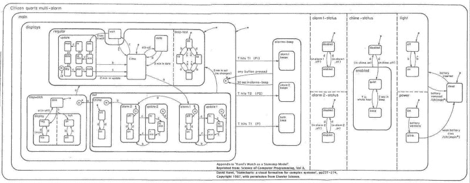
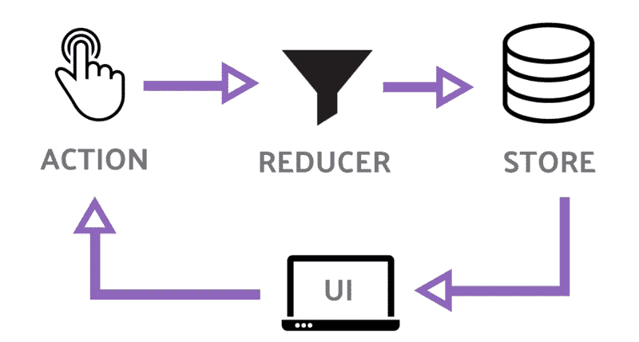
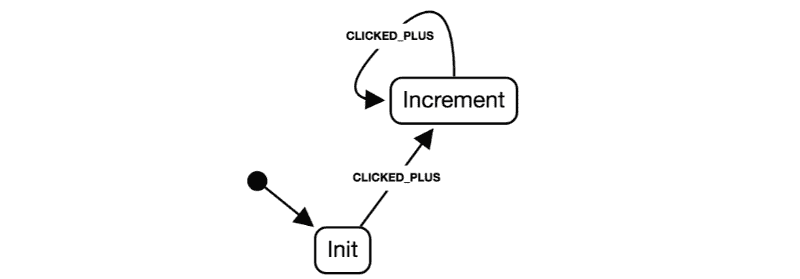
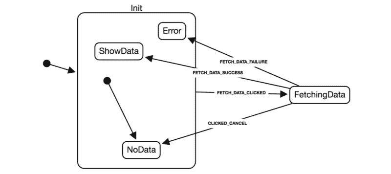
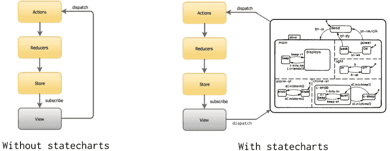
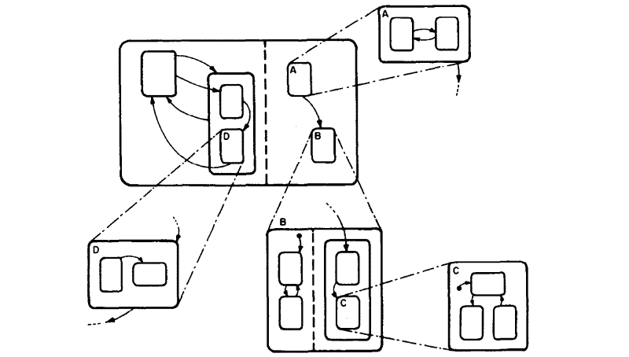

# 如何使用状态图对 Redux 应用程序的行为建模

> 原文：<https://www.freecodecamp.org/news/how-to-model-the-behavior-of-redux-apps-using-statecharts-5e342aad8f66/>

由卢卡事项

# 如何使用状态图对 Redux 应用程序的行为建模



[Statecharts: a visual formalism for complex systems](http://www.inf.ed.ac.uk/teaching/courses/seoc/2005_2006/resources/statecharts.pdf)

无论我们喜欢与否，我们的应用程序在任何给定的时间点都会处于特定的状态。当我们编写用户界面(UI)时，我们使用数据(例如 Redux 存储)来描述这些状态，但是我们从来没有给每个状态一个正式的名称。

更重要的是，有些事件在特定状态下不应该被触发。

事实证明，这种描述状态和从一种状态转换到另一种状态的事件的想法是一个经过充分研究的概念。例如，Statecharts 提供了一种可视化的形式来描述反应式应用程序的行为，比如用户界面。

在本文中，我将讨论 Redux 应用程序的行为如何从组件、容器或中间件——我们通常保存这种逻辑的地方——中分离出来，并完全使用状态图来包含和描述。这使得应用程序行为的重构和可视化更加容易。

### Redux 和状态图

[Redux](https://redux.js.org/) 很简单。我们有一个触发事件的 UI 组件。当这个事件发生时，我们就采取行动。缩减器使用这个动作来更新存储。最后，我们的组件直接从商店的更新中获取信息:

```
// our UI componentfunction Counter({ currentCount, onPlusClick }) {  return <>    <button onClick={onPlusClick}>plus</button>    {currentCount}  <>}
```

```
// let's connect the component to reduxconnect(  state => ({ currentCount: state.currentCount }),  dispatch => ({     onPlusClick: () => dispatch({ type: INCREMENT })  }))(Counter)
```

```
// handle the INCREMENT update using a reducerfunction currentCountReducer(state = 0, action) {  switch(action.type) {    case INCREMENT:      return state + 1;    default:      return state;  }}
```

这几乎是 Redux 的全部内容。



为了引入 statecharts，我们没有将事件直接映射到更新动作，而是将其映射到不更新任何数据的通用动作(没有 reducer 处理它):

```
// currently we are mapping our event to the update:// onPlusClick -> INCREMENT// instead, we dispatch a generic event which is not an update:// onPlusClick -> CLICKED_PLUS // this way we decouple our container from knowing // which update will happen.// the statechart will take care of triggering the correct update.
```

```
connect(  state => ({ currentCount: state.currentCount }),  dispatch => ({     onPlusClick: () => dispatch({ type: CLICKED_PLUS })  }))(Counter)
```

没有 reducer 处理`CLICKED_PLUS`，所以我们让一个状态图来处理它:

```
const statechart = {  initial: 'Init',  states: {    Init: {      on: { CLICKED_PLUS: 'Increment' }    },    Increment: {      onEntry: INCREMENT, // <- update when we enter this state      on: { CLICKED_PLUS: 'Increment' }    }  }}
```

状态图将以类似于 reducer 的方式处理它接收到的事件，但前提是它的状态允许这样的事件发生。**在这个上下文中的事件是不更新商店**的 Redux 动作。

在上面提到的例子中，我们从处于`Init`状态开始。当`CLICKED_PLUS`事件发生时，我们转换到具有`onEntry`字段的`Increment`状态。这使得 statechart 分派一个`INCREMENT`动作——这次由一个 reducer 处理，它更新存储。

你可能会问，为什么我们要让容器不知道更新呢？我们这样做是为了让所有关于何时需要更新的行为都包含在 statechart JSON 结构中。这意味着它也可以被可视化:



这可以通过简单地改变状态图的 JSON 描述来改进我们的应用程序的行为。让我们通过使用[分层状态](https://statecharts.github.io/glossary/compound-state.html)的概念，将两个`CLICKED_PLUS`转换组合成一个来改进我们的设计:


要做到这一点，我们只需要改变我们的状态图定义。我们的 UI 组件和 reducers 保持不变。

```
{  initial: 'Init',  states: {    Init: {      on: { CLICKED_PLUS: 'Init.Increment' },      states: {        Increment: {          onEntry: INCREMENT        }      }    }  }}
```

### 异步副作用

让我们想象一下，当一个`<FetchDataButton` / >被点击时，我们想要启动一个 HTTP 请求。下面是我们目前在没有状态图的 Redux 中的做法:

```
connect(  null,  dispatch => ({     onFetchDataClick: () => dispatch({ type: FETCH_DATA_CLICKED })  }))(FetchDataButton)
```

那么我们可能会有一部史诗来处理这样的动作。下面我们使用 [redux-observable](https://redux-observable.js.org/) ，但是也可以使用 redux-saga 或 redux-thunk:

```
function handleFetchDataClicked(action$, store) {  return action$.ofType('FETCH_DATA_CLICKED')    .mergeMap(action =>      ajax('http://foo.bar')        .mapTo({ type: 'FETCH_DATA_SUCCESS' })        .takeUntil(action$.ofType('FETCH_DATA_CANCEL'))    )}
```

即使我们将容器从副作用中分离出来(容器只是简单地告诉 epic“嘿，fetch data 按钮被点击了”)，我们仍然有一个问题，无论我们处于什么状态，HTTP 请求都会被触发。

如果我们处于`FETCH_DATA_CLICKED`不应该触发 HTTP 请求的状态，该怎么办？

这种情况很容易用状态图来处理。当`FETCH_DATA_CLICKED`发生时，我们转换到`FetchingData`状态。只有当进入这个状态(`onEntry`)时，`FETCH_DATA_REQUEST`动作才会被调度:

```
{  initial: 'Init',  states: {    Init: {      on: {        FETCH_DATA_CLICKED: 'FetchingData',      },      initial: 'NoData',      states: {        ShowData: {},        Error: {},        NoData: {}      }    },    FetchingData: {      on: {        FETCH_DATA_SUCCESS: 'Init.ShowData',        FETCH_DATA_FAILURE: 'Init.Error',        CLICKED_CANCEL: 'Init.NoData',      },      onEntry: 'FETCH_DATA_REQUEST',      onExit: 'FETCH_DATA_CANCEL',    },  }}
```

然后，我们更改我们的 epic，改为基于新添加的`FETCH_DATA_REQUEST`动作做出反应:

```
function handleFetchDataRequest(action$, store) {  // handling FETCH_DATA_REQUEST rather than FETCH_DATA_CLICKED  return action$.ofType('FETCH_DATA_REQUEST')    .mergeMap(action =>      ajax('http://foo.bar')        .mapTo({ type: 'FETCH_DATA_SUCCESS' })        .takeUntil(action$.ofType('FETCH_DATA_CANCEL'))    )}
```

这样，只有当我们处于`FetchingData`状态时，请求才会被触发。

同样，通过这样做，我们将所有的行为都推到了 JSON 状态图中，使得重构变得容易，并允许我们可视化一些原本隐藏在代码中的东西:



这种特殊设计的一个有趣的特性是，当我们退出`FetchingData`状态时，就会分派`FETCH_DATA_CANCEL`动作。我们不仅可以在进入状态时调度动作，还可以在退出状态时调度动作。正如我们的 epic 中所定义的，这将导致 HTTP 请求中止。

值得注意的是，我只是在查看了结果状态图可视化之后才添加了这个特定的 HTTP-abort 行为。简单地看一下图表，很明显 HTTP 请求应该在退出`FetchingData`时被清除。如果没有这样的视觉表现，这可能不会如此明显。

现在，我们可以直觉地认为状态图控制着我们的商店更新。基于我们目前所处的状态，我们知道哪些副作用需要发生，以及何时需要发生。

这里的主要观点是，我们的 reducers 和 epics 将总是基于我们的状态图的输出动作，而不是我们的 UI 做出反应。

事实上，状态图可以被实现为一个有状态的事件发射器:你告诉它发生了什么(触发一个事件)，通过记住你上一次所处的状态，它告诉你做什么(动作)。



### 状态图帮助解决的问题

作为 UI 开发人员，我们的工作是将静态图像变得生动。这个过程有几个问题:

*   **当我们将静态图像转换成代码时，我们失去了对我们应用程序的高级理解** — 随着我们应用程序的增长，理解哪个代码段负责每个图像变得越来越困难。
*   **并不是所有的问题都可以用一组图片来回答** —当用户重复点击按钮时会发生什么？如果用户想在运行中取消请求，该怎么办？
*   事件分散在我们的代码中，具有不可预测的影响——当用户点击一个按钮时，到底发生了什么？我们需要一个更好的抽象来帮助我们理解触发事件的影响。
*   **大量的`isFetching`、`isShowing`、`isDisabled`变量**——我们需要跟踪 UI 中发生变化的一切。

状态图通过为我们的应用程序的行为提供一个严格的**视觉形式**来帮助解决这些问题。绘制状态图可以让我们对我们的应用程序有一个高层次的了解，让我们使用视觉线索回答问题。



在这个过程中，应用程序的所有状态都会被探索，事件会被明确标记，这让我们可以预测任何给定事件之后会发生什么。

此外，状态图可以直接从设计者的模型中构建，允许非工程师也可以理解正在发生的事情，而不必钻研实际的代码。

### 了解更多信息

作为一个具体的例子，我构建了 [redux-statecharts](https://github.com/lmatteis/redux-statecharts) ，这是一个 redux 中间件，可以像前面的例子中所示的那样使用。它使用了 [xstate](https://github.com/davidkpiano/xstate) 库——一个用于转换状态图的纯函数。

如果你想了解更多关于状态图的知识，这里有一个很好的资源:[https://statecharts.github.io/](https://statecharts.github.io/)

也可以看看我关于这个主题的演讲:[状态图是下一个大的 UI 范例吗？](https://www.slideshare.net/lmatteis/are-statecharts-the-next-big-ui-paradigm)