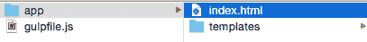
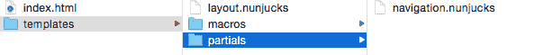
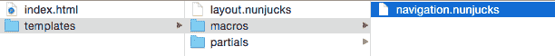

# 如何使用模板引擎模块化 HTML 和 Gulp

> 原文：<https://www.freecodecamp.org/news/how-to-modularize-html-using-template-engines-and-gulp-d1cb8af54138/>

作者 Zell Liew

# 如何使用模板引擎模块化 HTML 和 Gulp


模板引擎是帮助您将 HTML 代码分割成小块的工具，您可以在多个 HTML 文件中重用这些小块。模板引擎还让您能够将数据输入到变量中，这有助于简化代码。

只有当你有办法将模板引擎编译成 HTML 时，你才能使用它们。这意味着只有在使用后端语言或者客户端 JavaScript 时才能使用它们。

但是，有了 Node.js，您现在可以通过使用 Gulp 等工具轻松利用模板引擎的强大功能。

今天，您将学习什么是模板引擎，为什么您应该使用它们，以及如何用 Gulp 设置一个。

### 为什么应该使用模板引擎

模板引擎有两个主要好处:

1.  它们让你把 HTML 代码分解成更小的文件
2.  它们允许您用数据填充标记

让我们一个一个地看。

#### 将 HTML 分成更小的文件

HTML 文件包含在整个网站上重复的代码块是很常见的。考虑一下这个标记:

```
<body>  <nav> ... </nav>  <div class="content"> ... </div>  <footer> ... </footer></body>
```

许多代码行，尤其是 nav 和 footer 中的代码，在多个页面中重复出现。

因为它们是重复的，所以我们可以把它们提取出来，放入名为**片段**的更小的文件中。

例如，导航部分可能包含如下简单导航:

```
<!-- Navigation Partial --><nav>  <a href="index.html">Home</a>  <a href="about.html">About</a>  <a href="contact.html">Contact</a></nav>
```

然后，我们可以在 HTML 文件中重用这个部分。以下是包含部分内容的 HTML 文件的外观:

```
<body>    <div class="content"> ... </div>  </body>
```

注意:对于每个模板引擎，包含部分内容的语法是不同的。上面显示的是 nunjucks 或 Swig。

能够像这样分解代码有一个好处。

想象一下，如果你现在不得不改变导航，你会怎么做。当您使用分部时，您所要做的就是更改导航分部中的代码，所有的页面都将被更新。

这比必须在使用导航的每个文件上更改相同的代码要容易得多。

将代码分解成更小的文件有助于编写更少的(重复的)代码。当你需要一头扎进去修改旧代码时，它也能让你不至于发疯。

让我们继续第二个好处。

#### 使用数据填充标记

这个好处最好用一个例子来解释。假设您正在创建一个图像库。您的标记将类似于以下内容:

```
<div class="gallery">  <div class="gallery__item">      </div>  <div class="gallery__item">      </div>  <div class="gallery__item">      </div>  <div class="gallery__item">      </div>  <div class="gallery__item">      </div></div>
```

请注意。gallery__item div 在上面重复了多次？

如果你不得不改变一个。gallery__item，你必须在五个不同的地方进行更改。

现在，假设您有能力使用循环逻辑编写 HTML。你可能会写类似这样的东西:

```
<div class="gallery">  // Some code to loop through the following 5 times:   <div class="gallery__item">      </div>  // end loop</div>
```

模板引擎为您提供了使用这种循环的能力。它不是正好循环五次，而是遍历您传递给它的一组数据。HTML 将变成:

```
<div class="gallery">      <div class="gallery__item">          </div>  </div>
```

数据将是一个 JSON 文件，如下所示:

```
images: [{  src: "item1.png",  alt: "alt text for item1"  }, {  src: "item2.png",  alt: "alt text for item1"  },  // ... Until the end of your data]
```

使用所提供的数据，模板引擎将创建一个标记，使得。gallery__items 将对应于数据的图像数组中的项目数。

最好的部分是你只需要改变标记一次。将更新图库 _ _ 个项目。

### 使用带有 Gulp 的模板引擎

在我们继续并创建一个使用模板引擎的 gulp 任务之前，让我们看看 Gulp 能够使用的流行的基于 JavaScript 的模板引擎列表:

*   [Dust.js](http://akdubya.github.io/dustjs/)
*   [嵌入式 JS](http://www.embeddedjs.com/) (也称 ejs)
*   [车把](http://handlebarsjs.com/)
*   [Hogan.js](http://twitter.github.io/hogan.js/)
*   [玉](http://jade-lang.com/)
*   [小胡子](https://mustache.github.io/)
*   [双节棍](https://mozilla.github.io/nunjucks/)
*   [Swig](http://paularmstrong.github.io/swig/) (不再维护)

每个模板引擎都是独一无二的，都有自己的优缺点。模板引擎之间的语法可能会有很大的不同。因此，在本文中，我们将重点使用一个模板引擎——nunjucks。

我强烈推荐 nunjucks，因为它非常强大。它具有大多数模板引擎所没有的特性，比如继承。我以前也用过小胡子和车把，发现它们在很多情况下不够强大。

现在，让我们将 nunjucks 合并到我们的工作流程中。

### 双截棍配合吞咽


我们可以通过一个名为 [gulp-nunjucks-render](https://github.com/carlosl/gulp-nunjucks-render) 的插件来使用 nunjucks。

先来安装 gulp-nunjucks-render。

注意:我假设你知道如何使用 Gulp，所以我不会深入基础知识。如果你发现自己感到困惑，在回到这里之前，最好温习一下吞咽的基本知识。

```
$ npm install gulp-nunjucks-render --save-dev
```

```
var nunjucksRender = require('gulp-nunjucks-render');
```

接下来，我们需要创建一个允许我们轻松使用 nunjucks 的项目结构。我们将使用这种结构:

```
project/   |- app/       |- index.html and other .html files      |- pages/      |- templates/          |- partials/
```

**templates 文件夹**用于存储所有 nunjucks partials 和其他 nunjucks 文件，这些文件将被添加到 pages 文件夹的文件中。

**pages 文件夹**用于存储将要编译成 HTML 的文件。编译后，它们将在 app 文件夹中创建。

让我们在创建 Gulp 任务之前完成创建一些 nunjucks 文件的过程。

首先，nunjucks 的一个优点(其他模板引擎可能没有)是它允许您创建包含样板 HTML 代码的模板，这些代码可以被其他页面继承。让我们称之为样板 HTML layout.nunjucks。

创建一个名为 layout.nunjucks 的文件，并将其放在 templates 文件夹中。它应该包含一些样板代码，如、和标签。它还可以包含所有页面中相似的内容，比如指向 CSS 和 JavaScript 文件的链接。

下面是一个 layout.nunjucks 文件的示例:

```
<!-- layout.nunjucks -->
```

```
<!DOCTYPE html><html lang="en"><head>  <meta charset="UTF-8">  <title>Document</title>  <link rel="stylesheet" href="css/styles.css"></head><body>
```

```
 <!-- You write code for this content block in another file -->   
```

```
 <script src="bower_components/jquery/dist/jquery.js"></script>  <script src="js/main.js"></script></body></html>
```

顺便说一下，我更喜欢使用。nunjucks 文件和片段的 nunjucks 扩展，因为它让我知道我正在使用 nunjucks。如果你不喜欢。nunjucks，请随意将文件保存为. html 格式。

接下来，让我们在 pages 目录中创建一个 index.nunjucks 文件。该文件最终将被转换成 index.html 并放在 app 文件夹中。

它应该扩展 layouts.nunjucks，以便包含我们在 layout.nunjucks 中定义的样板代码:

```
<!-- index.nunjucks -->
```

然后，我们可以添加特定于 index.nunjucks 的 HTML 代码，介于和之间。

```
<!-- index.nunjucks -->
```

```
 <h1>This is the index page</h1>
```

我们已经完成了建立 nunjucks 文件的工作。现在，让我们创建一个将 index.nunjucks 转换为 index.html 的 nunjucks 任务。

```
gulp.task('nunjucks', function() {  // nunjucks stuff here});
```

在 nunjucks 任务中，我们首先需要告诉 nunjucks 模板的位置。我们可以通过 gulp-nunjucks-render 提供的 nunjucks.configure 函数来实现。

```
gulp.task('nunjucks', function() {  nunjucksRender.nunjucks.configure(['app/templates/']);});
```

接下来，我们通过 gulp.src 将 pages 中的文件添加到 gulp 任务中。

```
gulp.task('nunjucks', function() {  nunjucksRender.nunjucks.configure(['app/templates/']);
```

```
 // Gets .html and .nunjucks files in pages  return gulp.src('app/pages/**/*.+(html|nunjucks)')  // Renders template with nunjucks  .pipe(nunjucksRender())  // output files in app folder  .pipe(gulp.dest('app'))});
```

现在，尝试在命令行中运行 gulp nunjucks。Gulp 将为您创建一个 index.html，并将其放在 app 文件夹中。



如果您打开了这个 index.html 文件，您应该会看到下面的代码:

```
<!DOCTYPE html><html lang="en"><head>  <meta charset="UTF-8">  <title>Document</title>  <link rel="stylesheet" href="css/styles.css"></head><body>
```

```
 <h1>This is the index page</h1>
```

```
 <script src="js/main.js"></script></body></html>
```

注意所有的东西(除了

# 标签)是如何来自 layouts.nunjucks 的？这就是 layout.nunjucks 的用途。如果您需要修改标签，添加 JavaScript 或更改 CSS 文件，您知道您可以在 layouts.nunjucks 中完成，每个页面都会相应地更新。

此时，您已经成功地将 layouts.nunjucks 扩展到 index.nunjucks 中，并将其呈现到 index.html 中。还有几件事我们可以改进。我们能做的一件事就是学会使用分部。

### 添加 Nunjucks 分部

在将它添加到 index.nunjucks 之前，我们需要创建一个分部。让我们创建一个名为 navigation.nunjucks 的分部，并将其放在 templates 文件夹中的 partials 文件夹中。



然后，让我们给这个部分添加一个简单的导航:

```
<!-- navigation.nunjucks --><nav>  <a href="#">Home</a>  <a href="#">About</a>  <a href="#">Contact</a></nav>
```

现在，让我们将部分代码添加到 index.nunjucks 文件中。我们可以在 nunjucks 提供的语句的帮助下添加 partial。

```
 
```

```
<h1>This is the index page</h1><!-- Adds the navigation partial -->
```

```

```

现在，如果您运行 gulp nunjucks，您应该得到一个包含以下代码的 index.html 文件:

```
<!-- <head> and CSS -->
```

```
<h1>This is the index page</h1>
```

```
<nav>  <a href="#">Home</a>  <a href="#">About</a>  <a href="#">Contact</a></nav>
```

```
<!-- JavaScript and </body>    -->
```

当使用像导航这样的部分时，我们经常会遇到需要向页面上的链接添加一个类的情况。这里有一个例子:

```
<nav>  <!-- active class should only on be present on the homepage -->  <a href="#" class="active">Home</a>  <a href="#">About</a>  <a href="#">Contact</a></nav>
```

如果我们在主页上，活动类应该只出现在主页链接上。如果我们在“关于”页面上，那么活动类应该只出现在“关于”链接上。

我们可以用名为**宏**的 partials 的稍微修改版本来做到这一点。唯一的区别是，您可以像向 JavaScript 函数添加参数一样向它添加变量。

### 添加 Nunjucks 宏

首先，让我们在 templates 文件夹中的 macros 文件夹中创建一个 nav-macro.nunjucks 文件。请注意，我们使用 nav-macro 来确保您不会在两个导航 nunjuck 文件之间混淆。



一旦创建了 nav-macro.nunjucks 文件，就可以开始编写宏了。

所有宏都以下列标记开始和结束:

```
  <!-- Macro stuff here -->
```

让我们创建一个名为 active 的宏。它的目的是为我们的导航输出活动类。它应该有一个参数，activePage，默认为“home”。

```
  <!-- Macro stuff here -->
```

我们将编写将在宏中创建的 HTML。这里，我们还可以使用 nunjucks 提供的 if 函数来检查是否应该添加一个活动类:

```
<nav>  <a href="#" class=" active ">Home</a>  <!-- Repeat for about and contact --></nav>
```

我们现在已经完成了宏的编写。接下来让我们学习在 index.nunjucks 中使用它。

我们在 nunjucks 中使用 import 函数来添加一个宏文件，这与我们之前使用 include 函数来添加一个部分文件相反。

当我们导入一个宏文件时，我们也必须将它设置为一个变量。这里有一个例子:

```
<!-- index.html -->
```

```
<!-- Importing Nunjucks Macro -->
```

```

```

在本例中，我们将 nav 变量设置为整个 navigation.nunjucksmacro 文件。然后我们可以使用 nav 变量来调用写在这个文件中的任何宏。

```
<!-- Creating the navigation with activePage = 'home' -->{{nav.active('home')}}
```

经过这一更改，再次尝试运行 gulp nunjucks，您应该能够看到以下输出:

```
<nav>  <a href="#" class=" active ">Home</a>  <a href="#" class="">About</a>  <a href="#" class="">Contact</a></nav>
```

宏的使用到此为止。在使用双截棍的时候，知道这一点一定会对你有很大帮助:)

我们还可以做一件事来增强 nunjucks 的模板化体验，那就是用数据填充 HTML。

### 用数据填充 HTML

让我们首先创建一个包含您的数据的名为 data.json 的文件。我建议您将这个 data.json 放在 app 文件夹中。

```
$ cd app$ touch data.json
```

现在来补充一些数据。我们可以使用前面例子中的数据。

```
{  "images": [{    "src": "image-one.png",    "alt": "Image one alt text"  }, {    "src": "image-two.png",    "alt": "Image two alt text"  }]}
```

然后，我们必须稍微调整我们的 nunjucks 任务，以使用这个 data.json 文件中的数据。为此，我们需要借助另一个名为 [gulp-data](https://www.npmjs.com/package/gulp-data) 的 gulp 插件。

在继续之前，让我们安装 gulp-data。

```
$ npm install gulp-data --save-dev
```

```
var data = require('gulp-data');
```

Gulp-data 接受一个允许你返回文件的函数。我们可以使用 require 功能节点提供的来获取这个数据文件:

```
.pipe(data(function() {  return require('./app/data.json')}))
```

当使用 require 从自定义目录(不是 node_modules)获取文件时，我们需要告诉 node 目录的路径。这里，我们从一个./开始，它告诉 Node 从当前目录开始，然后在 app 中查找 data.json 文件。

注意:更好的方法是使用两个函数，JSON.parse()和 fs.readFileSync()，而不是 require。我们将在[“使用 Gulp 自动化您的工作流”](http://zell-weekeat.com/automate-your-workflow/)中介绍如何做到这一点。

现在让我们将吞咽数据添加到我们的 nunjucks 任务中。

```
gulp.task('nunjucks', function() {  nunjucksRender.nunjucks.configure(['app/templates/']);
```

```
 return gulp.src('app/pages/**/*.+(html|nunjucks)')    // Adding data to nunjucks    .pipe(data(function() {      return require('./app/data.json')    }))    .pipe(nunjucksRender())    .pipe(gulp.dest('app'))});
```

最后，让我们向 index.nunjucks 添加一些标记，以便它使用我们添加的数据。

```
<!-- index.nunjucks --><div class="gallery">  <!-- Loops through "images" array -->    <div class="gallery__item">      </div>  </div>
```

```
<!-- index.html --><div class="gallery">  <div class="gallery__item">      </div>Now, if you run `gulp nunjucks`, you should get a `index.html` file with the following markup: 
```

```
 <div class="gallery__item">      </div></div>
```

不错！

### 包扎

我们已经了解了模板引擎如何使开发变得更加容易，以及使用它们的一些基本方法。

然后我们深入到一个模板引擎 nunjucks，让它与 Gulp 一起工作。我们还学习了如何使用:

*   扩展以继承一个 nunjucks 文件
*   包括包含部分
*   导入以导入宏

如果你想进一步加快工作流程，请查看[自动化工作流程](http://zell-weekeat.com/automate-your-workflow/)。它将涵盖:

*   查看和编译 nunjucks 文件
*   防止努乔克弄坏古尔普的手表
*   每当文件改变时自动重新加载浏览器

> 这篇文章第一次出现在我的博客上是在 www.zell-weekeat.com。如果你想要更多这样的文章，可以看看