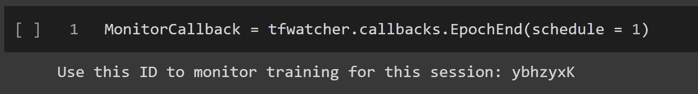
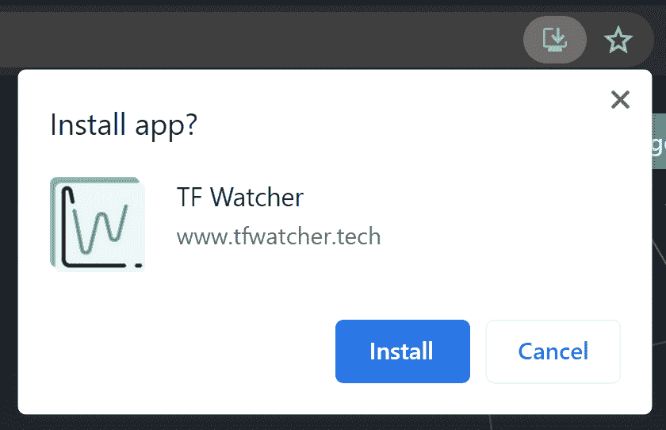
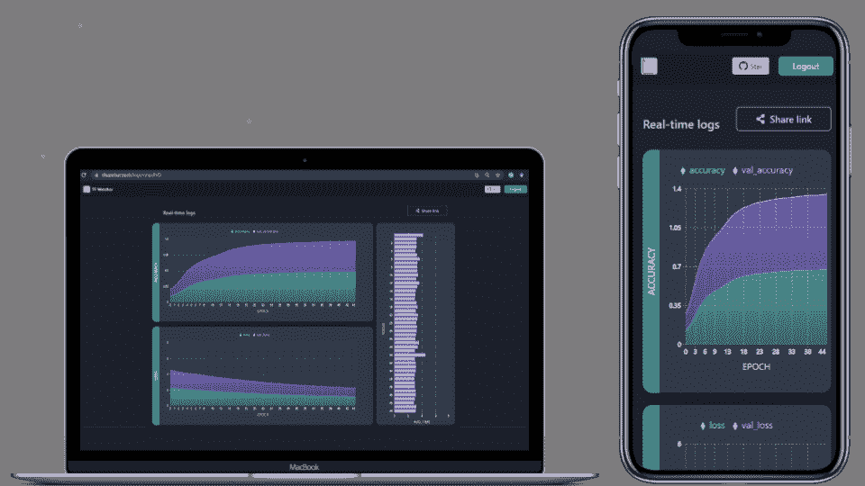
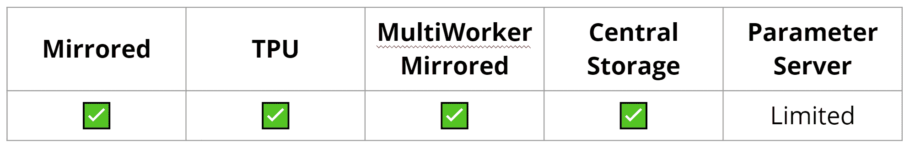

# 如何在移动设备上监控机器学习项目📱

> 原文：<https://www.freecodecamp.org/news/how-to-monitor-ml-projects-on-mobile-devices/>

如果你可以在手机上监控你的 Colab、Kaggle 或 AzureML 机器学习项目，会怎么样？你可以随时查看你的模特——甚至在散步的时候🚶。

如果你是一个 ML 开发者，你应该知道训练模型很容易花费很长时间。从你的手机上监控这个有多酷？

嗯，你可以做到——而且只用不到 5 行代码。

## 为什么远程监控您的模型有所帮助

在继续本教程并向您展示它是如何工作的之前，让我简单描述一下您可以用 [TF Watcher](https://github.com/Rishit-dagli/TF-Watcher) 做什么，这是一个开源项目，我们将使用它来监控我们的 ML 作业:

*   与您的 ML 工作流无缝集成，因此您不需要更改工作流中的任何其他代码就可以使其工作
*   您所有的可视化和仪表板都是实时的
*   您可能希望与同事共享您的实时仪表板或以前运行的仪表板，这也允许您创建可共享的链接
*   这是一个 PWA，可以让你在有限的容量内离线监控你的模型
*   您还可以精确控制何时记录指标

## 如何在手机上监控您的 ML 项目

现在让我们来看一下如何使用 Google Colab 在移动设备上监控模型的教程。我将向您展示如何在 Google Colab 中使用 tool this，因此任何人都可以尝试它，但是您几乎可以在任何地方复制它(甚至在您的本地机器上)。

请随意跟随[这款 colab 笔记本](https://colab.research.google.com/github/Rishit-dagli/TF-Watcher/blob/main/docs/source/TF-Watcher-Quickstart.ipynb)。

### **安装 tf-watcher Python 包**

要在移动设备上监控你的机器学习作业，你需要安装`tf-watcher` Python 包。这是我构建的开源 Python 包，你可以在[这个 GitHub repo](https://github.com/Rishit-dagli/TF-Watcher) 中找到源代码。

要从 PyPI 安装 Python 包，请在笔记本单元中运行以下命令:

```
 !pip install tf-watcher
```

### 如何创建简单的模型

出于本例的目的，我们将了解如何监控培训工作——但是您也可以使用此包来监控您的评估或预测工作。您将很快看到如何轻松地指定您想要监控的指标。

在这个例子中，我们将使用[时尚 MNIST](https://www.tensorflow.org/api_docs/python/tf/keras/datasets/fashion_mnist) ，这是一个简单的数据集，包含 10 个时尚类别的 60，000 幅灰度图像。我们首先加载数据集，然后我们将做一些简单的预处理，以进一步加快我们的例子。

然而，您可以在更复杂的实验中使用我们在本文中讨论的所有内容。

让我们获取数据集:

```
import tensorflow as tf

# Load example MNIST data and pre-process it
(x_train, y_train), (x_test, y_test) = tf.keras.datasets.mnist.load_data()

x_train = x_train.reshape(-1, 784).astype("float32") / 255.0
x_test = x_test.reshape(-1, 784).astype("float32") / 255.0

# Limit the data to 1000 samples to make it faster
x_train = x_train[:1000]
y_train = y_train[:1000]
x_test = x_test[:1000]
y_test = y_test[:1000]
```

Fetch the Fashion MNIST dataset

现在我们将创建一个简单的神经网络，它只有一个`Dense`层。我将向您展示如何在 TensorFlow 的顺序 API 中使用它，但在使用函数式 API 或子类模型时，它的工作方式完全相同。

```
# Define the Keras model
def get_model():
    model = keras.Sequential()
    model.add(keras.layers.Dense(1, input_dim=784))
    model.compile(
        optimizer=keras.optimizers.RMSprop(learning_rate=0.1),
        loss="mean_squared_error",
        metrics=["accuracy"],
    )
    return model
```

Create a simple model

您可能已经注意到，在编译我们的模型时，我们还指定了`metrics`,这让我们可以指定需要监控哪些指标。

这里我提到“准确性”,所以我应该能够在我的移动设备上监控准确性。默认情况下，我们记录“丢失”,因此在这种情况下，我们将监控两个指标:丢失和准确性。

您可以根据需要添加任意数量的指标。您也可以使用 TensorFlow 的[内置指标](https://www.tensorflow.org/api_docs/python/tf/keras/metrics)或添加您自己的自定义指标。

### 如何创建回调类的实例

现在，您将导入 TF Watcher 并创建它的一个类的实例:

```
import tfwatcher

MonitorCallback = tfwatcher.callbacks.EpochEnd(schedule = 1)
```

Create an instance of a TF Watcher class

在本例中:

*   我们使用来自 TF Watcher 的`EpochEnd`类来指定我们对纪元级别的操作感兴趣。你可以根据自己的需要使用其中的一些类——在[文档](https://rishit-dagli.github.io/TF-Watcher/)中找到所有关于其他类的信息。
*   我们在每 1 个时期后将`schedule`作为 1 传入以进行监控。您可以改为传入 3(在每 3 个纪元后进行监控)，或者您也可以传入您想要监控的特定纪元编号的列表。

当您运行这段代码时，您应该会看到这样的输出:



Unique ID for your session

这包括您的会话的唯一的 7 个字符的 ID。请务必记下这个 ID，因为您将使用它来监控您的模型。

## 如何开始监控您的模型🚀

现在，我们将训练我们构建的模型，并在移动设备上监控训练的实时指标。

```
model = get_model()

history = model.fit(
    x_train,
    y_train,
    batch_size=128,
    epochs=100,
    validation_split=0.5,
    callbacks = [MonitorCallback]
)
```

Train your model

在这段代码中，我们开始为 100 个时期训练我们的模型(在这种情况下应该很快)。我们还添加了在上一步中创建的对象作为`callback`。

如果在您的情况下，您正在监视预测而不是训练，那么您应该在 predict 方法中添加`callbacks = [MonitorCallback]`。

一旦运行了上面这段代码，您就可以从移动设备上的 web 应用程序开始监控它了。

前往[https://www.tfwatcher.tech/](https://www.tfwatcher.tech/)并输入您在上面创建的唯一 ID。这是一个 PWA，这意味着你也可以将它安装在你的移动设备上，并将其用作原生 android 应用程序。



Install the web app

添加会话 ID 后，您应该能够通过图表实时查看日志进度。除了度量之外，您还应该能够看到每个时期所花费的时间。在其他情况下，这可能也是一批所花费的时间。



The monitoring dashboard

### 如何共享仪表板

由于 ML 是高度协作的，您可能希望与同事共享您的实时仪表板。为此，只需点击共享链接按钮，应用程序就会创建一个可共享的链接，任何人都可以查看您的实时进度或存储的仪表板。

[这是我在本教程中创建的仪表板的可共享链接](https://www.tfwatcher.tech/logs/ybhzyxK)。

## 用 TF Watcher 还能做什么？

虽然我刚才展示的例子看起来很酷，但是我们可以用这个工具做更多的事情。现在我将简单地谈谈其中的两个场景:分布式训练和非急切执行。

### 分布式培训

您可能经常将您的机器学习培训分布在多个 GPU、多台机器或 TPU 上。您可能正在用`[tf.distribute.Strategy](https://www.tensorflow.org/api_docs/python/tf/distribute/Strategy)` TensorFlow API 做这件事。

当在定制的训练循环中使用`ParameterServer`时，您可以以与大多数有限使用的分发策略完全相同的方式使用它。



Distributed training

你可以在这里找到一些关于如何使用 TensorFlow Keras [这些策略的很好的例子。](https://www.tensorflow.org/guide/distributed_training#examples_and_tutorials)

### 非急切执行

在 TensorFlow 2 中，默认情况下会打开急切执行。但是你会经常想用 [`tf.function`](https://www.tensorflow.org/api_docs/python/tf/function) 来制作程序的图表。这是一个转换工具，可以从 Python 代码中创建独立于 Python 的数据流图。

这个项目的一个早期版本使用了一些 Numpy 调用，但是你猜怎么着，你现在也可以在非急切模式下以同样的方式使用代码了。

## **感谢您的阅读！**

谢谢你坚持到最后。现在，您可以在移动设备上的任何地方监控您的机器学习项目，并将它们提升到下一个级别。我希望你和我一样兴奋地开始使用它。

如果你学到了新的东西或者喜欢阅读这篇文章，请分享给其他人看。在那之前，下期帖子再见！

你也可以在 Twitter [@rishit_dagli](https://twitter.com/rishit_dagli) 上找到我。