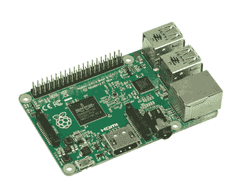
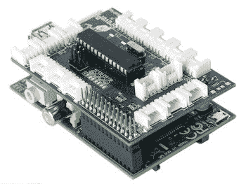
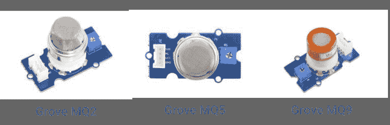
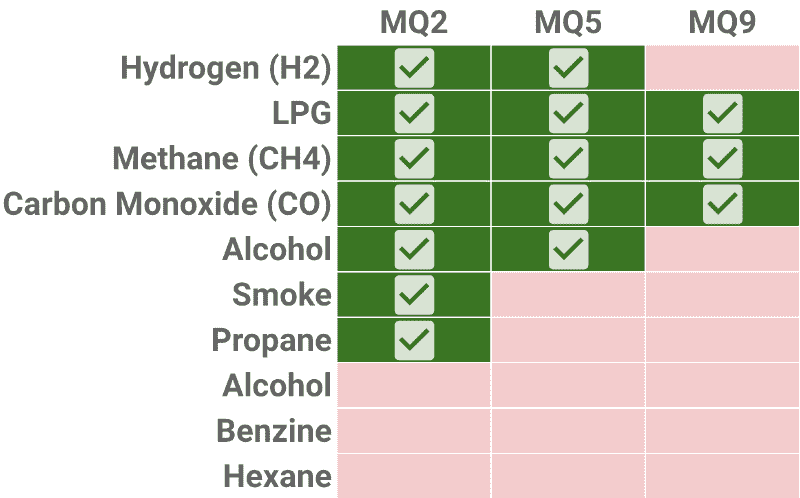
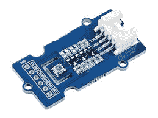
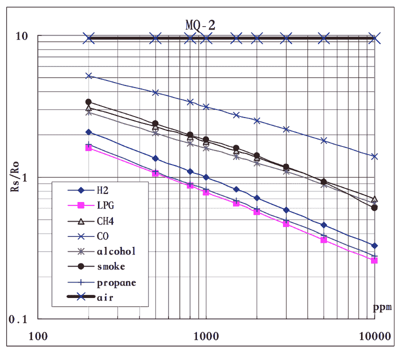
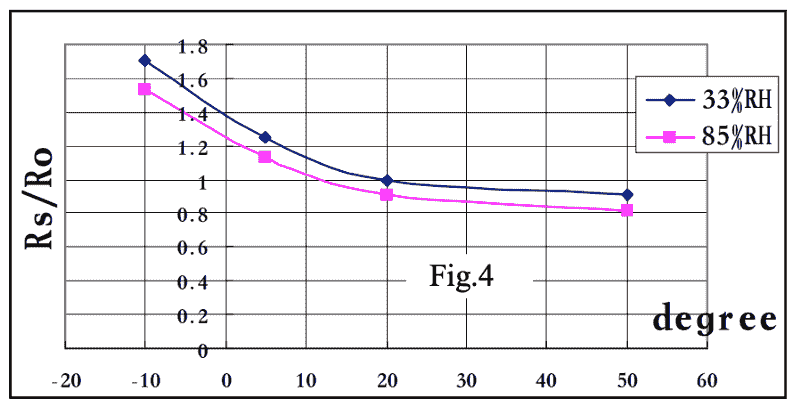
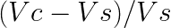
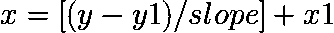
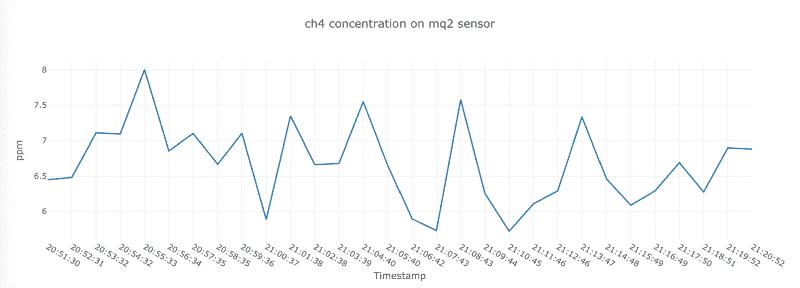

# 如何使用这种 DIY 设置来监测空气质量

> 原文：<https://www.freecodecamp.org/news/how-to-monitor-your-air-quality-with-this-diy-setup-3399793137c3/>

#### 有了树莓派、低成本气体传感器和遥控开关，你就可以控制你房子里的空气质量。

我们在室内呼吸的空气并不总是比室外的空气更健康。

根据欧盟联合研究中心的一项研究，你可以在室内发现各种各样的空气污染物。其中一些是有毒的，或者会导致基因突变或癌症。影响室内空气质量的因素有:

*   环境空气或室外空气
*   建筑物的气密性和通风
*   室内来源，如烟草烟雾、供暖气体、消费品等。

你知道你在室内花了多少时间吗？根据环境保护署的数据，美国人 87%的时间都待在室内。根据 JRC 的数据，在欧洲，这一平均比例为 90%。我们在室内呆的时间越长，吸入的污染物就越多。

所以如果我们追踪室内空气质量会很有趣。在这篇文章中，我将解释我是如何用一个[树莓派](https://www.raspberrypi.org/)、一个[格罗夫派](https://www.dexterindustries.com/grovepi/)和一些传感器做到这一点的。我们将把传感器数据上传到 [Firebase](https://firebase.google.com/) 数据库，并用 [Dash](https://dash.plot.ly/) 可视化趋势。

当污染物水平达到不健康水平时，我们可以发送警报通知来警告我们。

此外，如果我们能自动启动通风来净化空气，那就太好了。这可以通过 Energenie 的[遥控开关来完成。](https://www.raspberrypi.org/blog/controlling-electrical-sockets-with-energenie-pi-mote/)

#### 树莓派和 GrovePi



Raspberry Pi model 2B

在这个项目中，我将使用树莓 Pi 模型 2B。树莓派是一种低成本的小型电脑。它使程序员和制造者能够建造他们能想象的任何东西。



GrovePi (blue board) attached to a Raspberry Pi

GrovePi 是一个电子板，我们将它连接到 Raspberry Pi。它可以轻松连接各种传感器。因此，您不需要担心试验板、电阻、焊接或跳线。您可以插入连接器并开始使用它。

#### 数据流

在下图中，您可以看到传感器数据如何从传感器流向网页上的图表。我们将使用 Python 来完成所有这些工作。


Data flow from a GrovePi and a Raspberry Pi to Firebase to a web page hosted on PythonAnywhere.

第一步是从 Grove 传感器获取数据。然后，我们处理树莓 Pi 上的数据，并将它们发送到 Firebase 数据库。该数据也用于通过遥控开关打开或关闭通风装置。

我们可以通过在 PythonAnywhere.com 上运行脚本来获取存储的数据。借助 Dash 软件包，我们可以构建一个仪表板来跟踪室内空气质量。

#### 气体传感器

在这个项目中，我们将使用一套三种不同的气体传感器。我使用格罗夫气体传感器，并将它们连接到格罗夫皮。

没有必要在您自己的项目中使用所有三个传感器。请随意选择符合您需求的传感器。您可以通过在 Python 字典`MQ_SENSORS.`中保存您需要的传感器，在`config.py`文件中实现这一点



Grove gas sensors

每个传感器检测一组特定的气体。就它们检测的气体而言，传感器之间有相当多的重叠。但是，传感器检测气体的范围可以不同。你可以在 Seeedstudio 的[网站上找到这些范围。](http://wiki.seeedstudio.com/How_to_Chose_A_Gas_Sensor/)



Gases detected per sensor type

#### 温度和湿度传感器

温度和湿度会影响气体传感器的读数。因此，测量温度和湿度也很有趣。为此，我们使用 Grove BME680 传感器。



Grove BME680 to measure temperature and humidity

### 使用传感器数据

简而言之，当气体的浓度较高时，气体传感器将输出较高的电压。这是因为内置电阻器根据气体浓度改变其电阻(Rs)。

传感器值仅反映气体浓度趋势的近似值。这意味着你可以用它来显示气体浓度是增加还是减少。它没有给出准确的气体浓度。如果你想测量实际浓度，你需要一个更昂贵的传感器。

出于学习目的，我们将使用传感器值来估算气体浓度。你应该记住这一点。你不应该在现实生活中使用这些脚本来防止这些气体中毒！

在下面列出的数据表中，您可以找到气体浓度和传感器电阻值之间的关系图。气体浓度用百万分率(ppm)表示。Rs/R0 比值表示的电阻值。

*   [MQ2 数据表](https://raw.githubusercontent.com/SeeedDocument/Grove-Gas_Sensor-MQ2/master/res/MQ-2.pdf)
*   [MQ5 数据表](https://raw.githubusercontent.com/SeeedDocument/Grove-Gas_Sensor-MQ5/master/res/MQ-5.pdf)
*   [MQ9 数据表](https://raw.githubusercontent.com/SeeedDocument/Grove-Gas_Sensor-MQ9/master/res/MQ-9.pdf)

以下曲线对应于以下标准条件:

*   20 摄氏度的温度
*   65%的湿度
*   21%的氧气浓度
*   5 千欧的负载电阻。负载电阻是电子电路的总电阻。



Curves displaying the relation between gas concentrations and sensor resistance values. Both the x-axis and y-axis are on a log scale.

我们可以假设负载电阻和氧浓度随时间是稳定的。然而，室内的温度和湿度会发生变化。这两个因素都会影响传感器读数，如下图所示。



Influence of different temperatures and humidities (RH) on sensor resistance values in the MQ2 sensor for a hydrogen (H2) concentration of 1.000 ppm.

为了获得准确的读数，你应该有一个图表或不同温度湿度组合的查询表。不幸的是，制造商没有提供这些图表。

另一种方法是针对温度-湿度影响来校正传感器读数。

我们可以用人工神经网络来做到这一点，就像内诺娃&迪姆切夫在[的论文中提出的那样。这种方法需要对气体浓度进行真实的测量。这超出了本文的范围。](https://www.uni-obuda.hu/journal/Nenova_Dimchev_41.pdf)

#### 定义 R0 值

首先，我们需要计算 R0 值。R0 代表清洁空气中 1.000 ppm 氢气(H2)的传感器电阻值。洁净空气的比率(带蓝叉的黑线)是恒定的。不管洁净空气的浓度如何，它都保持在 9.8。因此，我们可以通过读取清洁空气中的传感器值(Rs)并除以 9.8 来计算 R0。

我们从传感器得到的值是 0 到 1.023 之间的值，没有测量单位。因此，为了获得输出电压，我们将传感器值除以 1.023。我们将该值乘以电路电压，通常为 5V。

从传感器电压，我们可以通过应用[欧姆定律](https://en.wikipedia.org/wiki/Ohm%27s_law)推导出传感器电阻。传感器电阻等于



Vc is the circuit voltage and Vs is the sensor voltage

让我们看看如何使用 Python 来实现这一点。完整的代码和更多文档可以在 [Github](https://github.com/bertcarremans/air_quality_monitoring) 的脚本`get_R0_values.py`中找到。

```
import config as cfg
import grovepi
import time
```

首先，我们导入一些包。`config`包是我制作的用来存储所有配置参数的 Python 脚本。

在整个代码中，你会注意到我有时会引用`cfg.PARAMETER_NAME`。我们在那个`config.py`文件中设置了`PARAMETER_NAME`值。它还包含一些密码和 API 令牌。

出于安全原因，我不会把那个文件保存在 [Github](https://github.com/bertcarremans/air_quality_monitoring) 上。相反，我将提供一个干净的模板`config_template.py`，您可以在自己的项目中使用。

接下来，我们导入`grovepi`包。你可以从 Dexter Industries 的 [Github 页面把它安装到你的 Raspberry Pi 上。它允许我们使用 GrovePi 和连接的传感器。](https://github.com/DexterInd/GrovePi/tree/master/Software/Python)

最后，我们使用`time`包在传感器读数期间暂停程序。

```
mq_values = {}

for sensor, data in cfg.MQ_SENSORS.items():
    grovepi.pinMode(data['pin'],"INPUT")
    mq_values[sensor] = 0
```

我们将在字典`mq_values`中存储不同传感器的传感器值。但是首先，我们在`MQ_SENSORS`中定义的传感器的循环中将值初始化为零。

使用`pinMode`方法，您可以将 pin 定义为`INPUT`或`OUTPUT.`，在我们的例子中，我们将使用它作为`INPUT`。

`pin`告诉我们传感器连接到 GrovePi 上的哪个引脚。我们使用 GrovePi 上标记为 A0、A1 和 A2 的模拟引脚(或端口)。确保将正确的传感器连接到`config.py`文件中描述的端口。

```
for i in range(cfg.NB_R0_READ):
    for sensor, value in mq_values.items():
        mq_values[sensor] += grovepi.analogRead(cfg.MQ_SENSORS[sensor]['pin'])
    time.sleep(cfg.R0_INTERVAL)
```

然后，我们在循环中读取传感器值`cfg.NB_R0_READ`次，并在`mq_value[sensor]`中对其求和。我们用`grovepi`包的`analogRead`方法读取传感器值。

如[文档](https://www.dexterindustries.com/GrovePi/programming/python-library-documentation/)中所述，这将返回一个介于 0 和 1.023 之间的值。事实上，它将模拟传感器值转换为数字值。

所有传感器读取一次后，我们在`cfg.R0_INTERVAL`秒暂停程序。为了得到平均值，我们将累计值除以`cfg.NB_RO_READ.`

```
for sensor, value in mq_values.items():
    mq_values[sensor] = mq_values[sensor]/cfg.NB_R0_READ
    mq_values[sensor] = mq_values[sensor]/cfg.AR_MAX * cfg.VC
    mq_values[sensor] = (cfg.VC - mq_values[sensor])/mq_values[sensor]
    mq_values[sensor] = mq_values[sensor]/cfg.MQ_SENSORS[sensor]['r0_rs_air']
```

我们通过将平均传感器值除以`cfg.AR_MAX`来计算传感器电压。然后我们把它乘以电路电压`cfg.VC`。

根据该电压，我们可以应用欧姆定律并计算传感器电阻值。除以干净空气的比率`cfg.MQ_SENSORS[sensor]['r0_rs_air']` 得到 R0。

在测量 R0 值之前，最好让传感器至少工作 24 小时。这将给出更稳定的传感器读数。

#### 气体浓度的线性插值

既然我们知道 R0 值，就可以利用传感器值计算 Rs/R0 比值。有了这个比值，我们就可以用[线性插值](https://en.wikipedia.org/wiki/Linear_interpolation)得出气体浓度。

为此，我们假设我们在第一张图中描述的标准条件下工作。在这种情况下，曲线几乎是线性的。

对于线性插值，我们需要每条曲线的两个已知点来计算其斜率。假设我们有两个坐标为(x1，y1)和(x2，y2)的点。y 值代表 Rs/R0 值，x 值代表气体浓度。对于线性曲线，斜率计算如下:


当我们知道斜率时，我们可以找到任意给定 Rs/R0 值(y)的气体浓度(x)。这个公式是:



下面的代码片段来自脚本`get_sensor_values.py`，你可以在 [Github](https://github.com/bertcarremans/air_quality_monitoring) 上找到。

我们把公式放在一个函数中，T1 和 T2 是气体曲线上的已知点。`curve['slope']`是我们用之前的公式计算出来的。

您可以在`config_template.py`文件中找到这些值。我用[webplot 数字化仪](https://automeris.io/WebPlotDigitizer/)从数据表上的图表中推导出这些值。因此，这些值并不完全准确。小心使用它们。

注意`np.log10`和`np.power.`的使用，这是因为图表上的轴是对数标度的。

```
def get_ppm(Rs_R0_ratio, curve):
    x_val = (np.log10(Rs_R0_ratio) - curve['y'])/curve['slope'] + curve['x']
    ppm_val = np.power(x_val, 10)
    return ppm_val
```

我们计算`Rs_R0_ratio`的方式与计算 R0 值的方式相同。所以我不会重复。为了计算这个比率，我们循环所有气体和传感器，并将其存储在`ppm_values[mq_sensor][gas].`中

```
for gas, curve in cfg.CURVES[mq_sensor].items():
                ppm_values[mq_sensor][gas] = get_ppm(mq_values[mq_sensor], curve)
```

#### 温度、湿度和压力

除了气体传感器，我们还通过 BME680 传感器读取温度、湿度和压力。BME680 传感器通过 I2C 端口连接到 GrovePi。为了使用传感器，我们导入可以从 Github 上的 [Pimoroni repo](https://github.com/pimoroni/bme680-python) 安装的包。

```
import bme680
```

`set_..._oversample`方法指定我们取多少样本来计算平均值。我们对气体也是这样做的。使用`get_sensor_data`我们读取传感器值。

```
bme680_sensor = bme680.BME680(bme680.I2C_ADDR_PRIMARY)
bme680_sensor.set_humidity_oversample(bme680.OS_2X)
bme680_sensor.set_pressure_oversample(bme680.OS_4X)
bme680_sensor.set_temperature_oversample(bme680.OS_8X)
bme680_sensor.get_sensor_data()
```

```
bme680_sensor.get_sensor_data()
```

### 在云风暴中存储和检索传感器数据

一些传感器能很快提供新的读数。其他(较便宜的)传感器需要更多时间。对于这个项目，我们将每分钟读取数据。这是用`FIREBASE_INTERVAL = 60`在配置文件中设置的。

在 Firebase 的免费 Spark 计划中，[云 Firestore 配额](https://firebase.google.com/docs/firestore/quotas)允许每天 2 万次写入。间隔一分钟，我们将远远低于配额。Firestore 中阅读文档的限制是每天 50K。

你需要创建一个 Firebase 项目和[创建一个云 Firestore](https://firebase.google.com/docs/firestore/quickstart) 。之后，确保[生成凭证](https://firebase.google.com/docs/admin/setup)来验证您的应用程序。将凭据文件保存在安全的位置。

要通过 Python 使用 Firebase，我们需要导入`firebase_admin` 包。如果需要的话，这个包需要先安装在你的 Raspberry Pi 上。

```
import firebase_admin
from firebase_admin import credentials
from firebase_admin import firestore
```

之后，我们可以用凭证初始化 Firebase 应用程序。我将凭证文件的位置存储在`cfg.FIREBASE_CREDS_JSON`中。当应用程序初始化时，我们创建一个 Firestore 对象`db`。

```
firebase_path = Path.cwd() / cfg.FIREBASE_CREDS_JSON
cred = credentials.Certificate(str(firebase_path))
firebase_admin.initialize_app(cred)
```

处理完气体值后，是时候将它们存储在云 Firestore 中了。我们将创建一个字典`firebase_values`来收集所有的数据。通过字典理解，我们将所有 MQ 传感器的所有气体的值相加。还添加了 BME680 值和时间戳。

使用 Firestore 对象`db`的`add`方法，很容易将数据存储在 Firestore 中。

Firestore 中的收藏名称是`cfg.FIREBASE_DB_NAME`。在 Firebase 网站上了解更多关于 Firestore 的[数据模型。](https://firebase.google.com/docs/firestore/data-model)

```
firebase_values = {mq_sensor + '_' + gas + '_ppm': ppm
                            for mq_sensor, gases in ppm_values.items()
                            for gas, ppm in gases.items()
                          }
firebase_values['temperature'] = bme680_sensor.data.temperature
firebase_values['pressure'] = bme680_sensor.data.pressure
firebase_values['humidity'] = bme680_sensor.data.humidity
firebase_values['date'] = datetime.now()
db.collection(cfg.FIREBASE_DB_NAME).add(firebase_values)
```

存储数据后，我们等待一分钟，从下面的代码行开始。

```
time.sleep(cfg.FIREBASE_INTERVAL)
```

### 改善空气质量

如果室内空气质量不好，我们应该采取措施来改善它。在此之前，我们需要得到关于临界气体浓度的通知。

一种可能是通过电子邮件发送警报通知，我们将在下面讨论。

有时室内空气污染源来自室外空气。例如，当你的邻居有烧木头的炉子，或者当你住在工厂附近。

在这种情况下，如果室外空气质量不好，您可以将测量站安装在室外，并关闭室内的通风设备。有了遥控开关，这可以很容易做到。

本节的所有代码都在 Github 的`improve_air_quality.py`中。

#### 当空气质量达到临界水平时发送通知

我们不希望每次传感器输出临界值时(这里是每分钟)都发送电子邮件。

假设我们想每小时检查一次在过去的一个小时内是否有临界值。为此，我们需要跟踪一个`reference_time.`,当读取传感器值的程序启动时，我们对其进行初始化。我们再次检查临界气体浓度的间隔在`cfg.ALERT_INTERVAL`中定义。

```
reference_time = datetime.now()
```

当`reference_time`过去一小时后，我们可以开始检查是否有临界空气污染物值。我们用当前时间更新`reference_time`。

使用`pytz`包，我们可以考虑我们的时区。在我的例子中，那是`Europe/Brussels.`，我们通过从当前时间减去 60 分钟来计算`one_hour_ago`。

```
if datetime.now() > reference_time + timedelta(minutes=cfg.ALERT_INTERVAL):
    reference_time = datetime.now()
    brussels_tz = pytz.timezone('Europe/Brussels')
    prev_check_time = brussels_tz.localize(datetime.now()) - timedelta(minutes=cfg.ALERT_INTERVAL)
```

通过`prev_check_time` ,我们从上一小时的 Firebase 中提取传感器读数。我们通过对从云商店`get`获得的数据应用`where`条款来做到这一点。

在这个脚本中，我们将只使用一个气体传感器和有限的气体。在`cfg.ALERT_SENSOR.`中选择传感器，在`cfg.ALERT_GASES.`中选择气体，每种气体的数据被附加到`ppm_vals`和`timestamps.`

```
timestamps = []
ppm_vals = {}
for gas in cfg.ALERT_GASES:
    ppm_vals[gas] = []

docs = db.collection(cfg.FIREBASE_DB_NAME).order_by(u'date').where(u'date', '>=', one_hour_ago).get()

for doc in docs:
    data = doc.to_dict()
    for gas in cfg.ALERT_GASES:
        ppm_vals[gas].append(data[cfg.ALERT_SENSOR + gas + '_ppm'])

    timestamps.append(data['date'].strftime('%H:%M:%S'))
```

我们用函数`find_crit_val.`寻找临界值，我们只检查该值是否超过上限`ubound`。这些上限需要在配置文件中指定。

数据是按时间升序排列的。因此，我们可以使用`next`方法来查找`v > ubound`的第一个时间戳。我们返回一个包含临界值时间戳和临界值本身的元组。

如果没有临界值，我们返回元组`(None, None).`

```
def find_crit_val(timestamps, val_list, ubound):
    try:
        (crit_time, crit_value) = next(((i,v) for i, v in zip(timestamps, val_list) if v > ubound))          
    except:
        (crit_time, crit_value) = (None,None)
    return (crit_time, crit_value)
```

关键元组存储在字典`crit_dict.`中作为键，我们使用 gas 名称。然后，我们检查具有关键时间戳和临界值的气体传感器组合。在这种情况下，我们向`critical_msg.`添加一条警告消息

```
crit_dict = {}
for gas in cfg.ALERT_GASES:
    (crit_time, crit_value) = find_crit_val(timestamps, ppm_vals[gas], cfg.UPPERBOUNDS[gas])
    crit_dict[gas] = (crit_time, crit_value)
critical_msg = ''
    for k, v in crit_dict.items():
        if v[0] is not None and v[1] is not None:
            critical_msg += '\nCritical value for ' + k + ' of ' + str(v[1]) + cfg.UNITS[k] + ' at ' + str(v[0])
```

如果`critical_msg`不为空，我们发送一封电子邮件。发送电子邮件是通过`smtplib`包完成的。BoringStuff.com 的[自动机上解释了如何用 Python 发送电子邮件。](https://automatetheboringstuff.com/chapter16/)

如果你使用谷歌的双因素认证，你需要为你的电子邮件生成一个特定于应用程序的密码。

```
if critical_msg != '':
    try:
        msg = MIMEText(critical_msg, _charset='utf-8')
        msg['Subject'] = Header('Air Quality Alert', 'utf-8')
        smtpObj = smtplib.SMTP('smtp.gmail.com', 587)
        smtpObj.ehlo()
        smtpObj.starttls()
        smtpObj.login(cfg.EMAIL, cfg.EMAIL_PW)
        smtpObj.sendmail(cfg.EMAIL, cfg.EMAIL, msg.as_string())
        smtpObj.quit()  
    except smtplib.SMTPException:
        print('Something went wrong while sending the email')
```

#### 自动控制您的通风设备

有了遥控开关，我们可以打开或关闭任何与之相连的设备。因此也是通风单元。 [Energenie](https://energenie.com/) 专门为树莓酱制作了 PiMote 插件。要控制 Energenie 开关，你需要安装`energenie`包并导入它。

请注意，您不能将 PiMote 附加到 GrovePi 的顶部。所以你需要第二个覆盆子酱。

当启动脚本时，我们做的第一件事是定义一个布尔变量`ventilation_on.`，我们将它设置为`False`，因为这是我们第一次运行脚本。

```
import energenie
ventilation_on = False
```

如果`critical_msg`不为空，则在上一个报警间隔中存在临界气体浓度。在这种情况下，我们用能量包的`switch_on`方法打开通风。

如果没有临界气体浓度，并且通风在最后一个警报间隔内打开，我们可以将其关闭。

您可能需要在关闭通风之前设置另一个时间间隔。这取决于您的通风设备的流速、测量的气体以及污染源是否已被关闭。

```
if critical_msg != '':
    if not ventilation_on:
        energenie.switch_on(1)
        ventilation_on = True
else:
    if ventilation_on:
        energenie.switch_off(1)
        ventilation_on = False
```

### 用 Dash 可视化空气质量

带有临界气体浓度的通知有助于立即采取行动。但是随着时间的推移追踪气体浓度也很有趣。通过在仪表板中可视化传感器值，我们可以查看气体浓度的趋势。这可以用 Dash 来完成。在 Dash 的网站上，你可以找到一个关于如何入门的[很棒的教程](https://dash.plot.ly/)。

在这个项目中，我们将建立一个仪表板，并将其托管在[PythonAnyWhere.com](https://www.pythonanywhere.com/)上。要在 PythonAnywhere 上使用 Dash，您需要创建一个[虚拟环境](https://help.pythonanywhere.com/pages/Virtualenvs/)。你可以按照[这个演示](https://github.com/conradho/dashingdemo)的步骤在 PythonAnyWhere 上设置 Dash 应用程序。

下面我将展示我如何为我们的空气质量站建立仪表板。完整的脚本可以在 [Github](https://github.com/bertcarremans/air_quality_monitoring) 上的 plot_sensor_values.py 中找到。

首先你需要导入`dash`包。

```
import dash
import dash_core_components as dcc
import dash_html_components as html
```

在 Dash 网站上的演示中，他们使用了一个级联样式表(CSS)的链接来提供一个漂亮的页面设计。如果您想在笔记本电脑或 web 服务器上使用本地 CSS，您可以添加一个 assets 文件夹。在那个文件夹中，你可以添加你的 CSS，Dash 会从那里拿起它。

然后你需要从 Firebase 获取数据。这可以像我们发送警报通知一样来完成。所以我们不会再重复了。

利用从 Firebase 收集的数据，我们可以填充仪表板中的图表。我们首先创建一个 Dash 对象`app`并给它一个`title.`

```
app = dash.Dash(__name__)
app.title = 'Indoor Air Quality Dashboard'
```

然后我们创建仪表板的`layout`。一个`H1`标题组件，一个`container` div 和一个包含`graphs.`的 div

```
app.layout = html.Div([
    html.H1(style={'textAlign':'center'}, children='Indoor Air Quality Dashboard'),
    html.Div(id='container'),
    html.Div(graphs)
])
```

`graphs`是包含每个图表信息的列表。下面你可以看到温度图是如何设置的。你也可以添加湿度和压力的`dcc.Graph`，方法是将它们附加到`graphs.`

```
graphs = [
    dcc.Graph(
        id='temperature',
        figure={
            'data':[{
                'x':timestamps,
                'y':temperatures,
                'type':'line',
                'name': 'Temperature',
                'line': {'width':2, 'color': '#542788'}
                }],
            'layout':{
                'title': 'Temperature',
                'yaxis': {'title': 'Celsius'},
                'xaxis': {'title': 'Timestamp', 'tickvals':timestamps}
            }
        }
    )
]
```

MQ 传感器的图形可以附加在 for 循环中。

```
for mq_sensor in cfg.MQ_SENSORS.keys():
    for gas in cfg.CURVES[mq_sensor].keys():
        sensor_gas_key = mq_sensor + '_' + gas + '_ppm'
        title = gas + ' concentration on '+ mq_sensor + ' sensor'
        data = ppm_values[mq_sensor][gas]
        data.reverse()

        graphs.append(dcc.Graph(
            id=sensor_gas_key,
            figure={
                'data': [{
                    'x': timestamps,
                    'y': data,
                    'type':'line',
                    'name': title,
                    'line': {'width':2}
                }],
                'layout': {
                    'title': title,
                    'yaxis': {'title': 'ppm'},
                    'xaxis': {'title': 'Timestamp', 'tickvals':timestamps}
                }
            }
        ))
```

因此，您将拥有一个类似下图的控制面板。



Graph with MQ2 sensor data for methane (ch4)

### 结论

用几个低成本的气体传感器和一个树莓皮(和 GrovePi)很容易建立一个空气质量测量站。然后，当空气质量不佳时，您可以通过发送警报通知或打开通风设备来根据数据采取行动。使用 Dash，您可以构建漂亮的可视化效果来监控空气质量。

下面我记下了一些想法来进一步推进这个项目。

*   制作一个可视化和接收通知的移动应用程序
*   给树莓派添加发光二极管、蜂鸣器和有机发光二极管显示器，以获得关于空气质量的即时反馈
*   在你的家人和朋友处安装测量站，并在互动地图上可视化。
*   一旦你有了足够的数据，[建立一个时间序列模型](https://towardsdatascience.com/forecasting-air-pollution-with-recurrent-neural-networks-ffb095763a5c)来预测室内空气质量

希望这个故事能激励你开始建立自己的测量站。如果您有任何问题或建议，请告诉我。