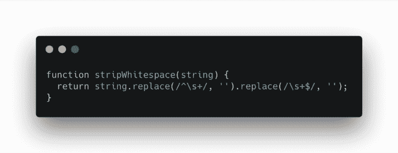
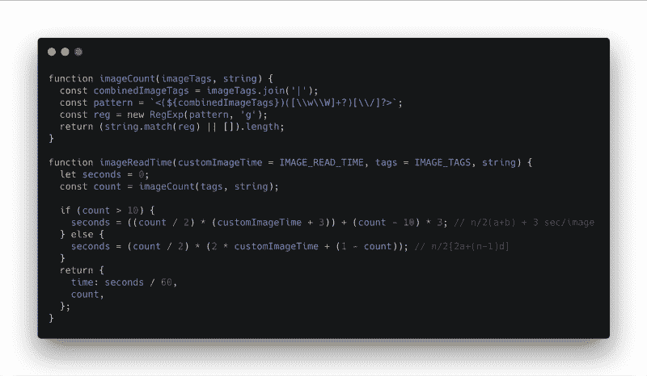
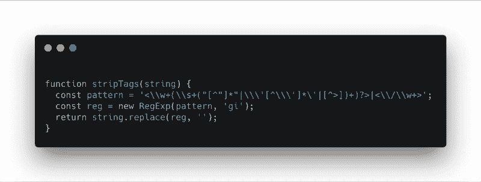
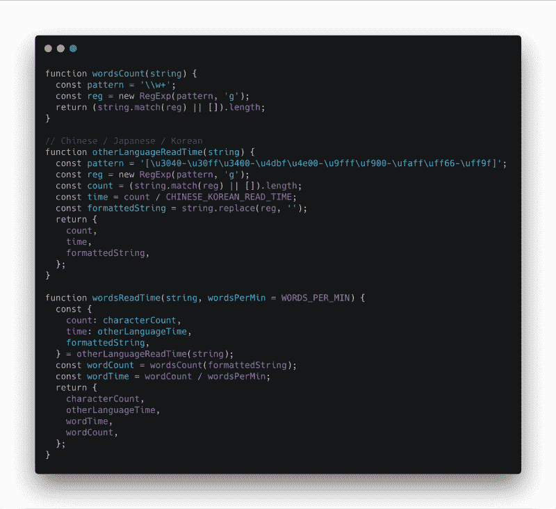
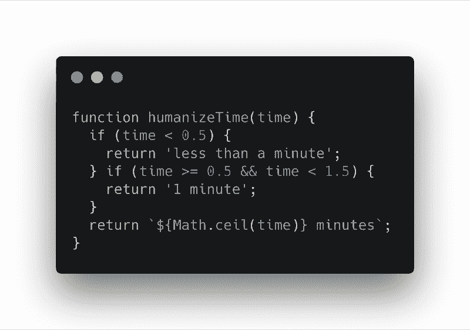
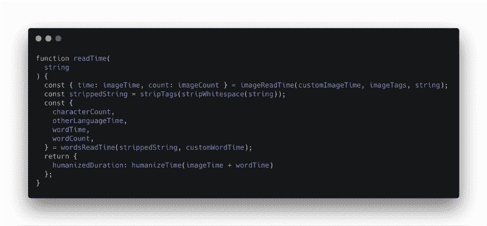
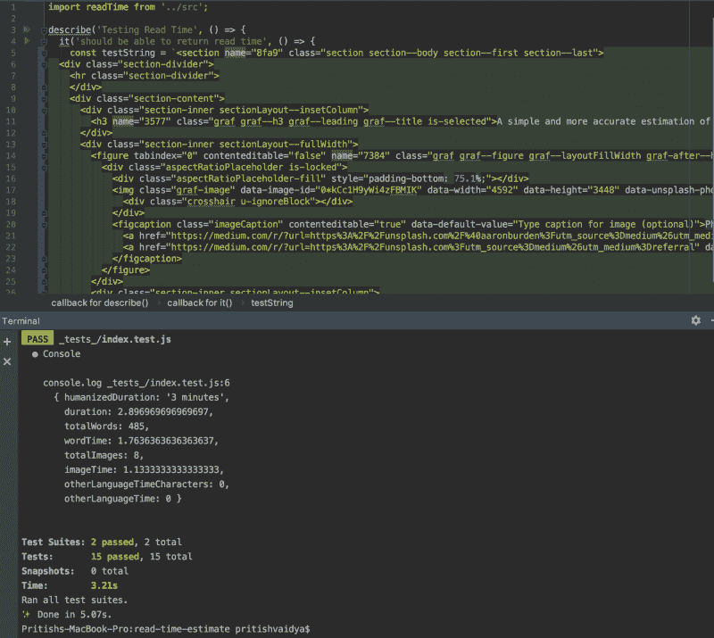
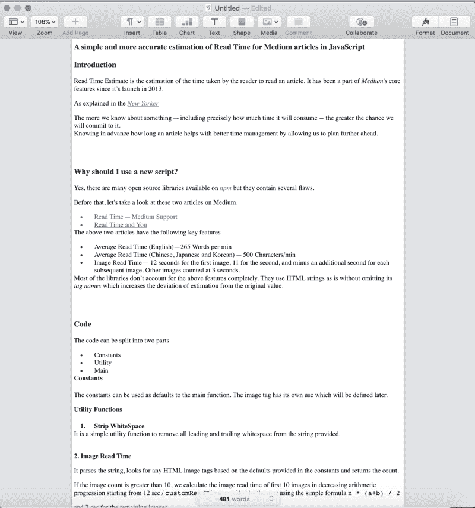
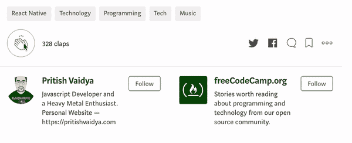

# 如何更准确地估计 JavaScript 中等文章的阅读时间

> 原文：<https://www.freecodecamp.org/news/how-to-more-accurately-estimate-read-time-for-medium-articles-in-javascript-fb563ff0282a/>

英国瓦伊迪亚

# JavaScript 中中等文章阅读时间的精确估计

Photo by [Aaron Burden](https://unsplash.com/@aaronburden?utm_source=medium&utm_medium=referral) on [Unsplash](https://unsplash.com?utm_source=medium&utm_medium=referral)

### 介绍

阅读时间估计是对读者阅读一篇文章所用时间的估计。自 2013 年推出以来，它一直是*Medium*核心功能的一部分。

如 [*纽约客*](https://www.newyorker.com/tech/annals-of-technology/a-list-of-reasons-why-our-brains-love-lists) *:* 中所述

> 我们对某件事了解得越多——包括确切地知道它将耗费多少时间——我们就越有可能去做。

提前知道阅读一篇文章需要多长时间有助于更好地管理时间，让我们能够提前做好计划。

### 为什么我应该使用新的脚本？

是的，在 [*npm*](https://npmjs.com) 上有很多开源库，但它们包含几个缺陷。

在此之前，我们先来看看这两篇关于 Medium 的文章。

*   [读取时间—介质支持](https://help.medium.com/hc/en-us/articles/214991667-Read-time)
*   [读时间和你](https://blog.medium.com/read-time-and-you-bc2048ab620c)

上述两篇文章有以下主要特点

*   平均阅读时间(英语)—每分钟 265 个单词
*   平均阅读时间(中文、日文和韩文)— 500 个字符/分钟
*   图像读取时间—第一幅图像为 12 秒，第二幅图像为 11 秒，每幅后续图像再减去一秒。其他图像以 3 秒计数。

大多数库没有完全考虑到上述特性。他们按原样使用 HTML 字符串，而没有省略其标签名称，这增加了估计值与原始值的偏差。

### 密码

代码可以分为三个部分:

*   常数
*   效用
*   主要的

#### 常数

常量可以用作主函数的默认值。图像标签有它自己的用途，这将在后面定义。

Image Credit: [Carbon](https://github.com/dawnlabs/carbon). | Code: [GitHub](https://github.com/pritishvaidya/read-time-estimate/blob/master/src/constants/index.js)

#### 效用函数

1.  **去除空白**

这是一个简单的实用函数，用于从提供的字符串中删除所有前导和尾随空白。

Image Credit: [Carbon](https://github.com/dawnlabs/carbon). | Code: [GitHub](https://github.com/pritishvaidya/read-time-estimate/blob/master/src/utils/strip-whitespace.js)

**2。图像读取时间**

它解析字符串，根据常量中提供的默认值查找任何 HTML 图像标签，并返回计数。

如果图像计数大于 10，我们使用简单的公式`n * (a+b) / 2` 从用户提供的 12 秒/ `customReadTime`开始以递减的算术级数计算前 10 个图像的图像读取时间，其余图像为 3 秒。

Image Credit: [Carbon](https://github.com/dawnlabs/carbon). | Code: [GitHub](https://github.com/pritishvaidya/read-time-estimate/blob/master/src/utils/image-read-time.js)

**3。条状标签**

接下来，我们检查字符串中的任何 HTML 标签(两者都有),并删除它，只从中提取单词。

Image Credit: [Carbon](https://github.com/dawnlabs/carbon). | Code: [GitHub](https://github.com/pritishvaidya/read-time-estimate/blob/master/src/utils/strip-tags.js)

**4。单词阅读时间**

该实用函数使用不同的 *Unicode* 字符范围计算字数和*中文/韩文和日文*字符。

时间是通过除以上面定义的常数来计算的。

Image Credit: [Carbon](https://github.com/dawnlabs/carbon). | Code: [GitHub](https://github.com/pritishvaidya/read-time-estimate/blob/master/src/utils/words-read-time.js)

**5。人性化时间**

基于单词中的[时间距离，我们可以计算并返回阅读所用时间的人性化持续时间。](https://api.rubyonrails.org/classes/ActionView/Helpers/DateHelper.html#method-i-distance_of_time_in_words)

Image Credit: [Carbon](https://github.com/dawnlabs/carbon). | Code: [Github](https://github.com/pritishvaidya/read-time-estimate/blob/master/src/utils/humanize-time.js)

#### 主要的

main 函数只按正确的顺序合并所有的实用程序方法。

### 这个脚本有多准确？

对 HTML 字符串进行测试(来自 Chrome inspector) **。**

测试和[页面](https://www.apple.com/in/pages/)清楚地给出了对解析后的 HTML 的总字数和图片数量的正确估计。

### 链接

我已经在 [GitHub](https://github.com/pritishvaidya/read-time-estimate) 上整合了完整的代码。它也可以作为一个 npm 包[读取时间估计](https://www.npmjs.com/package/read-time-estimate)。

更多酷的东西可以在我的[***stack overflow***](https://stackoverflow.com/users/6606831/pritish-vaidya)和 [***GitHub***](https://github.com/pritishvaidya) 个人资料中找到。

关注我关于[***LinkedIn***，](https://www.linkedin.com/in/pritish-vaidya-506686128/) [***中***](https://medium.com/@pritishvaidya94) ， [***推特***](https://twitter.com/PritishVaidya) 进一步更新新文章。

一拍，二拍，三拍，四十？

*最初发布于 2019 年 1 月 30 日[blog.pritishvaidya.com](https://blog.pritishvaidya.com/posts/2019-01-30-a-simple-and-more-accurate-estimation-of-read-time-for-medium-articles-in-javascript/)。*