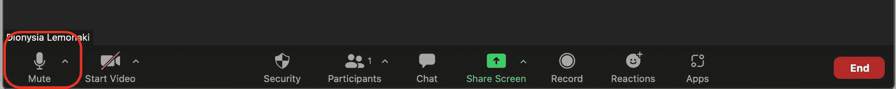
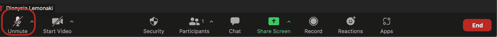

# 如何在缩放时静音–使用键盘快捷键或按下按钮让自己静音

> 原文：<https://www.freecodecamp.org/news/how-to-mute-and-unmute-on-zoom-keyboard-shortcut/>

随着远程工作越来越受欢迎，越来越多的人和公司正在使用 Zoom 等视频会议服务。

打开和关闭内置麦克风是 Zoom 最有用的功能之一。

在这个快速指南中，你将学习如何通过一个便捷的快捷键和一个按键来使自己静音。

这样，你就有希望避免任何不必要的尴尬局面，也不会在其他与会者发言时用背景噪音打扰他们。

## 如何使用键盘快捷键使自己在缩放时静音

缩放为所有操作系统和机器上可用的各种功能提供了有用的快捷方式。

以下是**在缩放时让**静音的快捷键:

*   要在 Windows 操作系统上使自己静音，请按住并同时按:`Alt A`。
*   要在 Linux 操作系统上将自己静音，请按住并同时按下:`Alt A`。
*   要在 Mac 操作系统上使自己静音，请按住并同时按:`Command Shift A`。

您可以使用快捷键将自己静音，也可以自己取消的静音。

## 如何通过按下按钮使自己在变焦时静音

麦克风图标是缩放中的静音/取消静音按钮，位于会议窗口的左下角。

如果它已经消失，当你将鼠标悬停在屏幕上时，它会再次出现。

在下面的截图中，我的麦克风是开着的:

一旦我点击了那个按钮，我会立刻让自己静音:

每当您看到麦克风图标上有一条红线时，这意味着您已静音。

在这种情况下，您的麦克风将关闭，没有人能够听到您的声音。

当您想取消静音时，只需再次单击麦克风按钮，您会看到图标已变为非交叉麦克风。现在每个人都可以叫她你了。

这是两种快捷的方法可以让你在缩放时静音和取消静音。见面愉快！