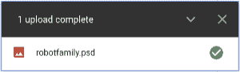
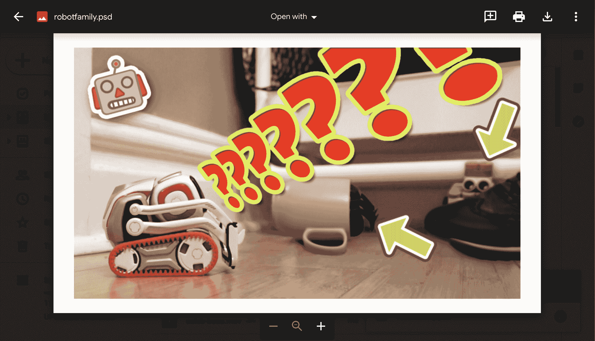
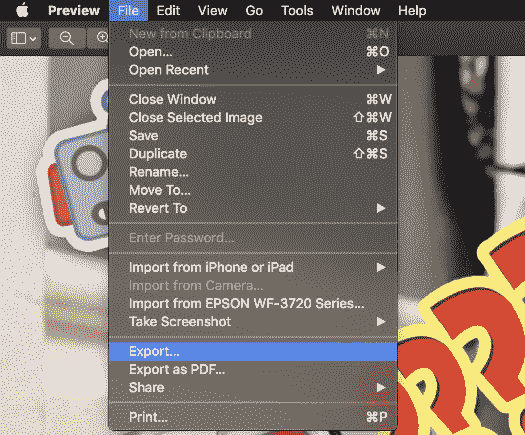
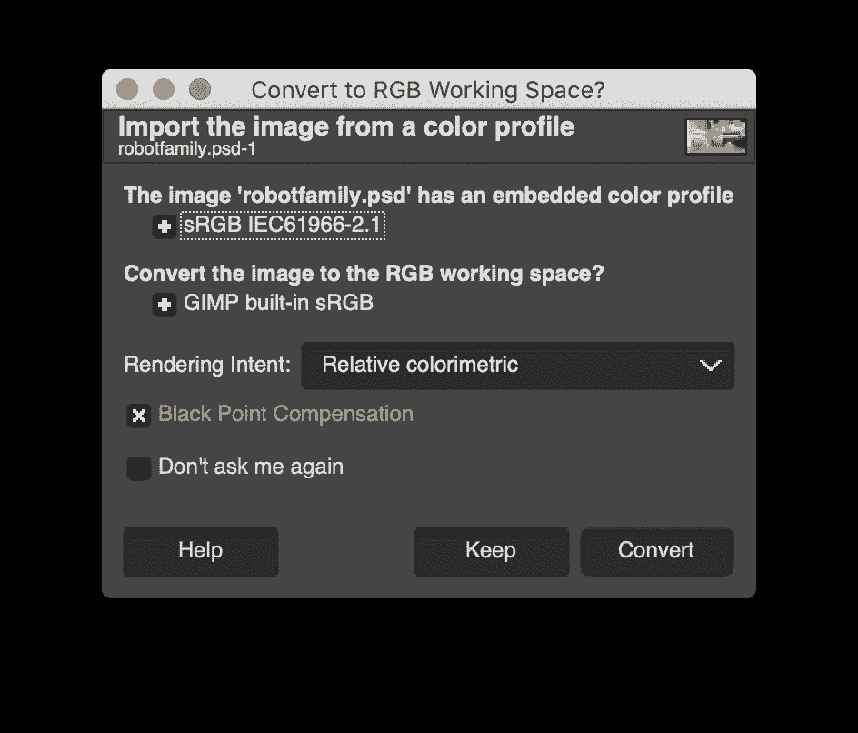

# 如何不用 Photoshop 打开 PSD 文件

> 原文：<https://www.freecodecamp.org/news/how-to-open-a-psd-file-without-photoshop/>

有没有 Photoshop(。psd)文件，你需要打开，但你没有 Photoshop？在本指南中，您将学习几种不同的方法，可以免费打开 Photoshop 文件，而无需为 Photoshop 付费。

### 在 Google Drive 上预览

无论您使用什么类型的操作系统，都可以使用这种方法。只需将你的 PSD 文件上传到 Google Drive。您将能够预览该文件。

预览文件后，您可以拍摄屏幕截图，然后在不同的程序中打开截图文件。

以下是在各种操作系统上截图的一些快捷方式:

*   Windows: Win+Shift+S
*   Mac: Command+Shift+4
*   ChromeOS: Ctrl + Shift + []]](窗口切换键)

### IrfanView(仅适用于 Windows)

InfranView 是一个可以在 Windows 上下载的免费程序。它可以让你显示一个 PSD Photoshop 文件，也可以把它保存成一堆其他流行的格式。但是，它不支持 Photoshop 文件中的图层，因此所有内容都将合并到一个图层中。

点击此处下载 IrfanView。

### 预览(仅适用于 Mac)

MacOS 上内置的预览程序可以打开 Photoshop 文件。只需右击文件，选择“打开方式”，然后选择“预览”。在“预览”中打开文件后，您可以通过选择“文件”，然后选择“导出...”将其导出为其他格式。“导出”菜单有一个下拉菜单，您可以从中选择格式。就像 IrfanView 一样，不支持层信息。

### 瘸子

GIMP 是 Photoshop 的免费开源替代品。它可以打开 PSD 文件，甚至保留图层信息。GIMP 是这个列表中最强大的选项，它允许您对文件进行其他修改。

要在 GIMP 中打开 Photoshop 文件，首先[下载并安装 GIMP](https://www.gimp.org/downloads/) 。

然后，在 GIMP 中打开 Photoshop 文件。只需使用默认设置来转换文件。

您现在可以访问 GIMP 中的图像，包括所有的层！您可以编辑图像，或以任何格式导出图像。GIMP 可能不会保留所有文本信息或图层样式。

现在你知道你不需要 Photoshop 打开 PSD 文件！