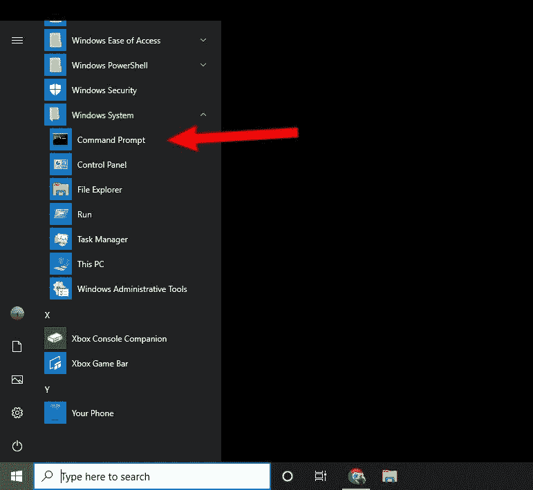
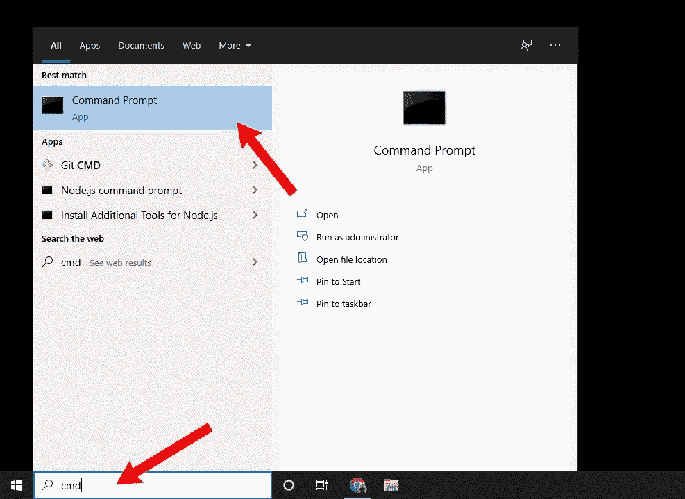
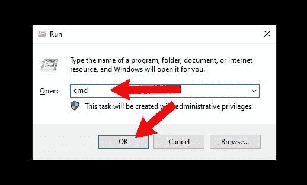
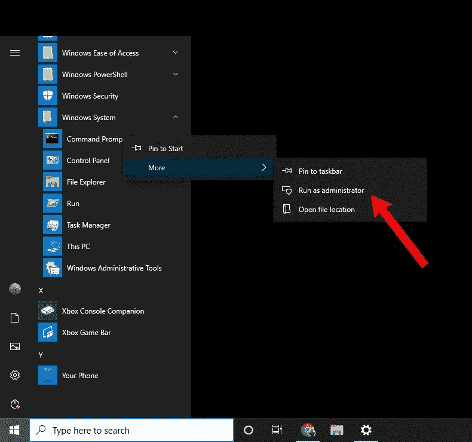
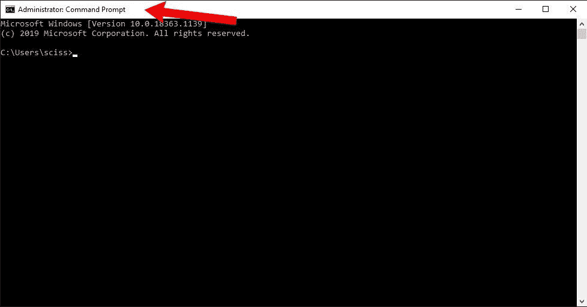

# 如何在 Windows 10 中打开命令提示符

> 原文：<https://www.freecodecamp.org/news/how-to-open-the-command-prompt-in-windows-10/>

如果您需要在 Windows 中运行`mkdir`、`ping`和`netstat`等命令，您需要打开命令提示符程序。

事实证明有很多方法可以做到这一点。在本文中，我们将介绍一些最常用的打开命令提示符的方法。

注意:虽然本文是为 Windows 10 编写的，但一些方法应该与早期版本的 Windows 类似。

## 如何从 Windows 开始菜单打开命令提示符

首先，单击左下角的开始菜单按钮打开开始菜单。

向下滚动到“Windows 系统”,然后单击它打开不同 Windows 程序的下拉列表。然后点击“命令提示符”:

## 如何用搜索栏打开命令提示符

打开命令提示符的最快方法之一是使用 Windows 10 任务栏中的搜索栏。

只需在搜索栏中键入“cmd”并点击“命令提示符”:

## 如何从运行程序中打开命令提示符

Windows 10 有另一个名为 Run 的程序，可以让你运行其他程序。您还可以做一些事情，比如打开文件夹和文件，但这超出了本教程的范围。

要打开运行，可以打开开始菜单，在“Windows 系统”下找到。你也可以在搜索框中输入“run ”,这样就可以找到它。

但是打开 Run 最快的方法是用快捷键 **Windows 键+ R** 。

然后，一旦运行窗口打开，只需键入“cmd”并按“OK”打开命令提示符:

## 如何以管理员身份打开命令提示符

像`powercfg`或`chkdsk`这样的命令要求您以管理员身份打开命令提示符。这将为您运行的任何命令提供更高的访问权限。

要以管理员身份打开命令提示符，请使用前面介绍的任何方法找到命令提示符。

然后，右键单击“命令提示符”并单击“以管理员身份运行”:

您可能需要将鼠标悬停在“更多”上，这取决于您用来查找命令提示符程序的方法。

此外，您可能会看到一个“用户帐户控制”窗口弹出，显示信息“您要允许此应用程序对您的设备进行更改吗？”单击“是”继续。

在此之后，您应该会看到一个命令提示符窗口，顶部显示“Administrator: Command Prompt ”:

或者，您可以作为普通用户打开命令提示符，键入一个命令，然后按下 **Ctrl + Shift + Enter** 作为管理员运行该命令。

**注意:**虽然您应该始终注意在命令提示符或任何其他命令行程序中运行什么命令，但是作为管理员，您尤其应该注意运行什么。一个错误的命令可能会删除重要的系统文件，并破坏您的 Windows 安装。

## 概括起来

这些只是在 Windows 中打开命令提示符的许多方法中的一部分。选择最适合你的，随心所欲地运行命令。

但是，在运行任何命令之前，请仔细检查所有内容是否正确，尤其是当您以管理员身份打开命令提示符时。从经验来看，多几秒钟的小心可以节省你几个小时的重新安装时间。

然后，继续(安全地)运行所有命令。